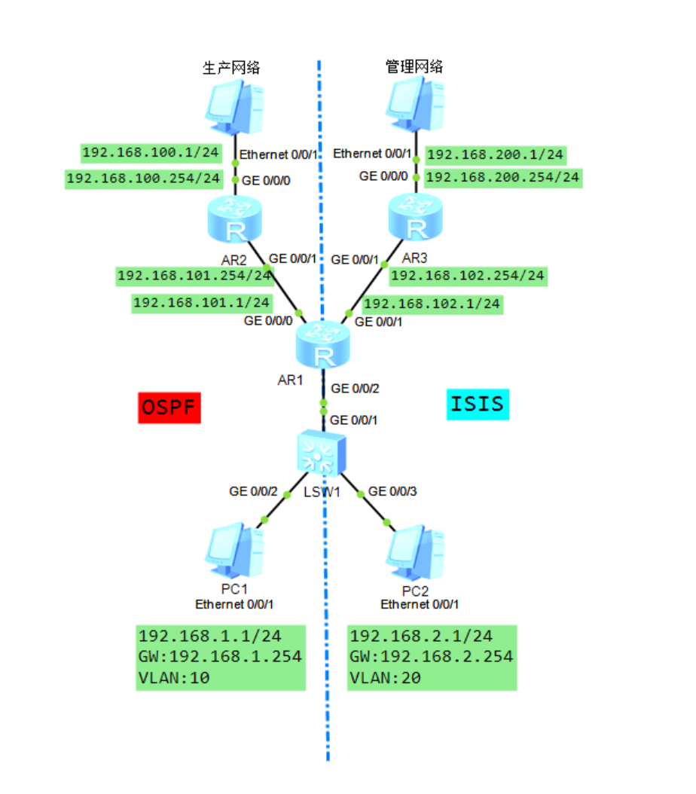
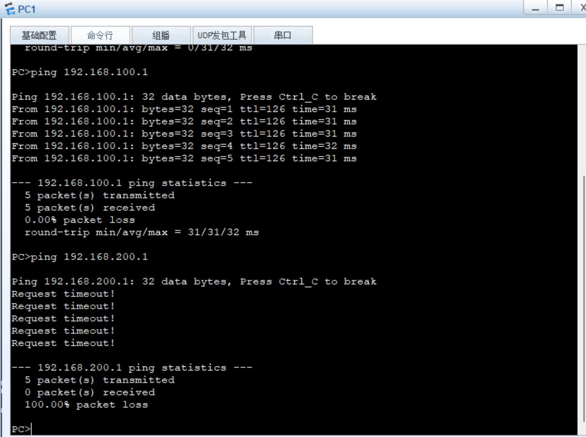
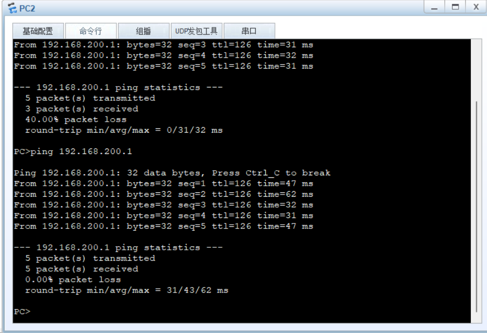

---
tags:
  - HCIP-Datacom
comment: false
---
# VRF
## 实验拓扑

## 实验要求
通过在AR1上配置VRF，将生产网络（OSPF域）与管理网络（ISIS域）进行逻辑隔离，实现不同业务网络的独立路由转发与安全隔离
## 实验配置
```AR1
ip vpn-instance prod
	ipv4-family
	quit
ip vpn-instance mgr
	ipv4-family
	quit
isis 1 vpn-instance mgr
	network-entity 49.0001.0000.0000.0001.00
	quit
int g0/0/0
	ip binding vpn-instance prod
	ip add 192.168.101.1 24
int g0/0/1
	ip binding vpn-instance mgr
	ip add 192.168.102.1 24
	isis enable
	quit
ospf 1 vpn-instance prod
	area 0
		network 192.168.101.0 0.0.0.255
		network 192.168.1.0 0.0.0.255
		quit
	quit
int g0/0/2.1
	ip binding vpn-instance prod
	ip add 192.168.1.254 24
	dotq1 termination vid 10
	arp broadcast enable
	quit
int g0/0/2.2
	ip binding vpn-instance mgr
	dot1q termination vid 20
	arp broadcast enable
	isis enable
	quit
```
实验图片
PC1能访问生产网络，不能访问管理网络

PC2能访问管理网络，不能访问生产网络



