---
tags:
  - HCIP-Datacom
comment: false
---
# 821
## 821-1
1.  在IS-IS网络中,定义了多种IS-IS报文类型,它们负责的功能各不相同。其中,用于建立和维持邻接关系的是IIH
2.  在华为交换机中,控制平面提供了数据平面转发前所必须知晓的网络信息和转发查询表项.
3.  CIST和MSTI都是根据优先级向量来计算的,这些优先级向量信息都包含在IST BPDU中。其中与CIST计算的优先级向量中,优先级最高的是根交换设备ID
4.  某大型企业采用N+1备份的组网方式部署WLAN网络,该场景中,主备AC的切换是由AP决定的。缺省情况下,当AP在150内未收到主用AC发送的CAPWAP心跳检测报文,就会触发主备切换
5.  如图所示为某企业的WLAN网络拓扑图,该组网用户数据转发方式为直接转发,用户漫游过程为AC间二层漫游。那么STA漫游后数据转发路径应为以STA-\>FAP-\>SW2-\>Internet

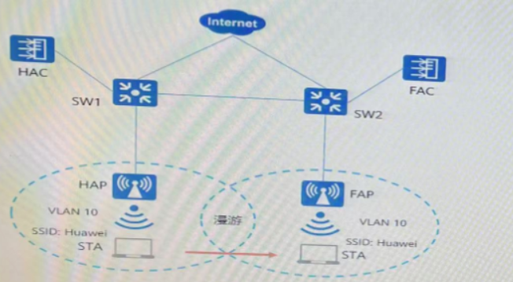

6.  某企业管理员在设备上配置了SNMPv3与网管通信,配置完毕后通过display trapbuffer命令可以查看到信息中心Trap缓冲区中存在Trap消息记录,但是网管设备没有收到Trap告警消息。那么导致该情况的原因:设备配置的SNMP版本与设备配置的Trap消息发送版本不一致
7.  VRRP在选举完后通过发送通告报文来检测设备是否发生故障,缺省情况下,VRRP通告间隔时间为1秒
8.  某企业管理员在部署VRRP网络时,设置的虚拟IP地址为192.168.1.254,VRID为1。则网络稳定后虚拟MAC地址应该是0000-5e00-0101
9.  BFD是一种高可靠性的快速故障检测机制,可以检测多个网络层次的通道。BFD本身属于以下哪一层次的协议 应用层
10. 企业管理员在日常运维时查看的VRRP备份组信息如下,以下关于该回显信息的描述,错误的是哪一项? 该备份组为管理VRRP备份组

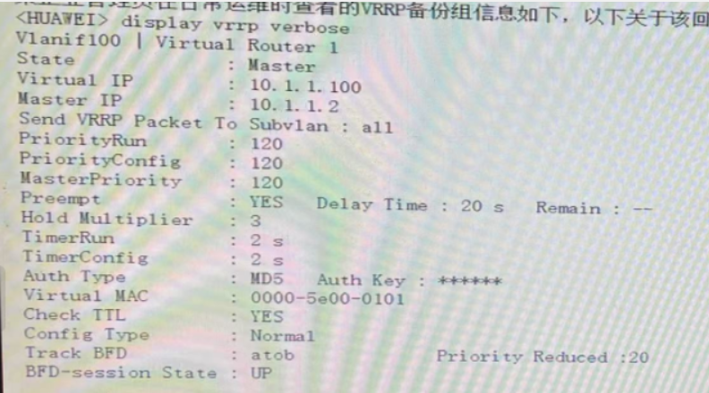

11. 在RSTP网络中,选举根端口或指定端口时可能会比较接口优先级。缺省情况下,华为交换机接口的优先级为以下哪一数值? 128
12. 某管理员在设备上通过as-path-filter定义了过滤器s1,并向BGP邻居通告,具体配置如下。配置完成后,可以从邻居获取以下哪一种类型的路由? 只接收AS65500始发的路由

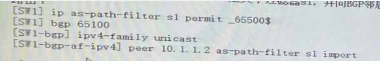

13. 当一台运行了BGP的路由器收到邻居发送来的路由时。发现该路由不可达。那么该设备会采取以下哪一项措施? 接收该路由,并加入到BGP路由表中
14. 当BGP邻居建立完成后,缺省情况下,设备每隔多少秒发送一次Keepalive报文来保持BGP连接? 60
15. 某企业采用华为路由器部署IS-IS网络,实现全网通信,现工程师想修改接口开销值,控制路由选路。那么缺省情况下,可配置的最大开销值是为以下哪一数值? 63
16. 在IS-IS网络中,所有路由器都会产生LSP,但伪节点生成的LSP中,不包含以下哪一种信息? 路由信息
17. 在IS-IS网络中,NET的长度与NSAP的相同,其组成部分也相同。其中,以下NET所含字段中,用来在区域内唯一标识主机或路由器的是哪一项? System ID
18. 在OSPF网络中,OSPF邻居状态有Down、Init、2-way、Loading、Full等多种状态机。其中,OSPF

路由器协商主从关系,是发生在以下哪一状态机? ExStart

19. 在OSPF网络中,LSDB用于存放LSA条目,常见的LSA类型主要有路由器LSA、网络LSA等。通常情况下,可使用LSA三元组来唯一标识一条LSA,那么该三元组中不包括以下哪一项? LS Sequence Number
20. 在部署VRRP网络时需要注意一些特别事项,否则可能会造成网络不通。以下关于VRP注意事项的描述,错误的是哪一项? VRRP设备发送ARP老化探测报文时,源IP地址为虚拟IP地址
21. IP-Prefix是路由策略中常用的匹配工具,在华为路由器配置IP-Prefix时,其匹配项不可能包含以下哪一项? 端口号
22. Origin属性用来定义BGP路径信息的来源,一共有三种类型,存在优先级关系。以下关于优先级关系的排序,正确的是哪一项? IGP\>EGP\>Incomplete
23. 路由器查找FIB表时,会选择一个掩码最长的FIB表项转发报文。其中,当表项中的Flag字段为以下哪一参数时,表示该路由是网关路由,即跳为网关? A G
24. 某大型企业汇AN网络拓扑图如下所示。用户数据转发方式为隧道转发,漫游为AC间三层漫游,那么STA漫游后的流量转发路径正确的是以下哪一项? STA-\>FAP-\>FAC-\>HAC-\>SW1- Internet

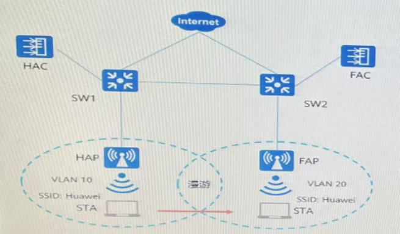

25. VPN的类型非常丰富,可以应用在不同层次中。其中SSL VPN属于以下哪一网络层次的VPN? 应用层
26. SSH是一种安全的协议,可以为用户在非安全的网络上构建隧道,从而保障数据的安全。以下关于用户通过SHH方式登录设备的描述,错误的是哪一项? 缺省情况下,SSH服务器的端口号为23,可以修改SSH Server的端口为非知名端口,减小被扫描攻击的概率
27. IGMP有三个版本,不同版本支持的特性有所区别。以下哪一项是所有版本均支持的特性? 成员报告报文
28. 汇聚点RP在组播网络中是一台重要的PIM路由器,以下关于RP的描述,错误的是哪一项? 一个RP只能为一个组播组服务
29. 某工程师在配置组播协议时未经过版本比对,结果设备配置的IGMP Snooping版本比用户主机的IGMP版本低。此时会发生以下哪一种情况?

用户无法收到组播数据,因为设备在收到IGMP Report报文后,只会向路由器端口转发,不会生成成员端口和转发表项

30. 在MST域内,MSTP根据WLA和生成树实例的映射关系,针对不同的VLAI生成不同的生成树实例。以下关于生成树实例的特点,描述错误的是哪一项? 每个端口在不同MSTI上的生成树参数需要相同
31. 以下关于PBR和Route-Policy的描述,错误的是哪一项? 两者若配置了多个节点,则均按照节点编号从大到小进行匹配
32. BGP在选择路由时严格按照先后顺序比较路由的属性,如果通过前面的属性就可以选出最优路由,BGP将不再比较后面的属性。因此当出现以下属性时,BGP选路会先比较哪一属性? PrefVal
33. 在配置BGP时,apply as-path命令可以用来在路由策略中配置改变BGP路由的AS_Path属性的动作。如果管理员想用指定的AS号覆盖原有AS_Path列表,可以携带以下哪一项参数进行配置? overwrite
34. 以下关于BGP协议的描述,错误的是哪一项? 因为BGP只选择最优路由,所以无法实现负载分担
35. 如图所示为某广播型IS-IS网络,缺省情况下,四台路由器选R1作为DIS。现将R2的GE0/0/1接口的dis-priority修改为63,那么当网络稳定后,以下哪一台路由器会被选为DIS R1

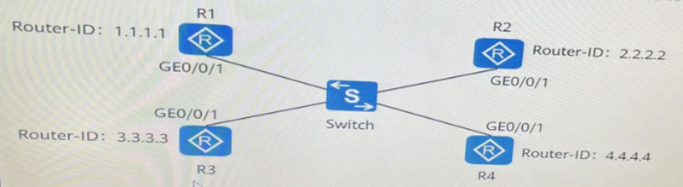

36. 在OSPF网络中,路由器通过交互LSA学习全网的路由信息,当LSA头部中LS Age达到以下哪一数值时,这条LSA会被删除? 3600秒
37. 在OSPF广播型网络中,所有0SPF路由器进行报文交互时,使用的2层组播地址是以下哪一项? 01-00-5e-00-00-05
38. 如图所示为某园区0SPF网络,图中五台路由器相连接口均为GE口且没有更改开销值,现工程师在R1上执行了import-route操作。等待网络收敛后,工程师在R2查看去往服务器192.168.1.0/24的路由条目时,其开销值应为以下哪一个? 3

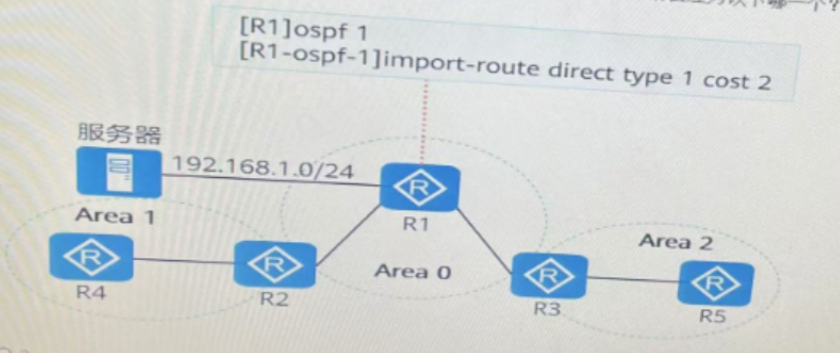

39. 某企业网络中,运行OSPF路由协议实现网络通信,已知某路由器角色仅为ABR,那么该设备可能产生以下哪些类型的LSA?

A. Network Summary LSA

D. ASBR Summary LSA

40. 在OSPF网络中,以下哪些网络类型建立0SPF邻居关系时,需确保在同一网段,且掩码要一致?

A, P2MP

1.  NBMA

D, Broadcast

41. 在网络中,每个路由器都有本地核心路由表和协议路由表。其中,本地核心路由表中的一条路由条目存在多个关键字段,主要包括以下哪些内容?
42. 学习此路由的路由协议B、
43. 此路由的目的地址

D、此路由的路由协议优先级

42. 某企业WLAN网络,为保证业务的可靠性,部署了VRRP双机热备。用户配置完成后,发现主备通道无法建立,导致双机热备份功能异常。那么造成上述故障的原因,可能是以下哪些?
43. 主备服务报文的重传次数和重传间隔不一致
44. 主备通道参数配置不匹配

D、本端的源IP地址、源端口号和对端的目的IP地址、目的端口号不一致

43. 数据加密可以有效保证VPN数据的安全性,但并不是所有的VPN都能够支持该特性。那么以下哪些VPN技术支持数据加密和验证?
44. IPSec

B、SSL

44. VRF又称VPN实例,可以帮助VP技术实现用户隔离,是一种网络虚拟化技术。正常情况下在物理设备上可以创建多个VI实例,每个VPI实例拥有独立的表项。那么以下哪些资源是VPN实例可以独立拥有的?
45. 路由表
46. 接口

D、路由协议进程

45. 邻居发现协议NDP是IPv6协议体系中一个重要的基础协议,扮演了重要的角色。它可以支持以下哪些功能和特性? 全选
46. 若一个MST域内有多台交换机,那么在部署MSTP时,需要确保以下哪些参数必须一致? 全选
47. 链路聚合是网络中常用的技术之一,其优点主要包括以下哪些项?

A增加链路带宽

C负载分担

D提高可靠性

48. 一台路由器收到报文后按照ACL匹配流程进行匹配时,匹配结果只有两种:“匹配”或“不匹配”。那么以下场景中,其返回匹配结果为“匹配”的是哪些项?
49. 匹配了ACL,但匹配动作为“permit"

C、匹配了ACL,但匹配动作为“deny"

49. BGP在建立对等体邻居时,会发送以下哪些报文?
50. Keepalive

C. Open

50. BGP为了解决AS内部的IBGP网络连接激增问题,除了使用路由反射器之外,可以使用联盟。以下关于联盟技术的描述,正确的是哪些项?
51. 所有联盟成员设备需要重新进行配置

D、该技术适用于大规模网络

51.在IS-IS网络中,会选举出类似OSPF中DR的存在,即选举DIS。那么以下关于它们相同点的描述,错误的是哪些项? 全选

52.在IS-IS网络中,路由器发送LSP报文交换链路状态信息,该报文分为Leve1-1 LSP和Leve1-2 LSP两种,且有着相同的报文格式。其中,LSP报文中的LSP ID由以下哪些部分组成?

A、System ID

2.  LSP分片后的编号

C、伪节点JD

53.在MA网络中,OSPF会通过选举DR/BDR减少邻接关系。那么以下关于DR/BDR选举的描述,正确的是哪些项?

B、DR/BDR的选举是基于接口的,接口的DR优先级数值越大越优

D、若直连的两台路由器的接口DR优先级均设置为0,则会导致这两台路由器无法建立邻接关系

54.安全策略是防火墙的核心特性,只有符合安全策略的合法流量才能通过防火墙进行转发。以下关于安全策略匹配规则的描述,正确的是哪些项?

B、当配置多条安全策略规则时,安全策略列表默认是按照配置顺序排列的,越先配置的安全策略规则位置越靠前,优先级越高

D、每条安全策略中包含多个匹配条件,各个匹配条件之间是“与”的关系

55.GRE是一种可以解决异种网络报文传输问题的VPN技术,以下关于该技术的描述,正确的是哪些项?

B、GRE隧道可以和IPSec结合使用,从而保证语音、视频等组播业务的安全

D、GRE隧道可以扩展跳数受限网络协议的工作范围

56.某企业新建网络,为了提高可靠性需要部署VRRP。为了防止配置错误导致网络不通,工程师在部署VRRP时需要注意以下哪些事项?

A、VRRP部署虚拟IP时需要和接口的IP地址在同一网段

B、VRRP备份组内各交换机上配置的VRRP协议版本尽量保持一致,否则可能造成报文不能互通

C、不同备份组之间的虚拟IP地址不能重复

57.某企业管理员想配置BFD单跳检测来实现直连链路的快速检测,以下哪些配置是管理员的必选配置?

A、配置BFD会话的远端标识符

B、配置BFD会话的本地标识符

D、使能全局BFD功能

58.VRRP只有一种报文,即Advertisement报文。以下关于该报文的描述,正确的是哪些项?

B、该报文支持认证功能

C、该报文包含了VRRP路由器的优先级

D、该报文封装的VRRP协议号为112

59.某企业管理员在日常运维时,查看路由器接口的IGMP配置如下。那么以下关于该信息的描述,正确的是哪些项?

A、接口IP地址是192.168.1.1

B、IGMP协议版本为2

D、查询报文最大响应时间是10秒

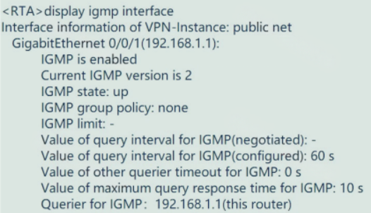

60.某华为路由器配置的IP-Prefix如下所示,那么以下可匹配成功且执行“permit"动作的是哪些路由信息?

A. 10.1.2.0/25

B 10.1. 2.5/32

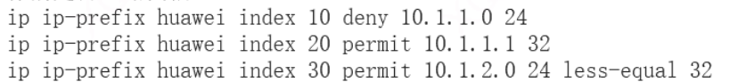

61.某企业管理员日常运维时查看BGP路由的详细信息如下,以下关于该路由的描述,正确的是哪些项?

A、该路由原始的下一跳为172.16.1.2

B、本地BGP设备的ID号为10.1.1.1

C、本地自治系统号为100

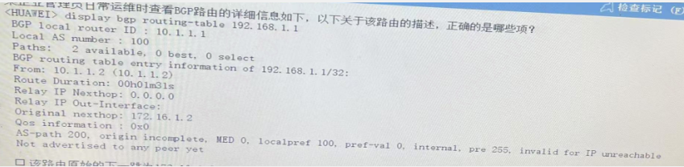

62.BGP为了解决AS内部的IBGP网络连接激增问题,除了使用路由反射器之外,还可以使用联盟。以下关于联盟技术的描述,正确的是哪些项?

A、所有联盟成员设备需要重新进行配置

C、该技术适用于大规模网络

63.在IS-IS网络中,每台路由器都可以产生LSP,那么当遇到以下哪些事件时,会触发生成一个新的LSP? 全选

64.在OSPF网络中,Router ID用于在自治系统中唯一标识一台运行OSPF的路由器,且遵循一定的选举规则。以下哪些场景会触发重新选举Router ID?

B、手动更改了OSPF的Router ID,并重启了OSPF进程

C、原来被选举为系统Router ID的IP地址被删除,且重新启动了OSPF进程

D、重新配置了系统Router ID,并重启了OSPF进程

65.在OSPF网络中,为了减少LSDB的大小,提供设备的性能,OSPF定义了多种特殊区域。其中,在完全NSSA区域中,可能存在以下哪些类型的LSA?

B、描述缺省路由的7类LSA

C、7类LSA

D、描述缺省路由的3类LSA

66.在OSPF网络中,有多种网络类型,如:Broadcast、P2P、P2MP和NBMA。缺省情况下,Hello tim

e为30秒的是以下哪些网络类型?

C. NBMA

D. P2MP

67.在OSPF网络中,7类LSA只能由NSSA区域或STUB区域中的ASBR产生,用于描述到达0SPF域外的路由。 错误

68.广域网是连接不同地区局域网或城域网通信的远程网,常用于实现园区网络、数据中心网络的互联。 正确

69.在VRRP组网中,如果用户未配置VRRP监视上行端口,则当VRRP备份组中的Master设备的上行接口或者链路出现故障时,此时主备不会发生切换,导致出现流量黑洞。 正确

70.某企业管理员在日常检查中发现部分交换机的端口没有使用,因此他登录到设备上将相关端口手工关闭,这样可以进一步保障设备安全。 正确

71.当一个TCP会话的两个连续报文到达防火墙的时间间隔大于该会话的老化时间时,为保证网络的安全性,防火墙将从会话表中删除相应会话信息。 正确

72.某华为路由器配置了PBR,因为PBR策略的优先级高于传统路由表,因此被匹配的报文会优先根据PBR的策略进行转发. 正确

73.路由器配置访问控制列表时,可以通过ACL编号标识ACL,也可以通过名称来标识ACL。其中,配置命名型ACL时,需手工指定ACL的名字和ACL的编号。 错误

74.双向路由重发布是指在边界路由器上把两个路由域的路由相互引入,但是容易造成次优路由和路由环路等问题. 正确

75.在OSPF网络中,属于Area0的IR肯定是ABR,而ASBR不一定是ABR. 错误

76.在OSPF网络中,若两台Router-ID相同的路由器运行在不同区域,且其中一台路由器为ASBR,则会造成LSA振荡。 正确

77.某企业OSPF网络的NSSA区域引入了大量外部路由,现用户要求减少非特殊区域的LSA数量,那么该企业工程师可在NSSA区域中的ABR上,对由7类LSA转化成的5类LSA进行路由汇总。 正确

78.在OSPF网络中,某一台路由器角色为ABR则该路由器也肯定是BR. 正确

79.在RSTP网络中,如果一个接口收到一个RST BPDU,发现自身缓存的RST BPDU优于收到的RST BPDU,则会直接丢弃收到的RST BPDU,不做其他回应。 错误

80.访问控制列表是路由策略中常用匹配工具之一,在一台路由器配置ACL后,即可用于匹配相应路由。 错误

81.当BGP路由发生变化时,BGP需要对非直连的下一跳重新进行迭代。如果不对迭代后的路由进行任何限制,则BGP可能会将下一跳迭代到一个错误的转发路径上,从而造成流量丢失。 正确

82.当BGP收到到达同一目的地的多条路由时,会根据选路规则选择出最优路由,因此无法实现负载分担。 错误

83.某WLAN网络中,AC与AP为三层组网,且AC与AP均采用IPv6地址。此时AP可通过DHCPv6服务器响应报文中所携带的Option43字段来获取AC的IPv6地址fc00:1 :: 1. 错误

84.在大型TLAN网络中,网络工程师通常采用漫游技术实现无线终端在不同AP覆盖范围之间移动的同时,确保用户业务不中断。 正确

85.在VRRP组网中,当VRRP设备发送ARP老化探测报文时,ARP老化探测报文中源IP地址会采用接口的IP地址,而不会采用虚拟IP地址。 正确

86.在防火墙中,对于一个已经建立的会话表项,只有当它不断被报文匹配才有存在的必要。如果长时间没有报文匹配,则说明可能通信双方已经断开了连接,不再需要该条会话表项了。此时,为了节约系统资源,系统会在一条表项连续未被匹配一段时间后,将其删除。 正确

87.在IPv6网络中,为了减少中间转发设备的处理压力,中间转发设备不对IPv6报文进行分片,报文的分片只在源节点进行 正确

88.某企业网络中,用户要求研发人员的流量需按照特定的转发路径进行数据转发,而非研发人员的流量则根据路由表进行转发。针对上述需求,可通过配置filter-policy实现。 错误

89.访问控制列表可以匹配路由或数据,但不能同时匹配IP地址前缀长度和掩码长度。 正确

90.在BGP中AS_Path属性按矢量顺序记录了某条路由从本地到目的地址所要经过的所有AS编号,如果BGP Speaker将这条路由通告给IBGP对等体时,会在open报文中创建一个空的AS_Path列表,从而避免了AS间的路由环路。 错误

91.在IS-IS网络中,区域是根据路由器来划分的,一台路由器只能属于一个区域,因此IS-IS路由器只需要维护当前所在区域的LSDB即可。 错误

92.在OSPFv2网络中,一台路由器可以同时运行多个不同的OSPF进程,并可以将同一个接口网段宣告进不同的进程中,它们之间是互不影响,彼此独立的. 错误

93.在OSPF网络中,NSSA区域与STUB区域都是为了减少LSA数量,两者最主要的区别在于,NSSA区域可以引入外部路由,并同时接收OSPF其他区域引入的外部路由。 错误

94.在某路由器的OSPF进程中,可使用命令import-route将其他OSPF进程的路由引入到当前OSPF进程中。 正确

95.(填空题)如图所示,缺省情况下华为防火墙已创建四个区域,并有着对应的优先级。其中优先级数值为100的区域是 区域。(英文全称,首字母大写) Local

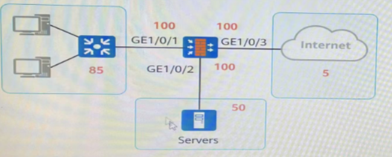

96.一条BGP路由都拥有多个路径属性,当路由器通告BGP路由给它的对等体时,该路由将会携带多个路径属性,这些属性描述了BGP路由的各项特征,同时在某些场景下也会影响BGP路由优选的决策。其中 性是华为设备的特有属性,该属性仅在本地有效,不会传递给BGP邻居。(按BGP路由表中的回显,全小写) prefval

97.在OSPF网络中,每台0SPF路由器都会产生RouterLSA,若该报文中E位置1,则表示产生此LSA的路由器角色是 。(英文缩写,全大写) ASBR

98.在OSPF网络中,若路由表的协议字段显示为 则表示该路由为OSPF的外部路由。(英文字母全大写) O_ASE

99.在实际的网络环境中,某些特殊的业务数据流的会话信息需要长时间不被老化。管理员可以通过命令 enable,启用长连接功能,从而可以保证此类业务正常运行。(英文全称,全小写) long-link

100.在初始形成STP树的过程中,所有STP交换机都认为自己是根桥,因此缺省情况下,会周期性地(每 2 秒)主动产生并发送配置BPDU。(阿拉伯数字)

## 821-2

1.边缘端口为RSTP改进STP不足所新增的端口角色,那么以下关于该端口角色的描述,错误是哪一项? 该端口收到一个配置BPDU报文后,依旧会处于Forwarding状态。

2.PBR是一种依据用户制定的策略进行路由选择的机制,主要分为接口PBR和本地PBR。以下针对接口PBR和本地PBR的描述,错误的是哪一项? 本地PBR在协议视图调用

3.在特殊场景下,BGP在向IBGP对等体通告路由时,需要把下一跳属性设为自身的IP地址,从而防止路由黑洞。那么正确的配置命令应该是以下哪一项? peer next-hop-local

4.在BGP中路由聚合可以有效减少BGP路由规模,但是在配置BGP路由聚合时需要搭配参数,否则会引起路由环路等问题。以下关于配置BGP路由聚合的描述,错误的是哪一项? 执行命令aggregate,并携带suppress-policy参数时,只发布通过路由策略的被聚合的路由

5.在IS-IS网络中,若一台路由器为Leve1-1-2路由器,那么它发送的IIH报文中的Reserved/CircuitType字段应该表示为以下哪一项? 11

6.在OSPF网络中,OSPFArea用于标识一个OSPF区域。若某OSPF区域ID为Area0.0.1.0,则等同于以下哪一个Area ID? Area 256

7.如图所示为某大型企业WLAN网络的组网拓扑图,该组网中用户数据转发方式为直接转发,漫游为AC间三层漫游,且将家乡代理设置为HAC。那么在以上场景中,STA漫游后的数据转发路径正确的是哪一项? STA-\>FAP-\>FAC-\>HAC-\>SW1-\>Internet

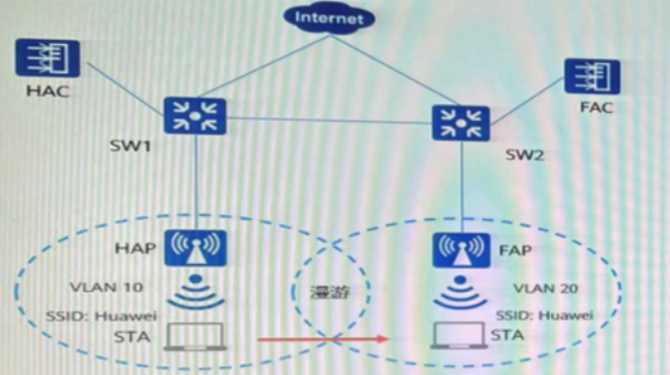

8.VRRP冗余备份方案实施的重要成份就是VRRP路由器的优先级和抢占功能,以下关于VRRP备份方案的描述,错误的是哪一项? 创建的VRRP设备即使为IP地址拥有者,也需要参加选举,并不会收到接口Up的消息后就将自己状态直接切换至Master状态

9.在实际部署BFD时,除了部署正常功能以外还需要调整部分参数,以便更好的检测网络状况。以下关于BFD优化的描述,错误的是哪一项? 为快速了解网络状况和性能需求,可以将设备BFD报文发送间隔时间调最小

10.在IPv6中NDP使用多种ICMPv6报文,其中RS报文用于以下哪一项功能? 前缀重编址

11.为了减少用户主机所在网段内的IGMP协议报文数量,可以在二层设备上部署IGMP Snooping Proxy功能。但是IGMP Snooping Proxy对接收到的协议报文的处理方式并非完全一致,以下关于该协议处理报文方式的描述,错误的是哪一项? 如果接收到的是IGMP报告报文,会直接丢弃

12.针对STP的不足,RSTP改变了配置BPDU的格式,充分利用了STP报文中的以下哪一字段,明确了端口角色? Flag

13.在BGP网络中,可调用Route-Policy修改路由属性,那么以下关于路由策略使用的描述,错误的是哪一项? 使用network引入路由时,不可调用Route-Policy,修改引入路由的属性

14.以下关于BGP协议的描述,正确的是哪一项? 一台路由器上不能配置多个BGP进程

15.BGP设备在收到邻居发送过来的路由中携带了一个不识别的属性,但是不确定其他设备是否需要,因此在通告给其他对等体的时候仍然携带该属性,以下哪一项属性属于此类型? :Community

16.在OSPF网络中,DR Other给DR/BDR路由器发送DD报文时,使用的组播地址是以下哪一个?

224.0.0.6

17.在IPv4地址空间中,D类地址被用于组播。在D类地址范围内,以下哪一项属于为路由协议预留的永久组播地址? 224.0.0.0-224.0.0.255

18.华为防火墙中安全区域的优先级数值越大代表优先级越高,默认情况下Trust区域的优先级是以下哪一项? 85

19.华为防火墙默认在启用时会创建一些安全区域,那么以下哪一安全区域是用户自己创建的? LSP

20.以太网传输IPv4单播报文的时候,目的MAC地址也是组播MAC地址。如果组播组的IP地址为224.0.1.1,那么对应的组播MAC地址应该为以下哪一项? 01-00-5e-00-01-01

21.ACL是路由常用匹配工具之一,并根据ACL规则功能的不同将ACL划分成多种类型,且每类ACL编号的取值范围不同。其中,编号范围为4000\~4999,表示的是以下哪一类型ACL?

二层ACL

22.访问控制列表是路由策略常用的匹配工具之一,华为路由器配置数字型ACL时,必须配置以下哪一参数? 匹配动作permit或deny

23.在BCP网络中,本地生成的路由可能存在多种途径,那么当本地存在多种途径学习到相同BGP路由时,优先级最高的是以下哪一项? 手动聚合路由

24.以下哪一种团体属性可以使设备在收到具有此属性的路由后,向任何BGP对等体发送该路由? Internet

25.BGP常用的路由策略工具中,以下哪一项能够用来匹配特定AS-Path属性? ip as-path-filter

26.在IS-IS网络中,可将一个AS划分为骨干区域和非骨干区域。其中,骨干区域可以存在的IS-IS路由器是以下哪一项? Level-1-2fpLevel-2

27.在广播型IS-IS网络中,需要选举DIS,其功能是创建并更新伪节点。缺省情况下,IS-IS接口的DIS优先级为以下哪一数值? 64

28.在OSPF网络中,OSPF定义了多种网络类型,其中,必须由网络工程师手工指定的是以下哪一种网络类型? P2MP

29.如图所示为某园区0SPF网络,图中五台路由器相连接口均为GE口且没有更改开销值,现工程师在R1上执行了import-route操作。等待网络收敛后,工程师在R4上查看去往服务器192.168.1.0/24的路由条目时,其开销值应为以下哪一项?(11.29确认题目完整,可查看解析): 2

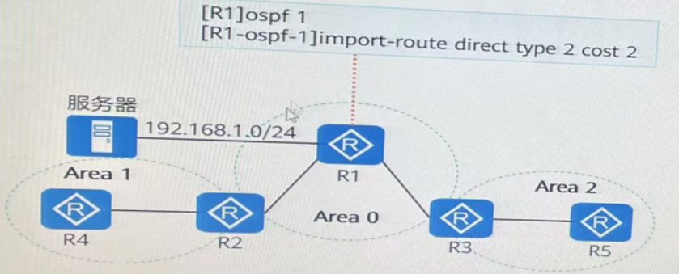

30.某MSTP网络中,四台交换机为实现负载分担,创建了多个MSTP实例。完成配置后,用户分别在四台交换机上执行命令display stp brief,其回显信息如图所示。那么以下关于该网络的描述,正确的是哪一项? SW1为MSTI 1的根桥

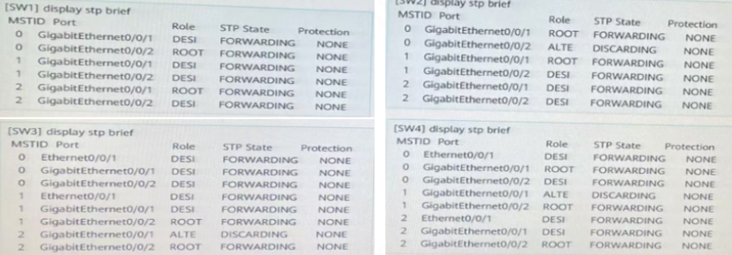

31.BGP联盟可以解决AS内部中IBGP网络连接激增的问题,因此被广泛应用。以下关于该属性的描述,错误的是哪一项? 联盟将一个AS划分为若干个子AS,每个子AS内部建立EBGP全连接关系

32.在BCP中MED属性是一种度量值,用于向外部对等体指出进入本AS的首选路径。以下关于该属性的描述,正确的是哪些项?

A、MED属性值越小则BGP路由越优

C、在IBGP对等体之间传递路由时,MED值会被保留并传递,除非部署了策略,否则MED值在传递过程中不发生改变也不会丢失

D、MED被传递给EBGP对等体后,对等体在其AS内传递路由时,携带该MED值

33.以下场景中,两台直连华为路由器,配置IS-IS路由协议后肯定不能成功建立邻接关系的有哪些项?

B、两台路由器一台为Level-1路由器,另一台为Level-2路由器

C、两台路由器均为Level-1路由器,且Area Address不同

34.在OSPF网络中,OSPF根据链路层协议类型,将网络分为了四种类型。其中,不需要选举DR/BDR的是以下哪些网络类型?

B. P2MP

C. P2P

35.在OSPF网络中,区域间路由的防环机制要求所有非骨干区域必须与骨干区域直接相连,若某个非骨干区域没有与骨干区域相连,则可通过配置虚连接解决。那么以下关于虚连接的描述,正确的是哪些项?

B、虚连接可以用于骨干区域被分割的场景

D、虚连接可以用于优化OSPF路径

36.在OSPF网络中,为减少某些区域的LSA数量,定义了多种特殊区域,如STUB、NSSA等。那么以下关于STUB区域的描述,正确的是哪些项?

A、虚连接不能穿越STUB区域

C、STUB区域中的所有路由器都必须配置STUB区域属性

37.路由协议是路由器之间维护路由表的规则,用于发现路由,生成路由表,并指导报文转发。其中,依据来源的不同,可将路由分为以下哪些类别?

A、静态路由

B、直连路由

D、动态路由

38.某企业部署完IPSec后发现业务不通,经管理员排查发现没有数据流触发IKE协商,那么以下哪些原因可能导致该情况发生? 全选

39.以下关于包过滤防火墙的描述,正确的是哪些项?

A、包过滤防火墙的本质是通过配置ACL实施数据包的过滤

C、包过滤防火墙支持逐包检测

40.IGMP SSM Mapping通过静态的将组播源与组播组进行绑定,使得IGMPv1与IGMPv2的组成员也能接入SSM组播网络。以下关于IGMP SSM Mapping的描述,正确的是哪些项? 全选

41.汇聚点RP在组播网络中是一个重要的路中器,以下关于RP的描述,正确的是哪些项?

B、RP是RPT树的树根

C、一个RP可以同时为多个组播组服务

42.在RSTP网络中,针对STP的不足,对端口角色进行了改进。那么RSTP可以包含以下哪些角色? 全选

43.IP-Prefix是路由策略中常用的匹配工具,某台华为路由器配置IP-Prefix时,以下参数中非必须配置的有哪些项?

A、掩码长度匹配范围的下限

C、前缀列表的序号

D、掩码长度匹配范围的上限

44.在BGP网络中,建立EBGP邻居关系时,要使非直连的EBGP邻居正常建立,则必须包含以下哪些配置?

A, peer as-number

B. peer ebgp-max-hop

C. peer connect-interface

45.在OSPF网络中,OSPF路由器会发送Hello报文建立邻居关系,但不同网络类型发送Hello报文的方式不同。那么以下哪些网络类型会以组播方式发送Hello报文?

B, P2P

C. P2MP

D. Broadcast

46.NETCONF是一种网络配置协议,它用可编程的方式实现网络配置的自动化,从而简化并加速网络服务部署。用户使用该协议可以实现以下哪些配置操作? 全选

47.以下关于IPv6地址表示方法的描述,正确的是哪些项?

A、在一个IPv6地址中只能使用一次双冒号“ :: ”

B、每组中的前导“0”都可以省略

D、地址中包含的连续两个或多个均为0的组,可以用双冒号“:”来代替

48.AS Path属性是BGP中重要的属性,可以作为路由优选的衡量标准之一。以下关于该属性的描述,正确的是哪些项?

A、BGP计算AS Path长度时不考虑AS_Confed \_Sequence和AS_Confed \_Set

B、该属性可用于BGP路由防环

D、路由被通告给IBGP对等体时,AS Path不会发生改变

49.当需要在AS之间传递路由的时候,经常会通过BGP和IGP互相引入来实现。但是这种实现方式存在风险,因此需要考虑以下哪些问题? 全选

50.某大型企业WLAN网络,为确保组网可靠性,AC采用VRRP双机热备份的组网方式。那么基于VRRP双机热备份进行数据备份时,可采用以下哪些备份方式?

B、定时同步

C、批量备份

D、实时备份

51.黑客经常通过各种攻击来获取系统管理员用户的登录权,为了增加管理员的账号安全,可以采取以下哪些措施进行安全加固?

C、建议账号专用,管理员应按照不同的维护角色,分配不同的账号,避免不同人员间共享账号

D、定期检查系统中是否存在无用的管理员帐户,如果存在,建议删除无用帐户,减小攻击面

52.RPF检查是组播中一个极为重要的机制,可以确保转发路径的正确性和唯一性。正常情况下,RPF检查会从以下哪些路由表项中选出最优路由?

A、MBGP路由表

B、单播路由表

D、组播静态路由表

53.在RSTP网络中,新增了多种保护功能,如:根保护、环路保护、防TC-BPDU攻击等。那么以下关于RSTP新增保护功能的描述,正确的是哪些项?

A、启用防TC-BPDU攻击功能后,对于其他超出阈值的TC BPDU报文,定时器到期后设备只对其统一处理一次

B、在开启环路保护功能后,若根端口长时间收不到上游设备的BPDU报文,则会将端口角色切换为指定端口

C、某开启了根保护功能的指定接口收到优先级更高的RST BPDU时,一段时间内将无法转发报文

54.如图所示为某OSPF网络,已知R1和R2已成功建立邻接关系,现一工程师在R2上配置了图中命令。那么在R2上查看LSDB时,可能存在以下哪些LSA? 全选

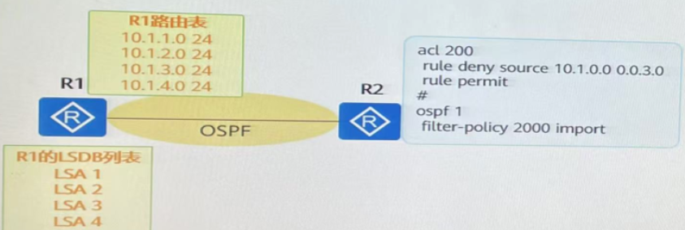

55.BGP协议本身不发现路由,因此需要将其他路由引入到BGP路由表,实现AS间的路由互通。其中Import方式是按协议类型将路由引入到BGP路由表中,那么Import支持将以下哪些路由引入到BGP路由表中? 全选

56.如图所示,R1通告BGP路由给EBGP对等体,以下关于该过程的描述,正确的是哪些项?

A、R2收到该路由传递给R3时,会保持路由的Next Hop属性值不变

B、该路由中包含了这条路由的Origin属性

C、R1只发送增量更新路由

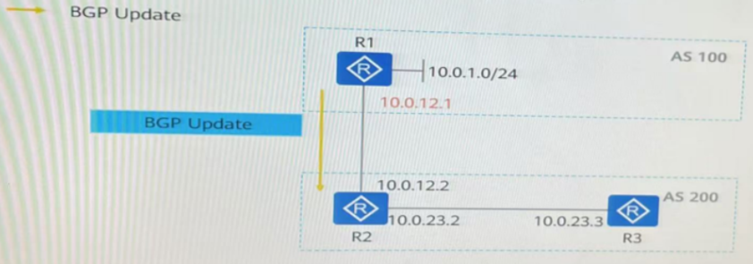

57.BGP协议是一种实现自治系统AS之间的路由可达,并选择优选路由的距离矢量路由协议。那么以下关于该协议的描述,正确的是哪些项?

A、BGP提供了丰富的路由策略

B、BGP使用TCP作为其传输层协议

58.BGP在发送路由更新报文时,一定会携带以下哪些属性?

A. AS Path

D. Next_Hop

59.在IS-IS网络中,网络设备需要配置网络实体名称,它由三部分构成,且每个部分包含的字段不同。其中,Area Address部分包含以下哪些字段?

A. AFI

C. IDI

D. High Order DSP

60.某企业办公网络采用OSPF路由协议实现网络通信,现工程师在一台路由器查看0SPF接口GEO/0/1的详细信息如下所示。那么以下关于该接口的描述,正确的是哪些项?

A、该接口不能接收或发送OSPF报文

B、该接的网络类型为Broadcast

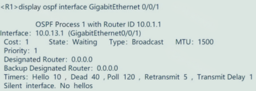

61.在OSPF网络中,区域内通过算法避免环路的发生,但区域间可能存在环路,因此OSPF定义了区域间路由的防环机制。那么以下关于该防环机制的描述,正确的是哪些项? 全选

62.数据中心是一整套包括机房在内复杂的设施,正常在部署数据中心时会涉及以下哪些设备? 全选

63.一个Route-Policy由多个if-match和apply子句组成,若通过节点匹配的路由将执行所有apply子句。其中,配置apply子句时,可以修改以下哪些路由信息? 全选

64.某BGP组网中如果部署了路由反射器RR,那么它需要遵循以下哪些反射规则?

A、从非客户机学到的路由,只发布给所有客户机

B、当路由反射器执行路由反射时,它只将自己使用的、最优的BGP路由进行反射

C、从EBGP对等体学到的路由,发布给所有的非客户机和客户机

65.使用ACL进行路由匹配时,不管是基本ACL还是高级ACL,或者是用户ACL,缺省情况下它们的ACL规则步长均为10。 错误

66.BGP路由表路由数量通常比较大,传递大量的路由对设备来说是一个很大的负担,为了减小路由发规模,需要对发布的路由进行控制,只发送自己想要发布的路由或者只发布对等体需要的路由。 正确

67.BGP中Next Hop属性记录了路由的下一跳信息,和IGP中的下一跳一样,一定是邻居接口的IP地址。 错误

68.在IS-IS网络中,直连的两台路由器不管是P2P网络类型或是Broadcast网络类型,缺省情况下,都是3次握手建立邻居关系。 正确

69.如图所示,通过配置VRRP与BFD联动,当Backup设备通过BFD感知故障发生之后,等待Master Domn Timer计时器超时后Backup设备会立即切换VRRP状态。 错误

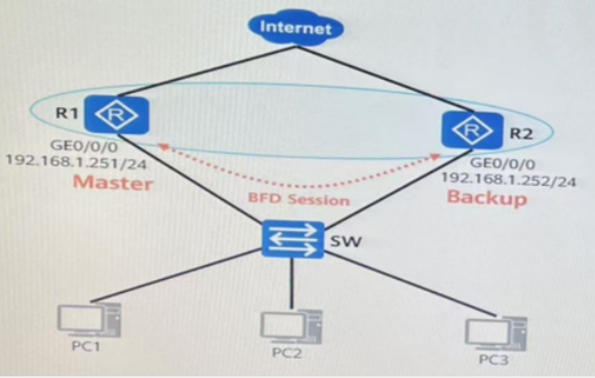

70.GRE是一种二层VPN封装技术,可以对某些数据链路层协议的报文进行封装,最后使封装后的报文都能够在IP网络中传输。 错误

71.在IP组播中,RPF路由只可以从单播路由和组播静态路由中选举产生。 错误

72.在华为路由器上,若未配置ACL或配置了ACL但没有配置规则,那么它们返回ACL的匹配结果均为不匹配。 正确

73.在配置EBGP时,缺省情况下EBGP连接允许的最大跳数为1,即只能在物理直连链路上建立EBGP连接。 正确

74.在BGP对等体建立后,改变BGP的Router ID会导致BGP对等体关系重置。 正确

75.在IS-IS网络中,Level-1路由器只能通过Level-1-2路由器接入IS-IS骨干区域从而访问其他区域。 正确

76.在IS-IS网络中,一台路由器只能属于一个区域;而在OSPF网络中,一台路由器的不同接口可以属于不同的区域。 正确

77.某企业办公网络中,运行了OSPF路由协议且划分了多个OSPF区域,为减少路由表规模和优化设备资源利用率,该企业网络工程师可在ASBR上执行路由汇总,减少区域间的三类LSA。 错误

78.工程师在配置VRRP时需要注意各备份组之间的虚拟IP地址不能重复,但是同属一个备份组的设备接口可以使用不同的VRID。 错误

79.当防火墙接收到一个报文且没有命中会话表时会直接丢弃,从而防止外部攻击,可以有效保障企业内部的信息安全。 错误

80.网络实体名称是一种特殊的NSAP,由区域地址和System ID组成,且SEL固定取值00,主要用于路由计算。 正确

81.在OSPF网络中,两台直连路由器,一台设备的网络类型为P2P,另一台为P2MP。针对以上场景,若将两台设备的Hello时间修改一致后,则不影响邻居的建立及LSDB的同步。 正确

82.在OSPF网络中,若两台Router-ID相同的非直连路由器运行在同一区域,会导致1类LSA计算出现问题。 正确

83.路由器查找FIB表时,将报文的目的IP地址和FIB表中的各表项的掩码进行按位“逻辑或”,得到的地址符合FIB表中的网络地址则匹配。 错误

84.在WLAN网络中,网络工程师可以通过VLAN Pool将接入的用户分配到不同的VLAN中,从而减少广播域,提升网络性能。 正确

85.设备在首次创建单跳BFD会话时,必须绑定对端IP地址和本端相应接口,且创建后不可修改。如果需要修改,则只能删除后重新创建。 正确

86.VRRP默认是抢占模式,当Backup路由器发现Master路由器的优先级比自己更低时,它将立即切换至Master状态,成为新的Master路由器。 正确

87.IPv6中的接口ID可以手工配置、系统自动生成,或基于IEEE EUI-64规范生成。 正确

88.IGMP Snooping Proxy功能在IGMP Snooping的基础上使交换机代替上游三层设备向下游主机发送IGMP Query报文和代替下游主机向上游设备发送IGHP Report和Leave报文,这样能够有效的节约上游设备和本设备之间的带宽。 正确

89.在STP网络中,若拓扑发生变更,必须先将拓扑变化信息传递给根桥,再由根桥向下泛洪拓扑变更信息。 正确

90.二层交换机的以太网接口有多种类型,其中,一个Access接口只能加入到一个VLAN中,而一个Trunk接口可以同时允许多个VLAN的数据帧通过。 正确

91.在OSPF或IS-IS网络中,路由器可以通过命令filter-policy import过滤掉其他邻居转发给它的LSA。 错误

92.在WLAN网络解决方案中,可采用iMaster NcE-Campus作为准入服务器,对无线用户进行身份验证 正确

93.华为防火墙的默认安全区域不能删除,但是管理员可以手工修改安全优先级 错误

94.互联网编号分配委员会将D类地址空间分配给IPv4组播使用,IPv4地址一共32位,D类地址最高4位为1111。 错误

95.为了避免路由聚合可能引起的路由环路,BGP设计了AS_Set属性,该属性是一种有序的AS_Path属性,标明聚合路由所经过的AS号。当聚合路由重新进入AS_Set属性中列出的任何一个AS时,BGP将会检测到自己的AS号在聚合路由的AS_Set属性中,于是会丢弃该聚合路由,从而避免路由环路的形成。 错误

96.华为路由器收到报文后,会按照ACL匹配规则进行报文匹配。缺省情况下,华为路由器采用的ACL匹配顺序是 模式。(英文全称,全小写) config

97.在IS-IS网络中,某台路由器区域号为49.0001,Router-ID为10.10.1.1,为了便于管理,一般根据Router ID配置system ID。那么其对应的NET地址应该为: (填写阿拉伯数字,用“"分开) 49.0001.0100.1000.1001.00

98.为了书写方便,IPv6提供了压缩格式。那么该IPv6地址:FC00:0000:130F:0000:0000:09C0:876A:130B以最简的形式书写应该简化为 :FC00:0:130F::9C0:876A:130B

## 821-3
1.iMaster NcE-fFabric是华为面向数据中心网络场景推出的控制系统，可以从多维度帮助客户提升业务效率。但该控制器不具备以下哪一项功能（转发）

2.VRRP冗余备份方案实施的重要成分就是VRRP路由器的优先级和抢占功能，一以下关于VRRP备份方案的描述，错误的是哪一项？（创建的VRRP设备即使为IP地址拥有者，也需要参加选举，并不会收到接口up的消息后就将自己状态直接切换至Master状态)

3.以下关于BFD检测模式的描述，错误的是哪一项（异步检测模式不支持回声功能）

4.MSTP可将一个交换机网络划分成多个域，每个域内形成多棵生成树，且生成树之间彼此独立。以下关于MST域的描述，错误的是哪一项（同一个MST域内的交换设备可以配置不同的域名）

5.在VLAN Po1中，用户可以在一个AP上创建不同的VP为不同的用户群里提供无线接入服务。如图所示为终端接入无线网络的流程，其中，VLAN Po01给终端分配VLAN发生在以下哪一步骤（3）

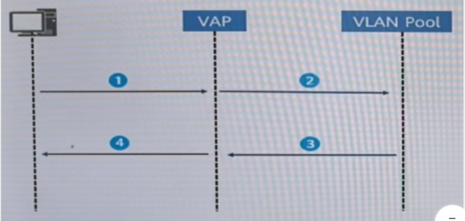

6.GRE 是一种VPN封装技术，被广泛用于跨越异种网络的报文传输问题。以下关于该协议的描述，错误的是哪一项（GRE支持加密和认证）

7.邻居发现协议NDP是IPV6协议体系中的一个重要基础协议，以下关于该协议的描述，错误的是哪一项（地址解析的二层完成，不同的二层介质采用相同的地址解析协议）

8.在RSTP网络中，可通过配置交换机的STP优先级来指定某台设备作为根桥。缺省情况下，华为交换机的STP优先级为以下哪一数值（32768）

9.如图所示，R1将直连路由10.1.1.0/24引入到了0SPF中，现用户在R2和R3上执行了双向路由重发布，并在R3上配置了如下命令。当网络稳定后，用户在R4是查看路由表中的10.1.1.0/24路由条目时，其Pre值为以下哪一数值（15）

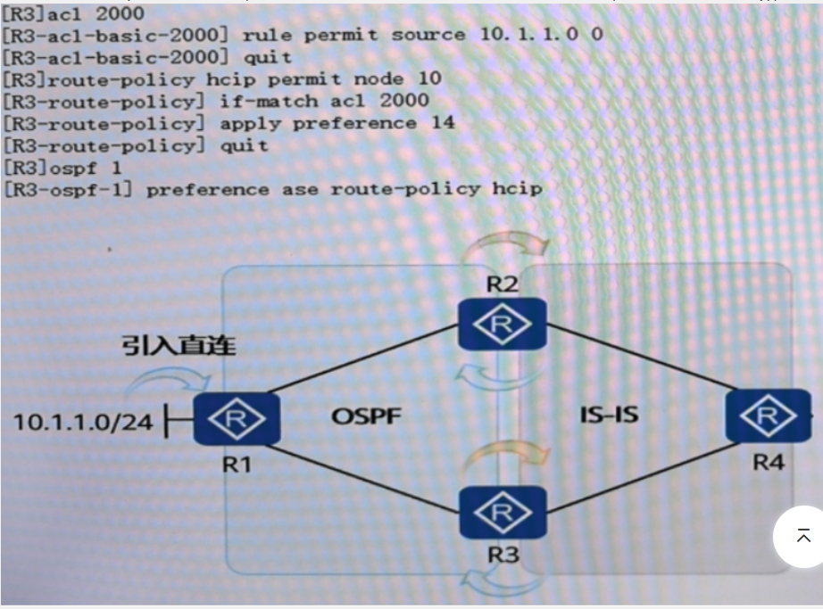

10.在BGP中ASPath属性按矢量顺序记录了某条路由从本地到目的地址所要经过的所有AS编号，以下关于传递路由时该属性变化的描述，错误的是哪一项？（当BGPSpeaker将这条路由通告给EBGP对等体时，便会把本地AS编号添加在ASPath列表的最后面）

11.边界网关协议BGP是一种实现自治系统之间的路由可达的距离矢量路由协议，它基于以下哪一项协议的端口号建立BGP会话？（TCP179)

12.缺省情况下，OSPF的P2P和Broadcast网络类型中接口的Deadtime是以下哪一时长?(40秒）

13.在OSPF网络中，OSPF根据链路层协议类型，将网络分为了四种网络类型。其中，以组播方式发送所有协议报文的是以下哪一种网络类型？（P2P）

14.IGMPSnooping是组播协议中一个重要的协议，以下关于该协议的描述，错误的是哪一项？（设备运行了IGHPSnooping后，收到不同的IGMP协议报文会进行相同的处理）

15.一台路由器的FIB表如下所示，当收到一个目的地址是10.9.1.2的报文时，会从以下哪一个接口转发该报文？（GigabitEthernet2/0/0)

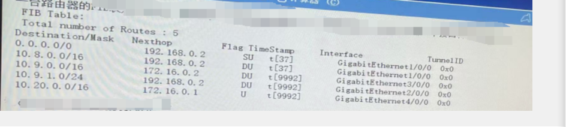

16.在OSPF网络中，两台直连路由器建立邻居关系失败，管理员在其中一台路由器上执行命令dispiay ospf eror的回显如下。那么通过回显信息分析，可以得出造成该问题的原因是以下哪一项？（OSPF Router ID一致）

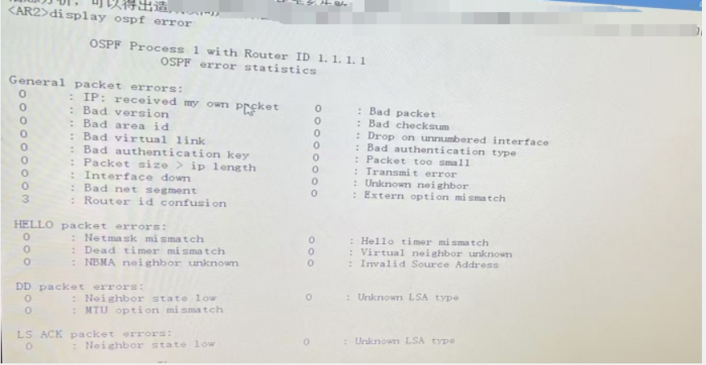

17.在IPSec中，SA是由一个三元组来唯一标识的。那么以下哪一参数不属于SA的三元组信息？（密钥交换协议）

18.当报文经过防火墙时，防火墙会为其创建相关的会话连接，从而指导后续报文转发。但是防火墙并非会为所有的报文都建立会话，那么以下哪一项报文到达防火端时，防火墙不会为其创建会话表项？（分片后续片报文）

19.以下关于IGMPv1和IGHPv2的描述，错误的哪一项（IGMPv2不支持特定组查询）

20.Wi-Fi6作为新一代无线技术，极大地提升了带宽速率，并提供了更高的性能。以下关于Wi-Fi6特性的描述，错误的是哪一项？（零时延，保障业务高效运行）

21.如图所示为某IS-IS网络，R1、R2和R3接口均为GE口，R1将网段10.0.1.1/32宣告进IS-IS网络。那么缺省情况下，R3到达10.0.1.1/32的开销值为以下哪一数值？（20）

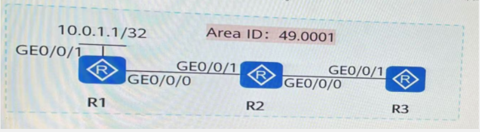

22.如图所示为某企业OSPF网络，R1的OSPF相关配置如图中所示。那么以下关于该组网的描述，错误的是哪一项?（R1接口GE0/0/1所属网段将不能发布出去）

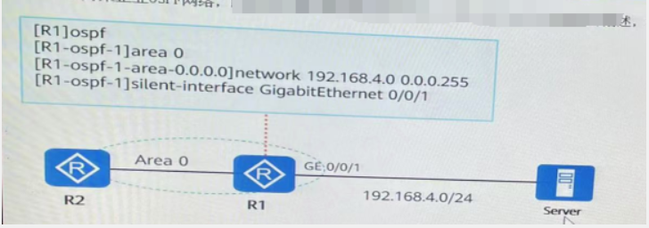

1.  安全策略的主要目标是降低入侵成功率和发现攻击者，为了确保在攻击的整个生命周期内进行检测和预防，需要制定一系列的规划。以下关于规划安全策略的描述，错误的是哪一项？（在所有动作为允许的安全策略规则中尽量不引用内容安全配置文件，以便快速检查）
2.  某台路由器使用高级ACL过滤数据，其配置命令如下所示。那么以下关于该配置的描述，错误的是哪一项？[Huaweil acl 3001

[Huawei-ac1-adv-3001] rule permit icmp source 192.168.1.3 0 destination 192.168.2.0 0.0.0.255（该ACL允许主机192.168.1.3去往192.168.2.0/24网段的IP报文通过）

25.某工程师在日常运维时发现两台设备的HoldTime参数不一致，此时会发生以下哪一种情况？（正常建立，协商Hold time值取最小值）

26.在大规模的网络中，BGP路由表十分庞大，给设备造成了很大的负担，因此一般都需要配置路由聚合。以下关于BGP路由聚合的描述，错误的是哪一项？（手动聚合无法控制聚合路由的属性）

27.在OSPF网络中，可通过“隐式确认”来确保DD报文传输的可靠性和完整性，该功能主要是通过DD报文中以下哪一字段实现的？（DD sequence number）

28.某大型企业为确保WLAN网络的可靠性，AC采用了VRRP热备份组网。那么以下关于VRRP配置的描述，错误的是哪些项？（缺省情况下，设备在VRRP备份组中的优先级为100，数值越小优先级越高）

29.（多选题）业务在设置访问通道时存在同一个访问需求有多种访问通道服务的情况，正常情况下会废弃不安全的访问通道，而选择安全的访问通道。那么以下哪些项属于安全的访问通道？（HTTPS，SFTP)

30.（多选题）IPV6在设计的时候考虑到IPV4的弊端，进行了改良和更新。相较于IPV4协议，IPv6协议具有以下哪些优势？(IPy6协议内置支持通过地址自动配置方式使主机自动发现网络并获取IPv6地址,可实现QoS,支持IPSec的认证和加密)

31.IGMP组表项在组播转发中起到了重要的作用，某管理员通过命令查看一个组播表项信息如下。以下关于该表项的描述，正确的是哪些项？(

A、该表项可用于构建相应(S，G)表项

B、Expires代表了该组的老化时间

C、该表项是由用户主机发送的IGMP加入报文触发创建的

D、225.1.1.2是用户加入的组地址)

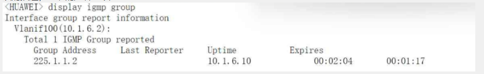

1.  （多选题）某大型企业为确保WLAN网络安全，对访客采用外置Porta1认证，且使用AC作为接入设备。但认证过程中访客一直无法认证成功，那么导致该问题的原因可能是以下哪些？

A.AC配置的共享密钥和Porta1服务器不一致

B.AC上配置的向Porta1服务器发送报文的目的端口与Porta1服务器上的认证端口不一致

C.AC关闭了STA地址学习功能

D.AC开启了Porta1服务器探测功能，而Porta1服务器上未开启该功能

33.（多选题）某企业管理员部署完DHCP服务器后，员工反应客户端无法从DHCP服务器获取IP地址。那么以下哪些原因可能会造成此类情况发生？

A、DHCP客户端和DHCP服务器不在同一个网段，网络中未配置DHCP中继

D、缺省情况下，系统未开启DHCP功能，管理员忘记启用

34.BFD的单臂回声功能是指通过BFD报文的环回操作检测链路的连通性，那么以下关干该功能的描述，正确的是哪些项？

A、单臂回声功能只适用于单跳BFD会话中

B、在对端使能了URPF特性的情况下，可能会导致BFD报文在对端被错误地丢弃

C、在配置单臂回声功能的BFD会话时，不仅需要配置本地标识符，也需要配置远端标识符

35.BFD作为一个快速故障检测机制，可以和多种协议进行联动。那么以下哪些协议支持和BFD进行联动？

A、静态路由

B、BGP

C、OSPF

D、PIM

36.（多选题）PIM-DM有很多工作机制，以下哪些机制用于构建SPT？

A、剪枝

B、扩散

D、嫁接

37.如图所示为某RSTP网络，现用户在根桥SW1和SW2之间新增了一条链路，那么当SW2收到根桥SW1发送的Proposal位置位的RSTBPDU之后，会将自己的所有端口进入同步状态，那么以下关于各角色接口同步状态的描述，正确的是哪些项？

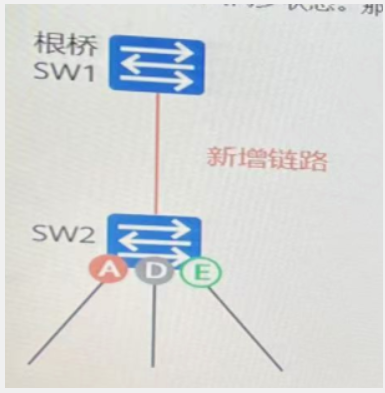

A指定端口会进入Discarding状态

1.  A1ternate端口会进入Discarding状态

38.（多选题）BGP设备在发送Open消息建立对等体连接时，会携带以下哪些信息？

A.Router ID

B.Hold time

D.本地自治系统号

39.（多选题）某园区网络中，全网运行IS-IS路由协议，现工程师在某一台设备上查看LSDB的详细信息如下所示。那么根据回显信息，以下描述正确的是哪些项？

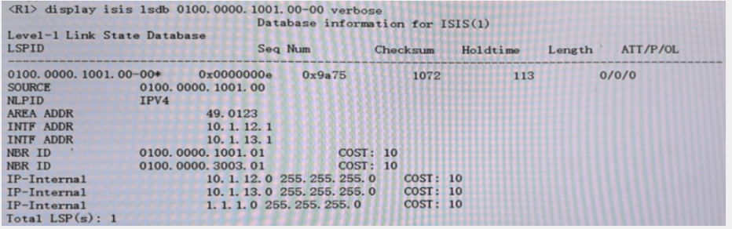

1.  该LSP来源的区域号为49.0123
2.  D、该LSP源节点的系统ID为0100.0000.1001.00

40.（多选题）某企业办公网络中，两台直连路由器开启了OSPF路由协议，建立邻接关系时发现状态机一直停留在2-Way状态。那么造成该现象的原因，不可能是以下哪些项？

A、Router-ID冲突

B、Hello time不一致

C、Area D不一致

41.（多选题）汇聚点RP在组播网络中是一个重要的路由器，以下关于RP的描述，正确的是哪些项？

A、RP是RPI树的树根

C、一个RP可以同时为多个组播组服务

42.（多选题）会话表是用来记录协议连接状态的表项，是防火墙转发报文的重要依据。以下哪些协议报文会使防火墙创建

会话？

1.  GRE
2.  TCP
3.  （多选题）MSTP在RSTP的基础上，新增了以下哪些端口角色？

A、域边缘端口

C、Master端口

44.（多选题）某路由器在流策略中应用ACL，其ACL配置信息如下所示。那么以下主机地址中，报文可以通过的是哪些项？

\#

acl number 2000

rule 5 permit source 192.168.1.2 0

rule 10 permit source 192.168.1.3 0

rule 15 deny source 192.168.1.0 0.0.0.255

\#

A、192.168.2.1

B、192.168.1.2

C、192.168.1.3

45.（多选题）在OSPF网络中，OSPF令居表是OSPF所维护的重要表项之一，那么以下关于该表项的描述，正确的是哪些项？

B、OSPF邻居表可通过命令disp1ay ospf peer查看

C、OSPF邻居关系是通过交互He11o报文建立的

D、OSPF传递LSA之前，需先建立OSPF邻居关系

46.（多选题）在OSPF网络中，不同设备角色产生的LSA种类不同，其描述的含义也有所不同。其中，角色仅为ASBR的路由器不可能产出以下哪些类型的LSA？

A、3类LSA

C、2类LSA

D、4类LSA

47.（多选题）BED状态机的建立和拆除都采用三次握手机制，以确保两端系统都能知道状态的变化。以BFD会话建立为例，设备会经历以下哪些会话状态？

A、Up

B、Down

C、Init

48.（多选题）华为防火墙执行安全策略的首要条件是先匹配流量，再执行相应动作。那么以下哪些参数可以作为安全策略的匹配条件？

A、MAC

B、VLAN ID

C、服务

D、时间

49.（多选题）如图所示为跨域组播网络。以下哪些协议会被应用到该网络架构中？

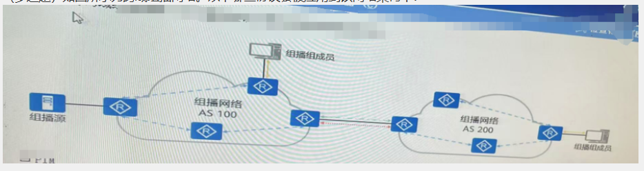

A、PIM

B、MSDP

C、MBGP

D、IGMP

50.（多选题）到目前为止，IGMP有三个版本。以下哪些是IGMP三个版本中都存在的报文？

B、成员报告报文

D、普遍组查询报文

51.（多选题）在0SPF视图下，网络工程师可以使用命令import-route引I入以下哪些路由？

A、OSPF其他进程路由

B、BGP路由

C、静态路由

D、直连路由

52.（多选题）作为IP传输三种方式之一，IP组播通信指的是IP报文从一个源发出，被转发到一组特定的接收者。以下关于IP

且播技术的描述，正确的是哪些项？

A、相比广播，IP组播可以有效地节约网络带宽

D、相比广播，可以防止信息泛滥

53.（多选题）以下关于IP组播服务模型的描述，正确的是哪些项？

B、组播服务模型的分类是针对接收者主机的，对组播源没有区别

C、ASM模型要求ASM地址只能被一种组播应用

D、SSM模型中针对每一个（源，组）信息都会生成表项

54.(多选题）在OSPF网络中，有多种报文类型，且每种报文的作用各不相同。其中，Hello报文的主要作用包括以下哪些

项?

B、邻居发现

C、邻居保持

D，邻居建立

55.（判断题）在WLAN网络跨AC漫游场景中，一个AC可以同时作为多个漫游组的漫游服务器，但是自身只能加入一个漫游组。

A、正确

56.(判断题）在设备上部署DHCPSnooping功能时，如果需要上线的用户数目超过了设备支持的DHCPSnooping绑定表规格，那么超出的用户将无法上线。

A、正确

57.(判断题）当SSH客户端首次访问SSH服务器，而SSH客户端没有配置SSH服务器端的公钥时，用户可以选择使能SSH客户端首次认证继续访问该SH服务器，并在SSH客户端保存该主机公钥。这样当SSH客户端下次访问该SSH服务器时，可以用已保存的主机公钥来认证该SSH服务器。

A、正确

58.（判断题）在IPv6中，当主机需要和目标主机通信时，必须先通过ARP协议获得目的主机的链路层地址。

B、错误

59.（判断题）管理员在配置组播协议时，如果RPF接口忘记使能PIM协议，则会导致组播分发树无法正确建立。

A、正确

60.（判断题）二层交换机的以太网接口支持多种接口类型，但无论哪种接口类型，都会存在缺省WLANID，且在华为交换机上，该缺省VLAN ID为11。

B、错误

61.（判断题）AI时代的典型特征是关注数据，挖掘数据价值并提升A运行效率，因此A对数据中心网络的核心诉求是要快，

即低时延

A、正确

62.（判断题）L2TP本身不提供安全加密，因此需要借助其他安全手段比如IPSec，保证整个隧道的安全，进行传输数据。

A、正确

63.（判断题）IGMPsnOoping功能可以使交换机工作在三层时，通过侦听上游的三层设备和用户主机之间发送的IGMP报文来建立组播数据报文的三层转发表，管理和控制组播数据报文的转发，进而有效抑制组播数据在三层网络中扩散。

B、错误

64.（判断题）在IS-IS网络中，每台路由器都至少拥有一个，若某台路由器同时配置了多个证NET，应确保这些NET的System ID相同。

A、正确

65.（判断题）在OSPF网络中，若两台Router-ID相同的直连路由器运行在同一区域内，会导致DD报文的主从无法选举。

A、正确

66.（判断题）BFD提供了一个通用的、标准化的、介质无关的、协议无关的快速故障检测机制，如果想要通过该机制检测链路是否连通，两端设备必须都需要支持该特性。

B、错误

67.（判断题）组播并不独立维护网络中的单播路由信息，在创建PIM路由表项时必须依赖网络中现有的单播路由信息执行RPF检查。如果到达某确定地址的单播路由不存在，则无法通过RPF检查。

B、错误

68.（判断题）MQC和PBR均可在设备接口上调用，对接收和发送的报文进行流量过滤或控制报文的转发路径。

B、错误

69.（判断题）在IS-IS广播网中，同一网段上的同一级别的路由器之间都会形成邻接关系，包括所有的非DIS路由器之间也会形成邻接关系。

A、正确

70.（判断题）在OSPF网络中，某台路由器的RouterID配置错误，应在OSPF进程1中配置为1.1.1.1。那么网络工程师可在该设备的系统视图下，通过命令ospf1router-id1.1.1.1直接修改。

B、错误

71.（判断题）运行BGP的路由器在Cormect状态下，BGP会启动连接重传定时器，等待TCP完成连接，如果连接重传定时器超时，BGP仍没有收到BGP对等体的响应，那么BGP继续尝试和其它BGP对等体进行TCP连接，并停留在Connect状态。

A、正确

72.（判断题）IS-IS的DIS和OSPF的DR一样，在广播类型网络中需要进行选举。但不同的是，OSPF的DR默认是抢占模式，、而IS-1S的DIS默认是非抢占模式。

B、错误

73.（判断题）路由器查找FIB表时，若匹配表项中的Tumne1ID为O，则表示匹配该项的报文通过隧道转发，如：IPLS隧道转发。

B、错误

74.（判断题）在STP网络中，为了避免环路，指定端口选举完成后必须等待足够长的时间，使全网的端口状态全部确定后才能进行转发，针对STP上述问题，RSTP通过P/A机制加快了下游端口进入Forwarding状态的速度。

B、错误

75.（判断题）在BGP中Notification报文用于在改变路由策略后请求对等体重新发送路由信息。

B、错误

76.（判断题）在OSPF网络中，若某台路由器收到一条LSA，发现本地LSDB已存在，但收到的更新，则会更新LSDB并泛洪该LSA。

A、正确

77.（判断题）在OSPF网络中，若网络类型为NBMA，则路由器会以单播形式发送所有协议报文;若网络类型为Bradcast，则路由器会以组播形式发送所有协议报文。

B、错误

78.（判断题）在OSPF网络中，路由器发送的第一个DD报文中的I位、M位和S位都会置1。

A、正确

79.（判断题）路由器分别定义了外部优先级和内部优先级，路由器选择路由时会先比较路由的内部优先级，若内部优先级相同，则比较外部优先级，数值越小越优。

B、错误

80.判断题）IPSecSA是IPSec的重要组成部分，用于为IKESA协商建立安全通道，但它本身是单向的逻辑连接，因此两个IPSec对等体之间的双向通信，最少需要建立两个SA来分别对两个方向的数据流进行安全保护。

A、正确

81.（判断题）在IPv6中每个接口只能有一个链路本地地址，为了避免链路本地地址冲突，推荐使用链路本地地址的自动生成方式。

A、正确

82.（判断题）在OSPF网络中，OSPF路由器是通过交互LSA实现链路状态数据库同步的，若一台OSPF路由器发现收到的LSA本地没有，则会更新LSDB并泛洪该LSA。

A、正确

83.（填空题）

STPPIM网络中存在两种路由表项，其中（S，G）路由表项主要用于在PIM网络中建立__\_

对于PIM-DM和PIM-SM网络均适用。（英文缩写，全大写）

SPT

84.（填空题）VRRP协议中定义了三种状态机，其中只有处于状态的设备才可以转发那些发送到虚拟IP地址的报文。（英文全称，首字母大写）

Master

85.（填空题）在BGP中Keepalive报文用于维持BGP对等体关系。当BGP路由器收到对端发送的Keepalive报文，将对等体状态置为已建立，同时后续定期发送Keepa1ive报文用于保持连接。默认情况下，设备每隔秒发送一次Keepalive报文。（阿拉伯数字）

60

86.（填空题）如图所示，现网中可能存在一台IGMP查询器需要管理大量组成员的情况，大量成员主机频繁加入/离开组播组时，会产生大量的IGMP成员关系报告/离开报文，从而给IGMP查询器带来较大的处理压力。为了减轻IGMP查询器压力，可以在三层交换机上部署IGMP功能来减少IGMP查询器接收IGMP成员关系报告/离开报文的数量，由该设备将成员关系报告/离开报文汇聚后统一上送给IGMP查询器。（英文全称，首字母大写）

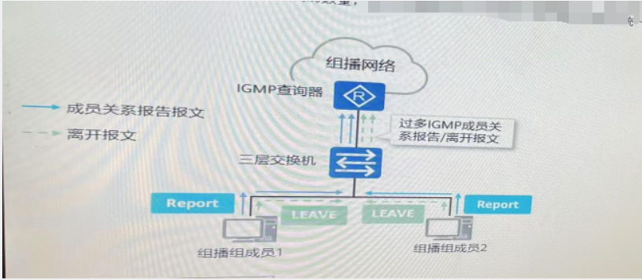

Proxy

87.（填空题）在VRRP组网中，VRRP备份组通过收发VRRP协议报文进行主备状态的协商，以实现设备的冗余备份功能。当VRRP备份组之间的链路出现故障时，由于此时VRRP报文无法正常协商，Backup设备需要等待倍协商周期后才会切换为Master设备。（阿拉伯数字）

3

88.(填空题）当AC和AP间是三层组网时，AP可通过DHCP服务器回应报文中所携带的Option

字段获取AC的IP地址10.100.30.10。（请填写阿拉伯效字）

43

89.（连线题）路由属性是对路由的特定描述，所有的BGP路由属性都可以分为4类。请将以下BGP常见属性和对应的类型进行匹配。（Token可重复使用）

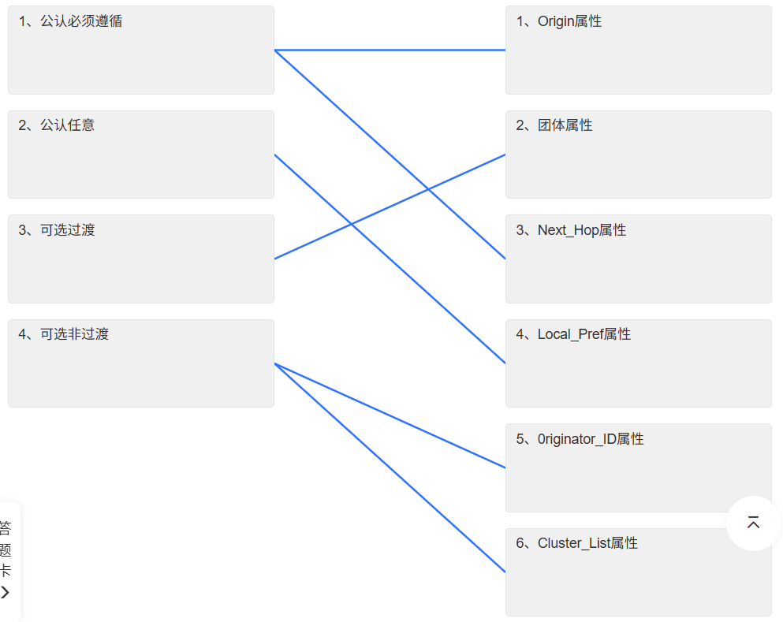

90.（连线题）如图所示是VRRP状态的切换事件，请将以下对应的切换事件和序号进行匹配。（Token可重复使用）

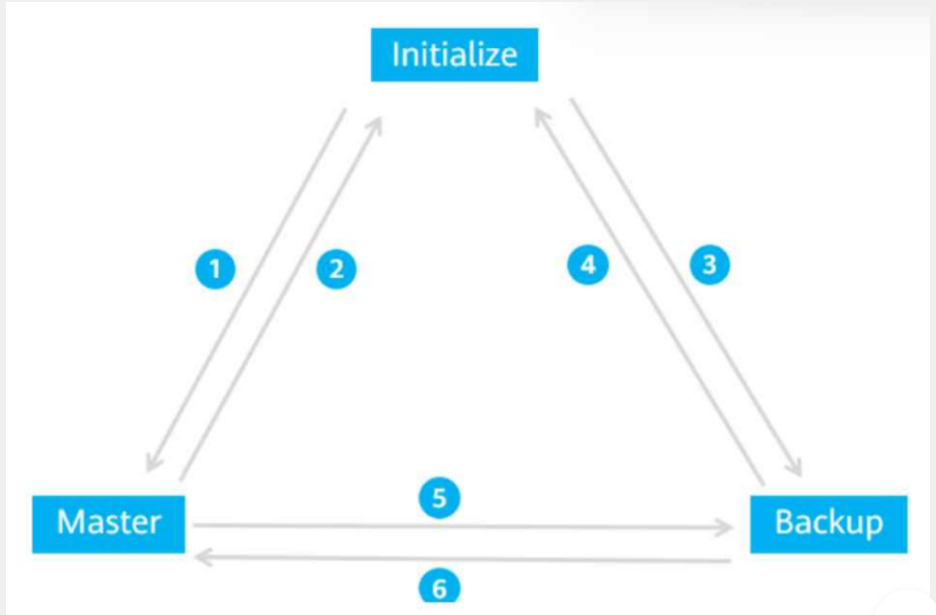

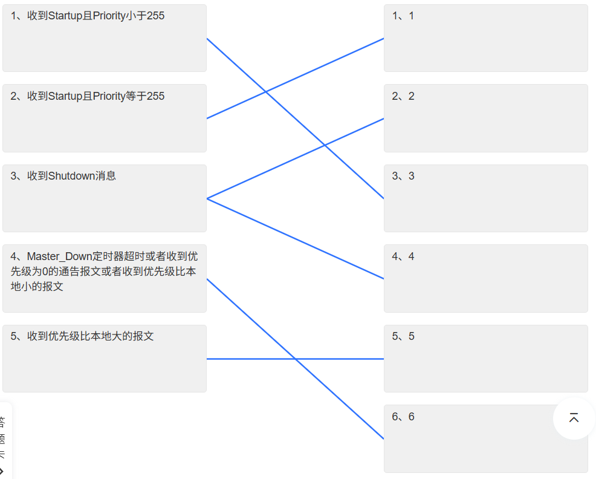

91.（连线题）CPU防攻击采用多级安全机制，从而实现对设备的分级保护。请将以下不同级别和对应的保护功能进行匹配。

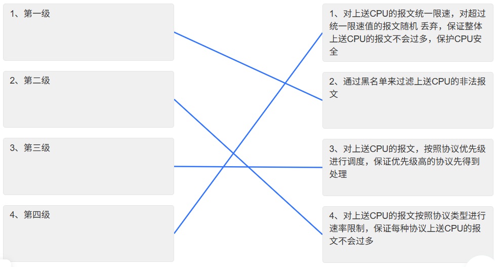

92.（连线题）在VRRP组网中，选举完成后设备角色将分为Master和Backup。请将以下两个角色和其对应的工作机制进行匹配。（Token可重复使用）

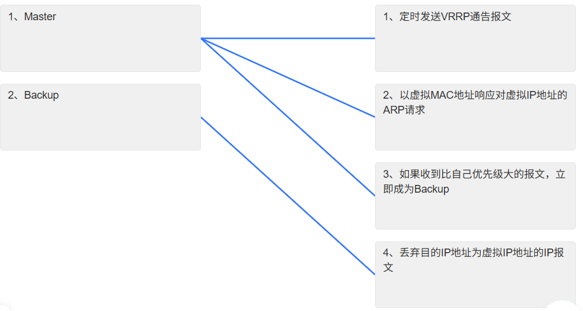

93.（连线题）在OSPF网络中，两台路由器邻居关系建立完成后，会交互DD报文，该报文中包含多个字段，请将以下字段与其表达的含义进行匹配。

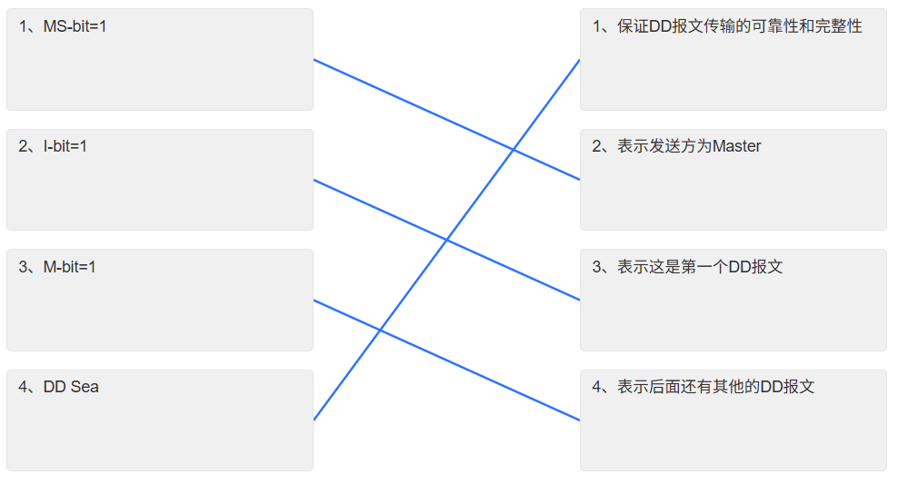

94.(连线题）请将以下IPv4组播地址的范围和对应的含义进行匹配

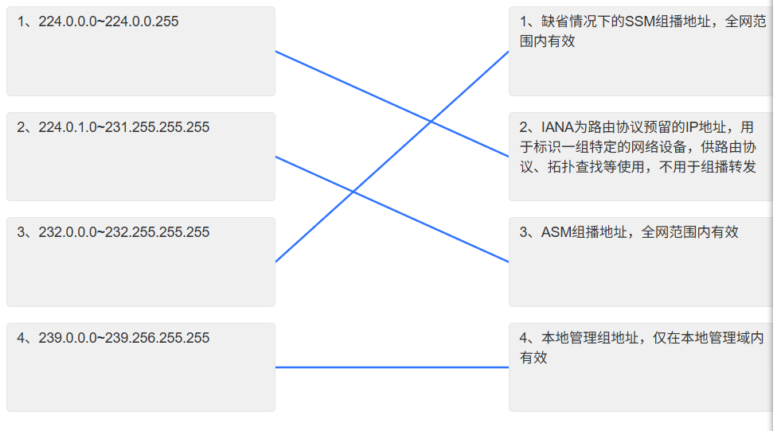

95.(连线题）BGP路由属性是对路由的特定描述，请将以下BGP属性和对应的描述进行匹配。

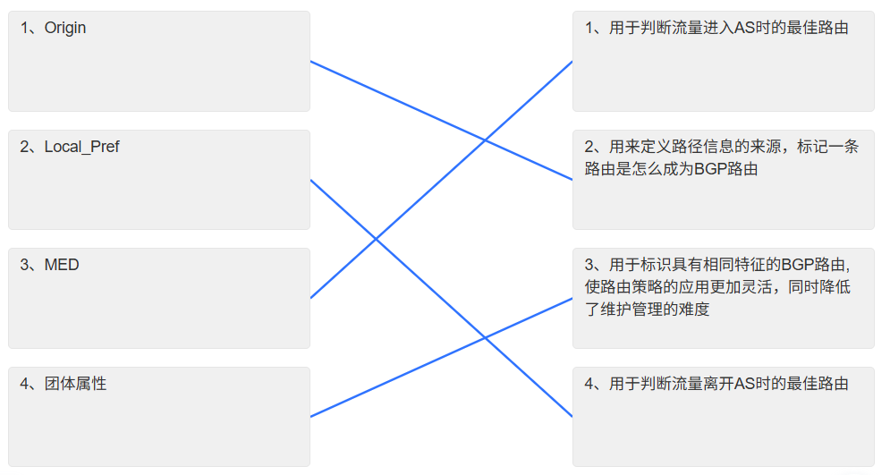

96.（连线题）在OSPF网络中，OSPF根据链路层协议类型，将网络分为了四种类型。缺省情况下，请将以下链路层协议与对应的网络类型进行匹配。（Token可重复使用）

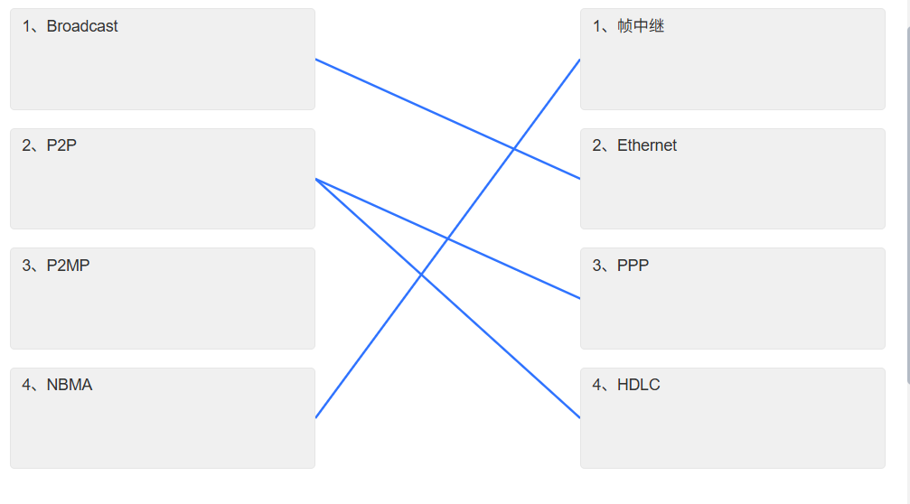

97.（连线题）华为框式设备具有多个硬件模块，其负责的功能有所不同，请将以下硬件模块与其负责的功能相匹配。

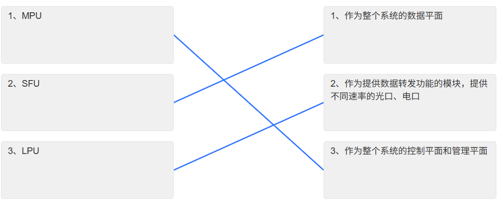

98.（连线题）如图所示为BGP状态机切换机制，请将以下BGP的状态和对应的序号进行匹配。

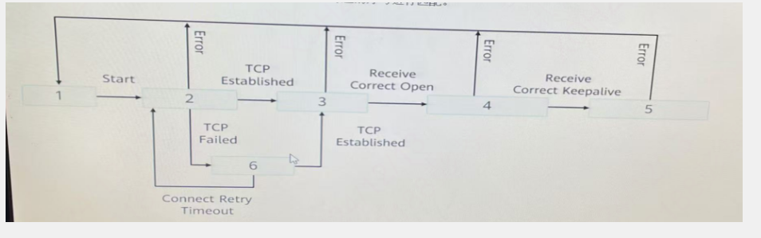

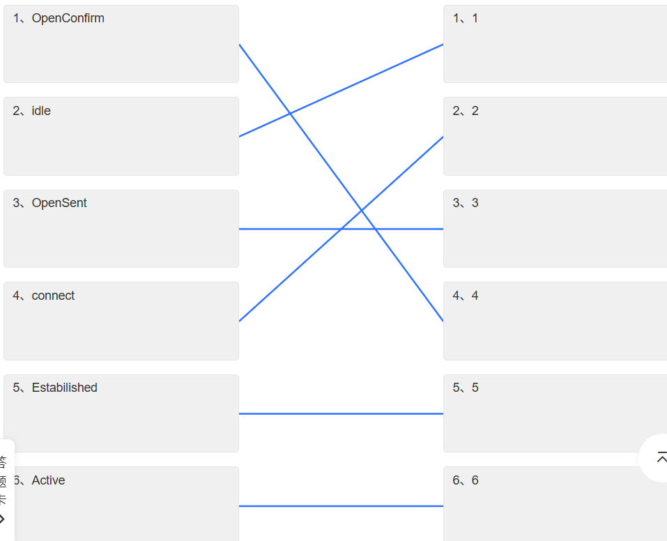

99.（连线题）某AR路由器配置了2条IP前缀列表，请将该路由器收到的路由与其能够匹配上（被permit)的IP前绿列表进行-对应。（Token可重复使用）

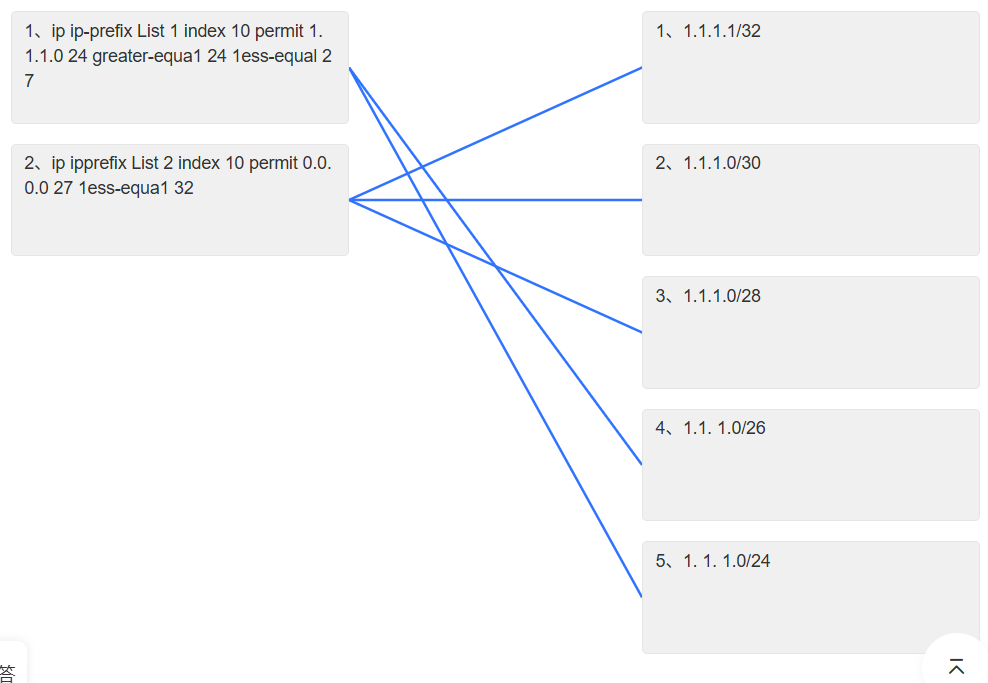

100.（连线题）如图所示为某广播型网络，已知R1、R2、R3、R4和R5开启了0SPF路由协议，且Area2被配置为NSSA区域。现工程师在R5上引入了去往通用服务器的路由，那么请将以下LSA类型和各路由器所存在的LSA类型相匹配。

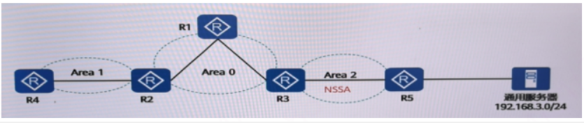

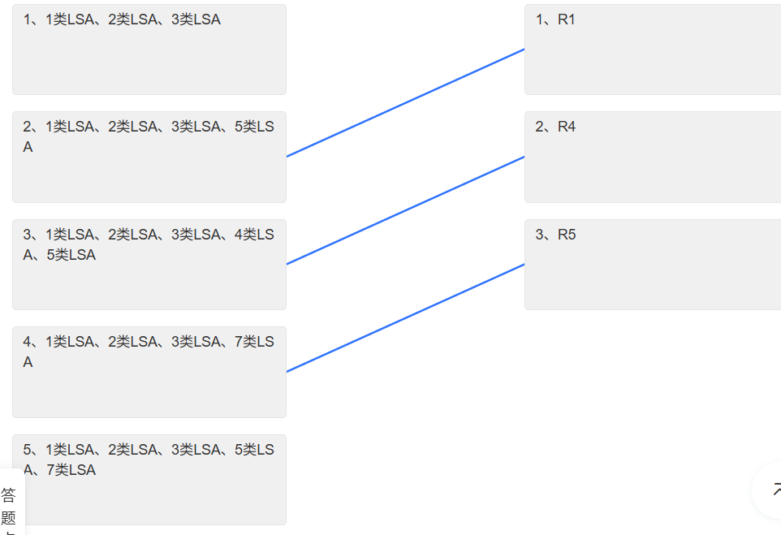

101.（连线题）在WLAN网络中，工程师可以通过VLANPOO1将接入的用户分配到不同的VLAN，从而减少广播域，提升网络性能。其中，VLANPoO1提供顺序分配和HASH分配两种分配方式，请将以下两种分配方式与其优缺点相对应。（Token可重复使用）

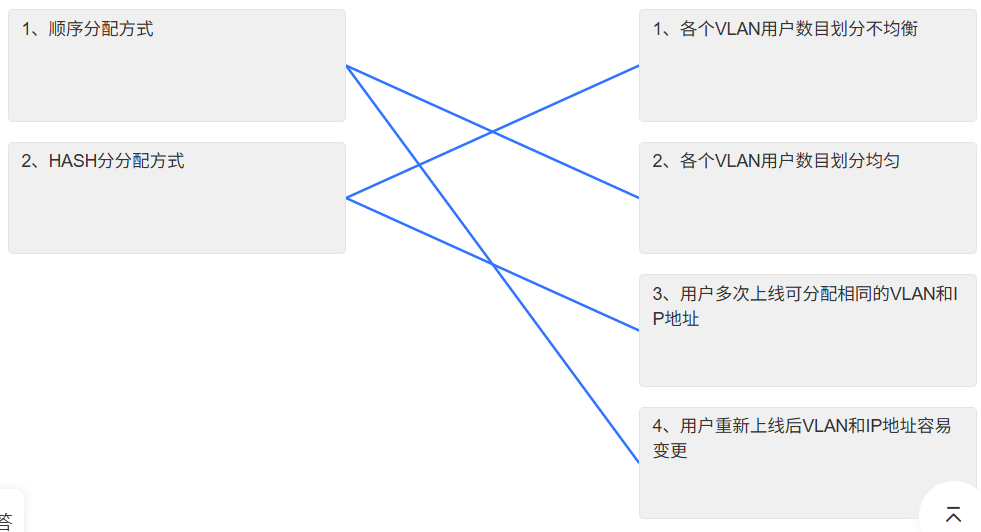

## 821-4

04

1.如图所示为某OSPP网络,已知R1和R2已,成功建立邻接关系,现工程师在R2上配置了图中命令。那么在R2上查看路由表时,可能存在的路由条目是以下哪一项? 10. 1.4.0/24

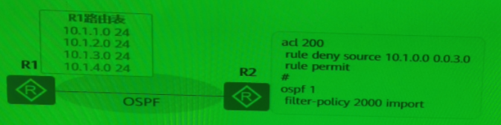

2.OSPF一共定义了五种类型的报文,但不同类型的OSPF报文有相同的头部格式。其中,若报文头部中的Auth Type字段为1,则表示以下哪一含义? 简单的明文密码认证

3.IPv4无法支持以下哪一种地址类型? 任播

4.在OSPF网络中,OSPF定义了多种路由类型,且优先级不同。针对同一个路由前缀,优先级最低的是以下哪一种路由类型? Type2 External

5.某华为路由器配置的IP-Prefix如下所示,那么以下路由信息中,不能被匹配的是哪一项? :10.1.1.0/6

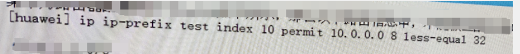

6.使用基本ACL进行路由匹配时,需配置规则编号、匹配动作及匹配项。其中,基本ACL可使用以下哪些匹配项?

A、生效时间

D、分片信息

7.BGP中AS_Path属性可以作为BGP选路的条件,因此在某些情况下需要使用Route-Policy修改该属性来影响选路。那么在使用Route-Polic中,apply as-path语句修改该属性时可携带以下哪些参数?

C. Additive

D. Overwrite

8.如图所示为某园区网络,全网路由器均配置了IS-IS路由器协议,且运行正常。那么缺省情况下,以下哪些路由器的路由表中拥有全网明细路由?

B, R7

C. R3

D. R2

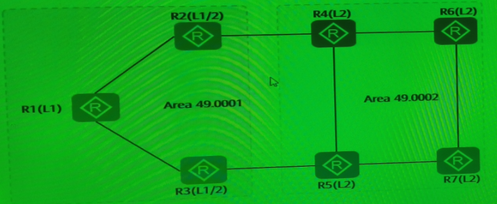

9.组播适用于任何“点到多点”的数据发布,那么以下哪些应用数据,可以采用组播方式转发?:全选

10.路由属性是BGP对路由的特定描述,以下关于BGP属性的描述,正确的是哪些项?

B、公认任意属性可能包括在某些Update消息里

D、公认必遵属性必须包括在每个Update消息里

11.IS-IS和OSPF路由协议虽然都是基于链路状态的IGP协议,但两者还是存着一定的差异。那么以下关于1S-IS和OSPF的对比,描述正确的是哪些项?

A、IS-IS的扩展性比OSPF强,可同时支持IPv4和IPv6等网络层协议

C、IS-IS和OSPF的工作层不同,IS-IS工作在数据链路层,而OSPF工作在网络层

D、每个IS-IS路由器都只属于一个区域,其中骨干区域是由Leve1-1-2和Leve1-2路由器构成

12.在WLAN三层漫游场景中,用户漫游前后由于所在子网不同,为使得用户漫游后仍能正常访问漫游前的网络,需将用户流量通过隧道转发到原来的子网进行中转。 正确

13.Te1emetry采样的原始数据只可来自网络设备的转发面,目前支持采集设备的接口流量统计、CPU或内存数据等信息。 错误

14.VRRP目前有两个版本,其中VRRPV2仅适用于IPv4网络,VRRP3仅适用于IPv6网络。错误

15.一般情况下,BGP都应用于复杂的网络环境中,路由变化十分频繁。而频繁的路由振荡会消耗大量的带宽资源和CPU资源,严重时会影响到网络的正常工作,这是BGP应用过程中无法避免的问题,也无法解决。 错误

16.VPN实例是一种虚拟化技术。一台物理设备上可以创建多个VPN实例,每个VPN实例拥有独立的接口、路由表和路由协议进程等。即使同一台设备有多个相同的网段,也不用担心IP地址冲突的问题。 正确

17.BGP是一种实现自治系统AS之间的路由可达,并选择最佳路由的矢量性协议。它使用TCP作为其传输层协议(端口号为179),并周期性进行路由更新。 错误

18.在使用Ethernet链路层协议的IS-IS网络中,缺省情况下,所有路由器都需要互相建立邻接关系。 错误

19.IS-IS路由协议与OSPF路由协议相比,具有更好的扩展性,主要是因为IS-IS构建报文时,使用了 结构。(英文缩写,全大写) TLV

20.在OSPF网络中,AS-external LSA用于描述到达AS外部的路由,其中该LSA的 字段为0.0.0.0时,才会将到达该外部网络的流量发往引入这条外部路由的ASBR。(请填写字段缩写,且英文字母全大写) FA

21.在OSPF网络中,缺省接口开销的计算方式是缺省参考值除以接口实际带宽。其中,默认情况下,缺省参考值为 Mbit/s。(请填写阿拉伯数字) 100

22.在STP网络中,会依次选举出根桥、根端口、指定端口等,且每个端口的选举规则不同,请按顺序排列出选举根端口的步骤。

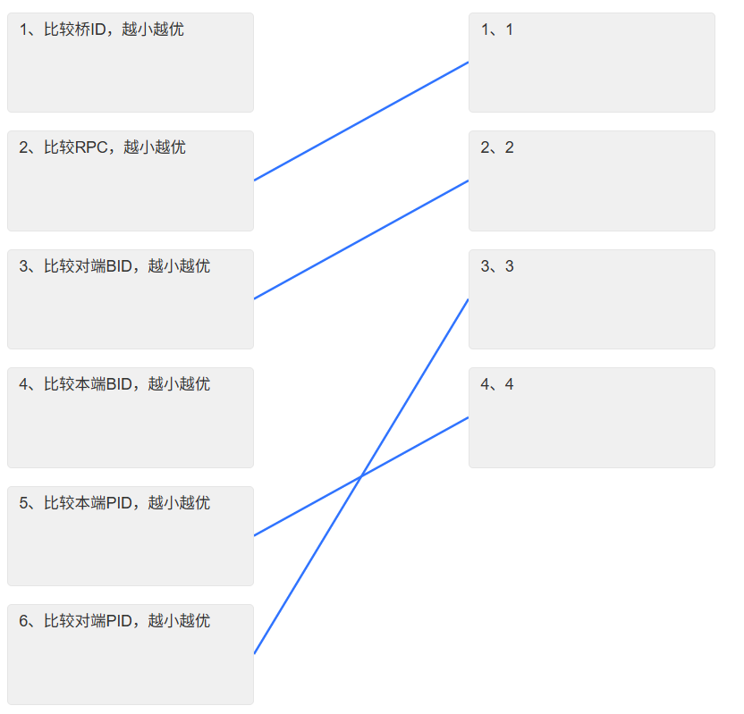
## 821-5
1.（单选题）在广播型IS-IS网络中，需要选举一个DIS来创建和更新伪节点。如图所示为某广播型IS-IS网络，在该场最下会被选举为DIS的是哪一台路由器？

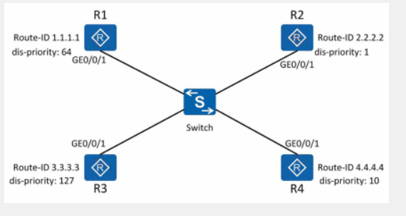

R3

2.（单选题）如图所示，某企业管理员在配置BFD检测两端设备链路故障时，误将两台设备的参数配置成不同值。经过协商后R1设备的TX时间应该为以下哪项？

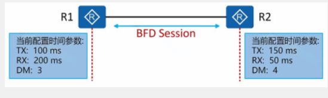

100ms

3.（单选题）在网络设备逻辑架构中，网络设备从逻辑上可以分为多个平面，但不包括以下哪一平面？

D、转发平面

4.（单选题）BFD进行单跳检测时，采用以下哪一项作为目的端口号？

C、UDP 3784

5.(单选题）一个Route-Policy由一个或多个节点构成，且一个Route-Policy最多可配置多少节点?

C、65535

6.（单选题）在缺省情况下，以下关于BGP通告路由时下一跳地址的描述，错误的是哪一项？

C、BGP从EBGP向IBGP对等体通告非标签路由时，将下一跳属性改为自身与对等体相连的接口地址

7.（单选题）如图所示为某OSPF网络，已知R1和R2已成功建立令接关系，现工程师在R2上配置了图中命令。那么在R2上查看路由表时，可能存在的路由条目是以下哪一项？

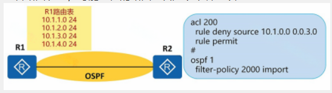

A、10.1.4.0/24

8.（单选题）以下关于Route-Policy中apply as-path命令的描述，错误的是哪一项?

C、使用apply as-pathadditive命令会将原有的ASPath全部替换成设定的新ASPath

9.（单选题）以下关于MP-BGP的描述，错误的是哪一项？

B、MP-BGP支持单播路由，但是不支持组播路由

10.（单选题）以下关于OSPF的描述，错误的是哪一项？

A、当OSPF网络中有新的具有更大DRPriority路由器加入时，则该新的路由器会抢占原来的

11.（单选题）以下关于常见动态路由协议的描述，正确的是哪一项？

C、BGP邻居关系建立在TCP会话基础之上的，采用的端口号是179

12.（单选题）以下关于包过滤防火墙的描述中，错误的是哪一项？

B、包过滤防火墙默认检查报文的目的IP地址和目的端口号，对源IP地址和源端口号不检查

13.（单选题）IPv6中定义了多种地址类型，以下关于这些地址的描述，错误的是哪一项？

A、任播地址只能作为目的地址使用

14.（单选题）MPLSVPN网络一般由运营商搭建，VPN用户购买VPN服务来实现用户网络之间的数据互通。在MPLSVPN网

络中存在诸多设备角色，其中以下哪一项设备角色是运营商网络中的骨干路由器，不与CE直接相连？

D、Provider

15.（单选题）以下关于路由注入的描述，错误的是哪一项？

A、外部路由引I入到BGP时，默认preference为200

16.(单选题）某管理员需要创建AS_Path过滤器（ipas-path-fiter)，允许AS_Path中包含65001的路由通过，那么以下哪项配置是正确的？

A、ip as-path-filter 1 permit_65001

17.（单选题）四台路由器运行IS-IS且已经建立邻接关系，区域号和路由器的等级如图所示，以下描述正确的是哪一项？

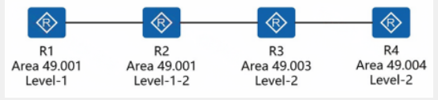

D、R1路由器的LSDB中不存在R4的LSP

18.（单选题）以下关于IPv6重复地址检测的描述，错误的是哪一项？

B、若两个节点配置相同地址，同时作重复地址检测时，当一方收到对方发出的DADNA报文，则接收方将不启用该地址

19.（单选题）IGMPV2使用独立的查询器选举机制，当共享网段上存在多个组播路由器时，以下哪一项参数是查询器选举的条件?

B、接口IP地址

20.（单选题）以下关于PIM-SM中RP的描述，错误的是哪一项？

C、一个组播组能对应多个RP

21.（单选题）以下关于前缀列表的描述，正确的是哪一项？

A、前缀列表不仅能在BGP中使用，还能在IGP中使用

22.（单选题）OSPF路由过滤不支持以下哪一种策略工具？

B、ip as-path-filter

23.（单选题）在宿舍、酒店和病房等房间密集的场景中，若每个房间都布放一个AP，会造成大量报文上送到AC容易造成AC出现性能瓶颈。为了应对这种问题，可以采用以下哪一种组网架构来部署？

B、敏捷分布式AP

24.（单选题）以下描述中属于EasylIP特有的特征是哪一项？

D、公网地址可以不固定

25.（单选题）当BGP对等体关系建立后，通过Keepalive报文维持BGP对等体关系。默认情况下Keepalive报文的发送间隔是以下哪一项？

C、60秒

26.（单选题）以下关于OSPFDD报文的描述，正确的是哪一项？

A、只有在Exchange状态下传输的DD报文才会携带链路状态信息

27.（单选题）RSTP协议存在几种端口状态？

D.3

28.（单选题）以下关于OSPFV3类LSA、4类LSA和5类LSA的描述，正确的是哪一项？

C、5类LSA在穿越不同区域后，不会发生改变，而3类LSA会发生变化

29.（单选题）Smurf攻击一般使用以下哪一种协议?

D、ICMP

30.（单选题）在OSPF网络中，为了减少LSDB的大小，提升设备的性能，OSPF定义了多种特殊区域。其中，在完全STUB

区域中，不可能存在以下哪一类LSA？

B、3类明细LSA

31.（单选题）如图所示，R1将直连路由10.1.1.0/24引I入到了OSPF中，现用户在R2和R3上执行了双向路由重发布。等网络稳定后，用户在R3上查看路由表中的10.1.1.0/24路由条目时，其Pre值为以下哪一数值？

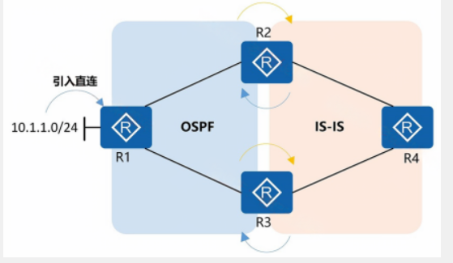

C.15

32.（单选题）在WLAN网络中，MAC认证是一种基于接口和终端MAC地址对用户的访问权限进行控制的认证方法那么以下关于MAC认证的描述，错误的是哪项？

C、缺省情况下，终端进行MAC认证时使用的用户名是终端MAC地址，密码是终端MAC地址后六位（16进制）

33.（单选题）在SNMP管理模型中，以下哪一项元素用于定义被管理设备的属性？

D、MIB

34.（单选题）一般情况下通信过程中需要占用两个端口的协议称为多通道协议，此时需要防火墙上开启ASP功能在保障数

据通道顺利建立的同时减少被攻击的风险。那么以下协议中，不属于多通道协议的是哪一项？

C、SMTP

35.（单选题）在组播中优选RPF路由要遵循一定原则进行匹配，那么以下原则中，不属于优选RPF路由原则的是哪一项？

D、接开销最小

36.（单选题）缺省情况下，广播型网络中运行IS-IS的路由器，DIS发送CSNP报文的周期是以下选项中的哪一项？

B、10秒

37.单选题）如图所示的OSPF网络，R1和R2之间通过四条链路相连，R2的Loopback0接口开启OSPF，在R1的OSPF进程中配置“maximumload-balancing1”命令，则R1到达R2的Loopback0接口的出接口为以下哪一项？

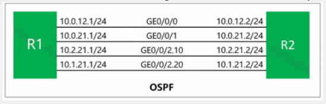

A.GEO/0/2.20

38.（单选题）以下关于配置OSPFStub区域注意事项的描述，正确的是哪一项？

C、如果将一个区域配置成为Stub区域，则该区域中的所有路由器都要配置stub区域属性

39.（单选题）路由器R1和R2的连接和配置如图所示，那么正确的是以下哪一项？

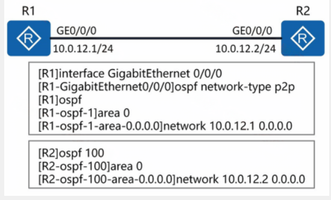

C、R1和R2可以建立邻接关系，但是不能完成路由计算

40.（单选题）以下关于策略路由特点的描述，错误的是哪一项？

D、能够修改路由属性，但是不能改变网络流量经过的路径

41.（单选题）在WLAN组中，为保证较高的组网可靠性，可使用以下哪一备份技术部署两台同型号但所处异地的AC？

C、双链路热备

42.（单选题）在建立BGP对等体的过程中，Openent状态表明BGP等待的Open报文，并对收到的Open报文中的AS号、版

本号和认证码等进行检查。如果发现收到的Open报文有错误，则设备会采取以下哪一项动作？

B、BGP发送Notification报文给对等体，并转至ldle状态

43.（单选题）以下关于ASPath的描述，错误的是哪一项？

A、该属性可以确保IBGP对等体之间无环路

44.（单选题）相比较RSTP，MSTP定义了更多的端口角色。如图所示，SW3连接SW5的端口是以下哪一端口角色？

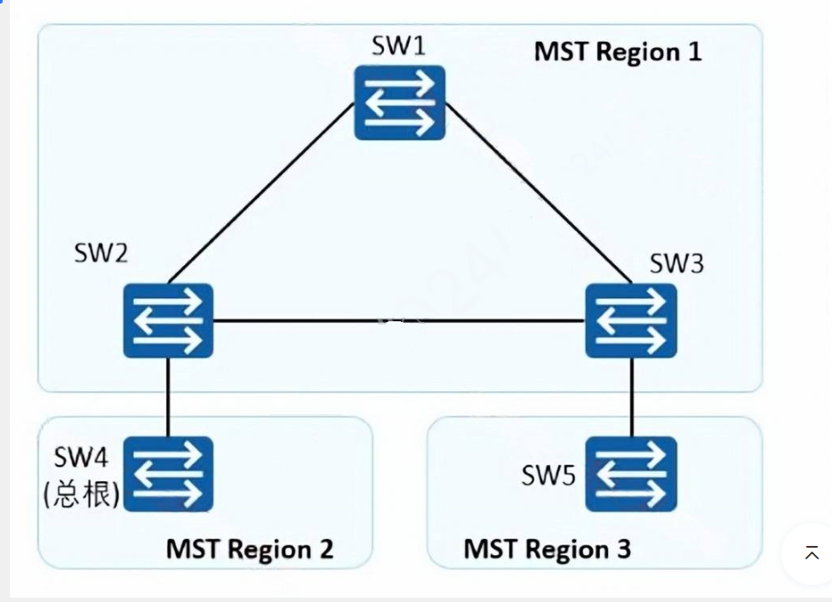

D.域边缘端口

45.（单选题）以下关于IS-IS开销的描述，正确的是哪一项？

A、一条IS-IS路径的Cost等于本路由器到达目标网段沿的所有链路的Cost总和

46.(单选题）以下关于PIM-SM(SSM)的描述，错误的是哪一项？

D、在PIM-SM(SSM)中依I日需要注册组播源

47.（单选题）以下关于OSPF的描述，正确的是哪一项？

D、DD报文中不一定携带链路状态摘要信息，此时该DD报文可以用于协商主从关系

48.（单选题）以下关于OSPF的描述，错误的是哪一项？

A、3类LSA中描述的Link StatelD为该ABR的Router ID

49.（单选题）以下关于OSPF协议的描述，错误的是哪一项？

A、OSPF是一个基于链路状态的外部网关协议

50.（单选题）以下加密算法中，哪一个需要公钥和私钥两种不同的秘钥配合使用？

B、RSA

51.（单选题）如图所示的网络，R1和R2运行OSPF协议，R1的Router-ID为10.0.1.1，R2的ROuter-ID为10.0.2.2。当R1收到R2发送的OSPF报文后，此时R1检查标记的邻居状态是以下选项中的哪一项？

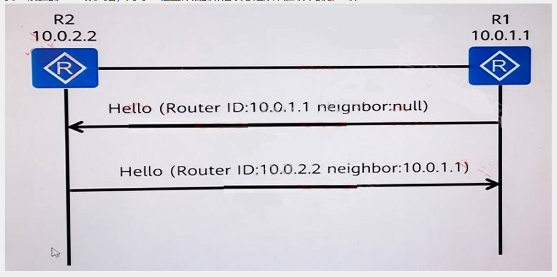

C.2-way

52.（单选题）关于VRRPmaster设备的描述，错误的是？

D、缺省情况下，即使该路由器已经是Master，也一会被优先级高的Backup路由器抢占

53.单选题）以下关于VRRP的描述，错误的是哪一项？

B、在使用VRRP协议时，需要在路由器上配置虚拟路由器号和虚拟IP地址虚拟路由器的MAC地址无需配置可直接使用主用路由器的真实MAC

（单选题）路由器R1和R2分别使用GigabitEtherneto/0/0直连，并试图建立OSFP邻居，然而邻居关系并没有成功建立，排错过程如图所示。那么以下哪一个操作可以使R1和R2邻居管理正常建立？

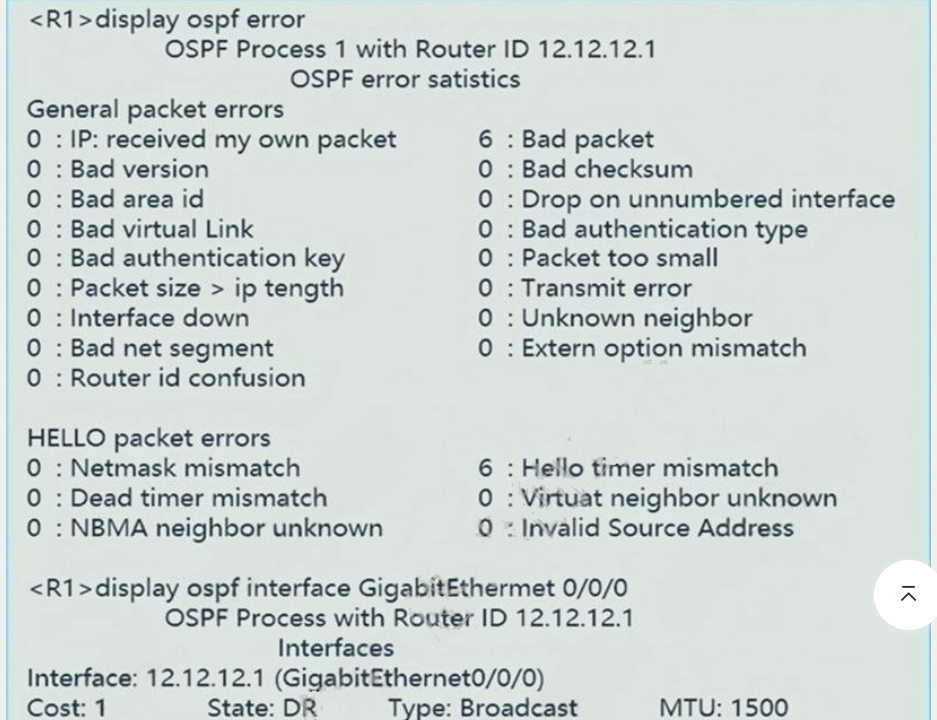

C、[R2Jinterface GigabitEthernet 0/o/o[R2-gigabitErherneto/o/o]ospf timer hello 20

55.（单选题）以下关于BGP路由更新的描述，正确的是哪一项

B、BGP无需周期性通告路由信息

56.（单选题）某中型规模园区网络通过SNMP协单选议管理网络，该园区对于网络安全性很高，推荐使用SNMP哪个版本进行管理？

D、SNMPV3

57.(单选题）下面关于displayospfpeers输出的信息，描述正确的是：

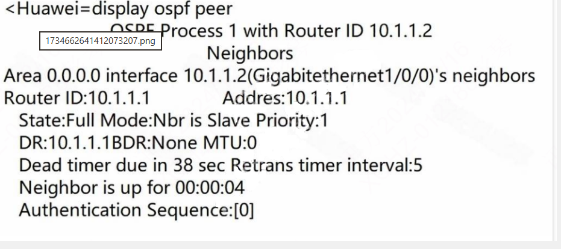

D、指定路由器(DR)为地址是10.1.1.1

58.（单选题）DHCP协议运行过程中，客户端从申请到获得IP地址时的流程是：

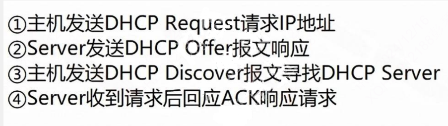

3214

59.（单选题）BGP常用的路由策略工具中，以下哪一项能够用来匹配特定ASpath属性？

C、ip as-path-filer

60.（单选题）以下关于OSPF缺省路由的描述，错误的是哪一项？

D、由于OSPF路由的分级管理，5类和7类缺省路由的优先级高于3类缺省路由

61.（单选题）以下关于OSPF多进程描述，错误的是哪一项？

D、不同OSPF路由器建立邻居，进程号必须相同

62.（单选题）以下关于BGP的UPDATE消息所包含的内容，错误的是哪一项？

A、UPDATE包含本端AS自制系统号

63.（单选题）在VRP平台下，以下关于各个协议的默认优先级的描述，正确的是哪一项？

C、静态路由的优先级是60

64.（单选题）以下是某路由器的部分配置，那么以下关于该配置信息的描述，错误的是哪一项？

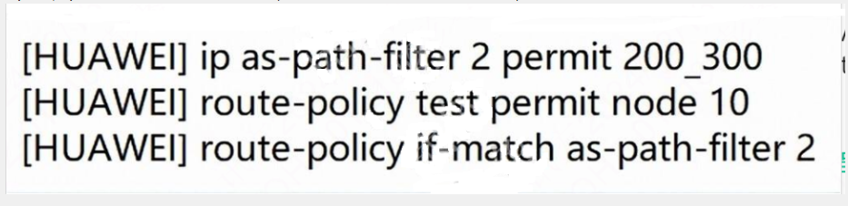

D、该Route-Policy只能在OSPF进程中进行调用

65.（单选题）关于PIM-SM中的Hello报文的描述，错误的是：

D、Hello报文发往组播地址224.0.0.5

66.（单选题）四台路由器运行IS-IS且已经建立邻接关系，区域号和路由器的等级如图中标记，下列说法中正确的有？

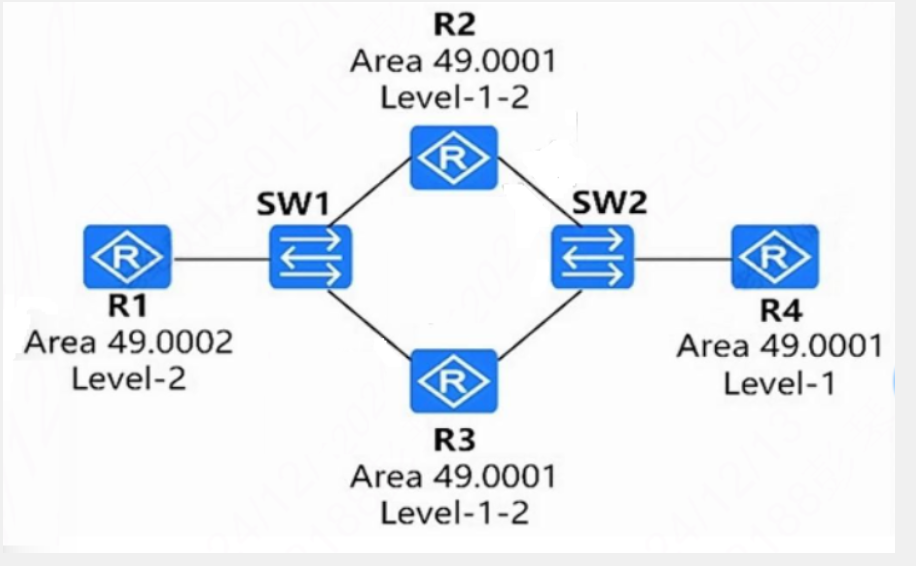

A.R2和R3都会产生ATT置位的Level-1的LSP

67.（多选题）在OSPF网络中，根据链路层协议类型，将接口的网络类型分为了四大类；而IS-IS也根据物理链路的不同，将接口的网络类型分为了以下哪些类型？

A、Broadcast

D、P2P

68.（多选题）iMasterNcE-Fabric是华为面向数据中心网络场景推出的网络控制器，它可以实现以下哪些业务的自动化，从而提升客户业务开展效率？

A、规划

B、建设

C、调优

D、维护

69.（多选题）公司有一个由三台交换机组成并稳定运行的堆叠系统，现主交换机因故障重启。那么以下关于该现象的描术，正确的是哪些项？

A、原主交换机重启完成之前，原备交换机会升为新主交换机

D、原主交换机重启完成之前，原从交换机会被指定为新备交换机

70.（多选题）某园区采用OSPF路由协议实现网络通信，现工程师在一台路由器上执行displayospfpeer命令的回显如下。那么以下关于该设备的描述，正确的是哪些项？

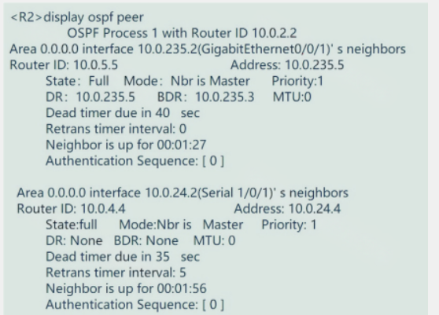

A、R2两个OSPF邻居的Router-ID分别为10.0.5.5和10.0.4.4

B、R2与邻居10.0.5.5所处网络的DR是10.0.235.5

C、R2与10.0.5.5和10.0.4.4都已成功建立邻接关系

71.（多选题）VRRP选举完成后设备分为master状态和Backup状态，以下哪些事件只能由处于master状态的设备进行处理？

B、定时发送VRRP通告报文

C、响应对虚拟IP地址的ARP请求

D、转发目的MAC地址为虚拟MAC地址的IP报文

72.（多选题）安全策略是防火墙的核心特性，只有符合安全策略的合法流量才能通过防火墙进行转发。以下关于安全策略匹配规则的描述，正确的是哪些项？

A、每条安全策略中包含多个匹配条件，各个匹配条件之间是”与“的关系

B、当配置多条安全策略规则时，安全策略列表默认是按照配置顺序排列的，越先配置的安全策略规则位置越靠前，优先级越高

73.（多选题）一台路由器收到报文后，会按照ACL匹配流程进行匹配，匹配结果只有两种：“匹配”或”不匹配”。若匹配结果为“不匹配”，那么可能是以下哪些原因？

A、遍历所有规则都未找到符合匹配条件的规则

B、配置的ACL中没有规则

D、设备未配置ACL

74.（多选题）在广播型网络中，IS-IS协议会选举出一个DIS，而OSPF协议会选举出一个DR。那么以下关于DIS和DR区别的描述，正确的是哪些项？

B、DIS和DR形成邻接关系的条件不同，IS-IS中的非DIS路由器之间也会建立邻接关系

C、DIS和DR负责的功能不同，DIS主要用于创建和更新伪节点

D、DIS和DR选举时间不同，DIS在建立完邻接关系之后选举

75.（多选题）以下哪些方法能够相对降低OSPF路由计算负荷？

A、对普通区域路由手动汇总

C、部署Stub区域

D、使用静默端口(Silent-Interface)

E、划分OSPF非骨干区域

76.（多选题）OSPF的报文类型包括以下哪些项？

A、Hello

E、Database Description

F、Link State Request

77.（多选题）以下哪些协议既支持网络配置管理又支持网络监控管理

A、NETCONF

C、SNMP

78.（多选题）以下关于AC漫游组的描述，错误的是哪些项？

A、AC可担任多个漫游组的漫游组服务器，同时自身可加入多个漫游组

C、漫游组服务器必须为漫游组内的AC

D、漫游组的AC之间通过采用DTLS扩展隧道来封装和传输漫游相关信息

79.（多选题）某企业Portal认证场景中，AC作为接入设备与Poral服务器之间使用Portal协议通信，那么以下关于Portal协议的描述，正确的是哪些项？

A、缺省情况下，接入设备上处理Portal协议报文的端口号为2000

B、HITP/HTTPS协议可作为Portal接入协议，也可以作为Portal认证协议

C、缺省情况下，设备向Portal服务器主动发送报文时使用的目的端口号为50100

80.（多选题）PIM-SM中的Hello消息有以下哪些作用？

B、邻居间参数协商

D、建立并维护邻居关系

81.（多选题）以下哪些项属于BGP可选过渡属性？

A、Aggregator

B、Community

82.（多选题）构建数通网络的华为引擎包括以下哪些项？

A、AirEngine

B、HiSecEngine

C、NetEngine

D、CloudEngine

83.（多选题）以下关于OSPF命令的描述，错误的是哪些项？

A、OSPFv3配置中不必使用router-id命令配置Router ID，配置方法和OSPFv2-样

D、stub命令用来配置此路由器为Stub路由器，Stub路由器可以与非Stub路由器形成邻居关系

84.（多选题）IGMPV2版本支持以下哪些报文？

A、特定组查询报文

C、普遍组查询报文

D、成员离开报文

85.（多选题）基于会话的状态检测防火墙对于首包和后续包有不同的处理流程，那么以下关于该流程的描述，正确的是哪些项？

B、在状态检查机制打开的情况下，后续包不需要进行安全策略检查，直接允许通过

D、在状态检查机制打开的情况下，防火墙处理TCP报文时，只有SYN报文才能建立会话

E、报文到达防火墙时，会查找会话表，如果匹配，防火墙会进行后续包处理流程

86.（多选题）以下关于Filter-Policy的描述，正确的是哪些项？

C、Filter-Policy具有“入"和”出”两个方向

D、Filter-Policy不仅可以调用前缀列表和ACL，还可以调用Route-Polic

87.（多选题）OSPF邻接关系建立的过程中，涉及到DD报文传输的阶段包括以下哪些项？

A、Exchange

E、ExStart

88.（多选题）以下关于BGP基本概念的描述，正确的是哪些项？

A、BGP的RouterID是一个用于标识BGP设备的32位值，每个BGP设备都必须有唯一的Router，否则对等体之间不能建立BGP连接

C、运行于不同AS之间的BGP称为EBGP，为了防止AS间产生环路，当BGP设备接收EBGP对等体发送的路由时，会将带有本地AS号的路由丢弃

D、发送BGP报文的设备称为BGP发言者，它接收或产生新的报文信息，并发布给其它BGPSpeaker

89.多选题）IP前缀列表是常见的匹配工具之一，一条IP-Prefix可创建多个index，每个index可以配置相应的动作和匹配条件。其中，index中可使用的匹配条件有以下哪些项？

A、掩码长度

C、IP地址前缀

90.多选题）路由属性是对路由的特定描述，所有的BGP路由属性都可以分为四类。其中，属于公认任意的包括以下哪些属性？

B、Atomic Aggregate

C、Local Preference

91.（多选题）在BGP中通过Origin属性来标识一条路由的起源，以下关于该属性的描述，正确的是哪些项？

A、当去往同一个目的地存在多条不同Origin属性的路由时，在其他条件都相同的情况下，BGP将按如下顺序优选路由:IGP\>EGP\>Incomplete

B、该属性为公认必遵属性

C、如果路由是由始发的BGP路由器使用network命令注入到BGP的，那么该BGP路由在路由表中的标识符为i

92.(多选题）以下关于BGP中LocalPreference属性的描述，正确的是哪些项？

B、该属性在传递时除非受路由策略影响，否则LocalPreference值不变

C、Local Preference属性值越大则BGP路由越优

93.（多选题）某园区网络中，采用OSPF路由协议实现网络通信，其链路层协议为Ethernet。那么缺省情况下，以下哪些报文会以单播的形式发送？

B、DD报文

C、LSR报文

94.（多选题）某大型商场为防止广播域过大，导致网络性能变差，配置了VLANPool。网络工程师执行命令displayvlan poolnameSTA的回显如下。那么以下关于该配置信息的描述，正确的是哪些项？

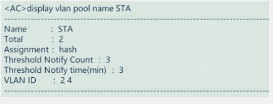

B、VLAN Pool的名称为STA

D、加入到VLAN Pool的VLAN ID为2和4

95.多选题）VRRP协议包括两个版本VRRPV2和VRRPV3，以下关于VRRPV3版本的描述，正确的是哪些项？

A、VRRPV3适用于IPv4和IPv6两种网络

C、设备的缺省优先级为100

D、缺省情况下，VRRP通告报文的发送时间间隔为1秒

96.（多选题）在网络中，存在着大量针对CPU的恶意报文以及需要正常上送CPU的各类报文。为了保证CPU对正常业务进行响应，设备提供了本机防攻击功能。以下关于该功能的描述，正确的是哪些项？

A、设备可以在防攻击策略中对上送CPU的报文按照协议优先级进行调度，保证优先级高的协议先得到处理

B、为了保证基于会话的应用层数据在攻击发生时可以正常运行，可以配置动态链路保护功能

D、所有CPU防攻击功能对设备的管理网口也可以起作用

97.（多选题）如图所示的OSPF网络，R1和R2之间通过四条链路相连，R2的LoopbackO接口开启OSPF，在R1的OSPF进程中配置“maximumload-balancing3”命令，则R1到达R2的Loopback0接口的出接口为以下哪一项？

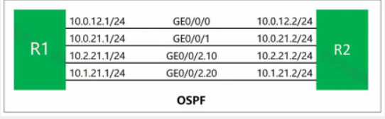

B、GE0/0/2.10

C、GEO/0/1

D、GE0/0/2.20

98.（多选题）用路由策略进行路由过滤时，以下选项中的哪些路由前缀，在匹配图中的IP-Prefix时会被deny掉？

B.1.1.1.2/16

D.1.1.1.1/24

99.（多选题）以下哪些工具不只用于BGP路由协议？

A、route-policy

B、ip-prefix

E、ACL

100.（多选题）在MQC中流量行为支持以下哪些可执行动作？

A、过滤报文

B、重新标记报文优先级

C、流量统计

D、为报文添加VLAN Tag

E、为报文执行策略路由

101.(多选题）以下关于IGMPSSMMapping的描述，正确的是哪些项？

A、SSM组播组的地址是232.0.0.0\~232.255.255.255

C、IGMPSSMMapping通过静态的将组播源与组播组进行绑定，使得IGMPv1与IGMPv2的组成员也能接入SSM组播网络

102.（多选题）以下关于BGP中MED属性值的描述，错误的是哪些项？

A、MED值默认为100

C、MED属性值越大则BGP路由越优

103.（多选题）一条前缀列表必须包括以下哪些参数？

C、动作

E、IP网段与掩码

104.（多选题）以下关于OSPF的描述，哪些项是正确的？

A、第二类外部路由的开销值只是AS外部开销值，忽略AS内部开销值

E、AS-Extemal-LSA不属于任何区域

105.（多选题）以下关于Filter-Policy的描述，正确的是哪些项？

A、Filter-Policy既能在OSPFv2上使用，也能在OSPFv3上使用

B、在距离矢量协议中，因为设备之间传递的就是路由信息，所以Filter-Policy能够直接对路由生效

106.（多选题）作为网络管理员，可以使用下列哪些协议用于网络设备配置？

自由

B、SNMP

C、NETCONF

D、SSH

107.（多选题）以下哪些技术支持流量统计？

A、Netstream

B、SNMP

C、端口镜像

D、IP报文计数

108.（多选题）以下关于大型WLAN三层组网中，DHCP服务器的描述，错误的是？

A、在大型WLAN组网中，AP可以通过option60参数从DHCP服务器来获取AC的IP地址

D、在大型WLAN组网中，一般建议使用AC作为DHCP服务器

109.（多选题）以下关于VRRP定时器的描述，错误的是哪些项？

A、Skew_Time=(255-Priority)/255

B、缺省情况下，VRRP抢占延时是1秒

D、缺省情况下，VRRP通告报文的时间周期是2秒

110.（多选题）以下关于VRRP协议版本的描述，正确的是哪些项？

A、VRRPv2仅适用于IPv4

C、VRRPv3不支持认证

D、VRRPv2支持认证

111.（多选题）以下关于MSTP的描述，正确的是哪些项？

A、MSTP支持与RSTP兼容运行

B、MSTP可以实现流量在不同VLAN之间的负载分担

C、相较于RSTP，MSTP的端口角色更多

112.（多选题）三台路由器运行IS-IS且已经建立邻接关系，区域号和路由器的等级如图中标记，如果R1和R2之间的路中断，下列说法正确的有？

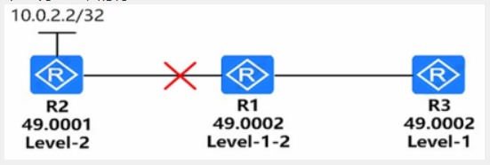

B、R3路由表中的缺省路由会消失

C、R1运行SPF算法将R2从SPF树干中删除

113.（判断题）在配置组播协议时，需要注意运行IGMP高版本的交换机可以识别低版本的成员报告，但是低版本的交换机不能识别高版本的成员报告。为了保证IGMP的正常运行，建议在交换机上配置和成员主机相同或高于成员主机的版本。

A、正确

114.（判断题）在STP网络中，用于角色选举的参数，如:根桥ID、根路径开销、网桥ID等，均为BPDU报文中的字段。

A、正确

115.（判断题）VRRP中，主备设备都会对虚拟IP地址的ARP请求进行响应，以便故障时进行快速切换。

B、错误

116.（判断题）某大型企业部署WLAN网络，要求减少广播域的同时，确保无线用户多次上线时可分配相同的VLAN和IP地址，则可以通过配置VLANPOol的顺序分配算法实现。

B、错误

117.（判断题）缺省情况下，如果没有配置RouterID但配置了多个LoopBack接口地址，那么BGP会优选Loopback接口中最大的IP地址作为Router ID。

A、正确

118.（判断题）在对等体关系建立过程中和建立之后都可能发生错误连接，当BGP检测到错误状态时，就会向对等体发送Notification，告知对端错误原因。

A、正确

119.（判断题）路由聚合是将多条路由合并的机制，BGP在IPV6网络中支持自动聚合和手动聚合两种方式。

B、错误

120.（判断题）二层交换机支持多种以太网接口类型，其中hybrid接口与trunk接口一样，可以允许多个vlan的数据帧通过，且可以指定hytrid接口在发送某个vlan的数据帧时是否携带Tag。

A、正确

121.（判断题）NSSA区域的ABR不会向NSSA泛洪4类和5类LSA，会将7类LSA转换成5类LSA泛洪给其他区域。

A、正确

122.判断题）路由汇总对OSPF路由进程占用的带宽、CPU周期和内存资源有直接的影响。

A、正确

123.（判断题）用户购买设备后，若需要使用BFD增值特性时，需获取设备对应功能或资源的License，以满足业务的需求。

B、错误

124.(判断题）使用Route-Policy工具可以使用if-match子项匹配BGP路由的LocalPreference属性。

B、错误

125.（判断题）当OSPF网络类型被指定为NBMA网络时，必须在接口视图下使用ospf innbmapeerxx.xx.x.xx命令来互相指邻居，否则OSPF邻居关系不会建立。

B、错误

126.（判断题）USG防火墙上提供了Local区域，代表防火墙本身。凡是由防火墙主动发出的报文均可认为是从Local区域中发出，凡是需要防火墙响应并处理（不是转发）的报文均可认为是由Local区域接收。

A、正确

127.（判断题）多主检测MAD是一种检测和处理堆叠分裂的协议，有直连检测方式和代理检测方式。在同一堆叠系统中，可司时配置两种检测方式，从而避免检查标记IP和MAC冲突对业务产生影响。

B、错误

128.（判断题）为了防止路由震荡，BGP可以采用路由聚合提高网络的稳定性。

A、正确

129.（判断题）在OSPF网络中，若将某未端区域设置为STUB区域，则该区域内不能存在ASBR.

A、正确

130.（判断题）IGMPV2离组使用超时机制，组成员只能静默离组。在未超时的时间内，组播流量依然会被组播路由器转发，因此存在缺陷。

B、错误

131.（判断题）工程师配置组播协议之前，必须先使能IP组播路由功能，使能IP组播路由功能是配置一切组播功能的前提。

A、正确

132.（判断题）BGP存在两种对等体关系类型：EBGP及IBGP，其中在配置EBGP时，Peer命令所指定的对等体IP地址要求路由可达，并且UDP连接能够正确建立。

B、错误

133.（判断题）在BGP中MED属性仅在相邻两个AS之间传递，收到此属性的AS一方不会再将其通告给任何其他第三方AS，同时，缺省情况下路由器只比较来自同一相邻AS的BGP路由的MED值，也就说如果去往同一个目的地的两条路由来自不同的相邻AS，则不进行MED值的比较。

A、正确

134.（判断题）当设备遭到恶意攻击或者网络中出现错误配置时，会导致BGP从邻居接收到大量的路由，从而消耗大量设备的资源。因此管理员必须根据网络规划和设备容量，对运行时所使用的资源进行限制。BGP提供了基于对等体的路由控制，限定邻居发来的路由数量，这样可以避免上述问题。

A、正确

135.（判断题）在IS-IS网络中，同一Level-1区域内的所有路由器必须配置相同的区域地址才能通信，但同一Level-2区域内的路由器配置不同的区域地址也可进行通信。

A、正确

136.（判断题）某企业使用OSPF路由协议实现网络通信，为确保数据来源的合法性及安全性，开启了OSPF支持的所有认证方式。针对上述情况，OSPF路由器将优先使用接口认证。

A、正确

137.（判断题）SFTP相比于FTP来讲更安全，因为使用了SSH来提供文件传输时的保护，一般情况下，SFTP使用TCP22端口来进行数据的传输。

A、正确

138.（判断题）VRF路由表里的OSPF外部路由不允许被路由汇总（asbr-summary）

B、错误

139.(判断题）在BGP中，当一条路由被反射器反射后，该RR的ClusterID就会被添加至路由的ClusterList属性中，用于判断是否存在环路。

A、正确

140.（判断题）Community属性是可选过渡属性，是一种路由标记，用于简化路由策略的执行

A、正确

141.（判断题）DHCPv6使用IPv6组播地址FFO5：1:3用于中继代理和服务器之间的通信。

A、正确

142.（判断题）在BGP中，路由反射器RR会将学习的路由反射出去，从而使得IBGP路由在AS内传播无需建立IBGP全互联。

A、正确

143.（判断题）MP-BGP用于实现BGP-4的的扩展以允许BGP带多种网络层协议。这种扩展有很好的后向兼容性，即一个支持MP-BGP的路由器可以和一个仅支持BGP-4的路由器交互

A、正确

144.(判断题）ospf dr-priority命令默认值为1，取值范围为0\~255.

A、正确

145.(判断题）某网络结构和OSPF分区如图所示，图中除了RTA之外，RTB、RTC和RTD都是ABR路由器。

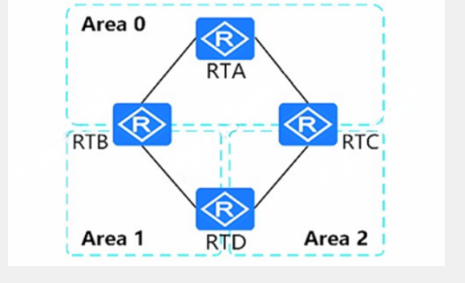

B、错误

146.(填空题）某路由器配置了一条IP-Prefix，配置命令为:ip ip-prefix huawei index 10 permit 10.1.1.0 24greater-equal 26,那么此时greater-equal-value=（），less-equal-value=（）。(请填写阿拉伯数字）

26，32

147(填空题）R1、R2、R3和R4运行OSPF，区域ID如图所示，则O会产生Type-3LSA。（请填写设备名称，例如R1

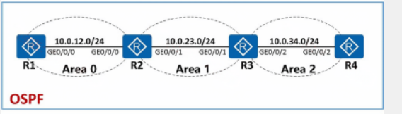

R2

148.填空题）如图所示，在MA网络中，若要实现R1一定为DR，R2一定为BDR，R3、R4、R5不参与选举，那么R1的dr-priority最大为0，R2的dr-priority最大为O，R3的dr-priority为()，R4的dr-priority为()，R5的dr-priority为()。(请填写阿拉伯数字）

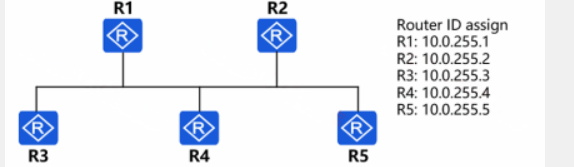

255,254,0,0,0

149.连线题）请将以下IPv6的报头按顺序进行排序

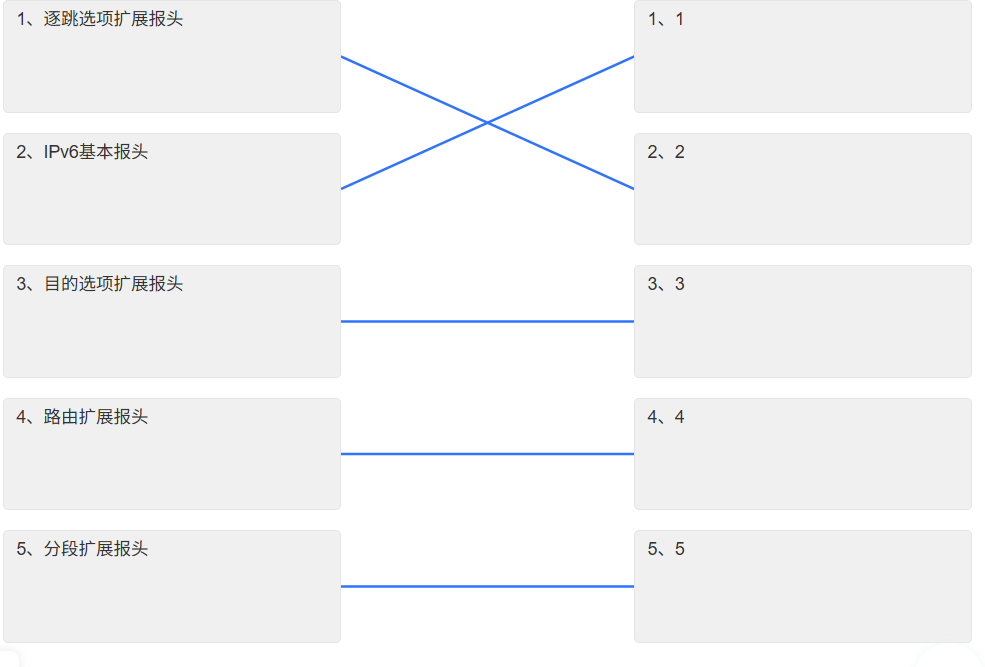

150.（连线题）在VRRP组网中选举完成后设备角色将分为Master和Backup。请将以下两个角色和其对应的工作机制进行匹記。(Token可重复使用）

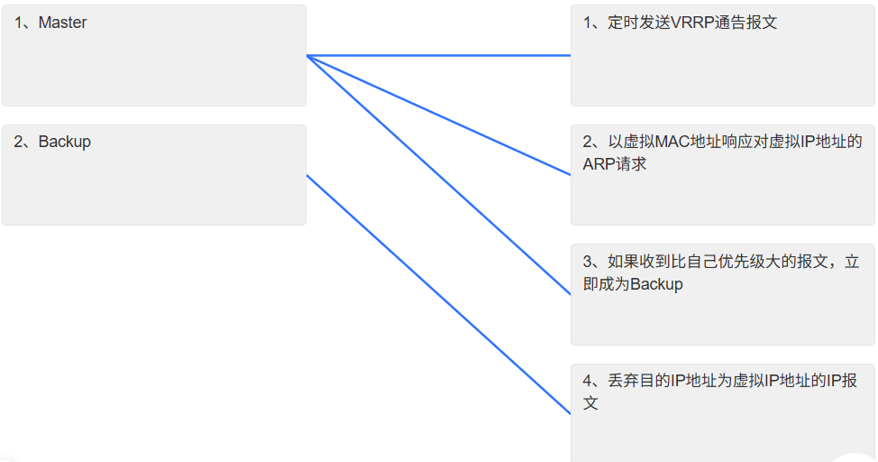

151.（连线题）在某点到点类型的IS-IS网络中，R1和R2建立令接关系后，R2发现LSDB没有同步。因此R2需向R1索取相应的LSP同步LSDB，索取后其同步流程如下图所示，请将以下报文类型与过程中所使用的报文类型相匹配。（Token可重复使用）

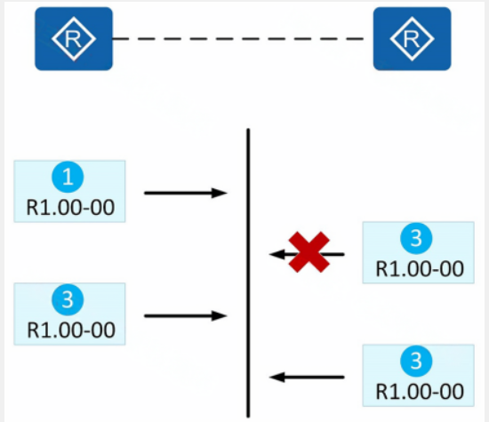

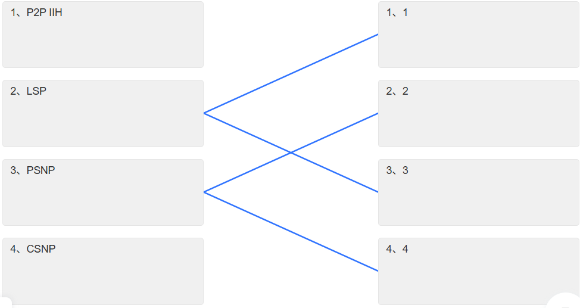

152.（连线题）在IP网络中，策略路由和路由策略常用于路由和流量控制，两者存在一定的差异性。请将策略路由和路由策略与其所能实现的功能相匹配。（Token可重复使用）

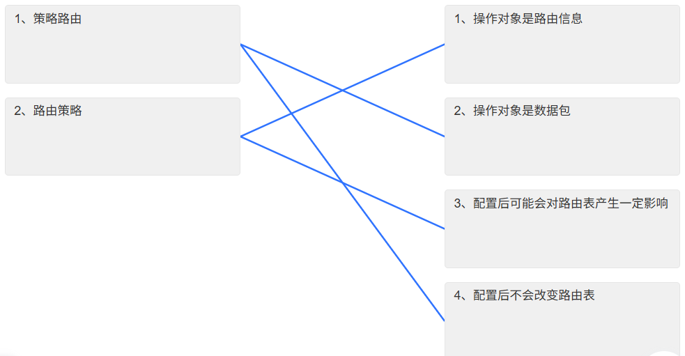

