---
tags:
  - HCIP-Datacom
comment: false
---
# 831
## 831-1

1.如图所示ospf网络，网络工程师发现R1和R2的Router ID配置相同，且R1和R2引入缺省路由（default-route-advertise always），关于此场景描述错误的是哪一项：R1和R2可以建立邻居关系

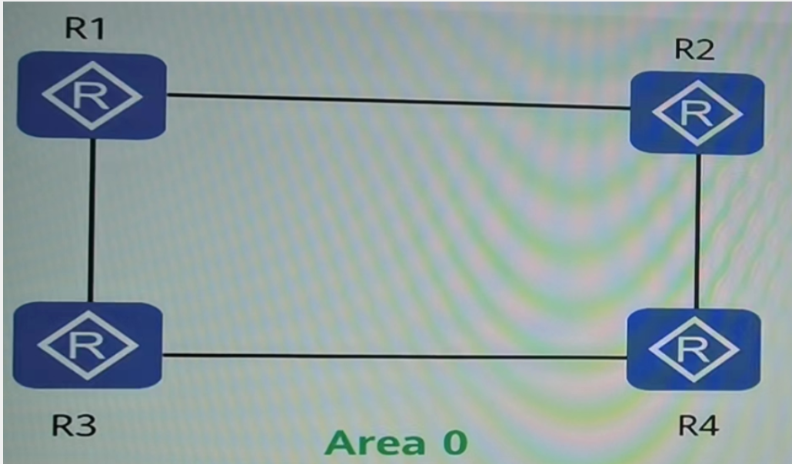

1.  在某MPLS网络中，R1和R3的LSP信息如图所示，此时管理员在R1上输入命令ping -a 1.1.1.1 3.3.3.3，那么以下关于该场景的描述，正确的是哪一项：R2收到Echo Request报文携带标签1025，R2收到的Echo Reply报文携带标签1024

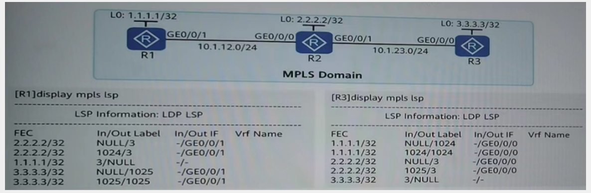

2.  在BGP/MPLS IP VPN网络中，当CE和PE之间运行一下哪一项路由协议时，PE设备可以不再BGP中执行路由重发操作：BGP
3.  如图所示，某管理在交换机连接终端的接口启用了端口隔离功能，那么在该场景中，PC1无法ping通以下哪个IP地址：10.1.1.3

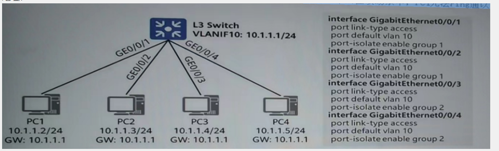

4.  某一台OSPF路由器的Debug输出信息如图所示，请问该路由器的Router ID为以下哪一项：10.0.2.2

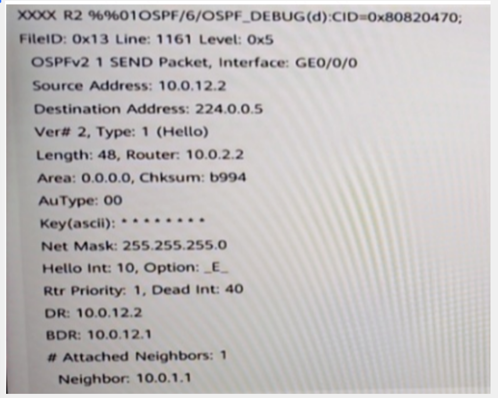

5.  OSPFv3报文封装在IPv6报文内，IPv6报文头部中Next Header字段的取值为以下哪一项：89
6.  如图所示的网络，R1、R2、R3之间运行OSPF协议，并且打开OSPF BFD特性，R1和R3之间使用Loopback接口建立IBGP邻居关系，假如将R2的GE0/0/1接口shutdown，在R1上查看BGP邻居关系缺省情况下，R1 BGP邻居关系由Up状态变成Down状态最长时间为以下哪一项：180s

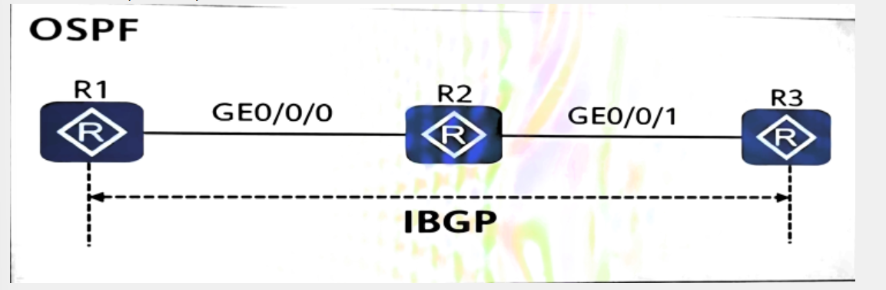

7.  如图所示的网络，相邻的路由器之间使用直连接口建立EBGP邻居关系，每台设备的Router ID为10.0.X.X，AS号为6500X，其中x为路由器的编号，R1和R4均有到达192.168.1.0/24的静态路由，通过import方式引入BGP。R1向邻居发送路由时添加了comnitx属性（1：1），网络中所有路由器均使能了传递团体属性的能力。R3上配置了路由策略，拒绝接受携带commnity属性为1：1的路由，则R3到达192.168.1.0/24的流量路径为以下哪一项：R3无法到达192.168.1.0.24的路由

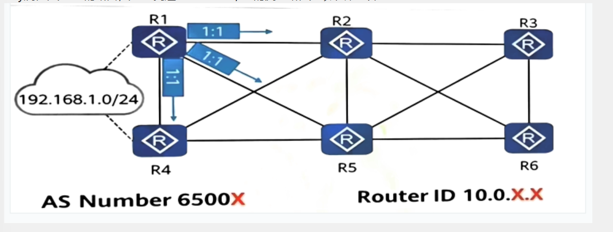

8.  如果某一台OSPF路由器被设置为stub路由器，则该路由器发出的LSA中链路度量值为以下哪一项：65535
9.  如图所示的OSPF网络，区域1时Totally NSSA区域，区域2是普通区域，R4引入外部路由10.0.4.4/32，每一台的Router ID为10.0.X.X，其中X为设备编号。在R1和R3的OSPF进程中配置了”asbr-summary 10.0.4.0 255.255.255.0”命令，以下描述中正确的是哪一项：区域2中没有Type7 LSA

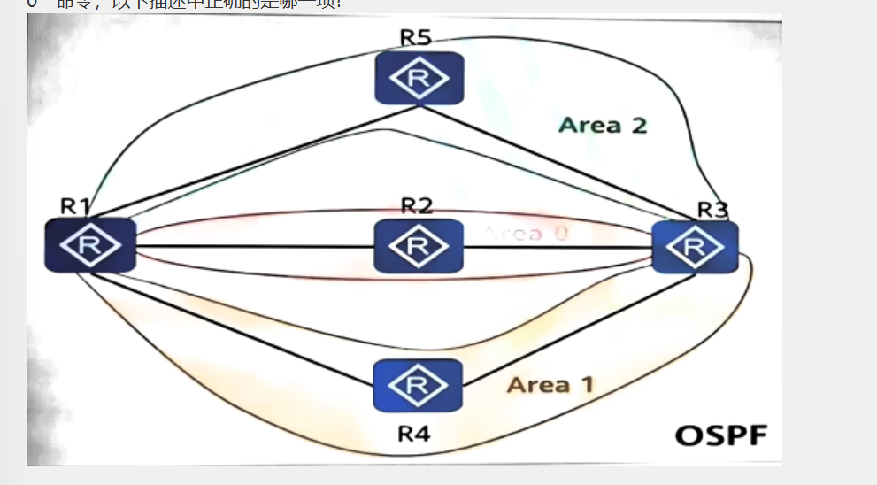

10. BFD的检测机制是两个系统建立BFD会话，并沿它们之间的路径周期性发送BFD控制报文，如果一方在既定的时间内没有收到BFD的控制报文，则认为路径上发生了故障，以下哪一原因不会导致BFD会话Down：BFD会话的session-name不一致

12.网络工程师抓取到一份组播数据帧，其目的MAC地址为01-00-5e-00-01-01，据此分析，目的IPv4地址不能为以下哪一项：224.0.0.1

13.网络工程师在处理现网故障时画出了如图所示的拓扑图，所有路由器运行OSPF，以下关于PC1和PC2互访路径描述，正确的是哪一项：PC1访问PC2的路径为：PC1-R1-R3-R2-PC2;PC2访问PC1的路径为：PC2-R2-R3-R1-PC1

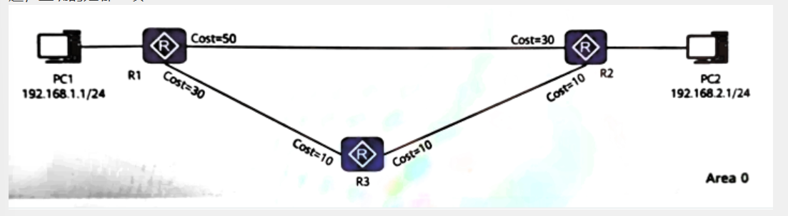

1.  在BGP/MPLSIPVPN网络中，当CE和PE之间运行以下哪一项路由协议时，PE设备可以不在BGP中执行路由重分发操作：BGP
2.  在BGP/MPLSIPVPN网络中，VPNv4的路由传递会携带ExportRT值，那么MP-BGP是通过以下哪一个路径属性携带的Export RT：Extended Community
3.  如图所示网络中，管理员先完成了如选项所示的路由配置，然后在R1-R3所有设备和互联接口上使能MPLS和LDP功能，从而实现PC1访问PC2的流量在网络中基于MPLS转发。那么以下哪一选项的路由配置，可以

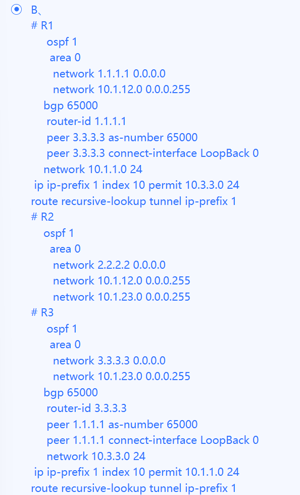实现该功能：

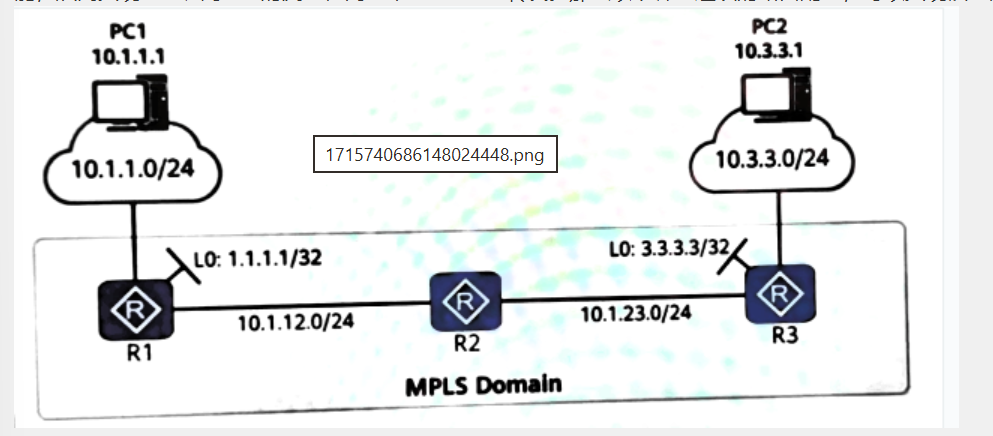

17.某交换机的输出信息如图所示，从该信息中可以判断出以下哪一项内容：GE0/0/1口对广播报文进行阻塞后，只有当广播报文的平均速率小于1000pps时才会被正常转发

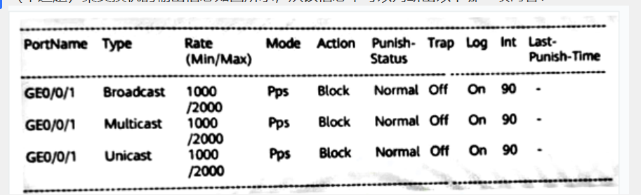

18.某园区网络通过华为S系列交换机组网，管理员在网络中开启了MAC漂移检测功能，那么以下关于该功能的描述，错误的是哪一项：交换机开启该功能后，可以整合整网MAC地址漂移信息，并上报告警

19.如图所示的IS-IS IPv6网络，所有路由器均开启多拓扑功能.R4Loopback0接口的IPv6地址为2000：：4/128.在R4IS-IS进程中配置“ipv6 summary2000：：64 level-1-2”。缺省情况下，以下描述错误的是哪一项：R1路由表中有2000：：4/128的路由条目

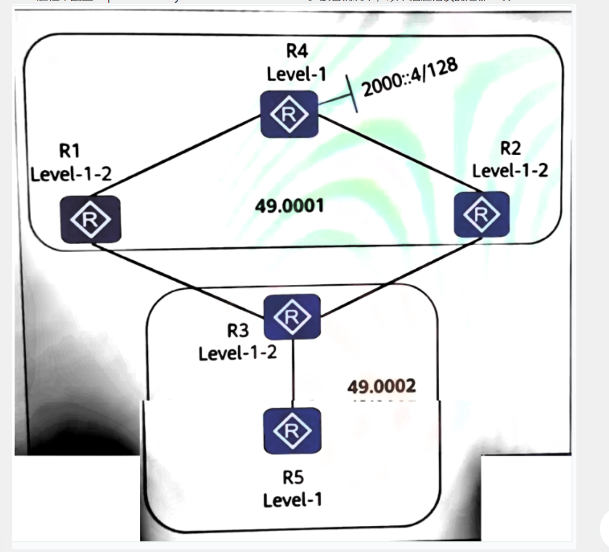

20.如图所示的OSPFv3网络，区域1为NSSA区域。R1将外部路由2000：：1/128引I入OSPFv3。缺省情况下，区域1中不存在以下哪一种类型的LSA：AS-External-LSA

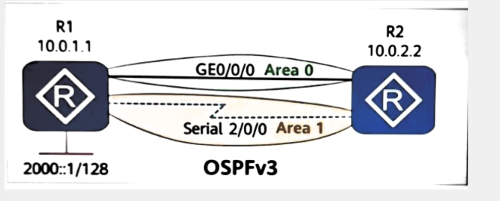

21.如图所示的网络，R1、R2、R3之间运行OSPF协议，R1和R3之间使用Loopback接口建立IBGP邻居关系，假如将R2的GEO/0/1接口通过"undo network x.x.x.x y.y.y.y"命令关闭OSPF，在R1上查看BGP邻居关系，缺省情况下，R1BGP邻居关系由Established状态变为ldle状态的最长时间为以下哪一项：180s

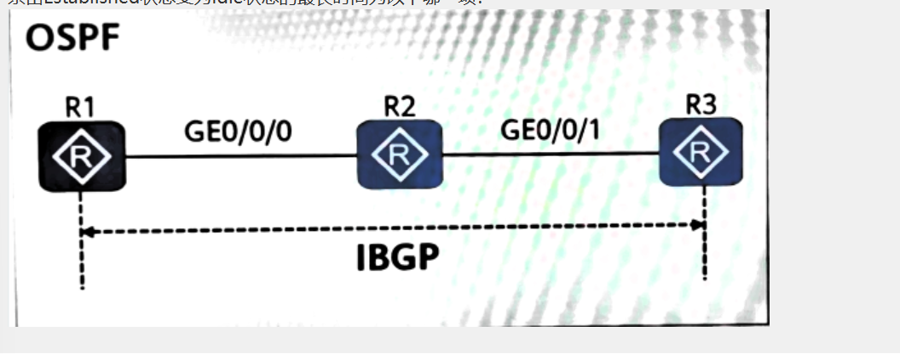

22.如图所示的OSPF网络，区域号已在图中标出，其中区域1为Stub区域，区域2为TotallyStub区域，区域3为NSSA区域，缺省情况下，以下哪一台路由器的路由表中没有缺省路由：R3

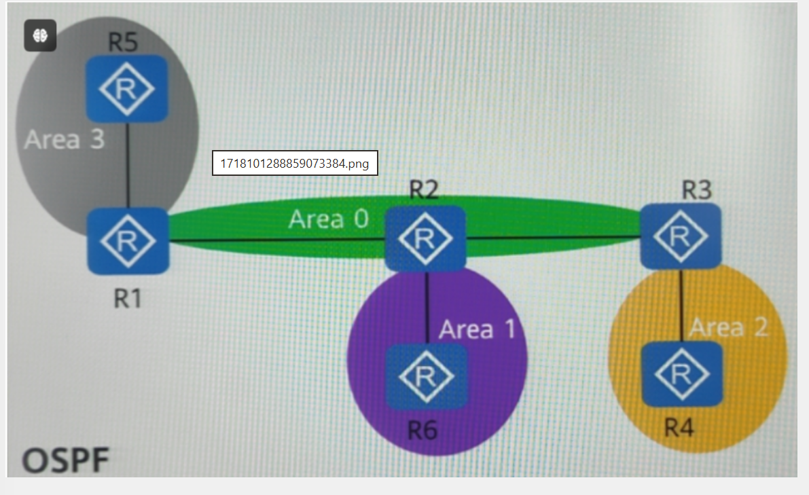

23.如图所示的OSPF网络，链路的Cost值已在图中标出，RI开启OSPFIPFRR，则以下描述中错误的是哪一项：如果R1和S1之间的链路中断，由于R1开启了FRR，因此R1将直接使用备份路径到达R3

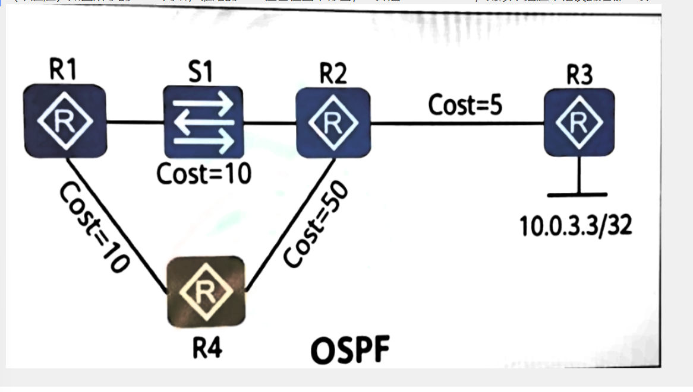

24.如图所示的OSPF网络，区域号已在图中标出，其中区域1、区域2、区域3均为普通区域，R5Loopback0接口的IP地址为10.0.5.5/32，且该接口通过network的方式使能0SPF。在所有路由器上均配置了acl2000，匹配规则如图所示。在R1、R2、R3的区域0中，均配置了“filter2000export”，则以下哪些路由器的路由表中不存在10.0.5.5/32的路由条目：

R4

R6

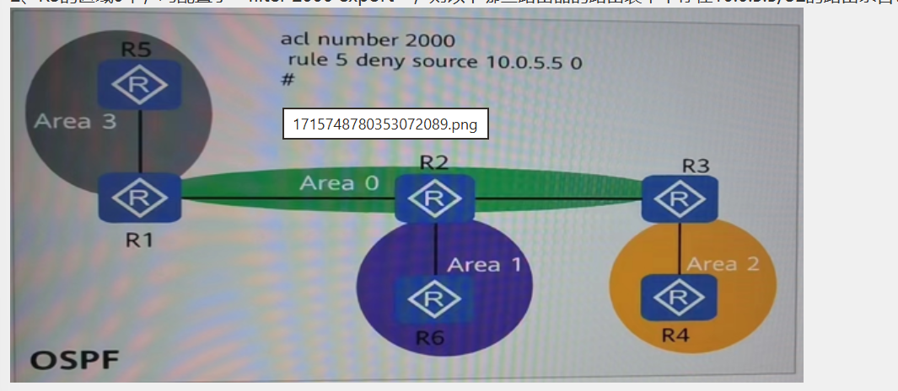

25.如图所示的IS-IS网络，R1通过“default-route-advertise always leve1-1”命令引入了缺省路由，以下描述中正确的是哪一项：

R1路由表中存在缺省路由

R3路由表中不存在缺省路由

R2路由表中存在缺省路由

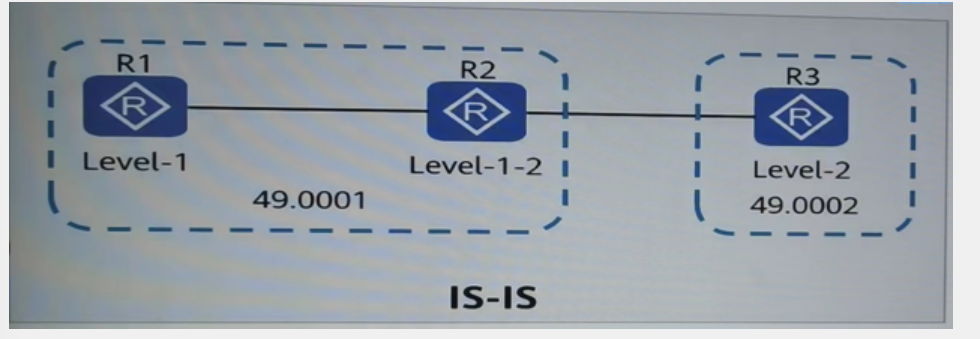

1.  如图所示的0SPF网络，区域号已在图中标出，其中区域1、区域2、区域3均为普通区域，R5Loopback0接口的IP地址为10.0.5.5/32，且该接口通过network的方式使能OSPF。在R5的GEO/O/1和R1的GEO/O/2接口，均配置了"ospf filter-lsa-outall”，则以下哪些路由器的路由表中不存在10.0.5.5/32的路由条目：全选

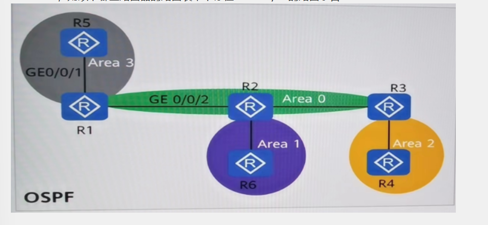

2.  如图所示的网络，PC1和PC2连接到同一台交换机，且属于相同的VLAN，以下哪些原因可能会导致PC1和PC2无法相互通信：全选

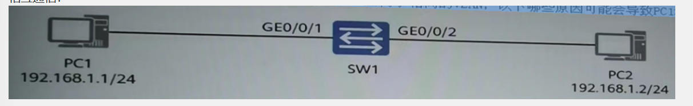

3.  某一台网络设备已建立OSPF邻居关系，其GEO/O/0接口的配置如图所示，在该接口下执行以下哪些命令不影响该接口OSPF邻居状态：

undo ospf dr-priority

undo ospf cost

undo description

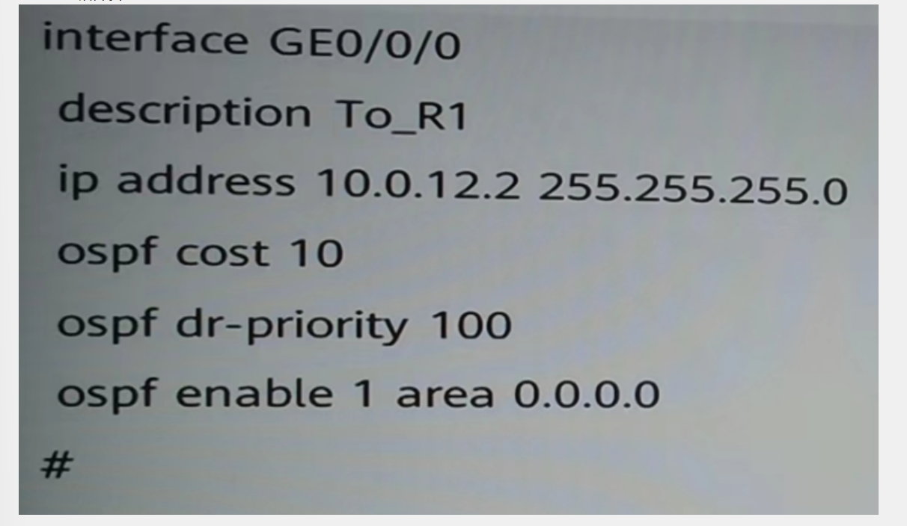

4.  管理员通过命令displaymplsIsp查看设备的LSP，输出信息如图所示，以下关于该信息的描述，正确的有哪些项：

对于访问3.3.3.3的流量而言，该设备是倒数第二跳Transit设备

从该设备GEO/0/1口发出的访问3.3.3.3的流量，将不携带标签

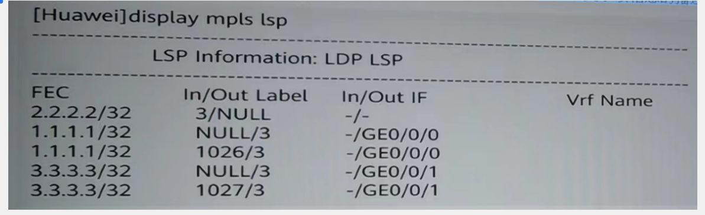

5.  某管理员通过displaymlsldpsession命令查看R1与R2间LDP会话的建立情况，输出信息如图所示，那么以下关于该信息的描述，正确的有哪些项：

会话中发送和接收的Keepalive消息数相同

R1与R2采用的标签发布方式均为DU

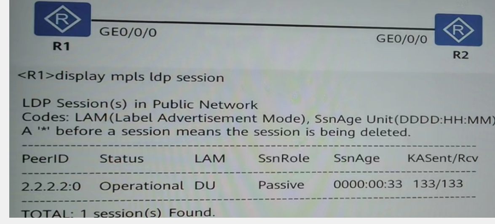

6.  网络管理员在交换机上部署了IPSG功能来预防IP地址欺骗攻击，那么在如图所示的设备接口中，哪些接口收到报文后不会执行IPSG检查

GE0/0/4

GE0/0/3

GE0/0/2

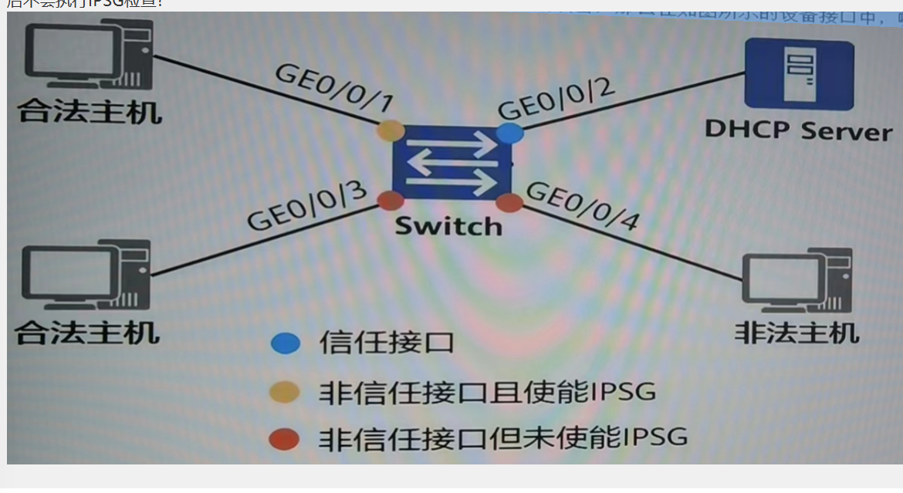

32.如图所示的OSPFv3网络，区域1为NSSA区域。R1将外部路由2000:1/128引I入0SPFv3。缺省情况下，区域0中有哪些类型的LSA

Intra-Area-Prefix-LSA

Link-LSA

Inter-Area-Prefix-LSA

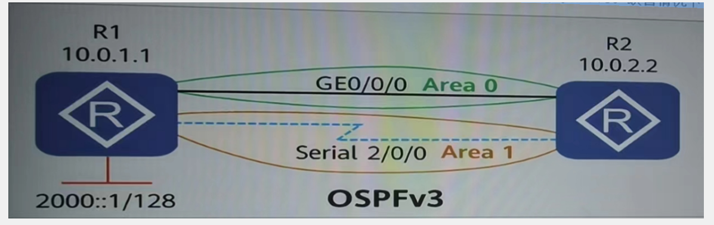

33.如图所示的OSPFv3网络，区域1为普通区域，以下描述中正确的有哪些项

假如R5引I入了外部路由，则R4计算该外部路由时不需要依赖Inter-Area-Router-LSA

R1、R2和R3均生成Inter-Area-Prefix-LSA

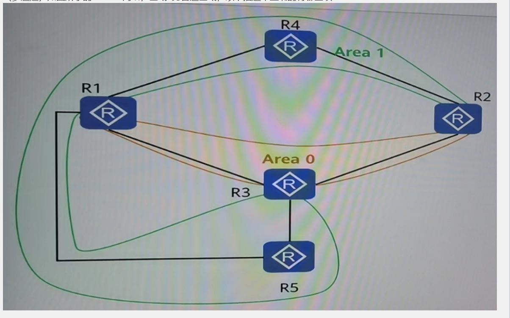

1.  如图所示的网络，R2、R6、R3之间运行IS-ISIPv6，R6Looback0接口的IPv6地址为2000:6/128。其它链路均运行OSPv3,区域1为stut区域，区域2为NSSA区域。在R2和R3上将IS-IS路由引入0SPFv3，以下哪些方式可以让R4Ping通2000:6

全选

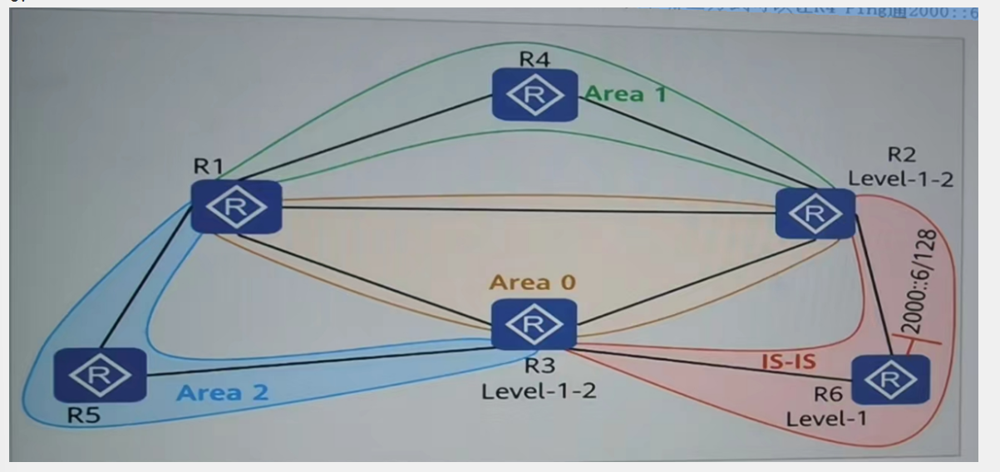

2.  如图所示的IS-ISIPv6网络，所有路由器均开启多拓扑功能。R4Loopback0接口的IPv6地址为2000:4/128。在R2和R1的IS-IS进程中配置"ipv6 summary 2000:/64 level-2"。在R1、R2和R3 IS-IS进程中配置"ipv6 import-route isis level-2 intolevel-1”。缺省情况下，以下哪些路由器的路由表中有2000:/64的路由条目

全选

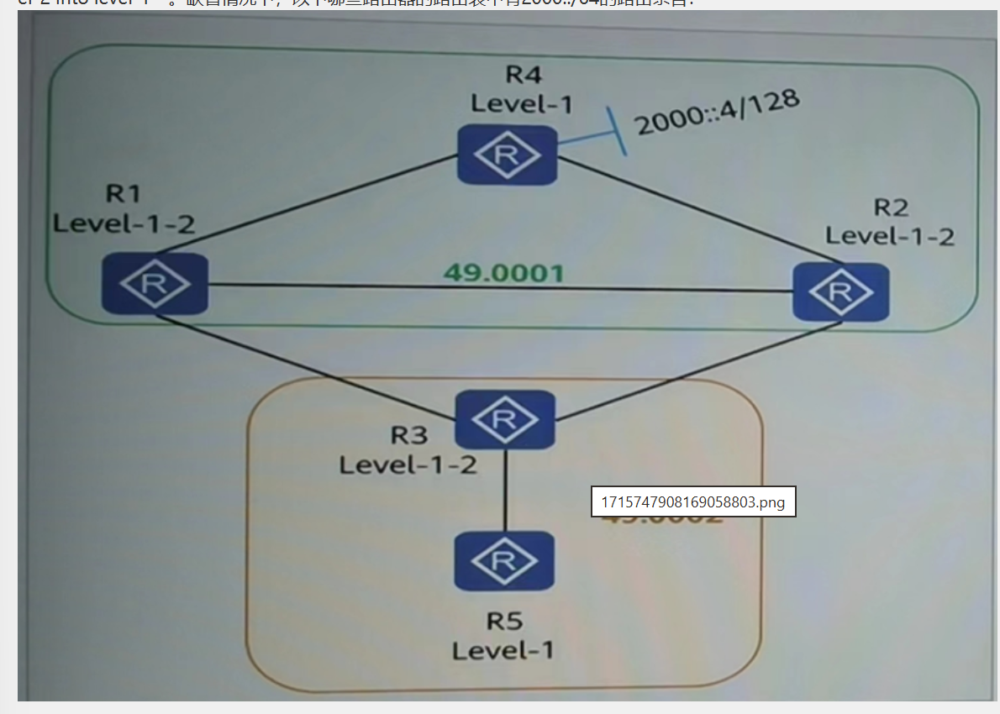

3.  如图所示的网络，R1、R2、R4、R5运行IS-IS，区域号为49.0001。R3、R6运行IS-IS，区域号为49.0002，且R2、R5配置路由渗透。在AS 6500内部，R1、R3、R4、R6均与R2、R5建立IBGP邻居关系，其中R2、R5是RR，R1、R4、R3、R6是客户端。IBGP邻居关系均使用Loopback0接口建立。每台设备的Loopback0接口的IP地址为10.0.X.X/32，Router ID为10.0.XX，其中X为设备的编号。R1和R4将外部网络192.168.1.0/24通过import方式引I入BGP，R3和R6通过import方式将外部网络192.168.2.0/24引入BGP。缺省情况下，以下描述正确的有哪些项

R3到达192.168.1.0/24的流量路径可能为R3-R2-R1

R1到达192.168.2.0/24的流量路径可能为R1-R2-R3

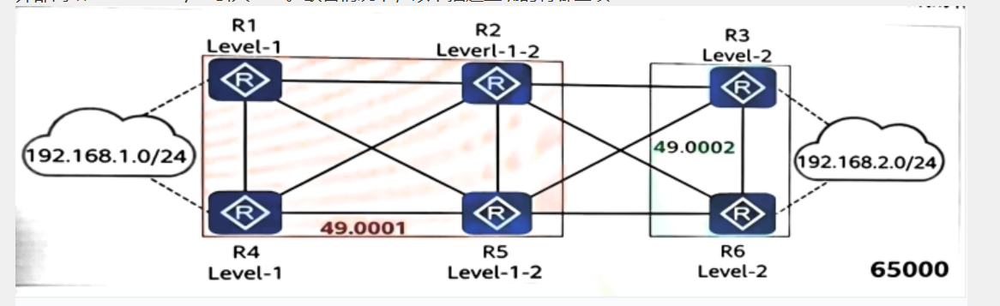

37.如图所示的网络，R1、R2、R4、R5运行IS-IS，区域号为49.0001。R3、R6运行IS-IS，区域号为49.0002。在AS 65000内部，R1、R3、R4、R6均与R2、R5建立IBGP邻居关系，其中R2、R5是RR，R1、R4、R3、R6是客户端。IBGP邻居关系均使用Loopback0接口建立。每台设备的Loopback0接口的IP地址为10.0.X.X/32,RouterID为10.0.X.X，其中X为设备的编

号。R1和R4将外部网络192.168.1.0/24通过import方式引I入BGP，R3和R6通过import方式将外部网络192.168.2.0/24引入BGP。缺省情况下，以下描述正确的有哪些项

R4路由表中有两条等价的缺省路由

R1路由表中没有192.168.2.0/24的路由条目

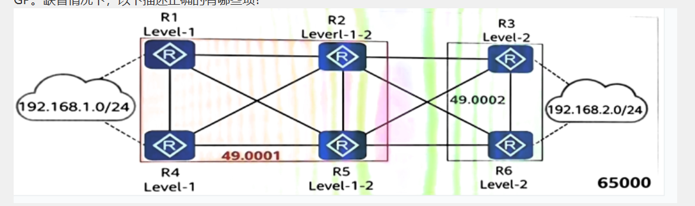

38.如图所示的OSPF网络，区域号已在图中标出，其中区域1为NSSA区域，区域2和区域3为普通区域，R5的OSP进程中配置了"default-routadvertise always”命令，以下哪些路由器的路由表中有缺省路由

全选

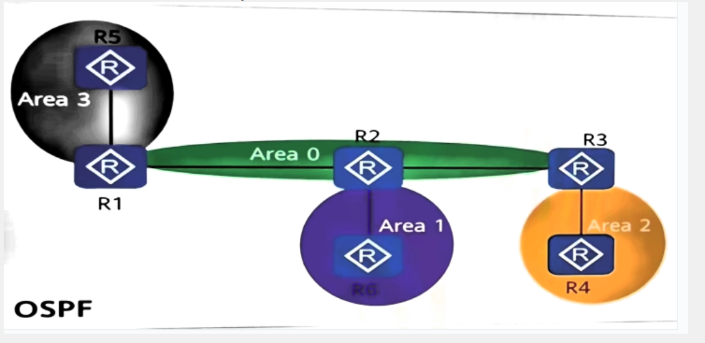

39.如图所示的OSPF网络，区域1和区域2都是普通区域，R4引I入外部路由10.0.4.4/32。在R1和R3的OSPF进程中均配置了"asbr-sumary10.0.4.0255.255.255.0”命令，则以下哪些路由器的路由表中有10.0.4.4/32的路由条月

全选

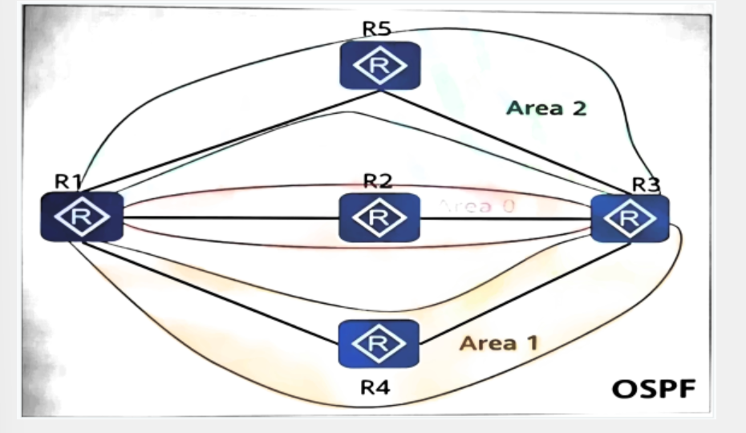

40.如图所示，某网络部署OSPF实现网络互通，其中Area1部署为Stub区域，Area2 部署为TotallyNSSA区域，R2的环回口Loopback0未开启OSPF，若在R2的OSPF 进程内通过命令import-route direct 将环回口地址引入到OSPF网络中，使得其他设备可以访问该环回口地址，则R4会收到以下哪些由R3发布的LSA

7类LSA描述缺省路由

3类LSA描述缺省路由

1类LSA描述R3 的接口信息

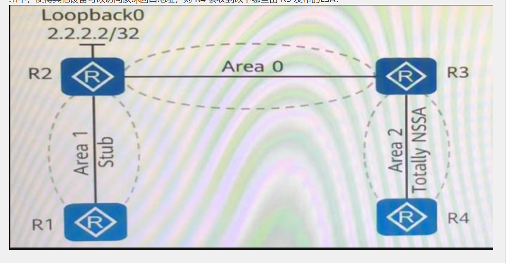

41.网络工程师在处理故障后撰写了故障处理报告，他把实际组网简化为如图所示的网络。R1和R2均开启OSPF协议，且分别作为PC1和PC2的网关，以下描述正确的有哪些项

在R1上无法Ping通192.168.1.12

PC1和PC2无法Ping通

在R1上无法Ping通192.168.1.2

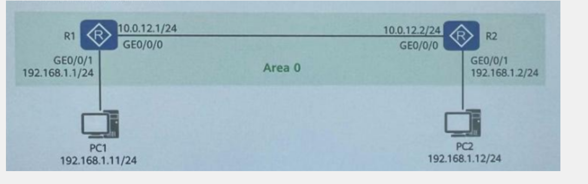

1.  如图所示的网络，PC1和PC2连接到同一台交换机，且属于相同的VLAN，以下哪些原因可能会导致PC1和PC2无法相互通信

全选

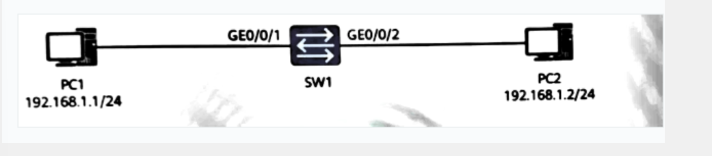

43.管理员为了防止广播风暴问题导致流量泛洪，准备在设备接口视图的入方向部署流量抑制功能，那么此时可以按照以下哪些参数对广播报文进行流量抑制？

比特速率

包速率

百分比

44.如图所示的IS-ISIPv6网络，所有路由器均开启多拓扑功能。在R4和R5IS-IS进程中配置“default-route-advertisealways level-1"缺省情况下，以下哪些路由器的路由表中有缺省路由

全选

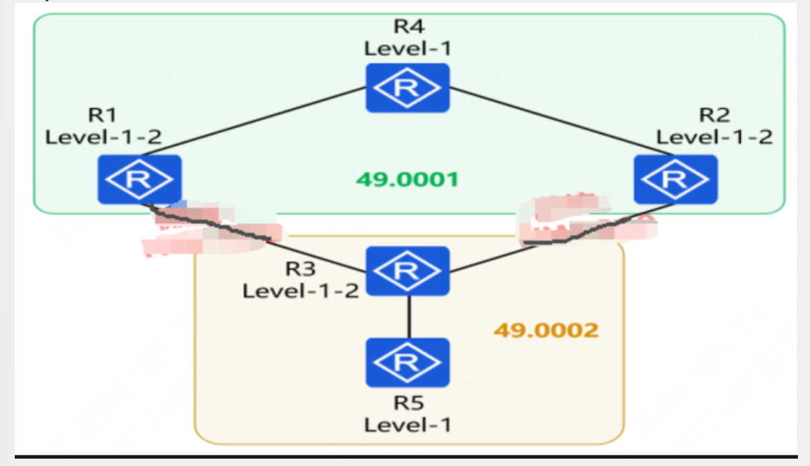

1.  如图所示，CE1发送了VPN1的流量给PE1，PE1收到后将转发该VPN流量，那么以下针对该场景的描述，正确的有哪些项

全选

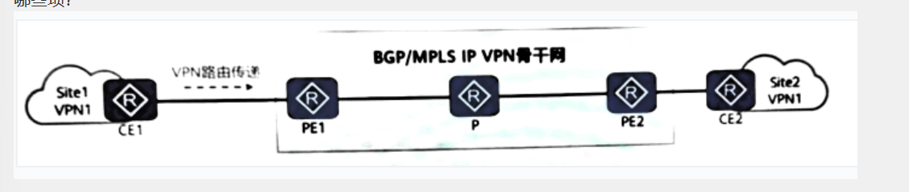

2.  MPLS标签是一个20bit长的本地标识符，其标签空间被划分为特殊标签、静态共享标签空间和动态信令协议标签空间，那么以下哪些属于特殊标签

14

2

47.如图所示的网络，R1、R2、R4、R5运行IS-IS，区域号为49.0001R3、R6运行IS-IS，区域号为49.0002，在R2和R5上配置"import-route isis level-2 into level-1 ",AS 6500o内部，R1、R3、R4、R6均与R2、R5建立IBGP邻居关系，其中R2、R5是RR，R1、R4、R3、R6是客户端。R2和R5之间也建立IBGP邻居关系，且配置相同的ClusterID，IBGP邻居关系均使

用Loopback0接口建立。每台设备的Loopback0接口的IP地址为10.0.X.X/32，RouterlD为10.0.X.X，其中X为设备的编号，R1和R4将外部网络192.168.1.0/24通过import方式引I入BGP，R3和R6通过import方式将外部网络192.168.2.0/24引入BGP，在所有路由器的BGP进程中，配置”maximumload-balancingibgp8”。缺省情况下，以下描述正确的有哪些项

R5的路由表中到达192.168.2.0/24有两条等价路由

R2的路由表中到达192.168.1.0/24有两条等价路由

R1的路由表中有到达192.168.2.0/24等价路由，且下一跳IP相同

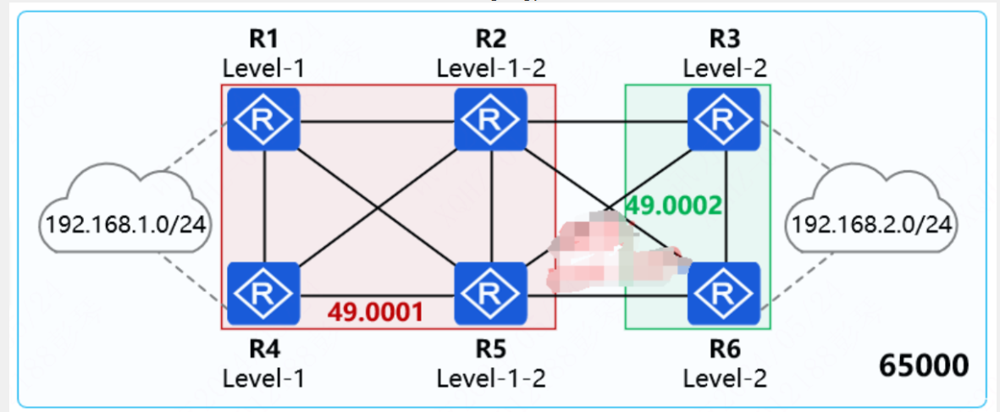

48.IPSG能够防御IP地址欺骗攻击，那么以下关于IPSG的描述，错误的有哪些项？

IPSG支持在二层物理接口或者VLAN上应用，也支持在三层物理接口或VLANIF等逻辑接口上应用

IPSG可以匹配检查主机发送的IP、ARP、PPPOE等报文

49.在BGP/MPLSIPVPN网络中，PE设备向外发布VPNV4路由时，会携带以下哪些信息？

IPv4地址前缀

Export Target

RD

1.  R4的RouterID为10.0.4.4，在R4的LSDB中看到如图所示的LSA，网络工程师根据该LSA做出以下推断，其中正确的有哪些项

R4是某一条链路上的DR

这三条LSA属于区域1

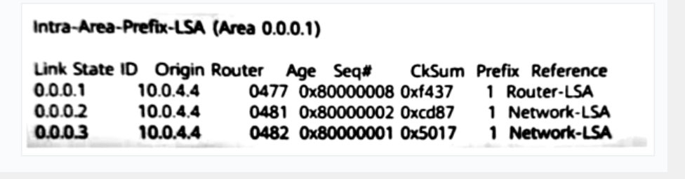

2.  某一台路由器生成的Router-LSA如图所示，根据此LSA进行推断，以下描述正确的有哪些项

该路由器是ABR

路由器至少有一个接口属于区域0

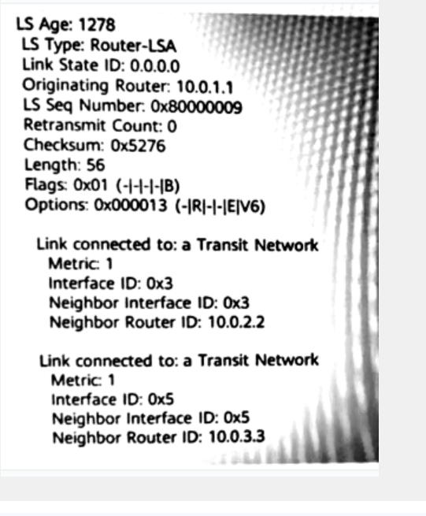

52.R3路由表中到达192.168.1.0/24有两个下一跳如图所示的网络，R1、R2、R3、R4、R5运行IS-IS，区域号为49.0001，R3、R6运行IS-1IS，区域号为49.0002.在AS 65000内部，R1、R3、R4、R6均与R2、R5建立IBGP邻居关系、其中R2、R5是RR，R1、R4、R3、R6是客户端。IBGP邻居关系均使用LoopbackO接口建立。每台设备的Loopback0接口的IP地址为10.

0.X.X/32.RouterID为10.0.X.X.其中X为设备的编号.R1和R4将外部网络192.168.1.0/24通过import方式引I入BGP，R3和R6通过import方式将外部网络192.168.2.0/24引l入BGP.缺省情况下，以下描述正确的有哪些项

R4路由表中有两条等价的缺省路由

R1路由表中没有192.168.2.0/24路由条目

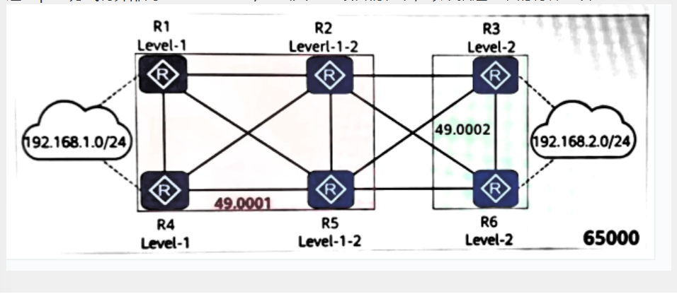

53.如图所示的网络，R1、R2、R4、R5运行IS-IS，区域号为49.0001，R3、R6运行IS-IS，区域号为49.0002，在R2上配置"import-route isis level-2 into level-1”。AS 6500o内部，R1、R3、R4、R6均与R2、R5建立IBGP令居关系，其中R2、R5是RR，R1、R4、R3、R6是客户端，R2和R5之间也建立IBGP邻居关系，且配置相同的ClusterID，IBGP邻居关系均使用Loopback0接口建立。每台设备的Loopback0接口的IP地址为10.0.X.X/32，RouterID为10.0.X.X，其中X为设备的编号。R1和R4将外部网络192.168.1.0/24通过import方式引I入BGP，R3和R6通过import方式将外部网络192.168.2.0/24引I入BGP。缺省情况下，以下描述正确的有哪些项

R5的BGP路由表中到达192.168.1.0/24有两条有效路由

R3的BGP路由表中到达192.168.2.0/24有一条有效路由

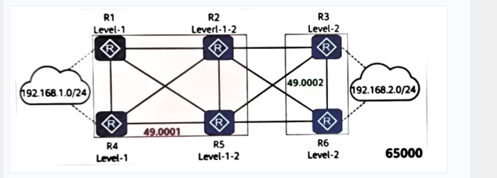

1.  R1、R2、R3将外部网络192.168.1.0/24通过import方式引I入BGP。缺省情况下，以下描述正确的有哪些项

针对192.168.1.0/24，R5优选从R2接收的路由

针对192.168.1.0/24，R4优选从R1接收的路由

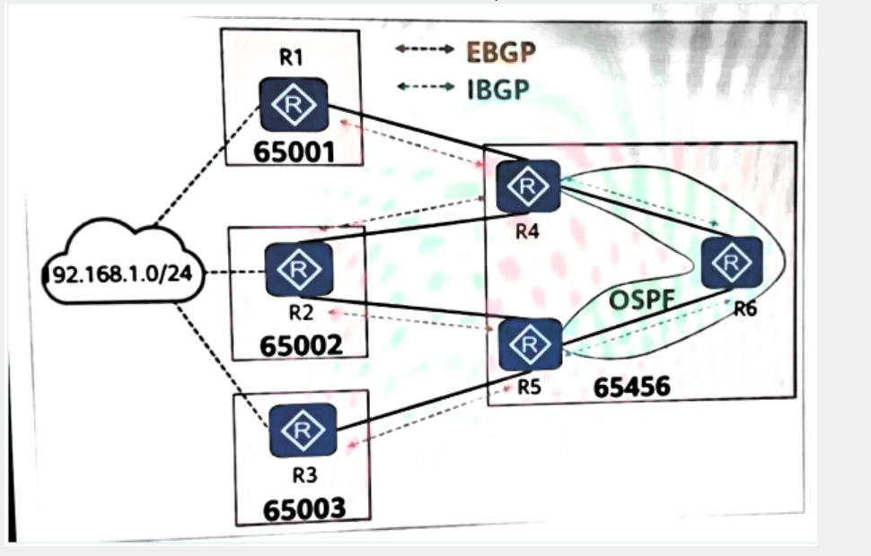

2.  如图所示的OSPF网络，区域号已在图中标出，其中区域1为普通区域、区域2为TotallyNSSA区域、区域3为NSSA区域，R5将外部路由10.0.5.5/32引入OSPF，则以下哪些路由器的路由表中存在10.0.5.5/32的路由条目

R2

R6

R3

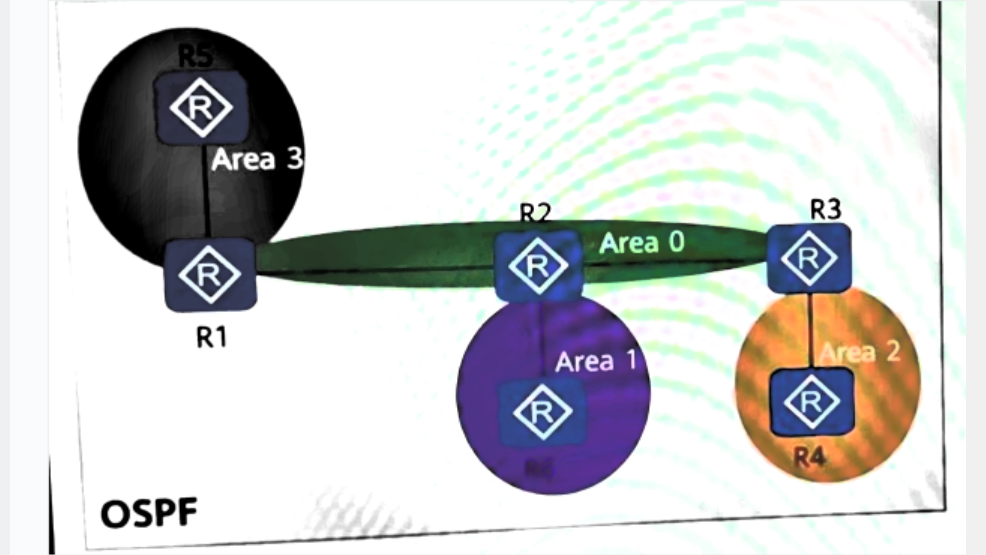

3.  为了将NSSA区域引I入的外部路由发布到其它区域，需要把Tpe7LSA转化为Type5LSA以便在整个OSPF网络中通告。缺省情况下，执行LSA转换的路由器是NSSA区域中RouterID最大的区域边界路由器（ABR）

正确

4.  在创建IPV6静态路由时，对于点到点接口，必须指定出接口。对于广播类型接口，必须指定下一跳。

错误

5.  网络运维人员可以通过VTY的方式远程登录设备，查看Log，Trap、Debug等信息，以实现远程设备维护

正确

59.如图所示的网络，R1和R2通过SW1相连，如果SW1未启用STP，则R1和R2无法互相Ping通。

错误

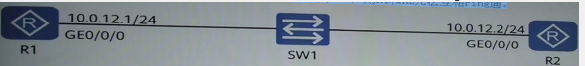

60.设备运行环境是指设备运行的机房、供电、散热等外部环境，这是设备运行的基础条件。对于设备运行环境的维护，工作人员只能亲临现场才能完成

错误

1.  网络工程师可以通过现场观察NetEngineAR6120的接口指示灯判断链路连接是否正常，但无法判断接口是否配置

正确

2.  在如图所示的Hub&Spoke组网中，Hub-PE可以通过手工配置允许本地AS编号重复实现路由的正确传递

正确

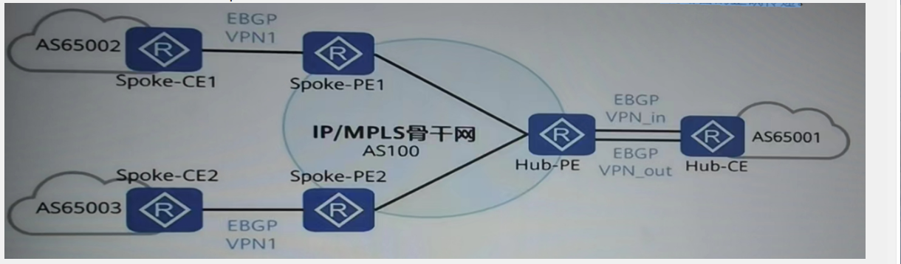

3.  如图所示的IS-ISIPV6网络，R1和R2的接口均有两个IPv6地址，由于R1和R2IPv6地址前缀长度不同，它们无法建立邻居关系

错误

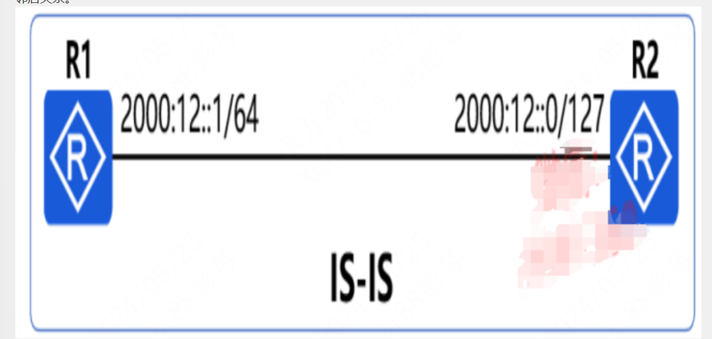

4.  MIPLS支持承载多种网络协议业务，包括单播IPv4业务、组播IPv4业务、单播IPv6业务、组播IPv6业务等

正确

5.  当交换机配置了端口隔离功能后，缺省情况下，属于同一VLAN的不同主机无法进行二层和三层通信

错误

6.  如图所示的IS-ISIPv6网络，当网络稳定后，R2可以Ping通2000:12:1，但是通过"displayipv6 neighbors”无法看到2000:12:1对应的MAC地址

错误

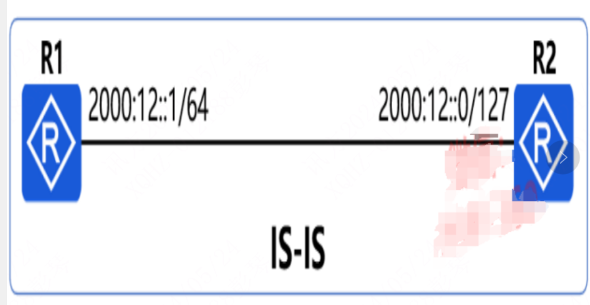

7.  图所示的OSPFv3网络，R1、R2、R3互联的端口开启OSPFv3，每一台设备的RouterID为10.0.X.X，其中X为备的编号。在R3上查看某一条LSA的详细信息，从输出信息中可以推断出R1和R2是网络中的DR。

正确

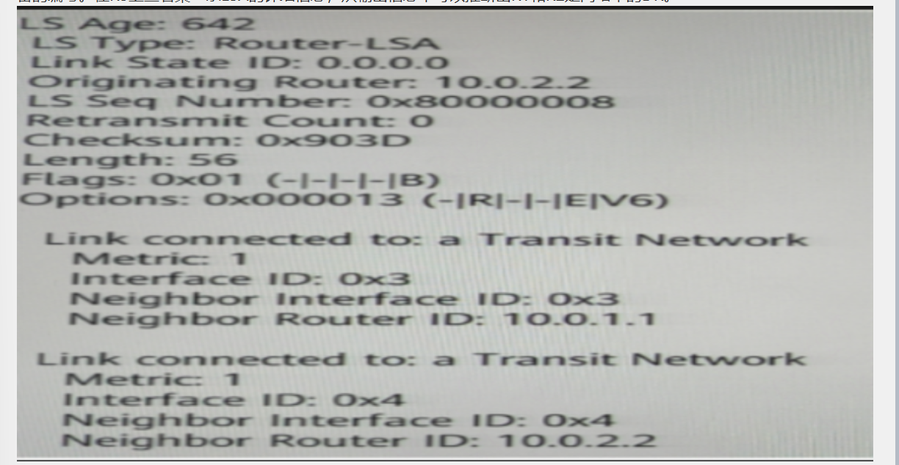

8.  IPSG是一种基于三层接口的源IP地址过滤技术，它能够防止恶意主机伪造合法主机的IP地址来仿冒合法主机访问合法网络资源的行为。

错误

69.如图所示的网络，R1和R2已通过Loopback0接口建立EBGP邻居关系，R1将2001:1/128的路由引I入BGP，则R1发送的update报文中，在M_REAC_RI的Next Hop字段的取值为200O:1。

正确

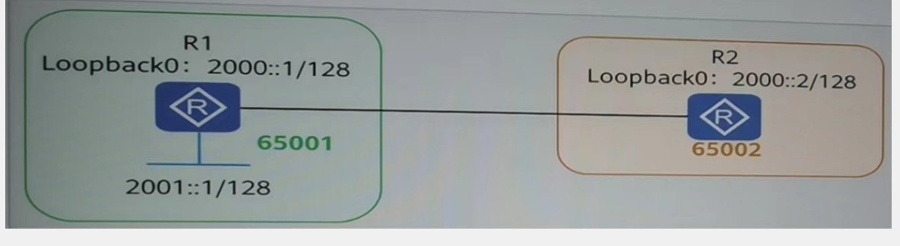

70.在大型BGP网路中，对等体的数目众多，配置和维护极为不便。对于存在相同配，置的BGP对等体，可以将它们加入一个BGP对等体组进行批量配置，简化管理的难度，并提高路由发布效率。配置IBGP对等体组时，不需要指定对等体组的AS号。配置EBGP对等体组时，必须指定对等体组的AS号

正确

1.  在创建IPv6静态路由判断需要指定下一跳，对于广播类型接口，需要指定下一跳。下一跳地址可以是链路本地地址。当下一跳地址为链路本地地址时，必须指定出接口。

正确

72.OSPF支持等价负载分担，当组网中存在的等价路由数量大于maximumload-balancing命令配置的等价路由数量时，如果路由的优先级相同，则负载分担选取接口索引大的路由。

正确

73.OSPF邻居之间周期性发送Hello报文建立和维护邻接关系，并且Hello定时器的时间间隔要保持一致，否则不能立邻接关系。为了加速OSPF收敛，网络工程师可以将He11o报文的时间间隔设置为1ms。

错误

74.大中型企业网络可分为接入层、汇聚层、核心层，网络工程师在对任一层次执行的影响现网业务的操作都需要制定割接方案。

正确

75.当到达同一目的地址存在多条等价路由时，可以通过BGP等价负载分担实现均衡流量的目的。但是公网中到达同一目的地的IBGP路由和EBG由不能形成负载分担。

正确

1.  如图所示，为了实现VPN路由在Hub&Spoke组网中正确的传递，管理员在Hub-PE与Hub-CE之间部署了IGP，在Spoke-PE与Spoke-CE之间部署了EBGP.

错误

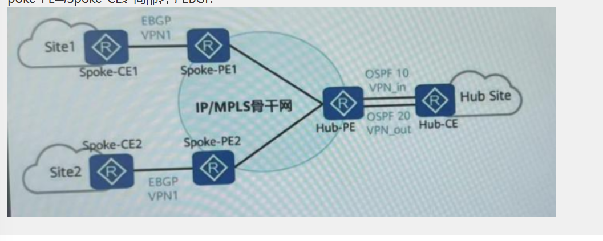

2.  在MPLS网络中，用LSRID来唯一标识一个LSR(Label SwitchingRouter)，LSRID缺省为设备某个物理接口IP地址，可以手工配置为Loopback接口地址。

错误

3.  MPLS标签是一个20bit长的本地标识符，当管理员配置静态LSP时，可以手动指定入标签和出标签，取值范围为0\~1048575。

错误

4.  当管理员采用命令static-Ispegress配置MPLS域内设备的静态LSP时，需要同时指定入标签值和出标签值。

错误

5.  MPLS标签是一个20bit长的标识符，当管理员配置静态LSP时，不同MPLS设备的标签值不能相互重叠

错误

81.两台LSR(Label Switching Router)之间交换Hello消息触发LDP会话的建立，Hello消息中会携带传输地址，其中传输地址较小的设备将作为主动方，发起建立TCP连接。

错误

82.某台IS-IS路由器自己生成的LSP信息如图所示，从LSP信息中可以推断该路由器配置了5个IPV6地址。

错误

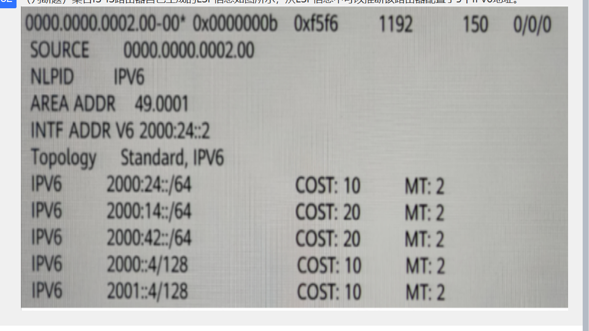

1.  如图所示的OSPFv3网络，R1和R2的接口均有两个IPv6地址，虽然R1和R2IPv6地址前缀长度不同，它们仍然能够建立OSPFv3邻居关系。假如R2是DR，那么在R2产生的Intra-Area-Prefix-LSA中会包含四个前缀。

正确

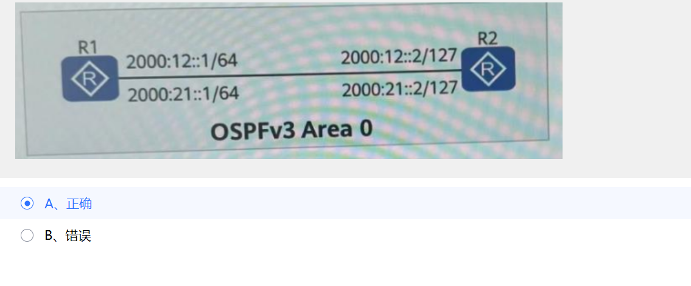

2.  如图所示的OSPFv3网络，R1，R2、R3互联的端口开启OSPFv3，并且均配置了1Pv6全球单播地址，其中R1和R3是DR，则R1和R3均会产生Intra-Area-Prefix-LSA.

正确

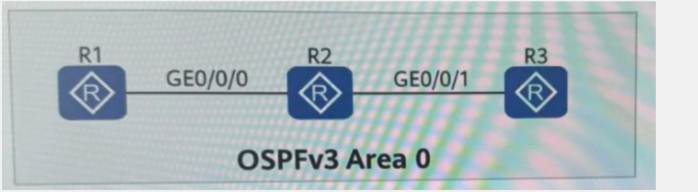

3.  在MPLS网络中，管理员同时部署了端到端的QoS功能，那么MPLS网络中的倒数第二跳设备可以基于PHP特性将MPLS标签弹出从而让Egress能够基于内层报文的QoS优先级进行报文处理。

错误

4.  某台IS-IS路由器自己生成的LSP信息如图所示，从LSP信息中可以推断该路由器非本链路的DIS。

正确

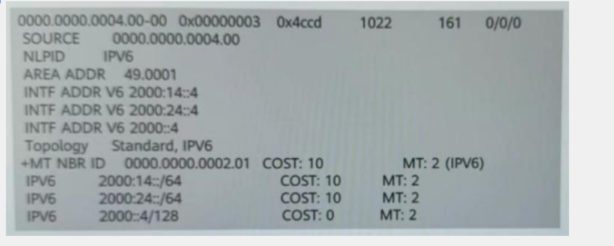

5.  OSPFv3报文封装在IPv6报文内，可以采用单播、组播和广播的形式发送。

错误

6.  BGP协议支持使用"filter-policyacl-nunber import”命令对接收的路由信息进行过滤，acl-number的取值范围是2000-3999.

错误

89.BGP基于前缀的ORF(OutboundRouteFiltering）能力，能将本端设备配置的基于前缀的入口策略通过路由刷新报文发送给BGP邻居，BGP邻居根据这些策略构造出口策略，在路由发送时对路由进行过滤。相比于在BGP邻居上配置路由策略，这种方式不仅避免了本端设备接收大量无用的路由，降低了本端设备的CPU使用率，还有效减少了本端设备的配置工作。

正确

90.然广播网中IS-IS同一网段上的同一级别的路由器之间都会形成邻接关系，即包括所有的非DIS路由器之间也会形成邻接关系。但在IS-IS与BFD联动的实现上，只在DIS和非DIS之间建立BFD会话，非DIS之间不启动BFD会话。

正确

91.LSP快速扩散特性可以加快LSP的扩散速度，正常情况下，当IS-IS收到其它路由器发来的LSP时，如果此LSP比本地LSDB中相应的LSP要新，则更新LSDB中的LSP，并用一个定时器定期将LSDB内已更新的LSP扩散出去，而使能了LSP快速扩散特性的设备收到一个或多个较新的LSP时，在路由计算之前，先将小于指定数目的LSP扩散出去，加快LSDB的同

步过程。

正确

1.  如图所示的OSPF网络，链路的Cost值已在图中标出，R1开启OSPFIPFRR.则R1到达10.0.3.3/32的主路径为R1-R2-R3，备份路径为R1-R4-R2-R3.

错误

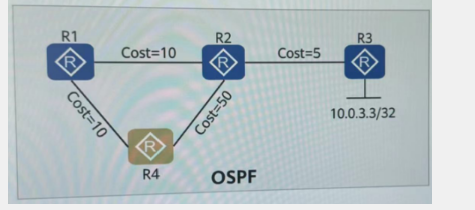

2.  根据本地维护的LSDB，运行OSPF协议的设备通过SPF算法计算出以自己为根的最短路径树，并根据这一最短路径树决定到目的网络的下一跳。如果网络频繁变化，可以将SPF计算的最长间隔设置为0，从而提升路由收敛速度。

错误

3.  如图所示的网络，R2与R1之间部署OSPF协议，且R2的GEO/O/1接口也使能了OSPF协议。R2与R3之间部署IS-IS协议，为了让R1能获取到达10.0.3.3/32的路由，在R2上做了将IS-IS路由引I入OSPF路由的操作，则R2产生的Type5LSA中的FA地址为（）

10.0.23.253

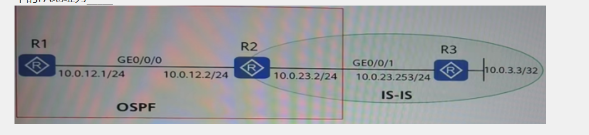

95.如图所示的网络，R2与R1之间部署OSPF协议，R2与R3之间部署IS-IS协议，为了让R1能获取到10.0.3.3/32的路由，在R2上做了将IS-IS路由引I入OSPF路由的操作，则R2产生的Type5LSA中的FA地址为（）

0.0.0.0

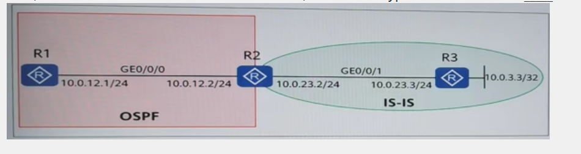

96.在系统升级或降级之前，使用“display（）命令来查看设备本次及下次启动相关的系统软件、备份系统软件、配置文件、License文件、补丁文件以及语音文件。(所有字母小写)

startup

1.  在如图所示的Hub&Spoke组网中，为了实现路由的正确传递，管理员必须在Hub-PE的BGP-VPN_out视图中，手工配置命令peer10.1.2.1（）(所有字母小写）

allow-as-loop

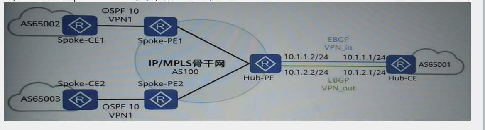

2.  在MPLS网络中，当Egress设备收到的MPLS报文的S字段取值（）为时，表明该标签是栈底标签，直接进行IP转发

1

3.  如图所示的OSPFv3网络，R1的LSDB中有（）条Link-LSA。

2

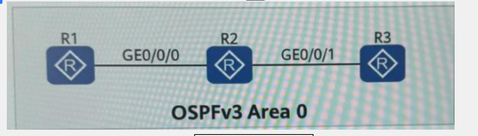

4.  如图所示的网络，R2与R1之间部署OSPF协议，且R2的GEO/O/1接口也使能了OSPF协议。R2与R3之间部署IS-IS协议，为了让R1能获取到达10.0.3.3/32的路由，在R2上做了将IS-IS路由引I入OSPF路由的操作，则在R1的路由表中，到达10.0.3.3/32的下一跳地址为（）

10.0.23.253

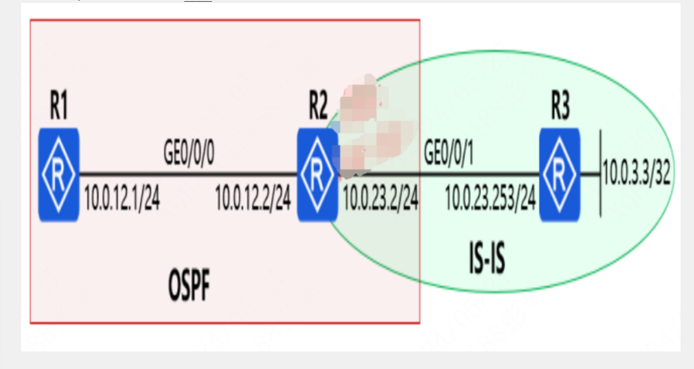

## 831-2
1.  某企业业务路由在网络中传递，其中PE1与PE2的部分配置如图所示，此时CE1新增业务网段，并通告进OSPF10的Area1中，那么在此场景中，CE2将收到以下哪一类型的LSA，其中将包含CE1新通告的业务网段？

Type 3 LSA

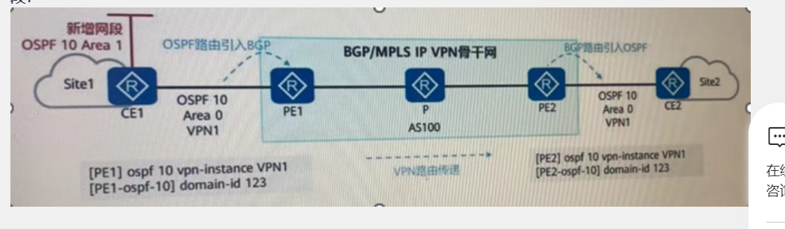

2.如图所示的OSPF网络区域1是TotallyNSSA区域，区域2是普通区域R4引I入外部路由10.0.4.4/32。每一台设备的RouterlD为10.0.X.X，其中X为设备的编号。在R1和R3的OSPF进程中均配置了"asbr-summary10.0.4.0255.255.255.0”命令，以下描述中正确的是哪一项？

区域2中没有Type7 LSA

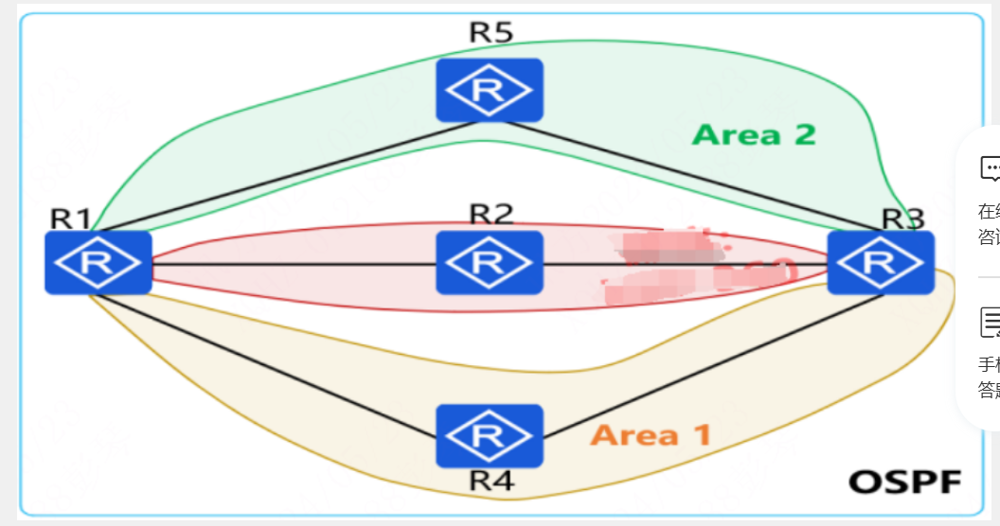

3.R1的RouterID为10.0.1.1，在R1的LSDB中看到如图所示的LSA，网络工程师根据该LSA做出以下推断，其中错误的是哪一项?

生成该LSA的路由器不会产生Network-LSA

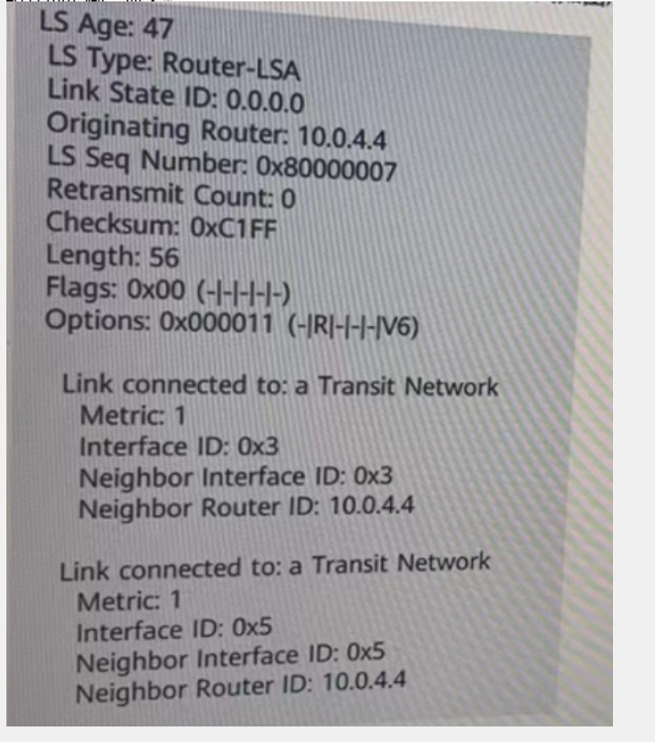

4.缺省情况下，IS-ISLSP刷新时间间隔为以下哪一项?

900s

5.如图所示的IS-IS网络，R1通过"default-route-advertise always level-1”命令引入了缺省路由，

以下描迷中正确的是哪一项？

R2路由表中将出现缺省路由

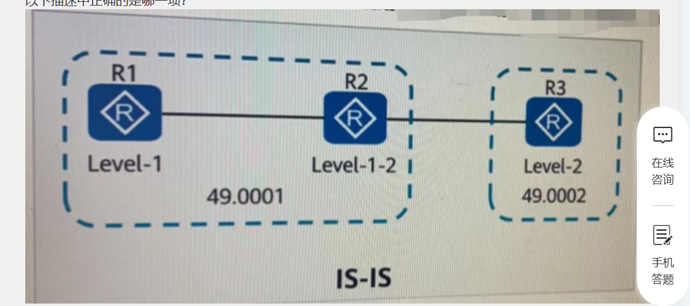

1.  如图所示的OSPF网络，R1和R2之间通过四条链路相连，R2的LoopbackO接口开启OSPF，在R1的OSPF进程中配置"maximumload-balancing1"命令，则R1到达R2的LoopbackO接口的出接口为以下哪一项？

GEO/0/2.20

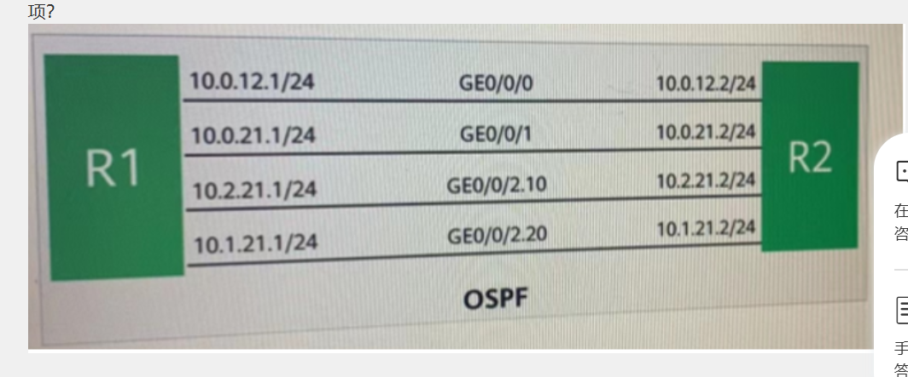

2.  如图所示的IS-IS网络，R1通过"default-route-advertise alvayslevel-1”命令引入了缺省路由，以下描述中错误的是哪一项？

在R1上ping任何一个不存在的IP地址，例如10.0.4.4，该数据包不会从R1发出

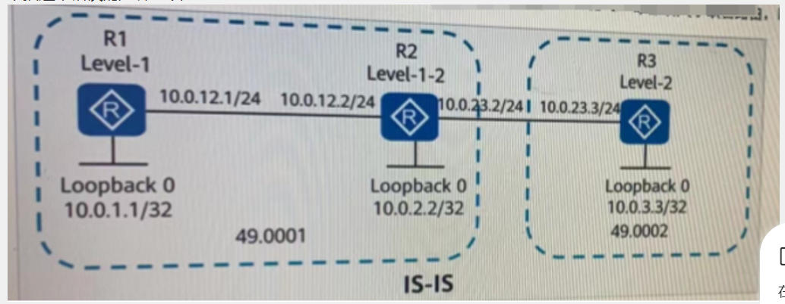

3.  如图所示的OSPF网络，区域号已在图中标出，其中区域1为Stub区域，区域2为TotallyStub区域，区域3为NSSA区域，缺省情况下，以下哪一台路由器的路由表中没有缺省路由？

R3

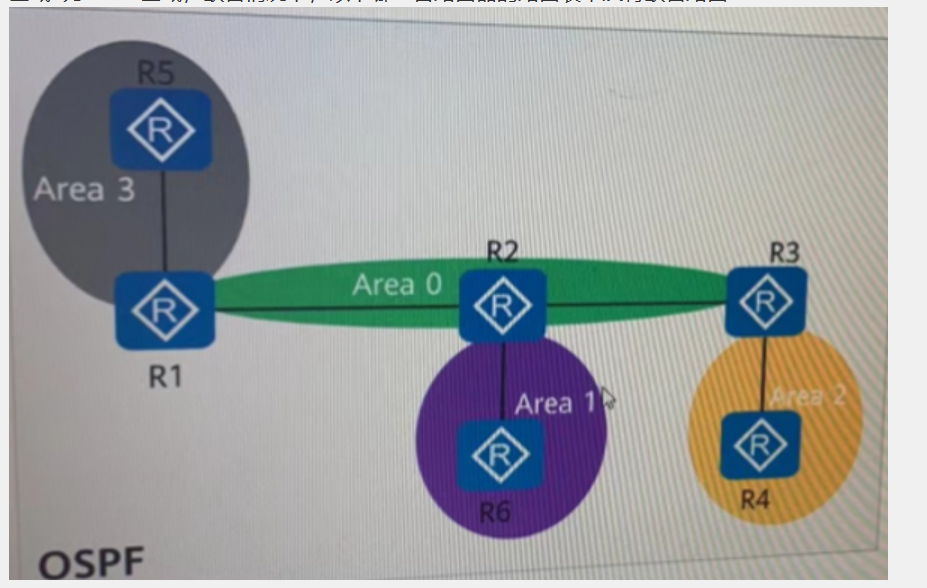

4.  网络工程师发现组播客户端无法正确的接收组播数据，因此怀疑组播服务器设置的组地址不正确，请问组地址不能为以下哪一项

224.0.0.1

5.  当设备出现异常或故障时，设备将会产生多种信息，根据信息的严重等级或紧急程度，信息分为8个等级，以下哪一种严重等级最高？

Warning

6.  如图所示网络中，管理员先完成了如选项所示的路由配置，然后在R1-R3所有设备和互联接口上使能MPLS和LDP功能，从而实现PC1访问PC2的流量在网络中基于MPLS转发。那么以下哪一选项的路由配置，可以实现该功能

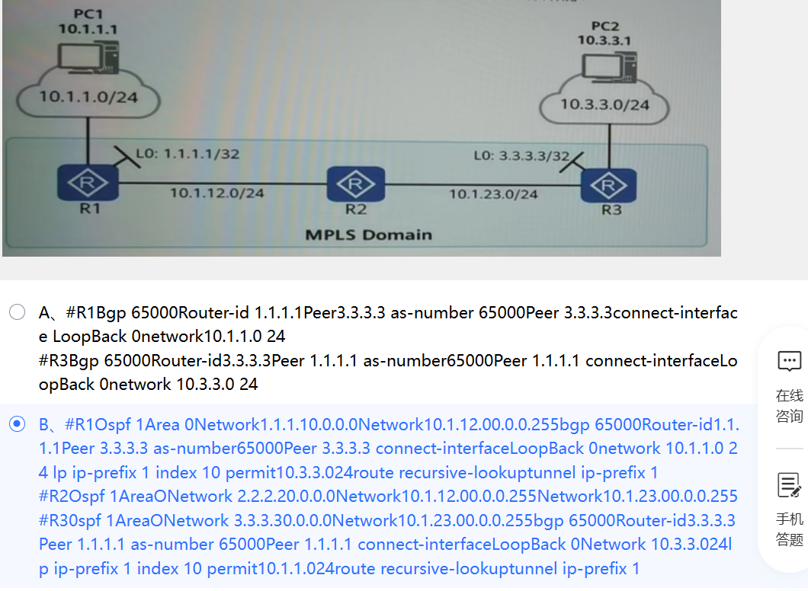

7.  在MPLS网络中，当Transit设备收到MPLS报文准备进行标签交换时，发现交换后的标签值为0，那么此时它会执行以下哪一项操作？

将标签O与MPLS报文中的原始标签交换，并将该报文转发给下一跳

8.  当组网发生变化时，DHCPSnooping绑定表不会立即老化，因此需要手动清除，那么管理员可以采用以下哪一条命令清除DHSPsnoopine绑定表？

reset dhcp snooping user-bind ip-address

9.  VLAN聚合可以实现在一个物理网络内，用多个Sub-VLAN隔离广播域，并将这些Sub-VLA聚合成一个逻辑的Super-VLA。那么以下关于VLAN聚合的描述，正确的是哪一项

若在Super-VLAN所属VLANIF接口下开启ProxyARP，则可使所有Sub-VLAN建立相应的ARP

15.如图所示的0SPFv3网络，区域1为NSSA区域。R1将外部路由2000:1/128引I入0SPFv3。缺省情况下，区域1中不存在以下哪一种类型的LSA?

AS-Externa1-LSA

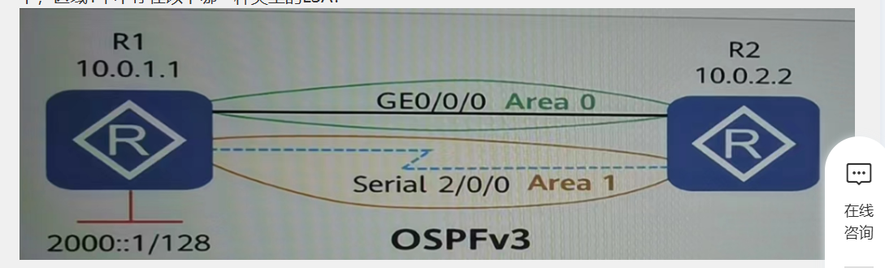

16.如图所示的网络，R1、R2、R3之间运行OSPF协议，R1和R3之间使用Loopback接口建立IBGP邻居关系，假如将R2的GEO/0/1接口通过"undo network x.x.x.x y.y.y.y”命令关闭OSPF，在R1上查看BGP邻居关系，缺省情况下，R1BGP邻居关系由UP状态变为Down状态的最长时间为以下哪一项

180s

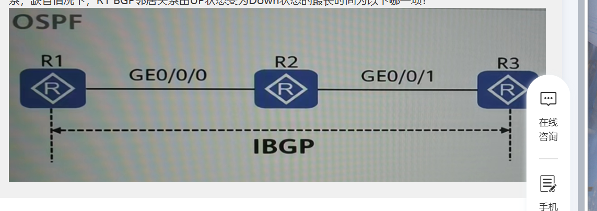

1.  OSPFHello报文中不包括以下哪一项？

Process ID

2.  如果某一台OSPF路由器被设置为Stub路由器，则该路由器发出的LSA中链路度量值为以下哪一项？

65535

3.  缺省情况下，IS-IS路由的开销类型为narrow模式，该模式下路由开销值的最大值为以下哪一项？

63

4.  如图所示的网络，网络工程师发现PC1和PC2互通的路径非最优路径，每条链路的cost值相同，据此分析，交换机的优先级可能是以下哪一项？

SW1 0:SW2 32768:SW3 8192:SW4 4096

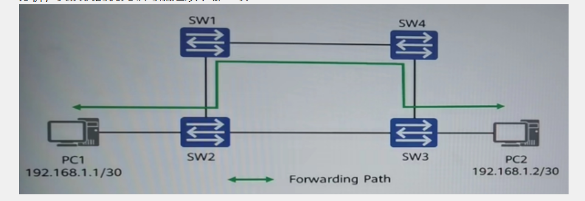

21.网络设备出现以下哪一故障时，网络设备会通过SNMP向网络管理服务器上报OID为1.3.6.1.4.1.201 1.5.25.155.31.3(节点名称为hwOspfv2IntraAreaRouteridConflict)的告整信息?

OSPF在区域内检测到路由器标识冲突

22.在采用LDP建立LSP的MPLS网络中，当发送标签请求的Ingress节点的直连下游Transit节点，只有收到最终下游Eeress节点的标签映射消息才会向Ingress分发标签，那么此时采用的标签发布方式和标签分配控制方式的组合是以下哪一项

DoD + Ordered

1.  R1和R2使用直连接口建立EBGP邻居关系，R1将2000:1/128引I入BGP。缺省情况下，R2到达2000:1/128的下一跳为以下哪一项?

2000:12:1

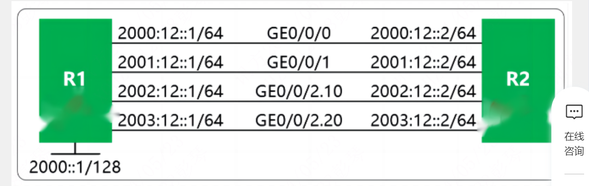

2.  在某Hub&Spoke组网中，VPN1的路由传递路径如图所示，那么Hub-PE将VPN1路由转发给SpokePE2时，携带的As_Path为以下哪一项?

AS_Path为空

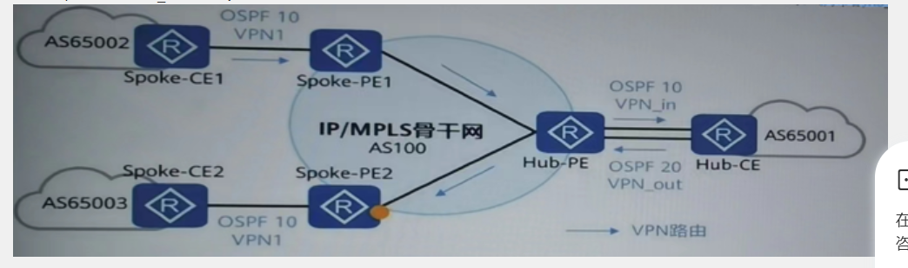

3.  某交换机的输出信息如图所示，从该信息中可以判断出以下哪一项内容？

GEO/0/1口对广播报文进行阻塞后，只有当广播报文的平均速率小于1000pps时才会被正常转发

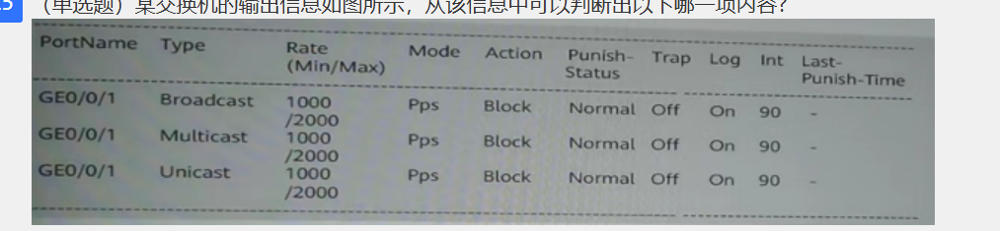

4.  如图所示的OSPFv3网络，区域1为Stub区域，区域2为普通区域，区域3为NSSA区域.R6Loopbacl0接口的IPv6地址为2000:6/128，每一台设备的RouterID为10.0.X.X.其中X为设备的编号.以下描述错误的是明—项？

R6LSDB中存在R3生成的描述2000:6/128的Inter-Area-Prefix-LSA

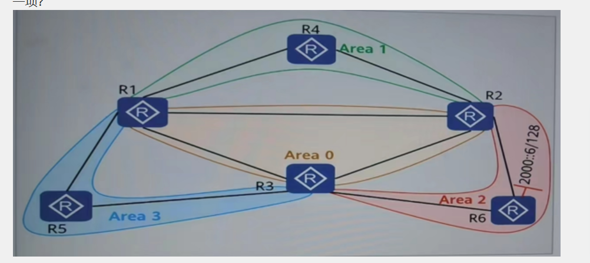

5.  如图所示的IS-ISIPv6网络，所有路由器均开启多拓扑功能.R4Loopback0接口的1Pv6地址为2000:4/128.在R2IS-IS进程中配置“ipv6summary2000:64level-1-2”。缺省情况下，以下描述错误的是哪一项？

R2路由表中有2000：/64的路由条目

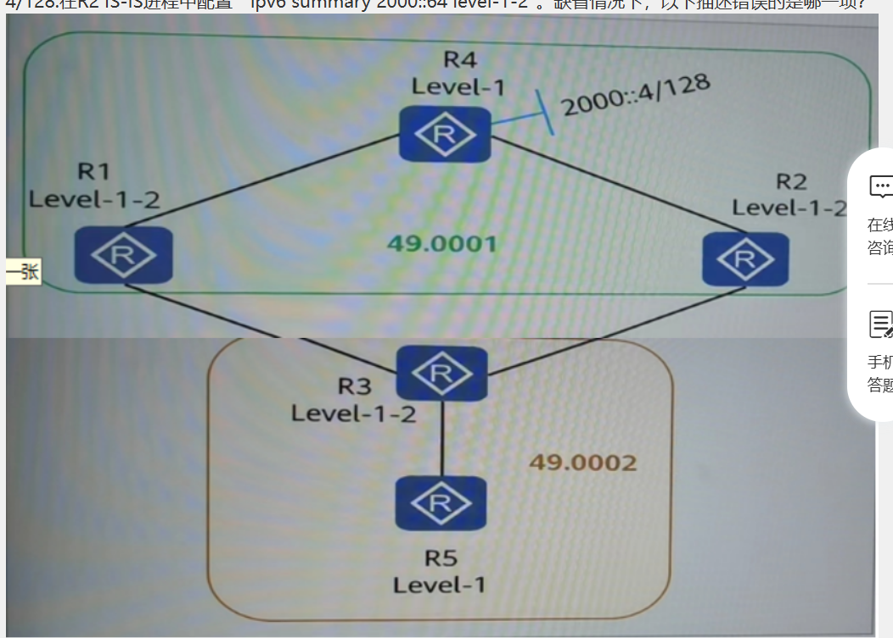

28.为了支持IPv6路由的处理和计算，IS-IS在129号1LV中新增了一个NLPID。NLPID是标识网络层协议报文的一个8比特字段，IPV6的MLPID值为以下哪一项？

142

29.如图所示的OSPFv3网络，路由器之间使用以太网链路互联。缺省情况下，该网络中DR的数量为以下哪一项？

9

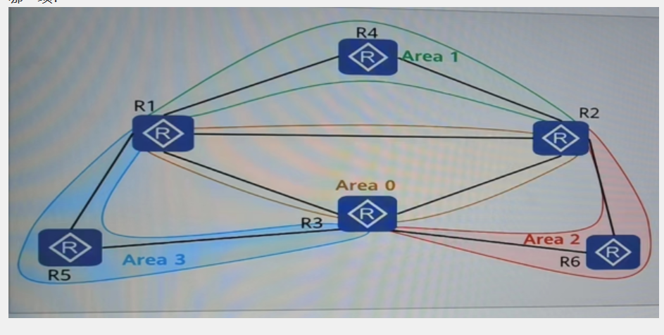

1.  图所示的0SPFv3网络，区域1为NSSA区域。R1将外部路由2000:1/128引I入0SPFv3。缺省情况下，区域1中不存在以下哪一种类型的LSA?

AS-External-LSA

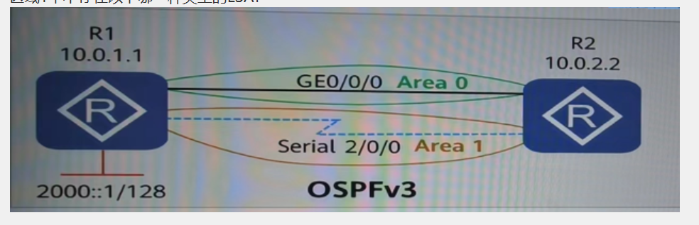

2.  R1和R2之间运行0SPFv3，接口配置的IPv6地址已在图中标出。R1的RouterlD为10.0.1.1，R2的RoutexID为10.0.2.2。缺省情况下，以下描述正确的是哪一项?

R2生成的Intra-Area-Prefix-LSA将会描述4个前缀

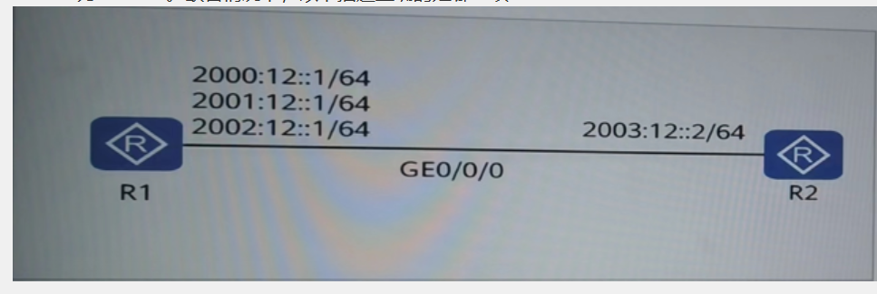

3.  R4的RouterID为10.0.4.4，在R4的LSDB中看到如图所示的LSA，网络工程师根据该LSA做出以下推断，其中错误的是哪一项？

R4不支持将外部路由引入OSPFv3

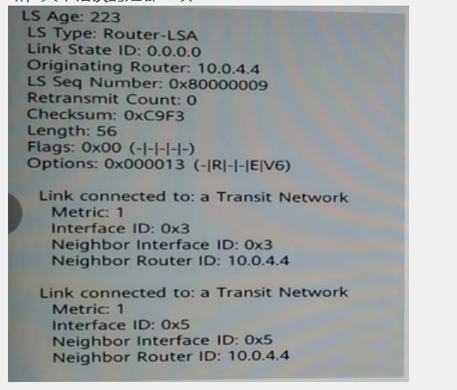

4.  如图所示的网络，相令的路由器之间使用直连接口建立EBGP邻居关系。每台设备的RouterID为10.0.XX，AS号为6500x，其中X为路由器的编号。R1和R4均有到达192.168.1.0/24的静态路由，通过import方式引入BGP。缺省情况下，R6收到的关于192.168.1.0/24的路由中，As_pat的长度最长为以下哪一项？

3

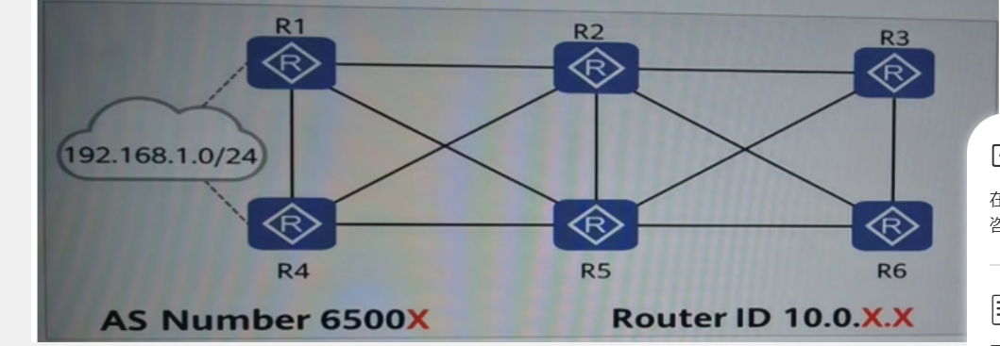

5.  如图所示的OSPF网络，区域1是NSSA区域，区域2是普通区域，R4引I入外部路由10.0.4.4/32。每台设备的RouterID为10.0.x.x，其中x为设备的编号。在R1和R3的OSPF进程中均配置了"asbr-summary10.04.0255.255.255.0”命令，以下描述中正确的是哪一项?

R1路由表中有10.0.4.0/24的路由条目

35.网络工程师需要撰写一份设备升级指导书，在该指导书中需要包括以下哪些内容？

全选

6.  在如图所示的BGP/MPLSIPVPN网络中，以下哪些RT值的规划可以实现Site1和Site2均能与Site3互访?

PE1:1RT=100:1;ERT=100:1

PE2:IRT=100:1;ERT=100:1

PE3:IRT=100:1;ERT=100:1；

PE1:IRT=100:1;ERT=100:1

PE2:IRT=200:1;ERT=200:1

PE3:1RT=100:1,200:1;ERT=100:1,200:1；

PE1:IRT=100:1;ERT=200:1

PE2:IRT=100:1;ERT=200:1

PE3:IRT=200:1; ERT=100:1

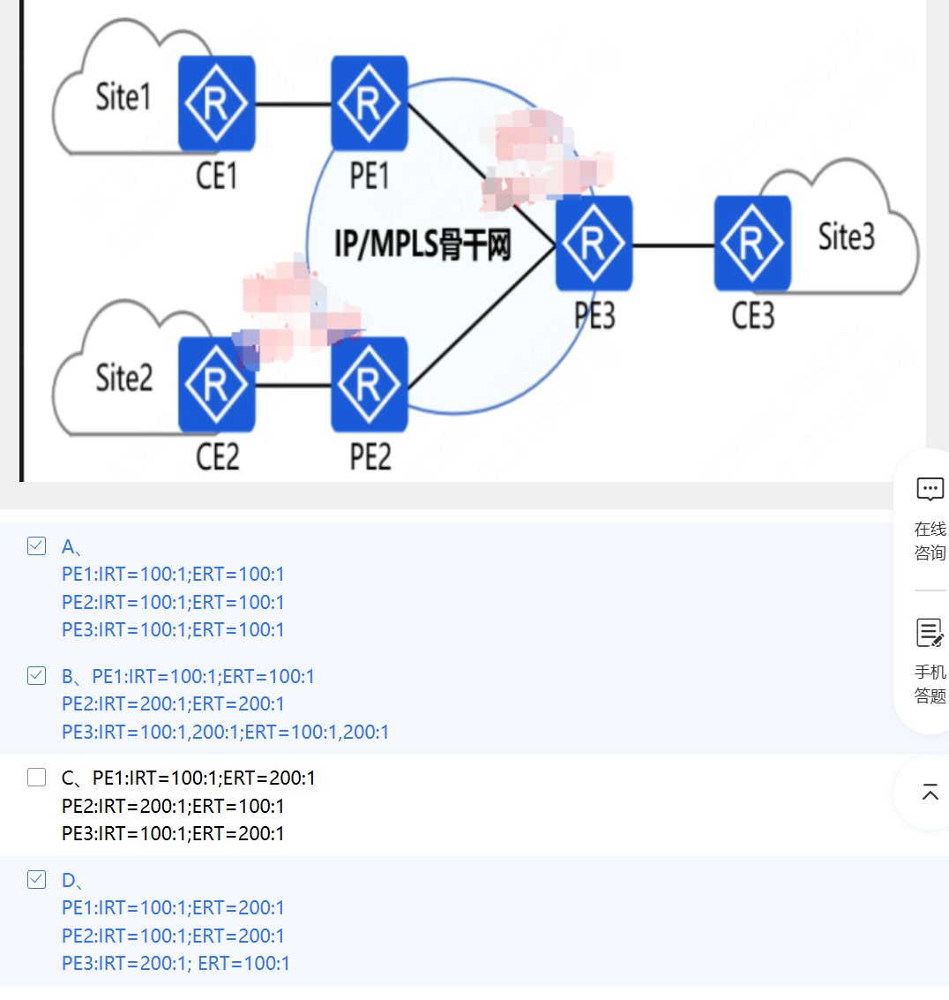

7.  某一个割接项目的网络逻辑架构如图所示，割接目的是在R2和R3之间扩容一台网络设备R4。R1、R2、R3的RouterlD分别为10.0.1.1、10.0.2.2、10.0.3.3。网络设备之间运行的是OSPF协议。当物理网络连接后，在执行割接操作时，网络工程师首先错误的将R3的备份配置导入了R4，基于此场景，以下描述正确的有哪些项？

在R2的LSDB中，能看到R4生成的LSA

在R1的LSDB中，能看到R3生成的LSA

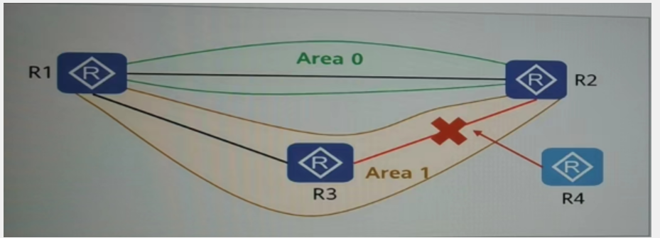

38.网络工程师在处理故障后撰写了故障处理报告，他把实际组网简化为如图所示的网络。R1和R2均开启OSPF协议，且分别作为PC1和PC2的网关，以下描述正确的有哪些项？

全选

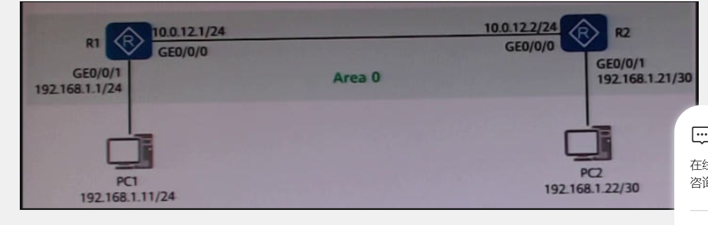

1.  如图所示的OSPF网络，R1和R2通过OSPF实现LoopbackO接口互通。同时，R1和R2开启了MPLSLDP功能，LDP传输地址为LoopbackO接口的IP地址，网络工程师发现R1和R2无法建立LDPSession，于是首先在R2上执行了如图所示的命令，在此基础上，请问以下哪些原因可能会导致R1和R2LDPSession无法建立？

R2GEO/O/1接口拒绝接收TCP目的端口为646的报文

R2GEO/O/1接口没有使能MPLSLDP

R1GEO/O/1接口拒绝接收UDP目的端口为646的报文

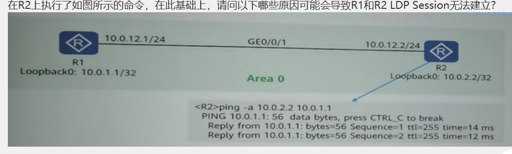

40.以下哪些信息既能通过观察设备指示灯判断，又能通过命令行的方式查看？

单板运行状态

链路连通性

41.设备运行环境正常是保证设备正常运行的前提。在进行设备运行环境检查时，需要检查以下哪些内容？

温度

供电

湿度

1.  如图所示，R1\~R4是AS123中的4台路由器，它们都运行了OSPF，实现了AS内部的路由互通，其中10.1.1.0/24和10.4.4.0/24两个网段没有被发布到OSPF中。现在，R1与R4基于Loopback0接口建立了IBGP对等体关系，并且分别将10.1.1.0/24和10.44.0/24网段发布到BGP中。那么以下哪些方式可以实现PC1与PC2互访?

在R2和R3上运行BGP，并在AS123中建立IBGP全互联

在R1\~R4上激活MPLS及LDP，建立路由1.1.1.1/32和4.4.4.4/32的LSP

在R1和R4上，分别将10.1.1.0/24和10.4.4.0/24路由引I入OSPF

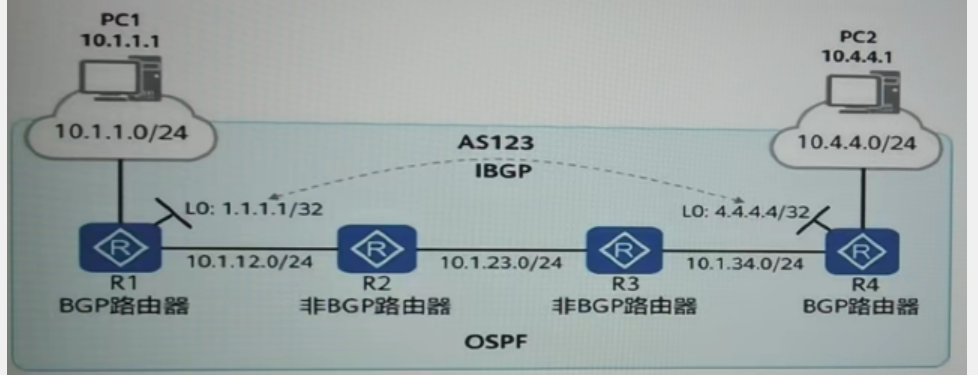

43.当VPN流量在典型的BGP/MPLSIPVPN网络中传递时，通常包含两层标签，那么以下关于这两层标签的描述，错误的有哪些项?

内层和外层标签均由LDP分发，用于VPN流量的端到端传递

外层标签由MP-BGP分发，用于指导报文在远端PE设备找到对应的CE设备

内层标签由MP-BGP分发，对端CE设备会通过BGPUpdate报文将内层标签传递到本端CE

44.某企业网络如图所示，其中CE与PE间通过部署EBGP互通，此时CE1向PE1传递了一条私网路由。那么以下对该场景的分析，错误的有哪些项？

若在PE1上配置命令peer10.1.1.1soo 200:1和peer10.1.2.1soo200:1,CE2将接收该路由

若要CE3成功接收该路由，需在PE1上配置命令peer10.1.1.1soo200:1

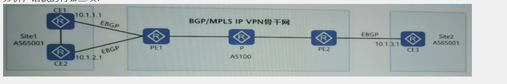

1.  某交换机接口配置如下所示，当该接口接收到的广播报文的平均速率为以下哪些项时，会被执行风暴控制动作？

8500 ppS

9000 pps

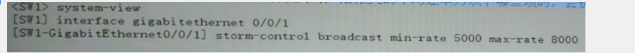

2.  以下关于OSPFv3的描述，正确的有哪些项？

OSPFv3的RouterLSA和NetworkLSA里不包含IP地址

广播、NBMA及P2MP网络中，邻居不再由IP地址标识，只由RouterID标识

OSPFv3的LSA报文里添加了LSA的泛洪范围

3.  如图所示的网络，R2、R6、R3之间运行IS-ISIPv6，R6Looback0接口的IPv6地址为2000:6/128。其它链路均运行0SPFv3，区域1为Stub区域，区域2为NSSA区域。在R2和R3上将IS-IS路由引I入OSPFv3，以下描述错误的有哪些项?

全选

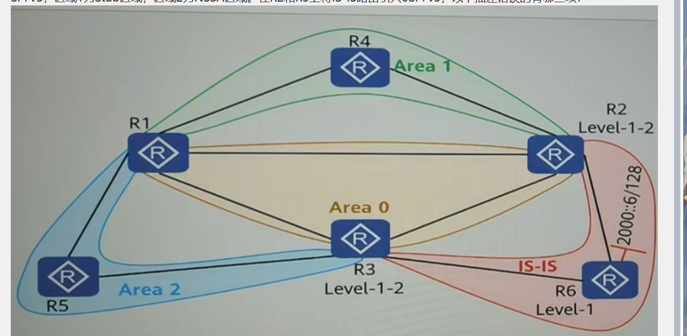

48.某台BGP路由器收到一条BGP路由，其携带的AS_Path属性为“100200300”。如果该路由器想要拒绝这条路由，可

以使用以下哪些as-path-filter?

ip as-path-filter I deny.\*

ip as-path-filter l deny OO\$

49.如图所示的IS-IS网络，R1通过“default-route-advertise a1waysleve1-1”命令引入了缺省路由，以下描述中正确的有哪些项？

10.0.1.1可以ping通10.0.2.2

10.0.2.2可以ping通10.0.3.3

10.0.12.2可以ping通10.0.3.3

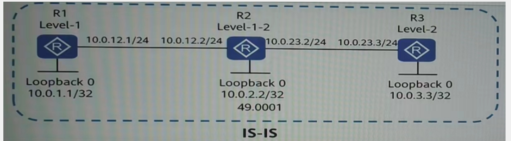

50.如图所示的IS-IS网络，R1通过"default-route-advertise always level-1命令引I入了缺省路由，R2通过”default-route advertise always level-2” 命 令 引 入 了 缺 省 路 由 以 下 哪 些路由器的路由表中存在缺省路由？

全选

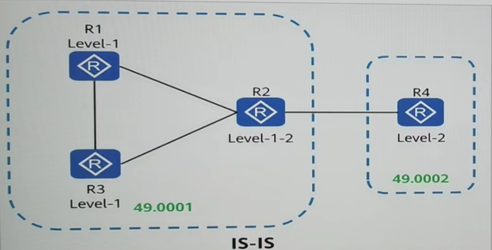

1.  华为NetEngineAR系列路由器作为FTP客户端登录FTP服务器（FTP服务器开启所有权限），可以执行以下哪些操作？

全选

2.  设备产生的信息可以向控制台、远程终端、Log缓冲区、日志文件、SNMP代理等方向输出信息。缺省情况下，以下哪些输出方向可接收Trap信息？

全选

3.  在如图所示场景，若想实现后门链路作为备份链路，可采用ShamLink功能，那么以下关于shamLInk的描述，错误的有哪些项？

ShamLink需要管理员在PE设备的普通OSPF进程的区域视图中键入命令sham-1ink建立

ShamLink相当于在两台PE之间建立了一条OSPF区域内链路，保证VPN流量优先经过Backdoor链路

建立ShamLink后，在其上泛洪的LSA均会被转换为Type3LSA

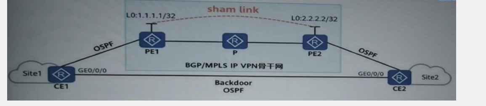

4.  在BGP/MPLSIPVPN网络中，某PE设备VPN1的输出信息如图所示，当VPN1对应的VPN4路由被通告给远端PE时，对端PE的哪些VPN会接收该路由？

VPN3:1mport RT=100:1, 300:1

VPN1:lmport RT=100:1

VPN2:1mport RT=200:1, 400:1

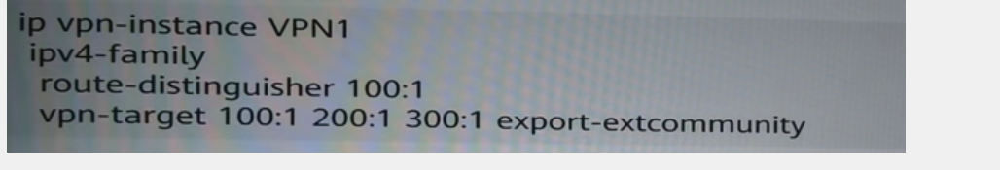

55.管理员在使能设备GEO/O/1接口的MPLSLDP功能时，必须配置以下哪些命令？

全选

56.如图所示的0SPFv3网络，区域1为NSSA区域。R1将外部路由2000:1/128引I入0SPFv3。缺省情况下，以下描述正确的有哪些项？

R1和R2路由表中均没有缺省路由

R1将生成描述2000:1/128的AS-External-LSA

R1将生成描述2000:1/128的NSSA LSA

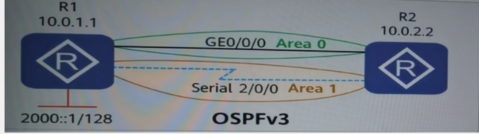

57.如图所示的0SPFv3网络，区域1为Stub区域，区域2为普通区域，区域3为NSSA区域.R5Loopback0接口的1Pv6地址为2000:5/128，通过import方式引I入OSPFv3.每一台设备的RouterID为10.0.X.X.其中X为设备的编号。以下描述正确的有哪些项？

R2会在区域O生成Inter-Area-Router-LSA

R3会生成AS-Externa1-LSA

R2会在区域2生成Inter-Area-Router-LSA

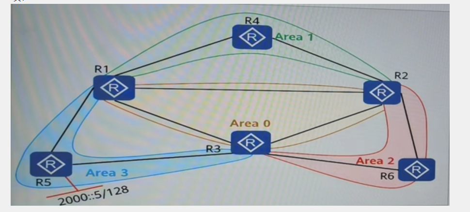

1.  如图所示的网络，R1、R2、R4、R5运行IS-IS，区域号为49.0001。R3、R6运行IS-IS，区域号为49.0002。在AS 65000内部，R1、R3、R4、R6均与R2、R5建立IBGP邻居关系，其中R2、R5是RR，R1、R4、R3、R6是客户端。IBGP邻居关系均使用Loopback0接口建立。每台设备的Loopback0接口的IP地址为10.0.X.X/32，RouterID为10.0.X.X，其中X为设备的编号。R1和R4将外部网络192.168.1.0/24通过import方式引I入BGP，R3和R6通过import方式将外部网络192.168.2.0/24引I入BGP。缺省情况下，以下描述正确的有哪些项？

全选

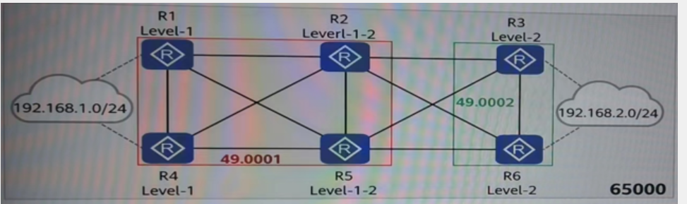

2.  如图所示的网络，R1、R2、R4、R5运行IS-IS，区域号为49.0001。R3、R6运行IS-IS，区域号为49.0002。在AS65000内部，R1、R3、R4、R6检资标记(E均与R2、R5建立IBGP邻居关系，其中R2、R5是RR，R1、R4、R3、R6是客户端。IBGP邻居关系均使用Loopback0接口建立。每台设备的Loopback0接口的IP地址为10.0.X.X/32,RouterlD为10.0.X.X，其中X为设备的编号。R1和R4将外部网络192.168.1.0/24通过import方式引I入BGP，R3和R6通过import方式将外部网络192.168.2.0/24引I入BGP。缺省情况下，以下描述正确的有哪些项？

针对于192.168.1.0/24,R2优选的BGP路由携带的OriginatorID属性为10.0.1.1

针对于192.168.1.0/24,R6优选的BGP路由携带的Originator_1D属性为10.0.1.1

针对于192.168.1.0/24,R5优选从R1接收的路由

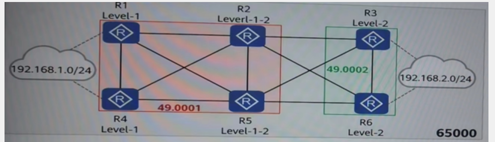

3.  如图所示的OSPF网络，区域1是NSSA区域，区域2是普通区域，R4引I入外部路由10.0.4.4/32。每一台设备的RouterlD为10.0.0.X，其中x为设备的编号。在R1和R3的OSPF进程中均配置了"asbr-summary10.0.4.0255.255.255.0”命令，则以下哪些路由器的路由表中有10.0.4.0/24的路由条目

R1

R5

R2

4.  如图所示的组网，R1和R2通过直连接口无法建立EBGP邻居关系，网络工程师首先查看了R1和R2BGP相关的配置，据此判断，R1和R2无法建立EBGP邻居关系的原因是RouterID和接口IP地址不一致，

错误

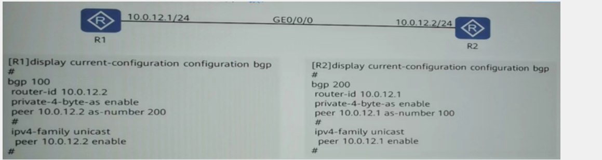

5.  如图所示的网络，R2GEO/O/0接口开启DHCPServer功能，地址池为全局地址池。R1GEO/O/0和GEO/O/1接口作为DHCP客户端，缺省情况下,R1任何一个接口都不能获取IP地址。

正确

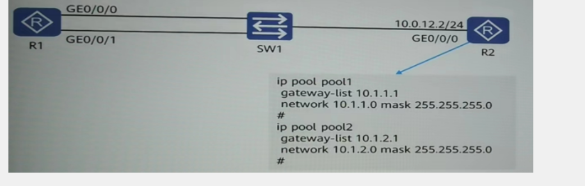

6.  MP-BGP通过新增路径属性MP_REACH_NLRI，在BGP/MPLSIPVPN网络中发布VPNv4路由信息或撤销不可达路由。

错误

7.  在BGP/MPLSIPVPN网络中，为了保留引I入的OSPF路由信息，BGP在MP_REACH_MLRI属性中携带DomainID来标识和区分不同的OSPF域。

错误

8.  两台设备间已建立好LDP会话，此时管理员修改了一台设备的传输地址，它会导致LDP会话中断，从而造成业务中断。

正确

9.  MPLS根据数据的转发方向确定上、下游关系，MPLS标签报文从上游LSR发出，被下游LSR接收并处理；同理，MPLS标签的发布也是从上游向下游逐个分配

错误

10. 使能了DHCPSnooping的设备根据DHCP客户端发送的DHCP请求报文信息会生成DHCPSnoopine绑定表，从而实现后续报文的匹配检查，防范非法用户的攻击。

错误

11. 某企业网络工程师想通过部署VLAN聚合和MUXVLAN实现节约IP地址，并隔离二层互访，那么同时为了节省VLAN资原，该工程师可以将SuperVLAN和MUXVLAN设置为同一VLANID。

错误

12. 为了保证BGP协议免受攻击，可以在BGP邻居之间使用MD5认证来降低被攻击的可能性。MD5算法配置简单，配置后生成单一密码，需要人为干预才可以更换密码。

正确

13. 如图所示的OSPFv3网络，R1、R2、R3互联的端口开启OSPFv3，每一台设备的RouterlD为10.0.X.X,其中X为设备的编号。在R3上查看某一条LSA的详细信息，从输出信息中可以推断出该LSA是由R2生成，并且它描述的是与Network-LSA相关联的IPv6前缀地址

正确

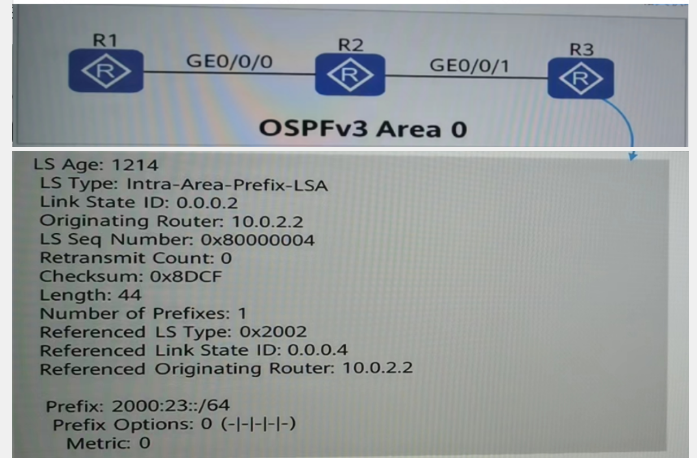

14. 一般大型的、重要的割接项目，都要求在实验室内搭建环境进行提前验证，这种方式被称为实验局测试。实验局测试成功代表割接方案可行，无需再约客户进行评审

错误

15. 如图所示的OSPFv3网络，区域1为普通区域。R2会生成Inter-Area-Prefix-LSA，用于描述区域内某个IPv6地址前缀的路由，区域O和区域1中都存在这种类型的LSA。

正确

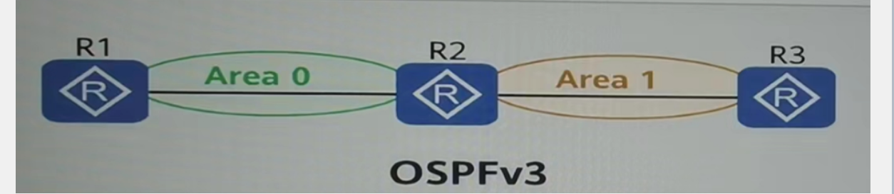

73.AS-path属性是BGP协议的私有属性，"if-matchas-path-filter"命令仅对BGP路由有效。

正确

74.为防止攻击者伪造BGP报文对设备进行攻击，可以通过配置GTS功能检测IP报文头中的TTL值的范围来对设备进行保护。如果某台设备配置了"peer x.x.x.x valid-ttl-hops100”，则被检测的报文的TTL值有效范围为[155，255].

错误

1.  高级ACL根据源IP地址、目的IP地址、IP协议类型、TCP源/目的端口、UDP源/目的端口号等信息来定义规则，使用路由策略调用高级ACL可以实现BGP路由控制

错误

2.  在网络相对稳定、对路由收敛时间要求较高的组网环境中，可以指定OSPFLSA的更新时间间隔为0来取消LSA的更新时间间隔，使得拓扑或者路由的变化可以立即通过LSA发布到网络中，从而加快网络中路由的收速度。

正确

3.  OSPF支持等价负载分担，当组网中存在的等价路由数量大于maximmnload-balancing命令配置的等价路由数量时，如果接口的优先级和接口索引都相同，则负载分担选取下一跳IP地址小的路由。

错误

4.  当增加了新特性或者需要对原有性能进行优化，以及解决当前运行版本的问题时，需要对设备进行升级。此时需要加载高版本的系统软件，并重新启动设备来实现。华为NetEngineAR系列的设备使用相同的软件包，例如AR6120、AR6280、AR6000V。

错误

5.  般大型的、重要的割接项目，都要求在实验室内搭建环境进行提前验证，这种方式被称为实验局测试。实验局测试成功代表割接方案可行，无需再约客户进行评审

错误

6.  当网络设备的硬件发生故障时，通常可以采用替换法，例如更换光模块、更换单板、更换电源模块等，在执行以上操作时，需要佩戴防静电腕带。

正确

81.为了保证BGP协议免受攻击，可以在BGP邻居之间使用Keychain认证来降低被攻击的可能性。其中keychain具有一组密码，可以根据配置自动切换，适用于对安全性能要求比较高的网络。

正确

82.网络维护可以分为两类：日常维护和故障排除。如果维护人员技术水平高，他就可以根据经验维护网络，无需遵循操作见范。

错误

83.如图所示的网络，R1和R2互联接口规划的IP地址已在图中标出，但R1和R2无法Ping通，因此网络工程师查看R1和R2接口的配置，根据配置信息判断，R2接口掩码配置错误是导致该故障的原因，

错误

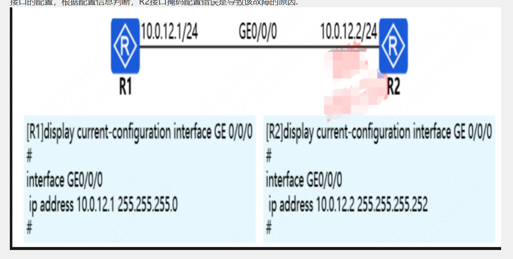

84.当网络中短时间内出现大量MAC地址漂移现象，一般是因为网络中存在环路，可以通过STP生成树协议消除二层环路。

正确

1.  在CE多归属场景，若PE使能了BGP的AS号替换功能，还可以配置SOO特性来避免环路，即在PE与CE的EBGP对等体通过命令peersoo使能该特性。

正确

2.  在BGP/MPLSIPVPN网络中，为了保留引I入的OSPF路由信息，BGP在MP_REACH_NLRI属性中携带DomainID来标识和区分不同的OSPF域

错误

3.  某企业网络如图所示，若CE2双归属PE2和PE3，有可能产生Type3LSA路由环路，可以通过在PE2和PE3设备上设置dn-bit-set disable命令来进行防环。

错误

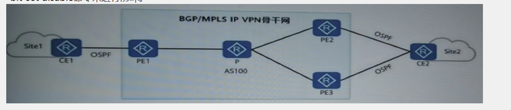

4.  在BGP/MPLSIPVPN网络中，两个站点的CE设备之间需建立MP-EBGP对等体关系，从而实现VPN路由端到端的传递.

错误

89.在配置VLAN聚合时，将Sub-VLAN加入Super-VLAN之前，必须删除该Sub-VLAN对应的VLANIF接口。

正确

90.如果交换机连接的用户变动比较频繁，可以通过端口安全把动态MAC地址转换为StickyMAC地址。这样可以在用户变动时，通过表项老化及时清除绑定的旧MAC地址表项。

错误

1.  BGP/MPLS IPVPN中，如果MCE与PE之间运行OSPF协议，那么当PE将BGP路由引I入OSPF时，缺省情况下，MCE 不会计算 PE 产生的Type5 LSA，只会计算 PE 产生 的Type3 LSA。

错误

2.  如图所示的网络，R2GEO/O/0接口开启DHCPServer功能，地址池为全局地址池。R1GEO/O/0和GEO/O/1接口作为DHCP客户端，缺省情况下，只有一个接口能获取IP地址。

正确

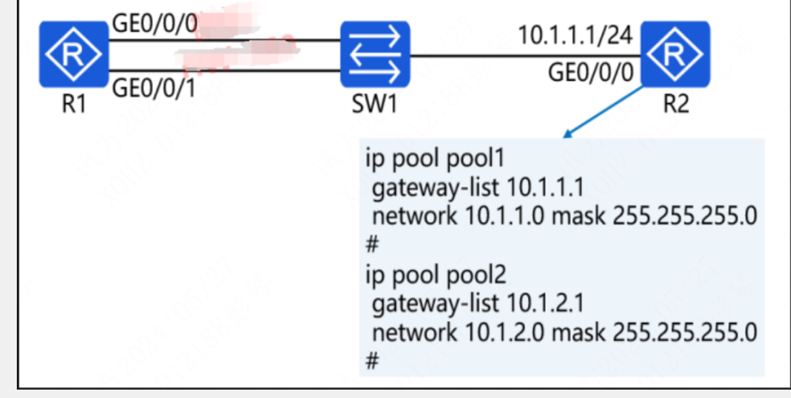

93.display current-configuration linclude10.0.2.\*”命令，可以看到当前配,置中包含“10.0.2”的全部信息。

正确

94.网络管理员在接入交换机上部署IPSG功能来预防IP地址欺骗攻击，那么他需要在交换机的接口视图或（）视图中使能IP报文检查功能。（若填写英文，请所有字母大写）

VLAN

1.  如图所示的0SPFv3网络，R1、R2、R3的RouterlD分别为10.0.1.1、10.0.2.2、10.0.3.3。请根据LSDB信息补全每一条路上的端口号。(Token可重复使用）（答案填写方式左侧从上往下为排序，右侧从上往下排序，答案填写例如：1-1，2-3）

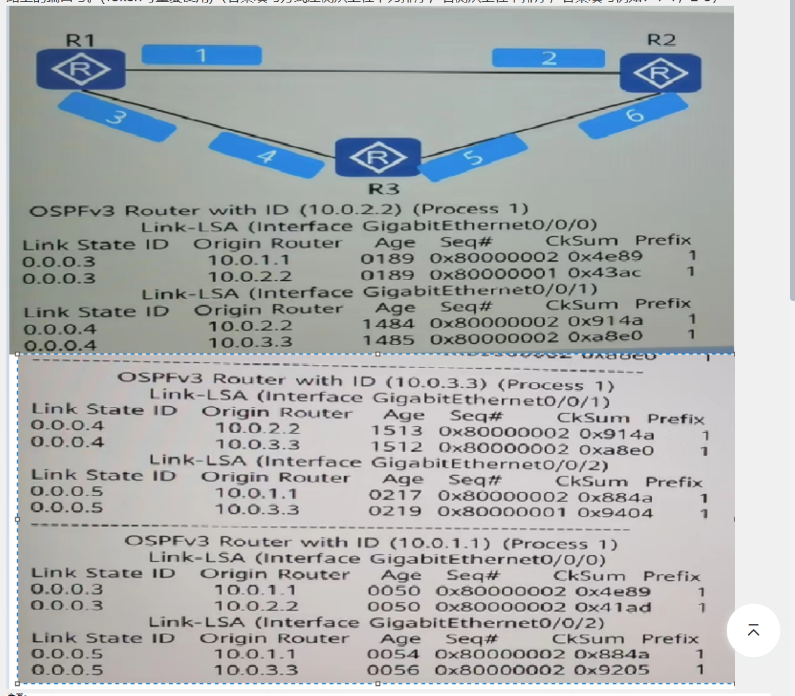

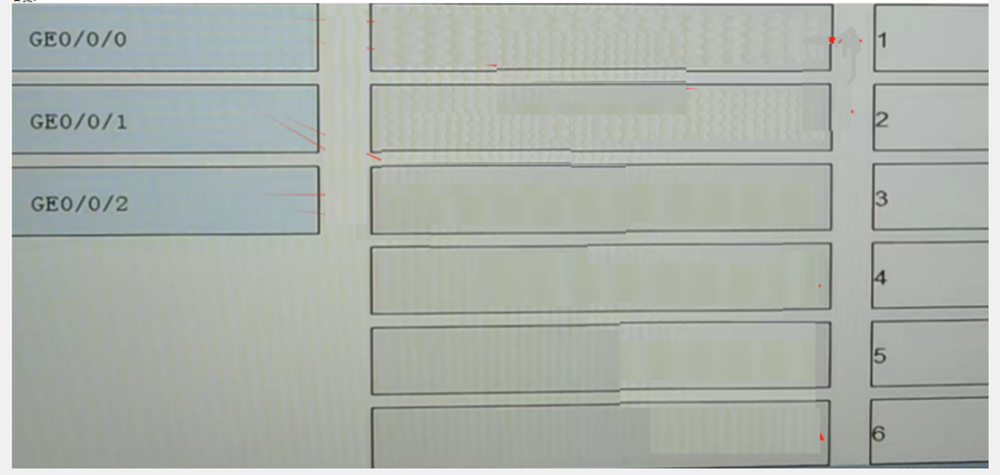

1-1,1-2,2-5,2-6,3-3,3-4

96.为防止攻击者伪造BGP报文对设备进行攻击，可以通过配置GTSM功能检测IP报文头中的TTL值的范围来对设备进行保护。如果某台设备配置了'peerx.x.x.xvalid-ttl-hops100”，则被检测的报文的TTL值有效范围为{（），255}。

156

97.请将IS-IS协议的特性与功能进行匹配。(Token可重复使用）（答案填写方式左侧从上往下为排序，右侧从上往下排序，答案填写例如：1-1，2-3)

1-1,1-2,1-4,2-3

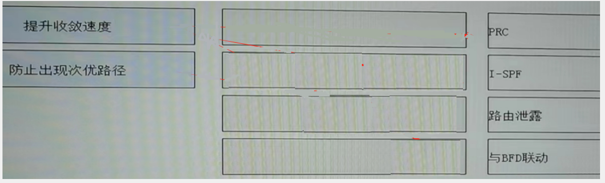

1.  某交换网络中部署了VLAN聚合功能，其中Sub-VLAN 2和Sub-VLAN 3均加入到Super-VLAN10中，若不同Sub-VLAN内的主机想要实现互通，则应在Super-LAN对应的VANIF10接口视图下，输入命令（）inter-sub-vlan-proxyenable。(所有字母小写)

arp-proxy

2.  如图所示的网络，R1、R2、R4、R5运行IS-IS，区域号为49.0001。R3、R6运行IS-IS，区域号为49.002。AS65000内部，R1、R3、R4、R6均与R2、R5建立IBGP邻居关系，其中R2、R5是RR，R1、R4、R3、R6是客户端。R2和R5之间也建立IBGP邻居关系，且配置相同的clusterID，IBGP邻居关系均使用LoopbackO接口建立。每台设备的Loopbacko接口的IP地址为10.0.X.X/32，RouterID为10.0.XX，其中X为设备的编号。R1和R4将外部网络192.168.1.0/24通过import方式引I入BGP。针对于192.168.1.0/24，请根据BGP路由表中有效路由的数量进行匹配。(Token可重复使用）

R1-1；R2-2；R3-2；R4-3；R5-2；R6-2；

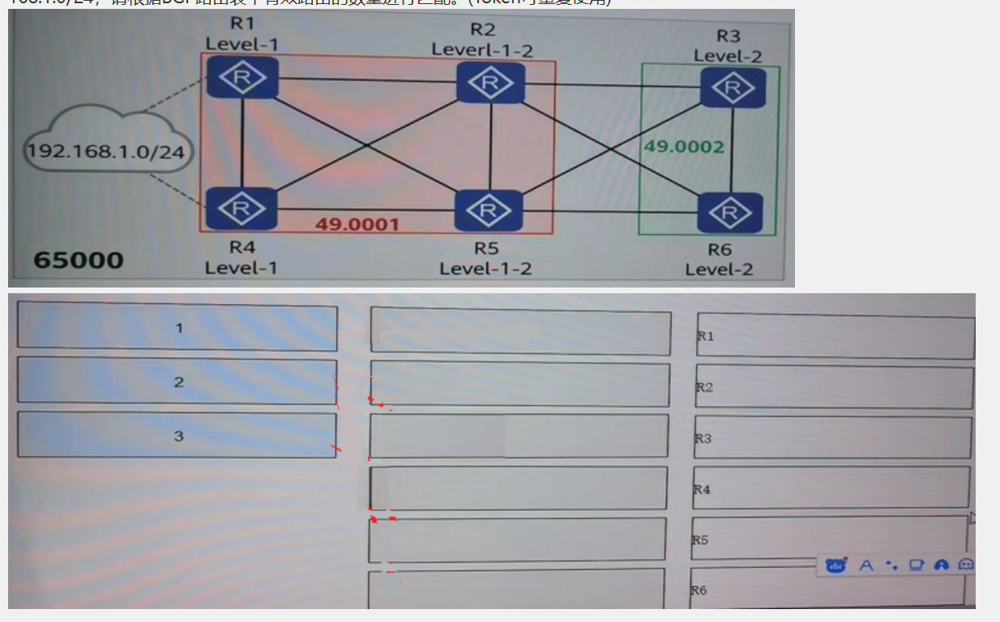

3.  IP报文经过MPLS网络时，MPLS设备会对儿进行处理，若如图所示拓扑采用uniform处理模式，请将报文传输过程中的TIL值进行——对应。

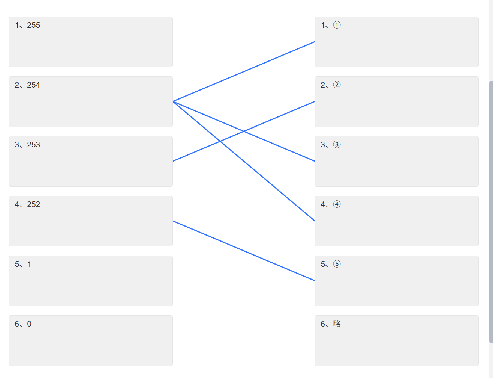

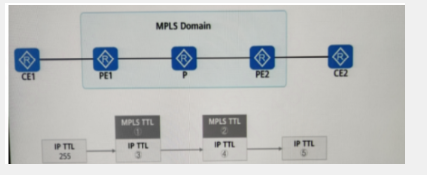

## 831-3

831-3

1 (单选题)某台OSPFv3路由器生成的Link-LSA如图所示,则该接口配置的全球单播地址数量为以下哪一项? :3

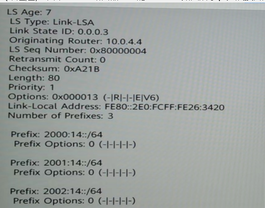

2 (单选题)如图所示的OSPFv3网络,区域1为Stub区域,区域2为普通区域,区域3为NSSA区域,则以下哪一种类型的LSA只会出现在区域2中?:AS-ExteRnal-LSA

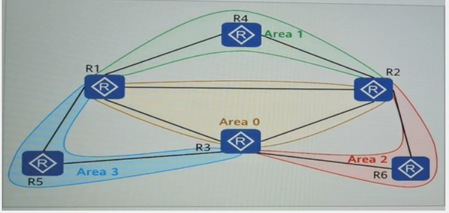

3 (单选题)IP报文经过MPLS网络时,MPLS设备会对TTL进行处理,若如图所示拓扑采用Pipe处理模式,那么IP报文中的TTL值分别为以下哪一项?:1=254, 2=254, 3=253

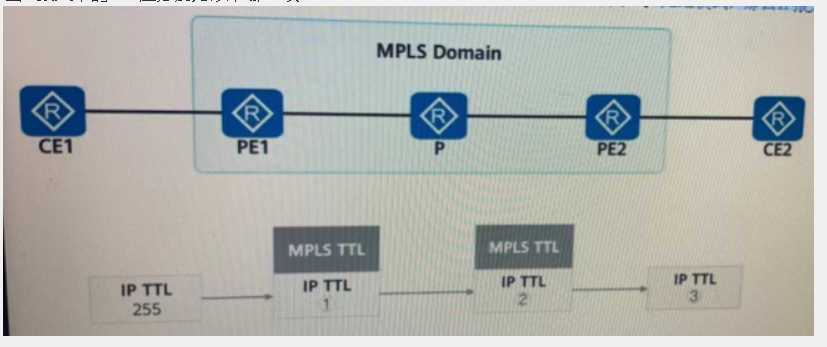

4 (单选题)如图所示,报文在网络中基于MPLS转发,当PE2收到P2发送过来的报文时,此时报文中携带的标签值为以下哪一项?:无标签

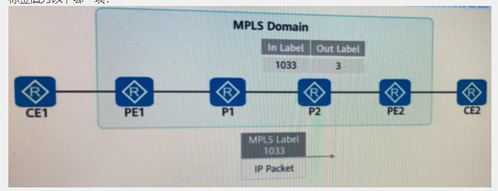

5 (单选题)在BGP/MPLS IP VPN网络中,当CE和PE之间运行以下哪一项路由协议时,PE设备可以不在BGP中执行路由重分发操作?：BGP

6 (单选题)网络工程师使用capture-packet工具抓取接口收到的报文,图中给出了部分输出信息,则该报文为哪一种协议的报文?

:OSPF

7 (单选题)某交换机的输出信息如图所示,从该信息中可以判断出以下哪一项内容?:GEO/0/1口对广播报文进行阻塞后,只有当广播报文的平均速率小于1000pps时才会被正常 转发

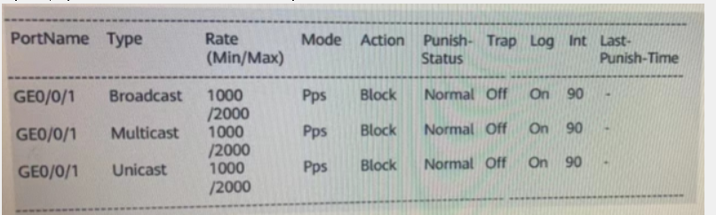

8 (单选题)如图所示的IS-IS IPV6网络,所有路由器均开启多拓扑功能。在R4 IS-IS进程中配置“ipv6 defa ult-route-advertise always leve1-1"。缺省情况下,以下哪一台路由器的路由表中无缺省路由?:R3

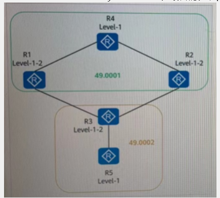

9 (单选题)如图所示的OSPFv3网络,区域1为Stub区域。缺省情况下,以下哪一种类型的LSA只有其中一 台路由器会生成?:Network-LSA

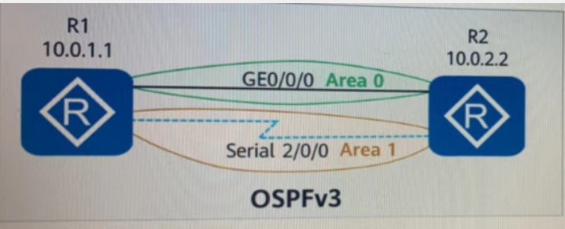

10 (单选题)如图所示的网络,相邻的路由器之间使用直连接口建立EBGP邻居关系,AS号为6500x,其中x 为路由器的编号。R1和R4均有到达192.168.1.0/24的静态路由,通过import方式引入BGP,缺省情况下, 在R3路由表中,到达192.168.1.0/24的路由条目携带的AS Path属性为以下哪一项?:65002,65001

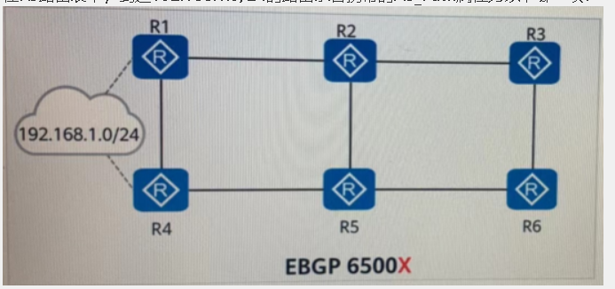

11 (单选题)如图所示的IS-IS网络,R1通过“default-route-advertise a1ways level-1"命令引入了缺省路 由,以下描述中正确的是哪一项? :R2路由表终将会出现缺省路由

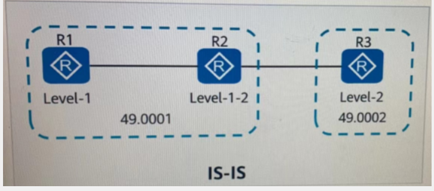

12 (单选题)如图所示的网络,R1、R2、R3之间运行OSPF协议,R1和R3之间使用Loopback接口建立IBGP 邻居关系,并且在BGP进程中开启了BFD功能,BFD参数为“bfd min-tx-interval 1000 min-rx-interval 1 000 detect-multiplier 6",假如将R2的GE0/0/1接口通过“undo network x.x.x.xy.y.yy”命令关闭0S PF,在R1上查看BGP邻居关系,缺省情况下,R1 BGP邻居关系由up状态变为Down状态的最长时间为以下 哪一项?：6s

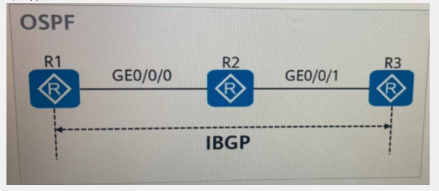

13 (单选题)如图所示的网络,相邻的路由器之间使用直连接口建立EBGP邻居关系。每台设备的RouterlD为 10.0.0.X,AS号为6500x,其中x为路由器的编号。R1和R4均有到达192.168.1.0/24的静态路由,通过impo rt方式引入BGP。R1向邻居发送路由时添加了commnity属性值(1:1),网络中所有路由器均使能了传递团体 属性的能力,以下哪一项可以让R3到达192.168.1.0/24的流量路径必须经过R4? ：在R2上配置路由策略,拒绝接收携带commmity属性值为1:1的路由

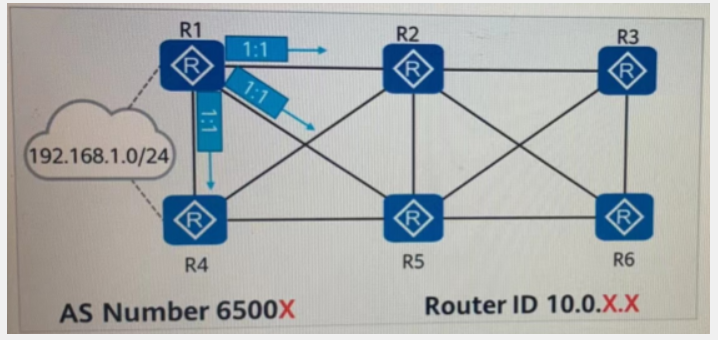

14 (单选题)如图所示的OSPF网络,链路的Cost值已在图中标出,R1开启了OSPF IP FRR,且在OSPF进程 中配置了“maximum load-balancing 8"命令,则在R1路由表中到达10.0.35.0/24的Cost值为以下哪一 项?:20

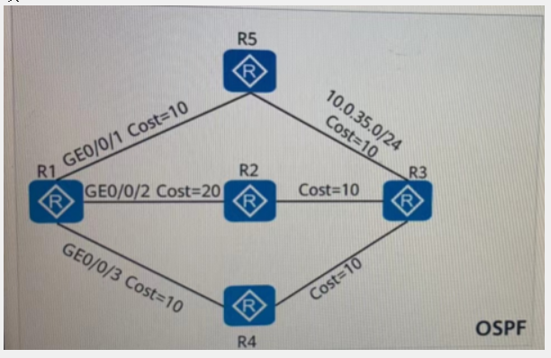

15 (单选题)如图所示的OSPF网络,区域号已在图中标出,其中区域1为普通区域,区域2为Stub区域,区域 3为NSSA区域,假如R5引入了一条外部路由10.0.5.5/32,以下哪台路由器的路由表中不存在10.0.5.5/32 的路由条目?：R4

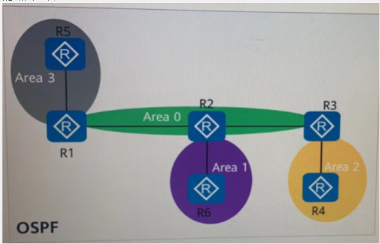

16 92.168.1.0/24 的 流 径 为 以下哪一 项 ? (单选题)如图所示的网络,相邻的路由器之间使用直连接口建立EBGP邻居关系。每台设备的Router ID 为10.0.X.X,AS号为6500X,其中X为路由器的编号。R1和R4均有到达192.168.1.0/24的静态路由,通 过import方式引入BGP。在R2配置了“ageregate192.168.1.0 16 detail-suppresed"命令,则R3到达1 量路:R3-R5-R1

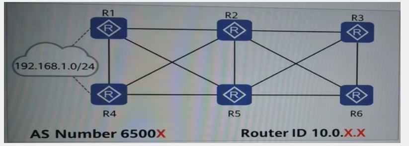

17 (单选题)如图所示的网络,R1和R2之间通过直连接口建立EBGP邻居关系,并且在BGP进程中开启了BFD 功能,BFD参数为“bfd min-tr-interval 1000 min-rx-interval 1000 detect-multiplier 6",假如将R2的 GEO/0/0接口的IP地址删除,在R1上查看BGP邻居关系,则R1 BGP邻居关系由Up状态变为Down状态的最 长时间为以下哪一项?：6s

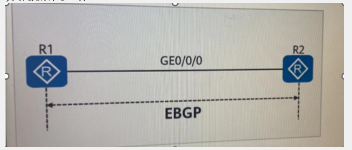

18 (单选题)如果对网络执行的技术迁移动作会影响现网运行业务,则在技术迁移项目实施时需严格地遵循预 先设定的操作流程和风险控制措施,一般将此类项目定义为割接项目。在现网中执行以下哪一操作属于非割 接项目?：批量修改路由器接口的描述信息

19 (单选题)在如图所示的Hub&Spoke组网中,为了实现路由的正确传递,管理员必须在Hub-PE上手工配 置以下哪一条命令?：[Hub-PE-bgp-VPN out] peer x.x.x.x allow-as-loop

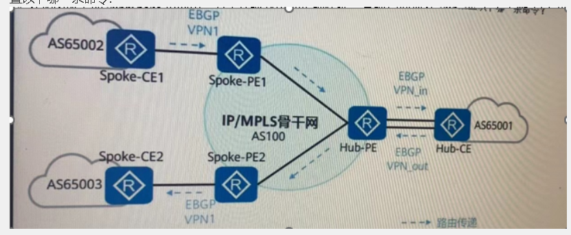

20 (单选题)某一台OSPF路由器的Debug输出信息如图所示,请问该路由器的Router ID为以下哪一项?：10.0.1.1

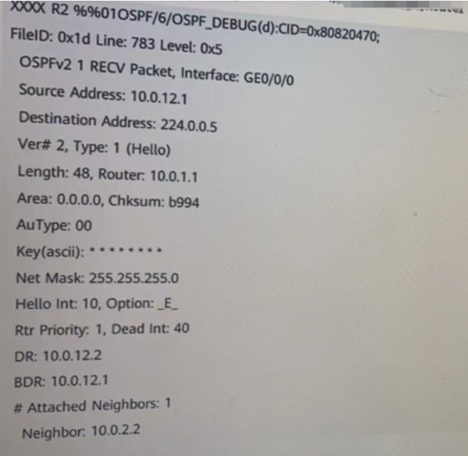

21 (单选题)在某MPLS网络中,R1和R3的LSP信息如图所示,此时管理员在R1上输入命令ping-a 1.1.1.1 3.3.3.3,那么以下关于该场景的描述,正确的是哪一项?： R2收到的Echo Request报文携带标签1025,R2收到的Echo Reply报文携带标签1024

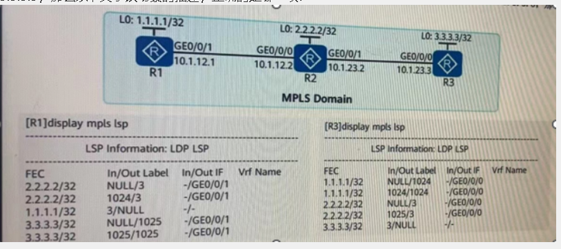

22 (单选题)在BGP/MPLS IP VPN网络中,VPNv4的路由传递会携带RD值,那么MP-BGP是通过以下哪一 个路径属性携带的RD值?：MP_REACH_NLRI

23 (多选题)R2设备上存在如图所示的文件信息,当网络工程师使用“dir\|include 4”命令查看文件信息 时,会看到以下哪些文件?

：dat

、zip

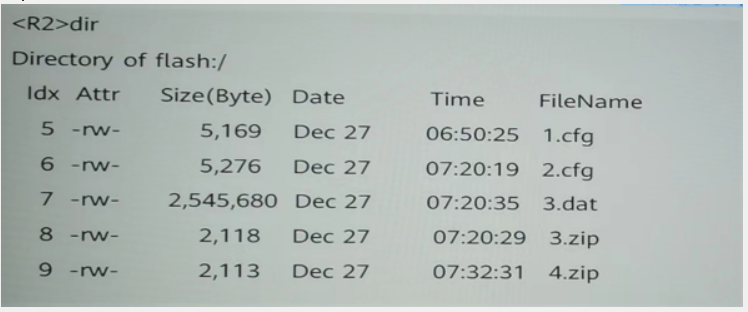

24 (多选题)网络中出现二层环路可能会有以下哪些现象?

： 接口带宽利用率过高

、CPU占用率过高

、设备无法登录或登录后运行缓慢

、业务接口指示灯频繁闪烁

25 (多选题)某一个割接项目的网络逻辑架构如图所示,割接目的是在R2和R3之间扩容一台网络设备R4。网 络设备之间运行的是OSPF协议。当物理网络连接后,在执行割接操作时,网络工程师首先错误的将R3的备 份配置导入了R4,基于此场景,以下描述正确的有哪些项?

：、R1和R2 OSPF邻居关系不受景响

、R1和R3能建立OSPF邻居关系

、R2和R4能建立OSPF邻居关系

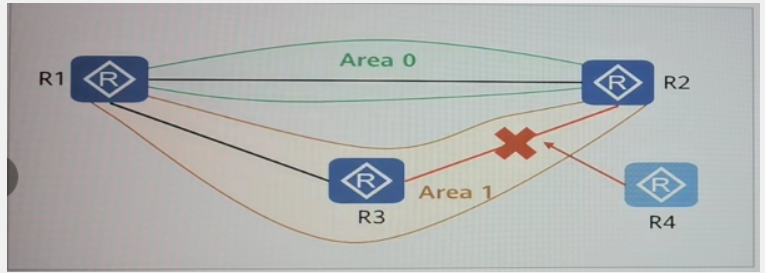

26 (多选题)某一个割接项目的网络逻辑架构如图所示,割接目的是使位于不同地理位置的终端能够互访,终 端的网关部署在PE上。在割接完成后,网络工程师可以采用以下哪些方式,初步判定网络连通性是否正确？

： 、在PE1和PE2上部署NQA检测,目的地址设为对方的IP地址

、在PE1上使用192.168.1.1作为源地址Ping192.168.2.1

、在PE1和PE2上查看路由表中是否有到达对方网段的路由

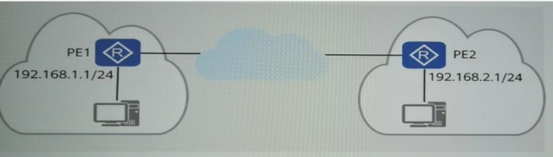

27 (多选题)如图所示的网络,R1、R2、R4、R5运行IS-IS,区域号为49.0001。R3、R6运行IS-IS,区域号 为49.0002。在R2和R5上配置“import-route isis level-2 into level-1"。AS 65000内部,R1、R3、R 4、R6均与R2、R5建立IBGP邻居关系,其中R2、R5是RR,R1、R4、R3、R6是客户端。IBGP邻居关系均 使用Loopback0接口建立。每台设备的Loopback0接口的IP地址为10.0.xX/32,RouterlD为10.0.XX,其 中X为设备的编号。R1和R4将外部网络192.168.1.0/24通过import方式引入BGP,R3和R6通过import方 式将外部网络192.168.2.0/24引入BGP。缺省情况下,以下描述正确的有哪些项?

:、R1路由表中有两条等价的缺省路由

、R1路由表中有192.168.2.0/24的路由条目

、R4路由表中有两条等价的缺省路由

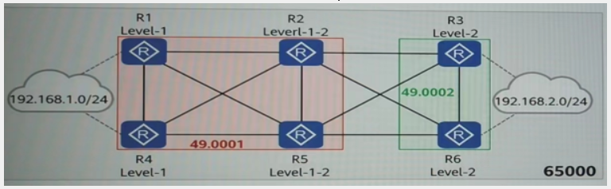

28 (多选题)OSPF协议要求同一个区域中的路由器保存相同的链路状态数据库LSDB。随着网络上路由数量不 断增加,一些路由器由于系统资源有限,不能再承载如此多的路由信息,这种状态就被称为数据库超限。假 如OSPF网络中所有路由器均配置了“Isdb-overflow-limitnuber?",则以下哪些场景可能会导致路由器 进入Overflow状态?

:、Tye7 LSA数量超过7条

、Type5 LSA数量超过7条

29 (多选题)如图所示,某企业希望在不改变网络部署的情况下,实现总部和分支机构间的安全互访,以及研 发区和非研发区之间的业务隔离。为了满足该需求,管理员在网络中部署了BGP/MPLS IP VPN,那么以下 关于该场景的描述,正确的有哪些项?

: 若要实现总部和分支研发区的互访,可以将VPN1和VEN2的ERT和IRT均设置为100:100

、若要实现总部研发区和非研发区的隔离,可以将VPN1的RT值均设置为100:100,而VPN3 的RT值均设置为200:200

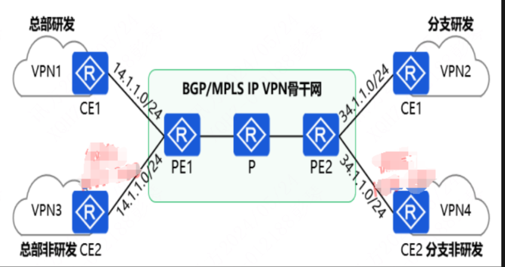

30 (多选题)如果割接准备不足,可能会出现以下哪些问题?

: A、未携带网线测试仪,端口无法UP时,无法判断是端口硬件故障,还是线缆故障

1.  不能在割接预定时间到达割接现场
2.  单板突发硬件故障,但没有备用单板
3.  割接失败,未备份配置文件,导致业务回退失败

31 (多选题)296.网络工程师在处理故障后撰写了故障处理报告,他把实际组网简化为如图所示的网络。R1 和R2均开启OSPF协议,且分别作为PC1和PC2的网关,以下描述正确的有哪些项?

：、R1可以Ping通192.168.1.21

、R1可以Ping通192.168.1.22

、R2可以Ping通192.168.1.2

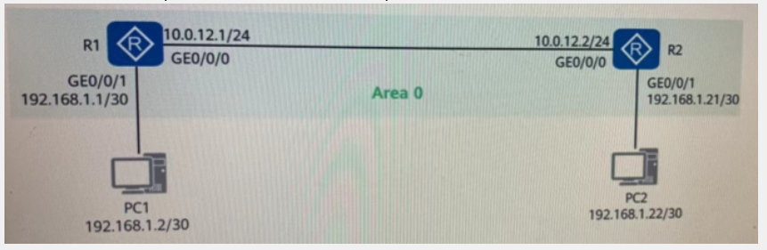

32 (多选题)以下哪些原因会导致网络设备Te1net登录失败?

： A、Telnet端口被禁用

1.  网络设备Telnet服务功能未开启
2.  用户名和密码错误
3.  客户端的IP地址被阻止

33 (多选题)如图所示的企业网络,R3连接企业网络管理服务器,网络中的所有设备通过VPN实现与网管互 通。在巡检过程中发现,R3有多余的RT配置,在R3上可以执行以下哪些命令删除多余RT,并且不影响所有 设备和网络管理服务器的连通性?

：A, undo vpn-target 3:1 import-extcommminty

1.  undo vpn-target 2:3 export-extcommunity
2.  C. undo vpn-target 1:3 export-extcommunity

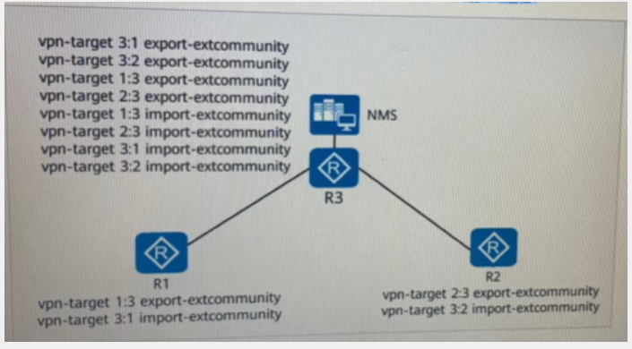

34 (多选题)某企业业务路由在网络中传递,其中PE1与PE2的部分配置如图所示,那么在此场景中,CE2可 能收到以下哪些类型的LSA?

：A. Type 7 LSA B. Type 3 LSA C. Type 5 LSA

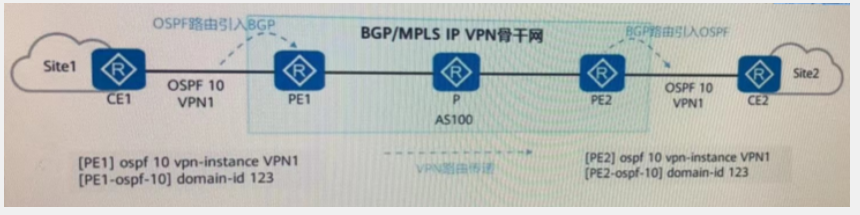

35 (多选题)MPLS标签是一个20 bit长的本地标识符,其标签空间被划分为特殊标签、静态共享标签空间和 动态信令协议标签空间,那么以下哪些属于动态信令协议标签?

：A. 1025

1.  1024

36 (多选题)在BGP/MPLS IP VPN网络中引入了RD和RT的概念,以下关于RD和RT的描述,错误的有哪些 项?

: A、 RT允许对端PE决定将哪些VPN路由从特定的VPN路由表中删除

C、RT允许对端CE决定将哪些VPN路由导入特定的VPN路由表

37 (多选题)R1转发的目的IP地址为4.4.4.4的报文在某MPLS网络中传输,其中R3的部分LSP信息如图所示, 那么在该报文传递的过程中,以下哪些设备会执行MPLS标签操作?:

1.  R2 B. R3 D. R1

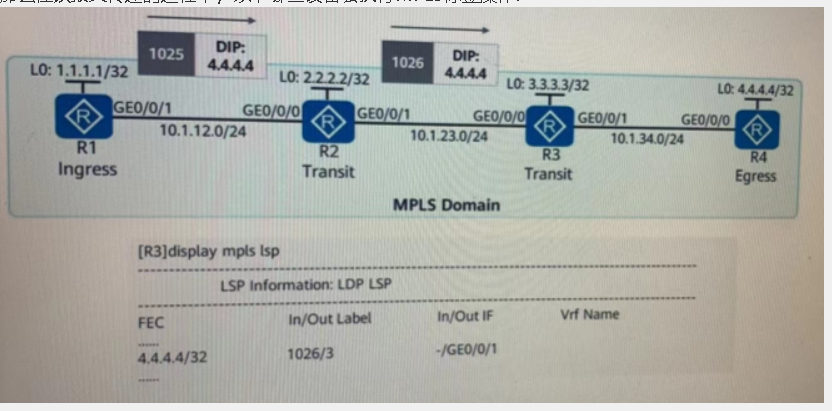

38 (多选题)LSR(Label Switching Router)通过LDP发现机制发现LDP对等体,从而建立LDP会话。以下关 于LDP会话的描述,正确的有哪些项?

: A、LSR通过发送组播或单播Hello消息发现LDP对等体

1.  LSR基于UDP发送Hello消息、
2.  传输地址较大的LSR主动发起建立TCP链接
3.  LSR基于LDP发现机制可以建立本地LDP会话或远端LDP会话

39 (多选题)在如图所示网络中,要求PC1与PC2属于同一个VLAN,却无法进行二层互通,则可以通过以下 哪些技术实现?

：C、MUX VLAN技术,将PC1与P02放入同一个Separate VLAN

D、端口隔离技术,将Switch的GE0/0/1四和GEO/0/2口加入同一个端口隔离组

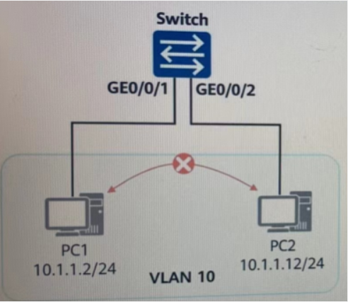

40 (多选题)某企业网络中既部署了VLAN聚合,又部署了MUX VLAN,且交换机连接终端的接口均为Acess 接口。那么在如图所示的场景中,PC3可以访问以下哪些IP地址?

：B.10.1.1.100

C. 10.1.1.15

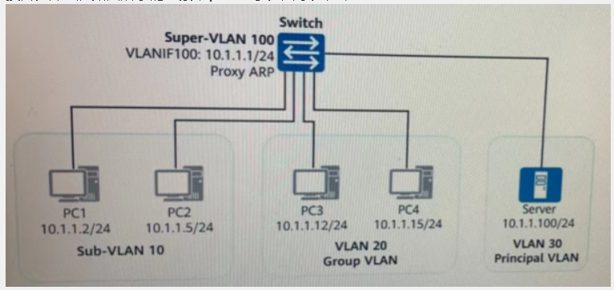

42 (多选题)如图所示的网络,AS之间使用直连接口建立EBGP邻居关系。AS65456内部部署OSPF(AS之间 的互联端口不开启OSPF),R4、R5使用Loopback0接口和R6建立IBGP邻居关系。每台设备的Loopback0 接口的IP地址为10.0.X.X/32,RouterlD为10.0.X.X,其中X为设备的编号。R1、R2、R3将外部网络192.1 68.1.0/24通过import方式引入BGP。缺省情况下,以下描述正确的有哪些项?

：

1.  针对192.168.1.0/24,R5优选从R2接收的路由
2.  针对192.168.1.0/24,R6优选从R4接收的路由
3.  针对192.168.1.0/24,R4优选从R1接收的路由

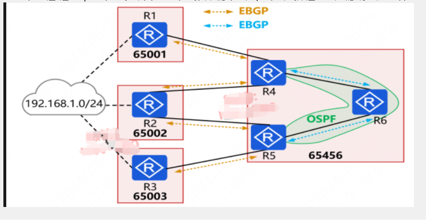

43 (多选题)如图所示的OSPFv3网络,区域1为Tota11y stub区域,区域2为普通区域,区域3为Tta11yNSS A区域。R6Loopback0接口的IPv6地址为2000:6/128。每一台设备的RouterlD为10.0.XX,其中X为设备 的编号。当所有链路正常时,缺省情况下,以下描述正确的有哪些项?

：A、R4发送数据包到达2000:6的路径可能为R4-R2-R6

1.  R4发送数据包到达2000:6的路径可能为R4-R1-R3-R6
2.  R4发送数据包到达2000:6的路径可能为R4-R1-R2-R6

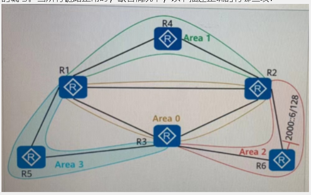

44 (多选题)运行OSPFv3的路由器一定会产生哪些类型的LSA?

：A. Link-LSA

2.  Router-LSA

45 (多选题)某一台路由器生成的AS-Externa1-LSA如图所示,根据此LSA进行推断,以下描述正确的有哪些项?

：B、该LSA携带的Route Tag值为1

C、该路由器的Router ID为10.0.3.3

D、其它路由器到达2000 :: 3的Cost值始终为1

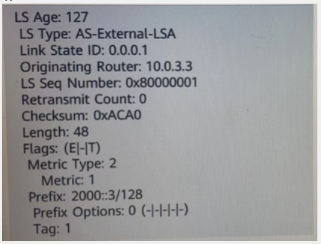

46 (多选题)如图所示的IS-IS网络,R1通过"default-route-advertise always level-1"命令引入了缺省路 由,以下哪些路由器的路由表中存在缺省路由?

：R3 、R2 、R1

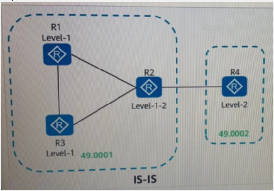

47 (多选题)如图所示的OSPF网络,区域号已在图中标出,其中区域1为stub区域,区域2为Totally NSSA区 域,区域3为NSSA区域,假如R5引入了一条外部路由10.0.5.5/32,以下哪些路由器的路由表中不存在10. 0.5.5/32的路由条目?

：R6、R4

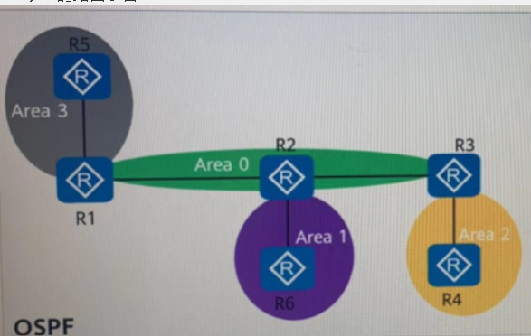

48 (多选题)如图所示的OSPFv3网络,区域1为普通区域,以下描述中正确的有哪些项?

：

1.  假如R5引入了外部路由,则R4计算该外部路由时不需要依赖Inter-Area-Router-LSA
2.  R1、R2和R3均生成Inter-Area-Prefix-LSA

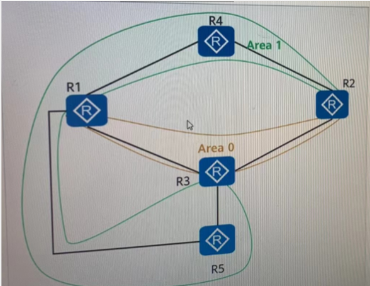

49 (多选题)在BGP/MPLS IP VPN网络中引入了RD和RT的概念,以下关于RD和RT的描述,正确的有哪些项?  
：A、RD值不用于标识一个路由的起源,也不用于决定该路由应该被加入到哪个VPN实例

3.  RD被用于加到IPv4地址之前,解决IPv4地址冲突问题
4.  D、VPNv4地址一共96 bit,其中RD值长64bit

50 (多选题)如图所示的网络,网络工程师发现PC1和PC2互通的路径非最优路径,每条链路的Cost值相 同,据此分析,以下哪些路由器可能是这个二层网络的根桥?

：A、SW4

3.  SW1

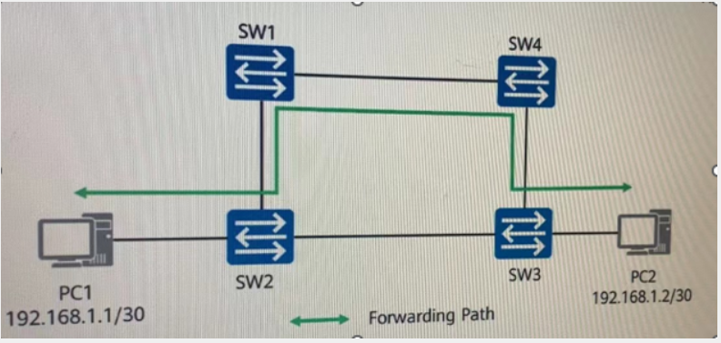

51 (多选题)设备作为SSH客户端登录其他设备,使用公钥认证登录失败,可能的原因有以下哪些项？

：

1.  服务器上保存的用户公钥不正确
2.  客户端未使能首次认证功能
3.  缺少本地密钥对

52 (多选题)交换机上的MAC地址表项有多种类型,其中以下哪些类型是由用户手工配置的,表项不可老 化? ：

1.  黑洞MAC地址表
2.  静态MAC地址表

53 (多选题)MPLS需要为报文事先分配好标签,建立一条LSP,才能进行报文转发。LSP分为静态LSP和动态 LSP两种,那么动态LSP可以基于以下哪些协议建立?

：A. RSVP-TE

D 、LDP

54 (多选题)如图所示,R1、R2、R3运行了MPLS,且管理员配置了一条从1.1.1.0/24网段到3.3.3.0/24网 段的静态LSP那么以下关于该场景的描述,正确的有哪些项?

：A、PC1无法访问PC2

B、R1对PC1发往PC2的流量将执行MPLS转发

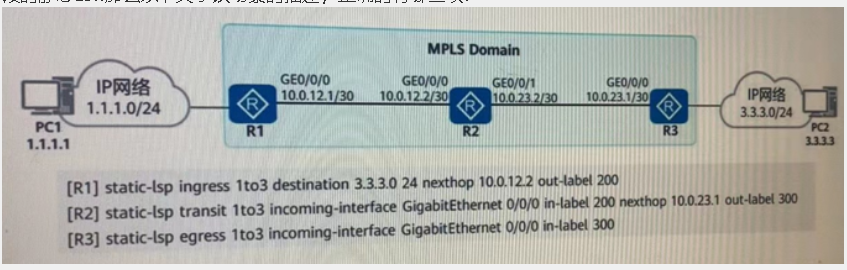

55 (多选题)如图所示的OSPF网络,R1和R2之间通过四条链路相连,R2的Loopback0接口开启OSPF,在 R1的OSPF进程中配置"maximum load-balancing 3"命令,则R1到达R2的Loopback0接口的出接口为以 下哪些项?

：

1.  GE0/0/2.10
2.  GE0/0/1
3.  GE0/0/2.20

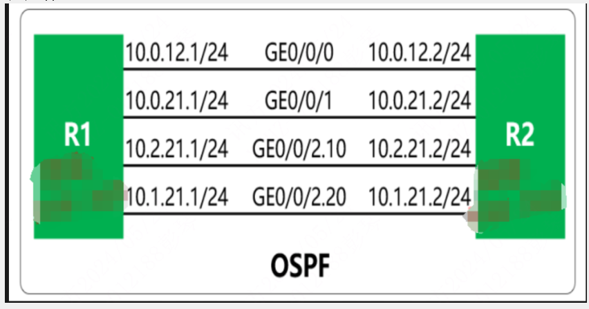

56 (多选题)如图所示,网络管理员在交换机上部署了DHCP Snooping信任功能,其中GEO/0/2口为信任接 口,GE0/0/3口为非信任接口。那么以下关于这两个接口的描述,正确的有哪些项?

：B、当交换机从GEO/0/2口收到DHCP响应报文时,会将报文从GEO/0/1口转发出去

D、当交换机从GE0/0/3口收到DHCP请求报文时,会将报文从GEO/0/2口转发出去

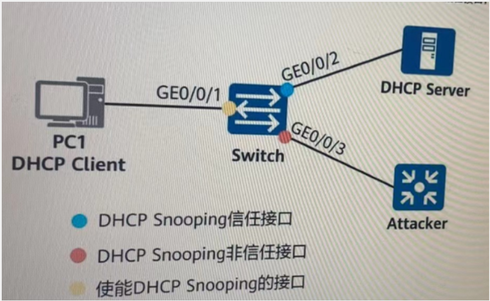

57 (多选题) 以下关于OSPFv3 Link-LSA和Intra-Area-Prefix-LSA的描述,正确的有哪些项? ：A、Link-LSA描述到此Link上的link-local地地址、IPv6前缀地址

3.  每个设备都会为每个链路产生一个Link-LSA
4.  Intra-Area-Prefix-LSA描述的前缀信息与Route-LSA或者Network-LSA相关联

58 (多选题)如图所示的网络,R2. R6.R3之间运行IS-IS IPv6,R6 Looback0接口的IPv6地址为2000 :: 6/128.其它链路均运行OSPFv3,区域1为Stub区域,区域2为NSSA区域。在R2和R3上将IS-IS路由引入OS PFv3,以下描述错误的有哪些项?

：

A、R1在区域2生成Inter-Area-Router-LSA

B、R2在区域1生成Inter-Area-Router-LSA

C、R3在区域0生成Inter-Area-Router-LSA

D、R2在区域0生成Inter-Area-Router-LSA

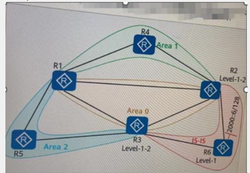

59(多选题)某一台路由器生成的Router-LSA如图所示,以下描述正确的有哪些项?

A、该路由器属于Stub区域

B、其它路由器转发IPv6流量时可以经过此路由器

D、该路由器是本地链路的DR

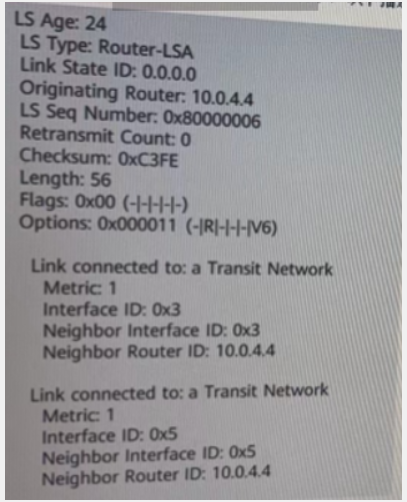

60 (多选题)如图所示的网络,R1、R2、R4、R5运行IS-IS,区域号为49.0001.R3、R6运行IS-IS,区域号 为49.0002.在AS 65000内部,R1、R3、R4、R6均与R2、R5建立IBGP邻居关系,其中R2、R5是RR, R1、R4、R3、R6是客户端。IBGP邻居关系均使用Loopback0接口建立,每台设备的Loopback0接口的I P地址为10.0.XX/32,Router ID为10.0.XX.其中X为设备的编号.R1和R4将外部网络192.168.1.0/24通 过import方式引入BGP,R3和R6通过import方式将外部网络192.168.2.0/24引入BGP.缺省情况下,以下 描述正确的有哪些项?

：

B、针对于192.168.1.0/24,R5优选从R1接收的路由

C、针对于192.168.1.0/24,R6优选的BGP路由携带的Originator ID属性为10.0.1.1

D、针对于192.168.1.0/24,R2优选的BGP路由携带的Originator ID属性为10.0.1.1

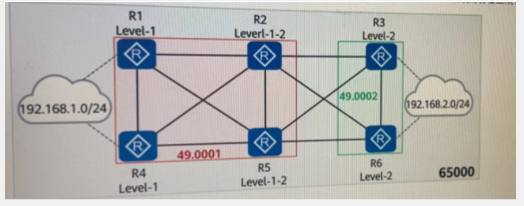

61 (多选题)如图所示的网络,R1、R2、R4、R5运行IS-IS,区域号为49.0001.R3、R6运行IS-IS,区域号 为49.0002.在R2上配置"import-route isis level-2 into level-1"。AS 65000内部,R1、R3、R4、R6 均与R2、R5建立IBGP邻居关系,其中R2、R5是RR.R1、R4、R3、R6是客户端.IBGP邻居关系均使用Lo opback0接口建立。每台设备的Loopback0接口的IP地址为10.0.XX/32,Router ID为10.0.XX.其中X为 设备的编号R1和R4将外部网络192.168.1.0/24通过import方式引入BGP,R3和R6通过import方式将外 部网络192.168.2.0/24引入BGP缺省情况下,以下描述正确的有哪些项?

B、R1路由表中有192.168.2.0/24的路由条目

C、R1路由表中有两条等价的缺省路由

D、R4路由表中有两条等价的缺省路由

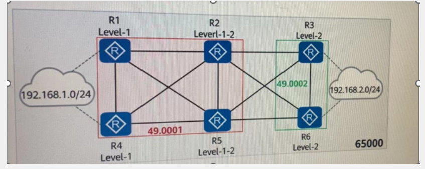

62 (多选题)如图所示的OSPF网络,区域号已在图中标出,其中区域1、区域2、区域3均为普通区域,R5L oopback0接口的IP地址为10.0.5.5/32,且该接口通过network的方式使能OSPF.在所有路由器上均配置了 acl 2000,匹配规则如图所示。在R1、R2、R3的区域0中,均配置了"filter 2000 import",则以下哪些 路由器的路由表中不存在10.0.5.5/32的路由条目?

：A. R2 C. R3 D. R4

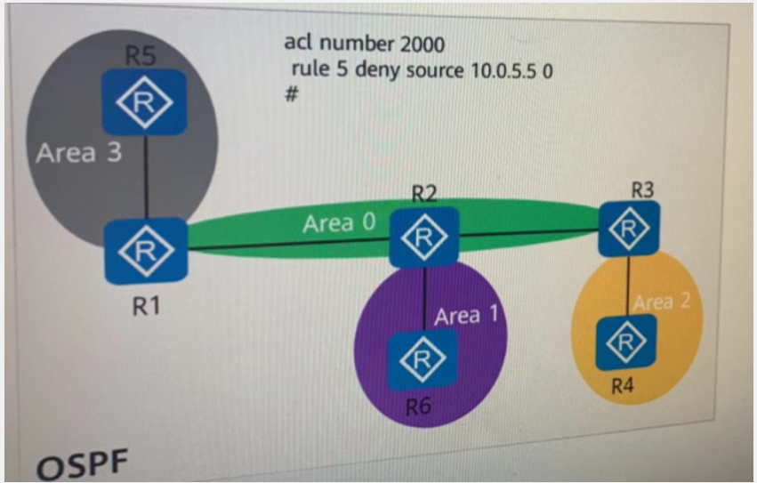

63 (多选题)如图所示的IS-IS网络,R1通过"default-route-advertise always level-1"命令引入了缺省路 由,以下描述中正确的有哪些?

：

A、10.0.12.2可以ping通10.0.3.3

B、10.0.1.1可以ping通10.0.2.2

C、10.0.1.1可以ping通10.0.3.3

D、10.0.2.2可以ping通通10.0.3.3

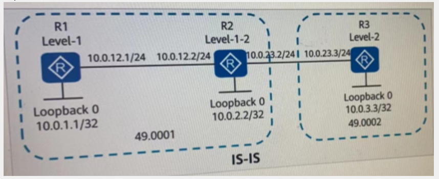

64(判断题)华为NetEngine AR6120和AR6121均有两个业务接口卡槽位,且这两个槽位可以合并为1个槽位。

A、正确

65 R R1 GE0/0/1 10.0.12.2/24 GE0/0/0 SW1 R R2 (判断题)如图所示的网络,R2 GEO/0/0接口开启DHCP Server功能,地址池为接口地址池。R1GE0/0/ 0和GEO/0/1接口作为DHCP客户端,缺省情况下,只有一个接口能获取IP地址。

1.  正确

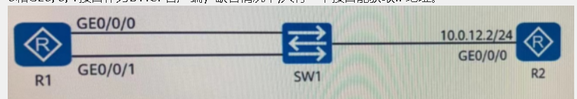

66 (判断题)网络工程师在进行故障处理时,如果忘记Console口密码,华为NetEngineAR系列路由器支持 在BootROM下配置跳过console口密码启动。

A、正确

67 (判断题)如图所示的组网,R1和R2通过直连接口无法建立EBGP邻居关系,网络工程师首先查看了R1和 R2 BGP相关的配置,据此判断,R1和R2无法建立EBGP邻居关系的原因是Keepalive和Hold参数不匹配。

2.  错误

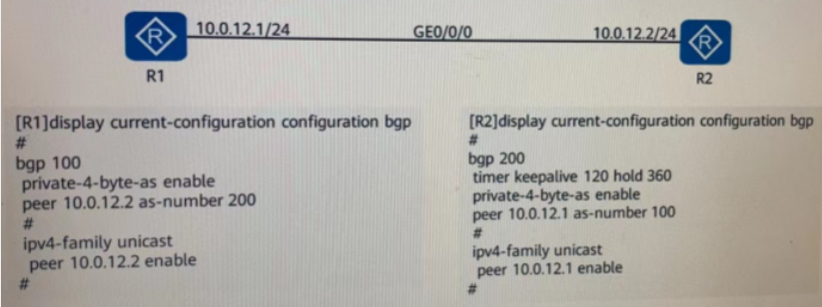

68 (判断题)如图所示的网络,R1和R2配置了单跳BFD检测,网络工程师发现BFD会话Down,因此查询了 R1和R2 BFD相关的配置,配置信息已在图中标出。此外,网络工程师在R1上执行了Ping10.0.12.2的操 作,输出信息如图所示。据此判断,BFD会话Down的可能原因是UDP端口为4784的报文被拒绝通过。

B、错误

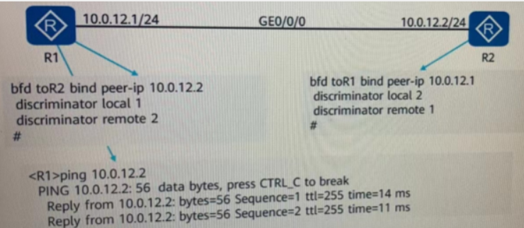

69 (判断题)在MPLS网络中,当一台LSR(Label Switching Router)接收到对端发送过来的Hello。消,息后, 会建立LDP邻接体关系,其中Hello消,息会采用组播或单播的形式发送。

1.  正确

70 (判断题)在BGP/MPLS IP VPN网络中,若要修改VPN实例下的RD值,必须先去使能VPN实例相应的地 址族或删除该VPN实例。

1.  正确

71 (判断题)管理员静态配置LSP的Ingress节点时,推荐采用指定下一跳的方式建立静态LSP,确保本地路由 表中存在与指定目的IP地址精确匹配的路由项。

1.  正确

72 (判断题)如图所示,为保证交换机Core和ACC_1间正常进行MACsec会话协商,要求交换机AGG_1支持 二层协议透传功能

A 、正确

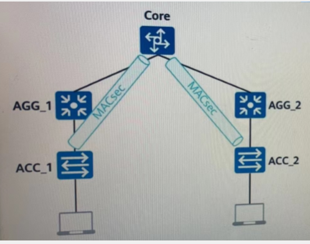

73 (判断题)在执行割接项目时,网络工程师可集中在客户的网络维护中心进行远程操作,并且指导现场施 工人员完成硬件相关的操作,例如设备上电、设备连线等.

1.  正确

74 (判断题)缺省情况下,P2P、Broadcast类型的接口发送OSPF Hello报文的时间间隔的值为10秒,邻居 失效时间是40秒。

1.  正确

75 (判断题)使用“display ospfv3 peer verbose”查看OSPFv3邻居信息,在输出信息中可以看到对端的R outer ID,对端接口的全局单播地址,邻居的状态等内容。

2.  错误

76 (判断题)路由反射器和它的客户机组成一个集群(Cluster),使用AS内唯一的Cluster ID作为标识。当一 条路由第一次被RR反射的时候,如果没有Cluster List属性,RR会把本地Cluster ID添加到Cluster_List的 前面。如果一条路由中已经存在了Cluster_List属性,则RR不再修改Cluster List属性。

B、错误

77 (判断题)在路由器上使用“display curent-configuration linclude 10.0.2 .\* "命令,可以看到当前配置 中包含“10.0.2”的全部信息。

A、正确

78 (判断题)在大型BGP网路中,对等体的数目众多,配置和维护极为不便。对于存在相同配置的BGP对等 体,可以将它们加入一个BGP对等体组进行批量配置,简化管理的难度,并提高路由发布效率。配置IBGP 对等体组时,不需要指定对等体组的AS号。配置EBGP对等体组时,必须指定对等体组的AS号

1.  正确

79 (判断题)I-SPE和PRC可以提高IS-IS路由的收敛速度。它们都是只对发生变化的路由进行重新计算。不同 的是,PRC不需要计算节点路径,而是根据I-SPF算出来的SPT来更新路由。

A、正确

80 (判断题)OSPF与BFD联动就是将BFD和OSPF协议关联起来,加快OSPF协议对于网络拓扑变化的响应。 BFD状态变为UP后,OSPF邻居状态才能达到Full状态。BFD状态变为Down后,OSPF邻居状态才能变为D own状态。

A、正确

81 (判断题)Type7 LSA是为了支持NSSA区域而新增的一种LSA类型,用于描述引入的外部路由信息。它由 NSSA区域的自治域边界路由器(ASBR)产生,它的扩散范围和Type5 LSA类似,除了普通区域和Stub区域 外,Type7 LSA将扩散至OSPF网络中的所有NSSA区域。

B、错误

82 (判断题)在网络相对稳定、对路由收敛时间要求较高的组网环境中,可以指定OSPF LSA接收的时间间隔 为0来取消LSA接收的时间间隔,使得拓扑或者路由的变化可以立即被感知到,从而加快路由的收敛。

1.  正确

83 (判断题)随着企业网络规模的不断扩大,某一个企业计划将分散部署的服务器集中移动到同一个机房统 一管理,在搬迁的某一个阶段,工作内容为硬件搬迁。在此阶段,网络工程师不需要执行设备调测,因此 网络工程师无需制定割接方案。

B、错误

84 (判断题)Trap信息是系统检测到故障而产生的通知,主要记录故障等系统状态信息。如果网络管理员想 要通过命令行查看Trap信息,需要首先使能SNMP代理功能。

1.  正确

85 (判断题)display startup命令可以用来查看设备本次及下次启动相关的系统软件、配置文件,并且能看 到这些文件的保存路径。

1.  正确

86 (判断题)在CE多归属场景,若PE使能了BGP的AS号替换功能,还可以配置SOO特性来避免环路,即在P E与CE的EBGP对等体通过命令peer soo使能该特性。

1.  正确

87 (判断题)MPLS标签是一个20 bit长的标识符,当管理员配置静态LSP时,不同MPLS设备的标签值不能 相互重叠。

2.  错误

88 (判断题)IPSG是一种基于三层接口的源IP地址过滤技术,它能够防止恶意主机伪造合法主机的IP地址来 仿冒合法主机访问合法网络资源的行为。

B、错误

89 (判断题)使用"display ospfv3 peer verbose"查看OSPFv3邻居信息,在输出信息中可以看到对端的Rou ter ID,对端接口的全局单播地址,邻居的状态等内容。

B、错误

90 (判断题)如图所示的IS-IS IPv6网络,R1和R2的接口均有两个IPv6地址,由于R1和R2 IPv6地址前缀长 度不同,它们无法建立邻居关系.

B、错误

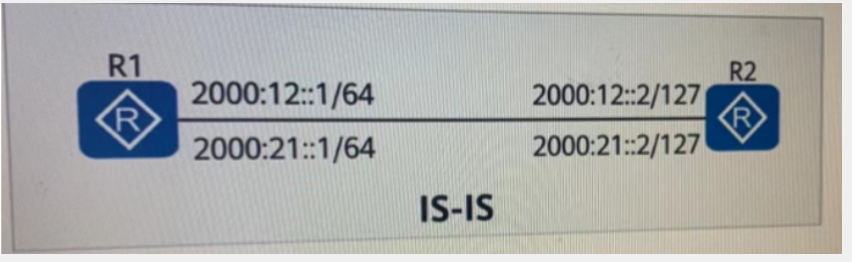

91 (判断题)MP_REACH_NLRI的地址族信息域由2字节的地址族标识AFI和1字节的子地址族标识SAFI组成. 当BGP-IPv4单播地址族下传递公网IPv4由时.SAFI是1.当BGP-IPv6单播地址族下传递公网IPv6路由时,SA FI也是1.

1.  正确

92 (判断题)为防止攻击者伪造BGP报文对设备进行攻击,可以通过配置GTSM功能检测IP报文头中的TTL值 的范围来对设备进行保护,如果某台设备配置了"peer x.x.x.xvalid-ttl-hops 100",则被检测的报文的TTL 值有效范围为[155,255].

2.  错误

93 (判断题)在大型BGP网路中,对等体的数目众多,配置和维护极为不便。对于存在相同配置的BGP对等 体,可以将它们加入一个BGP对等体组进行批量配置,简化管理的难度,并提高路由发布效率。配置IBGP 对等体组时,不需要指定对等体组的AS号,配置EBGP对等体组时,必须指定对等体组的AS号。

1.  正确

94 (判断题)IS-IS LSP分片由LSP ID中的LSP Number字段进行标识,这个字段的长度是4 bit.因此,一个I S-IS进程最多可产生256个LSP分片,携带的信息量有限。通过增加附加系统ID,可以让IS-IS进程产生更多 LSP分片.

B、错误

95 (填空题)如图所示的OSPFv3网络,R2的LSDB中有 条Router-LSA。(填写阿拉伯数字)

：3

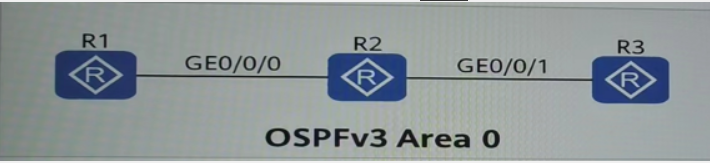

96 (填空题)如图所示,网络工程师在进行故障处理时,将某一个组播网络的示意图画出,R1和R2启用的IG MP版本为2,使用PIM-SM作为组播路由协议,其它配置均为默认配置,则该组播网络中的查询器是

：R3

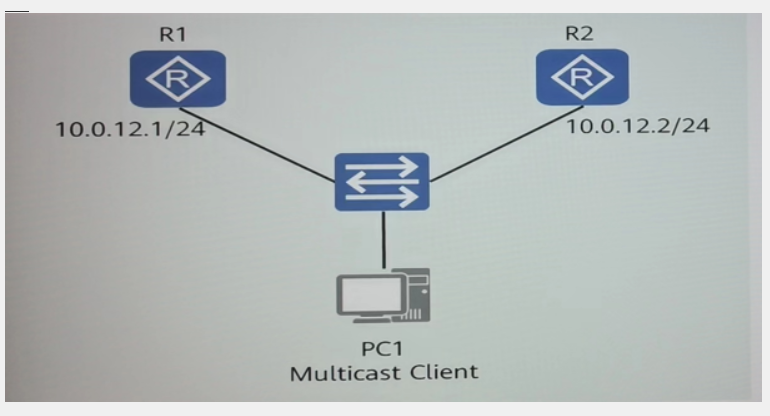

97 报文是某一种动态路由协议的报文,则该协议为 (填空题)网络工程师使用capture-packet工具抓取接口收到的报文,图中给出了部分输出信息,已知该 (填写术语,全大写)

:RIP

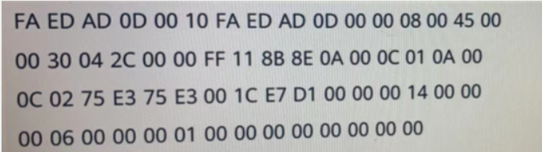

98 右侧从上往下排序, (填空题)如图所示的OSPFv3网络,OSPFv3相关参数为缺省配置。在其中一台设备上查看LSDB,LSDB 中省略了一部分内容。R1、R3、R4的Router ID分别为10.0.1.1、10.0.3.3、10.0.4.4。某些LSA的Origin Router部分做了隐藏,请您将该部分补充完整。(Token可重复使用)(答案填写方式左侧从上往下为排序, 1-1 答案填写例如: 2-3 )

：1-3,2-2,2-4,3-1

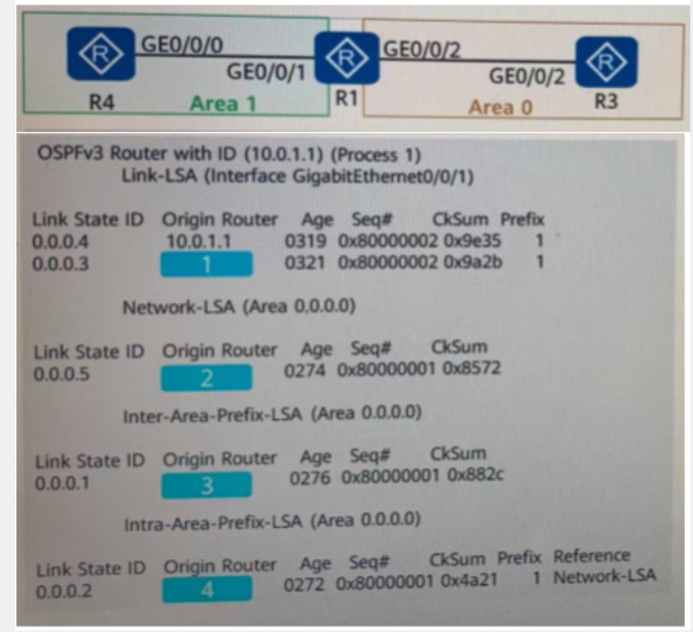

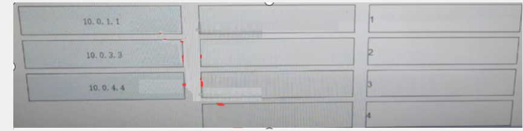

99 (填空题)R1和R2使用直连接口建立EBGP邻居关系,R1将2000:1/128导入BGP。缺省情况下,R2到达 2000:1/128的下一跳地址为

:2001:12::1

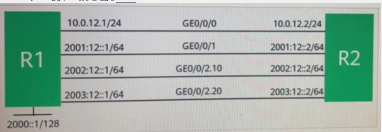

100 (填空题)在如图所示的BGP/MPLS IP VPN网络中,管理员准备通过Hub-Spoke组网实现H站点对VPM 流量的集中管控,那么请将以下各设备的K值进行 -- 对应。(Token可重复使用)(答案填写方式左侧从 上往下为排序,右侧从上往下排序,答案填写例如:1-1,2-3)

：1-1,1-4,2-2,2-3

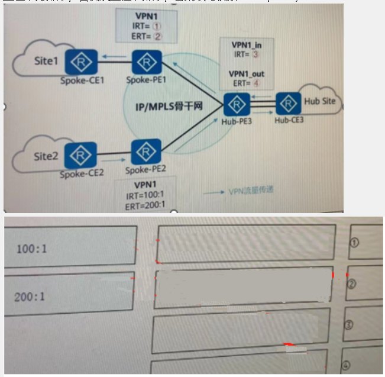

## 831-4
831-4

1 (单选题)某一大型互联网服务提供商需要对机房设备分批进行断电维护,作为割接项目管理人员,您会 优选以下哪一时间节点? ：工作日

2 (单选题)MPLS的体系结构分为控制平面和转发平面,里面包含了多个协议和表项,请问以下哪一个表项 负责带MPLS标签报文的转发? ：标签转发信息表LFIB

3 (单选题)如图所示,管理员要使能R1\~R4设备的MPLS LDP功能,那么以下关于R1的配置,正确的是哪 一项?

1.  [R1] mpls Isr-id 1.1.1.1 [R1] mpls [R1- mpls] quit [R1] mpls 1dp [R1- mpls-1dp] quit [R1] interface gigabitethernet 0/0/1 [R1-GigabitEthernet0/0/1] mpls [R1-GigabitEther net0/0/1] mpls Idp [R1-GigabitEthernet0/0/1] quit

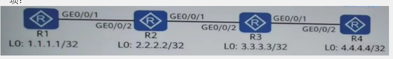

4 (单选题)如图所示的网络,相邻的路由器之间使用直连接口建立EBGP邻居关系,每台设备的Router ID 为10.0.XX,AS号为6500x,其中x为路由器的编号,R1和R4均有到达192.168.1.0/24的静态路由,通过i mport方式引入BGP,R3针对所有部送配置了"peer yy.y.y.as-path-filter 1import"命令,以下哪一项可 以使R3到达192.168.1.0/24选择AS-Path最长的路径?

：ip as-path-filter 1 deny \^65002

ip as-path-filter 1 deny \^65005

ip as-path-filter 1 permit .\*

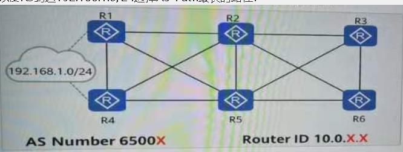

5 (单选题)NetEngine AR路由器作为DHCP Server可以为同一个网段或不同网段内的客户端分配IP地址。 以下哪一原因不会导致客户端无法获取IP地址? ：IP地址租期小于24小时

6 (单选题)管理员在使能设备的MPLS LDP功能时,必须先配置以下哪一条命令? ：[Huawei] mpls 1sr-id 1.1.1.1

7 (单选题)管理员在交换机上部署流量抑制功能时,在设备的VLAN视图下,可以对以下哪一类型的报文基 于比特速率进行流量抑制? ：广播报文

8 (单选题)如图所示,某交换网络中部署了VLAN聚合功能,其中Sub-VLAN 10和Sub-VLAN 20均加入到 Super-VLAN 100中,若要实现PC1与PC2,PC1与PC3均可以互访,则以下关于L3 Switch接口类型和应 该放通的VLAN的描述,正确的是哪一项?

：GE0/0/1口为Trunk口,放通VLAN 10和VLAN 20;GE0/0/2口为Access口,PVID设置为 VLAN 10

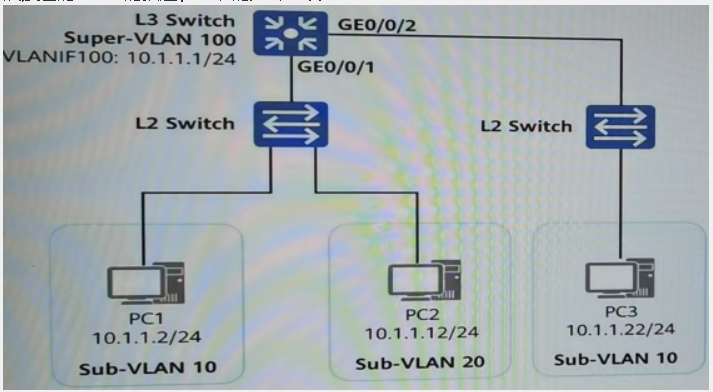

9 (单选题)随着业务流量的增加,某企业需要扩充骨干网传输带宽,以下哪种方式最能满足该需求? ：增加骨干网设备间互联的链路,骨干网设备之间部署链路聚合

10 (单选题)如图所示的网络,R1和R2配置VRRP,虚拟IP地址为10.0.12.254。配置完成后,网络工程师在 R1和R2上查看VRP状态,两台设备均为master状态,以下哪一项不会导致出现该现象?：R1和R2在VRRP备份组中的优先级不一致

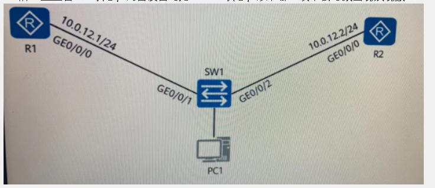

11 (单选题)网络工程师在处理单跳BFD会话Down时,无需执行以下哪一项操作?：如果有静态路由绑定了BFD会话,执行display ip routing-table命令检查路由表中是否存 在该静态路由

12 (单选题)当IP报文进入MPLS域中,入节点会检查目的IP地址对应的Tummnel ID,当Tunmel ID为以下 哪一项时,入节点会对该报文执行IP转发? ：0x0

13 (单选题)如图所示,网络管理员为了抵御DHcP Server仿冒者攻击,在交换机上部署了DHCP Snooping 功能,那么以下哪一个接口应该被设置为DCP信任接口?：GE0/0/2

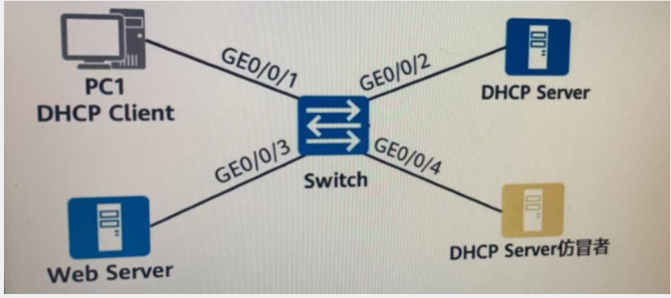

14 (单选题)如图所示的OSPF网络,区域号已在图中标出,其中区域1为Stub区域,区域2为Totally Stub区 域,区域3为NSSA区域,则区域1、区域2、区域3中都不会出现以下哪一种类型的LSA?：Type4

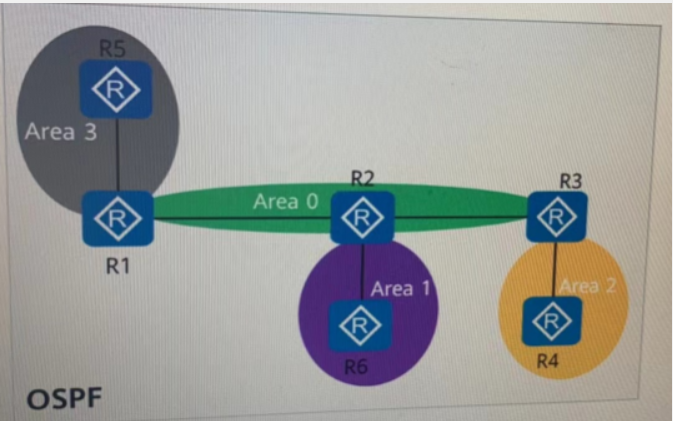

15 (单选题)如图所示的IS-IS网络,R1通过“default-route-advertise always level-1”命令引入了缺省路 由,则R3路由表中缺省路由对应的下一跳设备为哪一台? :R1

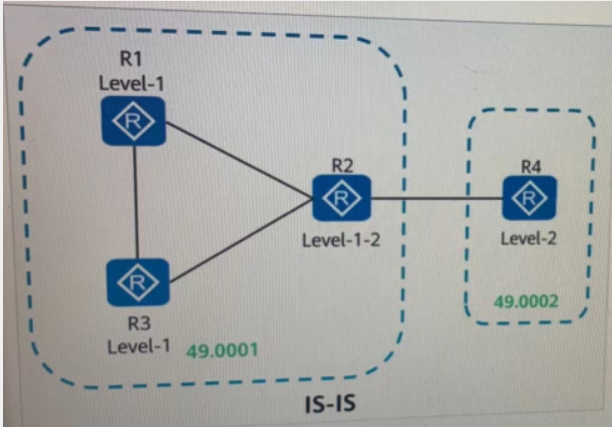

16 (单选题)在MPLS网络中,会依据FIB、NHLFE和ILM等信息进行数据转发,其中在这些信息中,主要是 通过以下哪一个选项进行信息关联? ：Tunnel ID

17 (单选题)在某MPLS网络中,R1和R2的LSP信息如图所示,此时管理员在R1上输入命令ping 3.3.3.3,那 么以下关于该场景的描述,正确的是哪一项? ：R1发出的Ping报文会携带标签1025,R2收到后将剥离标签基于IP进行转发

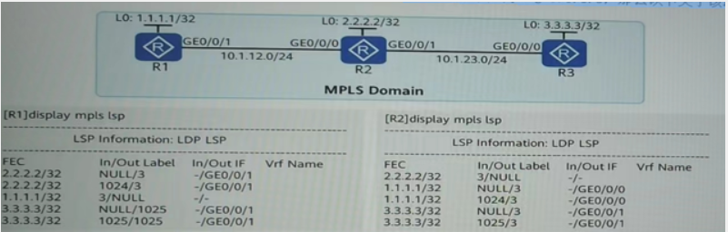

18 (单选题)当管理员在MPLS网络的Egress设备输入命令label advertise explicit-null.表示向倒数第二跳设 备分配了以下哪一个标签? ：0

19 (单选题)在MPLS网络中,会依据FIB、NHLFE和ILM等信息进行数据转发,其中在这些信息中,主要是 通过以下哪一个选项进行信息关联? ：Tunnel ID

20 (单选题)在某MPLS网络中,R1和R2的LSP信息如图所示,此时管理员在R1上输入命令ping 3.3.3.3,那 么以下关于该场景的描述,正确的是哪一项?：R1发出的Ping报文会携带标签1025,R2收到后将剥离标签基于IP进行转发

21 (单选题)当组网发生变化时,DHCP Snooping绑定表不会立即老化,因此需要手动清除,那么管理员可 以采用以下哪一条命令清除DHSP Snooping绑定表? ： reset dhcp snooping user-bind ip-address

22 (单选题)以下哪一项不是IS-IS为了支持IPv6路由的处理和计算而增加的新内容? ：IS-IS Hello报文的源IP地址更改为链路本地地址

23 (单选题)交换机上的MAC地址表项有多种类型,其中以下哪一类型的表项可以通过匹配收到的报文的源 目MAC地址来进行报文丢弃,从而达到过滤非法用户的目的? :黑洞MAC地址表

24 (单选题)如图所示,SW3是网络中的用户网关及DHCP Relay,管理员准备在SW3上部署DHCP Snoepi ng功能预防DHCP攻击。那么在SW3上不需要配置以下哪一条命令?

： [SW3-GigabitEthernet0/0/3]dhcp snooping trusted

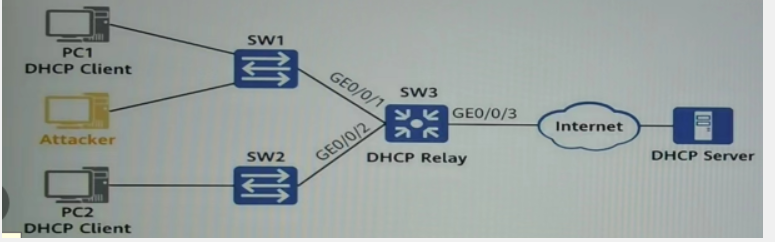

25 (多选题)某台OSPFv3路由器的接口地址为2000 :: 1/128,该前缀有可能会出现在以下哪些类型的LSA 中?

B. Inter-Area-Prefix-LSA

C. AS-External-LSA

26 (多选题)如图所示的网络,相邻的路由器之间使用直连接口建立EBGP邻居关系。每台设备的Router ID 为10.0.XX,AS号为6500X,其中X为路由器的编号。R1和R4均有到达192.168.1.0/24的静态路由,通过 import方式引入BGP。缺省情况下,以下描述中正确的有哪些项?

1.  R2到达192.168.1.0/24的流量路径为R2-R1

D、R3到达192.168.1.0/24的流量路径为R3-R2-R1

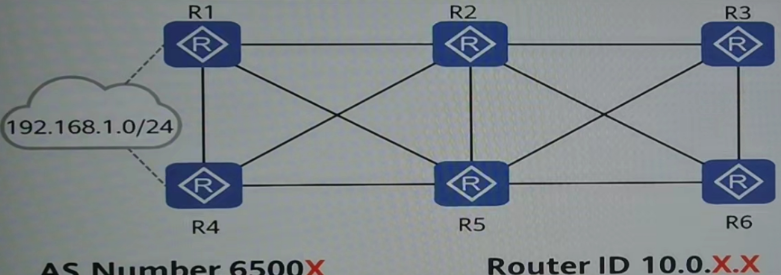

27 (多选题)以下哪些原因可能会导致本端设备无法学习到对端设备的ARP信息? A、链路传输不稳定或光功率不足 B、接口物理层未正常Up C、接口下配置的IP地址与对端设备不在同一网段 D、设备受到ARP攻击

28 (多选题)网络管理员在接入交换机上部署了DHCPSnooping功能,其中以下哪些方案可以用来降低攻击 者恶意申请1P地址,导致DHcp server拒绝服务的影响?

A、配置DHCP Snooping检查DHCP Request报文中的CHADDR字段

B、通过DHCP Snooping限制交换机接口学习MAC地址数量

D、开启设备根据DHCPSnooping绑定表生成接口的静态IAC表项功能

29 (多选题)网络工程师在R1上查看LLDP邻居信息,以下描述中正确的有哪些项?

B、对端设备的管理IP地址为192.168.1.1

C、对端设备的接口编号为GE0/0/0

D、对端设备的sysname为R2

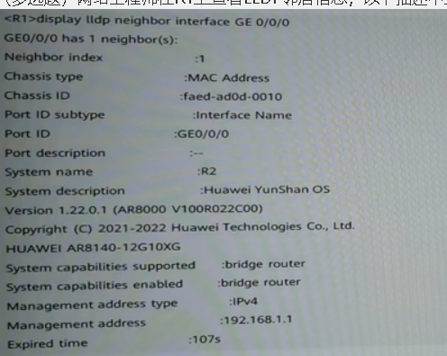

30 (多选题)网络工程师在处理故障后撰写了故障处理报告,他把实际组网简化为如图所示的网络。R1和R2 均开启OSPF协议,且分别作为PC1和PC2的网关,以下描述正确的有哪些项?

A、如果R1 GEO/0/1接口故障,R1可以Ping通192.168.1.2

C、如果R1 GEO/0/1接口故障,R1可以Ping通192.168.1.12

D、PC1和PC2无法Ping通

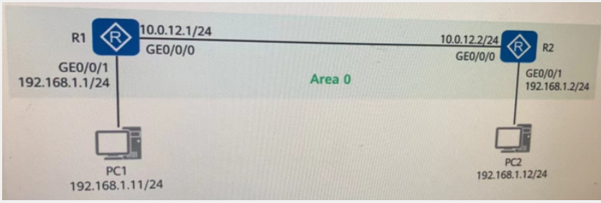

31 (多选题)如图所示,某网络管理员通过配置静态LSP实现了MPLS数据转发,拓扑图下方是管理员对某一 设备的抓包信息,那么以下关于该信息的描述,正确的有哪些项?

A、若抓包设备为R3,则R3会对PC1访问PC2的报文执行IP转发

C、PC1对PC2执行了Ping操作

D、PC1访问PC2的报文在MPLS城内基干MPLS标签转发

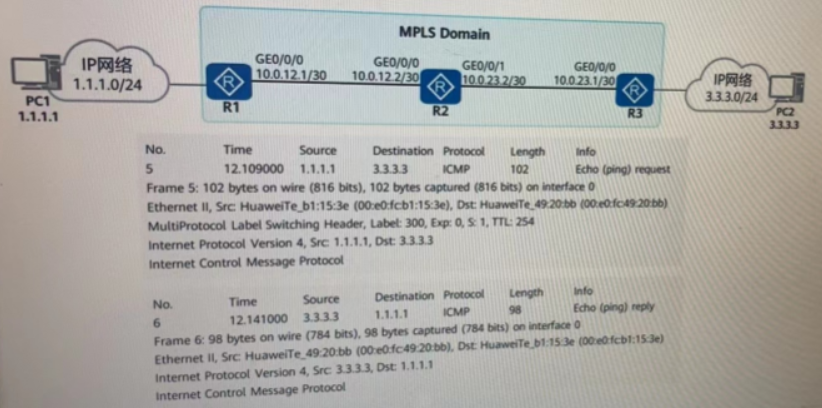

32 (多选题)如图所示的OSPF网络,区域1和区域2都是普通区域,R5的Loopback0接口的IP地址为10.0.5. 5/32,该接口使能OSPF。在R1和R3的区域2中均配置了“abr-summary 10.0.5.0 255.255.255.0”命 令,则以下哪些路由器的路由表中有10.0.5.0/24的路由条目?

1.  R4

C、R2

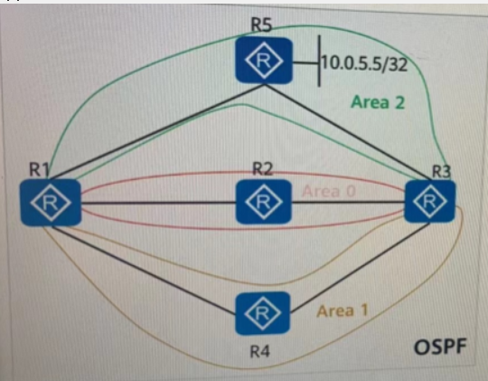

33 (多选题)如图所示的IS-IS网络,R1通过“default-route-advertise always leve1-1”命令引入了缺省路 由,以下描述中正确的有哪些项?

A、R1路由表中不存在缺省路由

B、R2路由表中存在缺省路由

C、R3路由表中不存在缺省路由

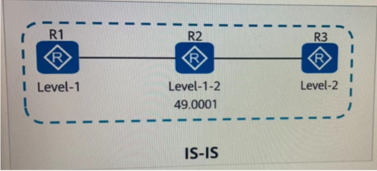

34 (多选题)MPLS网络中的三台设备已成功建立了LDP会话,此时管理员配置或修改以下哪些信息,会导致 本地LDP会话重新建立?

C、修改LDP传输地址

D、修改标签发布方式

35 (多选题)如图所示的OSPFv3网络,区域1为Stub区域。缺省情况下,以下描述正确的有哪些项?

C、R1和R2均会生成Intra-Area-Prefix-LSA

D、R1和R2均会生成Inter-Area-Prefix-LSA

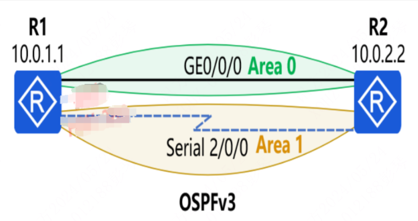

36 (多选题)在BGP/MPLS IP VPN网络中,PE设备间会通过Update报文进行VPN路由更新,其中Updata 报文中将包含以下哪些信息?

A、VPNv4路由前缀

B、Export RT值

D、下一跳地址

37 (多选题)如图所示的OSPFv3网络,区域1为普通区域,以下描述中错误的有哪些项?

A、由于R4和R5处于同一区域,R4和R5的LSDB相同

B、由于R4和R5处于同一区域,R4如果生成了Intra-Area-Prefix-LSA,则该LSA会发送给R5

C、由于R4和R5处于同一区域,假如R5引入了外部路由,则R4计算该外部路由时不需要依赖In terx-Area-Router-LSA

D、由于区域1不连续,R4和R5无法获取到达对方接口IPv6地址的路由

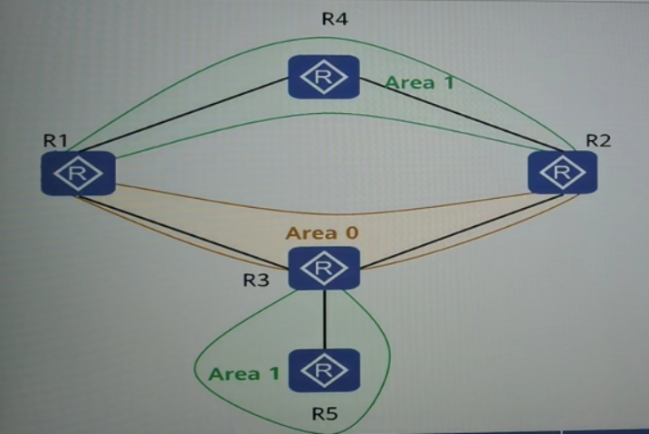

38 (多选题)如图所示的OSPFv3网络,区域1为Stub区域,区域2为普通区域,区域3为NSSA区域。R6Loo pback0接口的IPv6地址为2000 :: 6/128。每一台设备的Router ID为10.0.XX,其中X为设备的编号。以下 描述正确的有哪些项?

2.  区域3中存在R1生成的描述2000:6/128的Inter-Area-Prefix-LSA

D、区域1中存在R2生成的描述2000:6/128的Inter-Area-Prefix-LSA

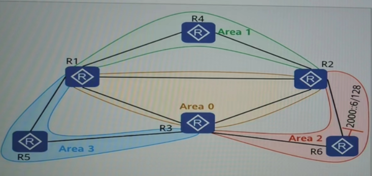

39 (判断题)在BGP/MPLS IP VPN网网络中,PE设备之间可以通过BGP-4协议进行VPNv4路由的传递。 B、错误

40 (判断题)当IS-IS网络中有多条冗余链路时,可能会出现多条等价路由,针对等价路由中的某一条路由, 网络管理员可以通过"nexthop x.x.x.x weight value”命令调整其优先级,value值越小,表示优先级越 高。 A、正确

41 (判断题)在BGP/MPLS IP VPN网络中,CE和PE设备之间只能通过IGP或BGP协议进行路由打通。 B、错误

42 (判断题)dir命令与I命令用来显示FTP服务器上所有文件或指定文件的信息,同时可以将指定文件的信息 保存至本地设备。 A、正确

43 (判断题)网络工程师通过Console口登录某一台NetEngine AR6120时,发现密码错误,无法登录,如 果该设备仍然能够通过Telnet账号登录,且用户账号具有修改Console口密码的权限,此时他可以通过Teln et登录设备修改Console口密码. A、正确

44 (判断题)如图所示的网络,R1和R2配置了单跳BFD检测,网络工程师发现BFD会话Down,因此查询了 R1和R2 BFD相关的配置,配置信息已在图中标出根据配置信息判断,BFD会话Down的原因是R1和R2配 置的时间参数不匹配。 B. 错误

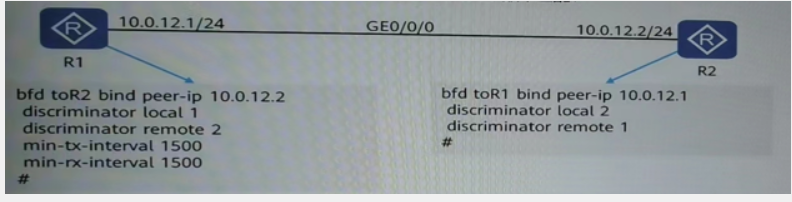

45 (判断题)当IP报文进入MPLS域中,入节点会检查源IP地址对应的Tunnel ID,当Tunnel ID不为0x0时, 入节点会对该报文执行MPLS转发 B、错误

46 (判断题)如图所示的IS-IS网络,R1通过"default-route-advertise always level-1"命令引入了缺省路 由,则R3能通过IS-IS学习到该缺省路由. B、错误

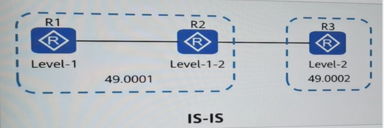

47 (判断题)网络管理员可以用clock timezone命令设置设备的时区信息。如果两台网络设备的时区设置不 一致,会导致这两台设备运行的动态路由协议无法正常建立邻居关系。 B、错误

48 (判断题)如图所示的网络,R1和判断R2通过Loopback0接口建立EBGP邻居关系。R1将2001:1/128的 路由引入BGP,之后又取消引入该路由。则在R1取消路由引入后,R1发送的Update报文中,MP UNREA CH NLR的的NextHop字段的取值为2000 :: 1. B、错误

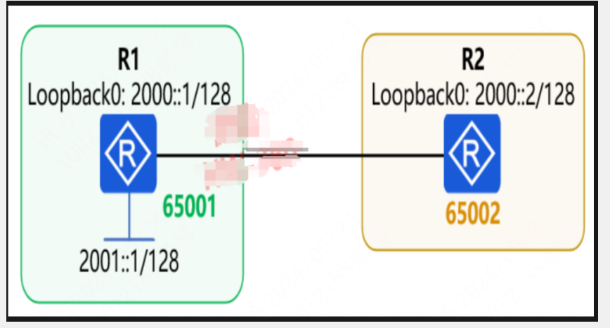

49 (判断题)为了保证LDP消,息的可靠发送,LDP的Discovery消息、Session消息、Advertisement消,息和 Notification消息都使用TCP传输。 B、错误

50 (判断题)在同一个交换机接口上,管理员只能配置对广播、未知组播、未知单播、已知组播和已知单播 报文中的一种进行流量抑制。 B、错误

51 (判断题)当交换机某端口上配置了基本QinQ功能后,只有从该端口收到带有VLA Tag的报文,才会为该 报文打上本端口缺省VLAN的Tag,从而达到扩展VLAN空间的目的。 B、错误

52 (判断题)如图所示的IS-IS IPv6网络,当网络稳定后,R1可以Ping通2000:12:0,并且通过“display ip v6 neighbors"可以查看200:12:0对应的MAC地址。 A、正确

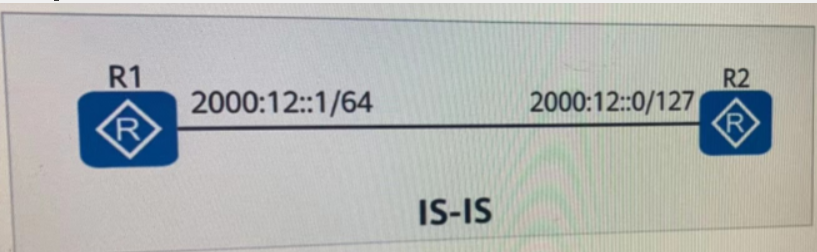

53 (判断题)如图所示的IS-IS网络,链路的Cost值已在图中标出,R1开启IS-IS AutoFRR,则R1到达10.0.3. 3/32的主路径为R1-R2-R3,备份路径为R1-R4-R2-R3。 B、错误

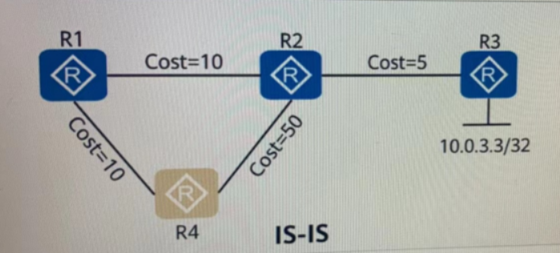

54 (判断题)在BGP/MPLS IP VPN网络中,PE和P设备间通过运行MP-BGP来交换公网标签,从而实现P设 备基于标签进行数据转发。 B、错误

55 (判断题)当交换机配置了端口隔离功能后,缺省情况下,属于同一VLAN的不同主机无法进行一层和三层 通信。 B、错误

56 (判断题)MAC地址表中的表项分为动态表项、静态表项和黑洞表项。同时交换机的MAC地址表中还存在 一种业务类型的MAC地址表项,这类表项一般是通过动态表项转换来的。 A、正确

57 (判断题)如果交换机连接的用户变动比较频繁,可以通过端口安全把动态MAC地址转换为Sticky MAC 地址。这样可以在用户变动时,通过表项老化及时清除绑定的旧MAC地址表项。 B、错误

58 (判断题)如图所示的OSPFv3网络,R1、R2、R3互联的端口开启OSPFv3,并且均配置了IPv6全球单播 地址,则R1、R2、R3都会产生Intra-Area-PrefixLSA。A、正确

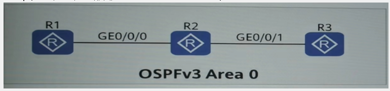

59 (判断题)如图所示的IS-IS IPv6网络,在R1上查看LSDB,从输出信息可以推断R1是DIS。 A、正确

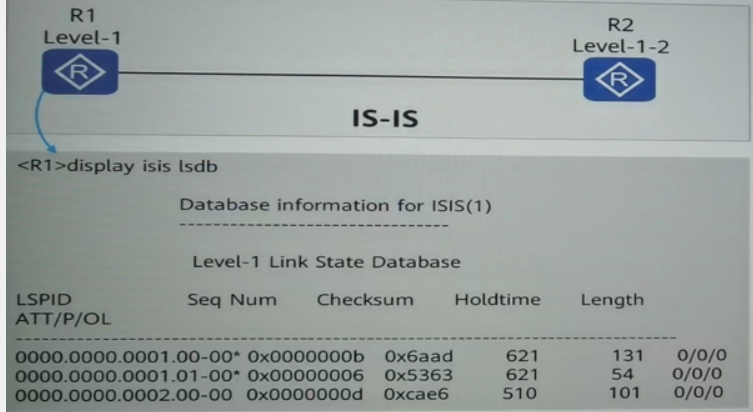

60 (填空题)如图所示的网络,R1、R2、R4、R5运行IS-IS,区域号为49.0001,R3、R6运行IS-IS,区域号 为49.0002.AS 65000内部,R1、R3、R4、R6均与R2、R5建立IBGP邻居关系,其中R2、R5是RR,R1、 R4、R3、R6是客户端。IBGP邻居关系均使用Loopback0接口建立。R2和R5之间也建立IBGP邻居关系, 且配置相同的cluster ID,IBGP邻居关系均使用Loopback0接口建立。每台设备的Loopback0接口的IP地 址为10.0.X.X/32,Router ID为10.0.XX,其中X为设备的编号。R1和R4将外部网络192.168.1.0/24通过i mport方式引入BGP。针对于192.168.1.0/24,请根据"display bgp routing-table"输出信息中有效路由 的数量进行匹配。(Token可重复使用)(答案填写方式左侧从上往下为排序,右侧从上往下排序,答案填 写例如:1-1,2-3)

:1-1,2-2,2-3,2-5,2-6,3-4

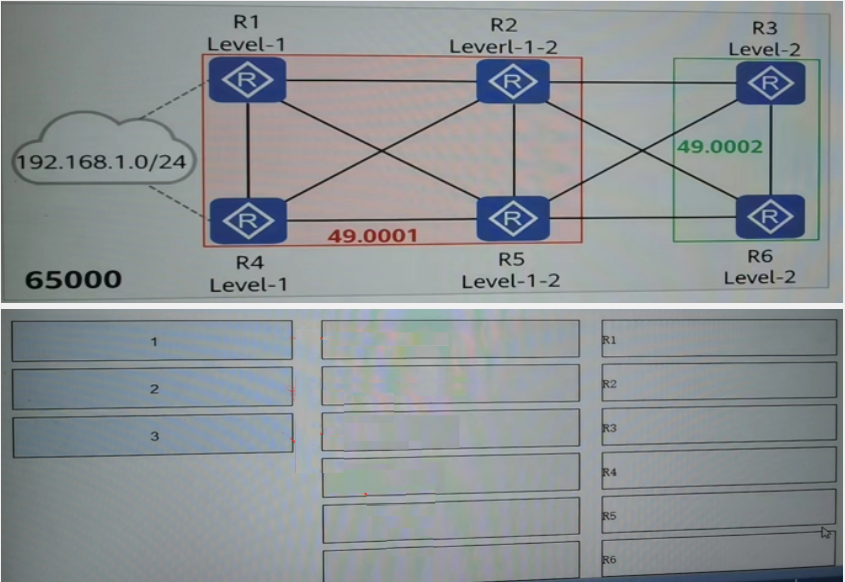

61 后的标签值为 (填空题)在MPLS网络中,倒数第二跳LSR(Label Switching Router)进行标签交换时,如果发现交换 则将标签弹出,并将报文发给最后一跳。(填写阿拉伯数字)：3

62 (填空题)某企业网络中既部署了VLAN聚合,又部署了MUXVLAN,且交换机连接终端的接口均为Acce ss接口,那么请将如图所示场景中,PC1"PC4与能访问的主机或服务器进行-一对应。(注意:不允许匹 配主机自己,如PC1不能匹配PC1)(Token可重复使用)(答案填写方式左侧从上往下为排序,右侧从上 往下排序,答案填写例如:1-1,2-3)

：1-2,2-1,5-3,5-4

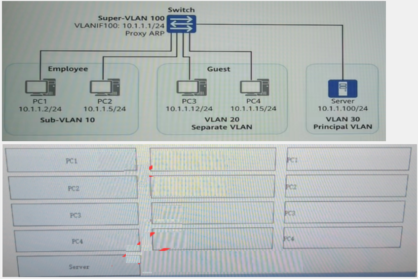

63 (连线题)如图所示的OSPF网络,区域1是NSSA区域,区域2是Stub区域,R4引入外部路由10.0.4.4/32. 每一台设备的Router ID为10.0.XX.其中X为设备的编号,在R1和R3的OSPF进程中均配置了"asbr-summa ry 10.0.4.0 255.255.255.0"命令,请将以下路由表中的路由条目与路由器匹配.

:1-4,2-3,3-2,4-1

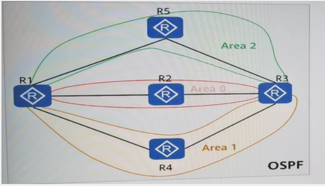

64 (连线题)如图所示的网络,R1和R2使用直连接口建立BGP邻居关系。在R2上有如图所示的Debug信 息,请根据该信息,将以下内容进行匹配。

：1-2,2-1,3-3,4-4

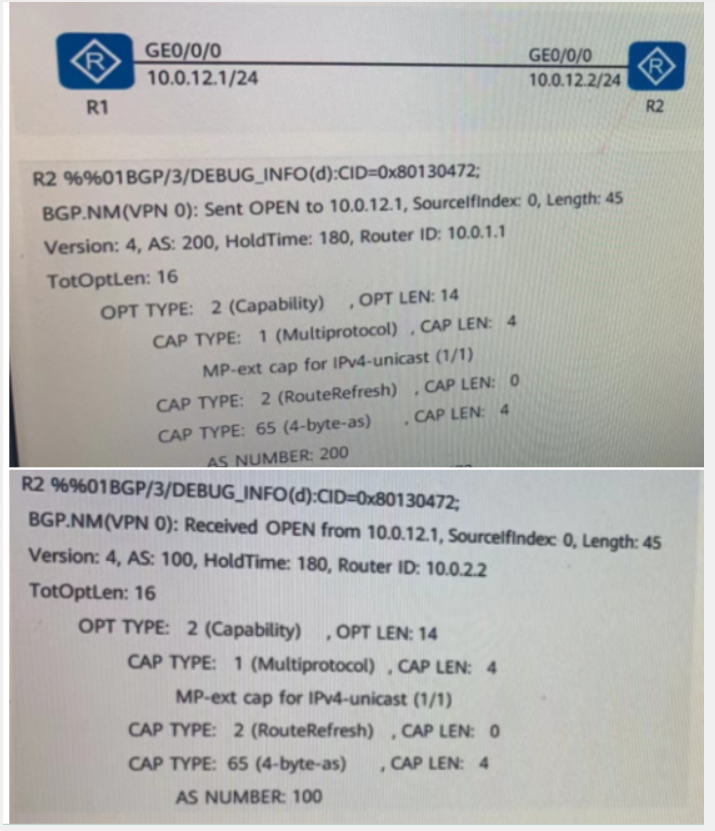

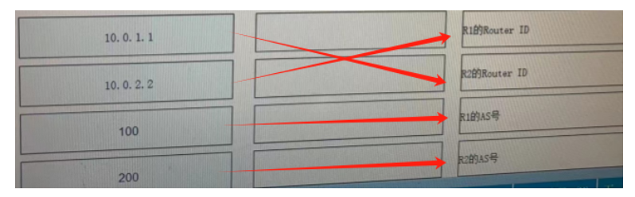

65 (连线题)OSPF网络发生故障时,需要经历以下几个过程才能实现流量路径切换,请对以下过程按照故障 恢复的处理步骤进行排序。

：1-1,2-2,3-3,4-4

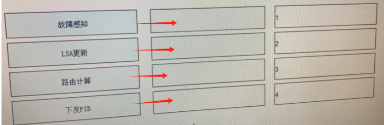

66 (连线题)如图所示的OSPF网络,请将左侧数值拖拽到正确的位置,使PC1访问PC2的流量为PC1-R1-R3 -R2-PC2;PC2访问PC1的流量为PC2-R2-R1-PC1。

:1-3,2-2,3-1

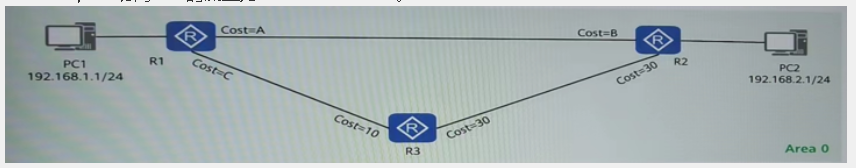

67 (连线题)MIPLS的体系结构分为控制平面和转发平面,如图所示为各个协议和表项的关系图,请将协议 和表项填入对应的位置。

:1-4,2-6,3-2,4-1,5-3,6-5

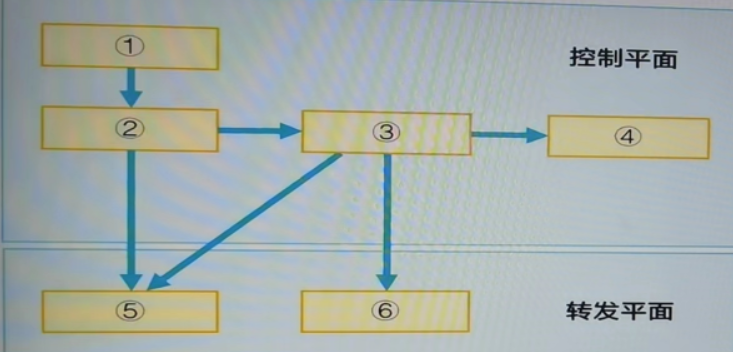

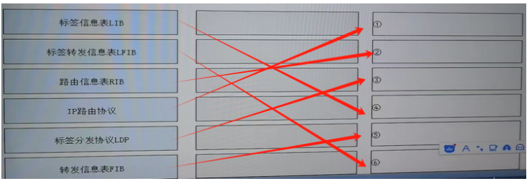

68 (连线题)管理员在配置交换机的端口安全功能时,同步开启了静态MAC地址漂移检测功能,若后续发生 静态Ac地址漂移现象,交换机就会根据配置的动作对接口做保护处理。请将接口安全保护动作的名称和操 作进行对应。

：1-2,2-3,3-1

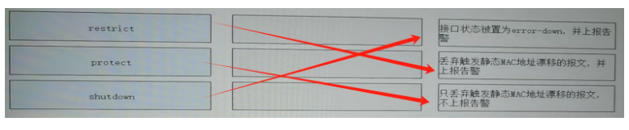

69 (连线题)在割接项目的准备阶段,需要执行软硬件检测,请将以下准备阶段的操作对象和相应的操作内 容进行匹配。

:1-3,2-1,3-2,4-4,5-5

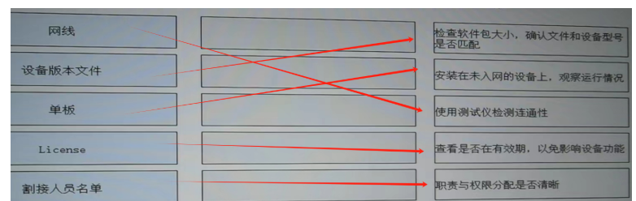

70 (连线题)某企业网络及VPN规划如图所示,请将业务流量可以互通的站点进行 -- 对应。

：1-2,2-1,3-4,4-3

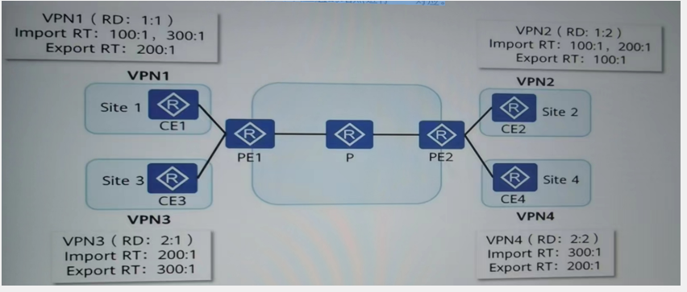

71 (连线题)一个OSPFv3网络中有三台路由器,在其中一台路由器上看到了如图所示的LSDB.请根据路由器 的Router ID,判断路由器的角色。

:1-2,2-1,3-3

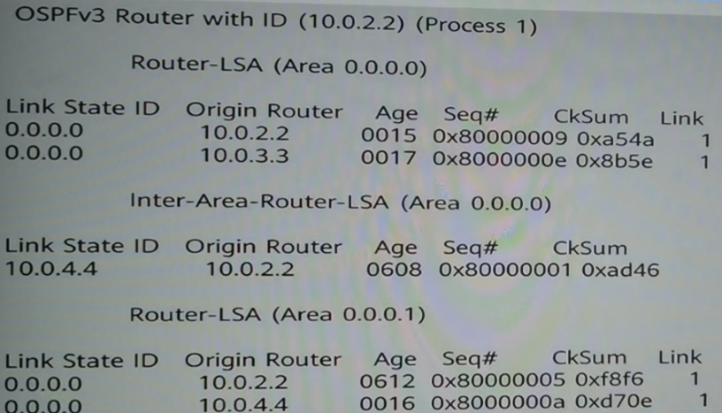

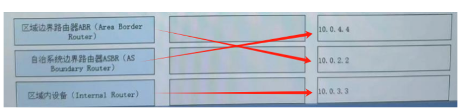
## 831-5
831-5

1 (单选题)管理员在交换机上配置了端口安全功能,并且将端口安全的保护动作设置为了restrict。那么当 交换机端口上安全MAC地址数达到限制后,收到源MAC地址不存在的报文时,会执行以下哪一个动作? ：丢弃该报文,并上报告警

2 (单选题)在PIM-SM组播网络中,网络工程师发现组播客户端无法接收组播数据,网络工程师列出了多 个原因,请问以下原因列表中的哪一项不会导致该现象? ：组播设备的下游接口禁止状态刷新报文的转发

3 (单选题)相比于OSPFv2的Hello报文,以下哪一字段是OSPFv3的Hello报文独有的字段? ：Interface ID

4 (单选题)如图所示的IS-IS IPv6网络,所有路由器均开启多拓扑功能。在R4 IS-IS进程中配置“ipv6 defa ult-route-advertise always leve1-1",缺省情况下,以下哪一台路由器的路由表中无缺省路由?

：R3

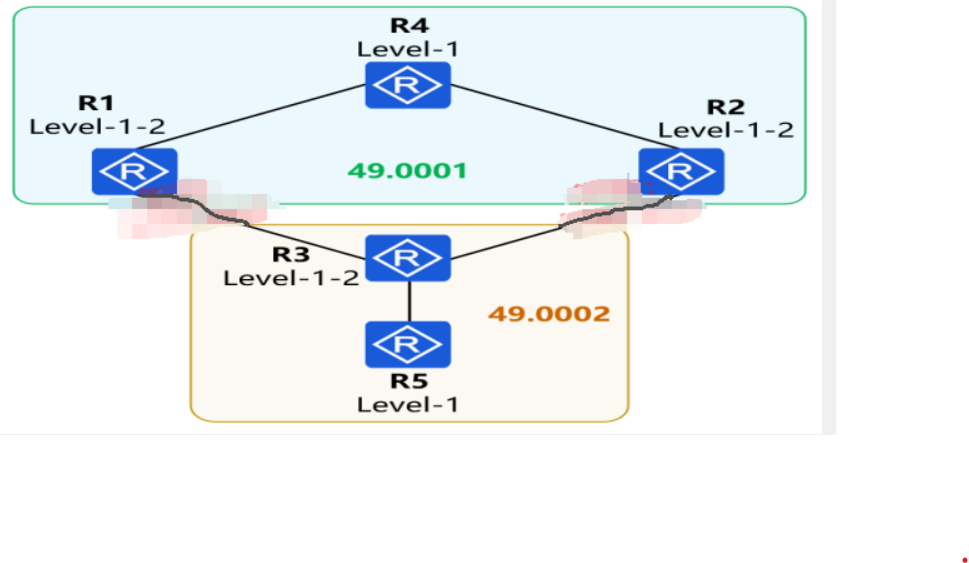

5 (单选题)如图所示的IS-ISIPv6网络,所有路由器均开启多拓扑功能。R4Loopback0接口的IPv6地址为2 000 :: 4/128。缺省情况下,以下哪一台路由器的路由表中无2000 :: 4/128的路由?

：R5

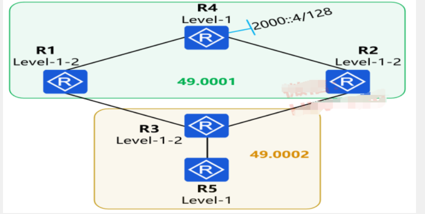

6 (单选题)某台IS-IS路由器自己生成的LSP信息如图所示,从LSP信息中不能推断出以下哪一结论?

：该路由器引入了4个外部网段

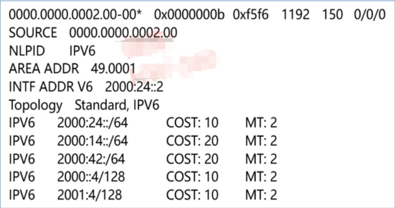

7 (单选题)网络工程师想要清除串口登录密码,需要输入以下哪一项?

：6

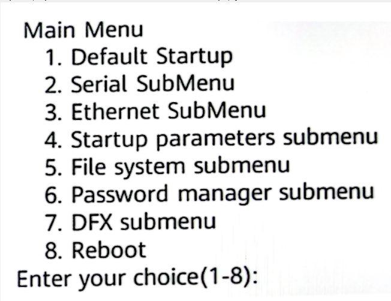

8 (单选题)如图所示的OSPFv3网络,区域1为Totally Stub区域,区域2为普通区域,区域3为Totally NSS A区域。R6 Loopback0接口的IPv6地址为2000:6/128。每一台设备的Router ID为10.0.XX,其中X为设 备的编号。以下描述错误的是哪一项?

：R1路由表中不存在2000:6/128的路由条目

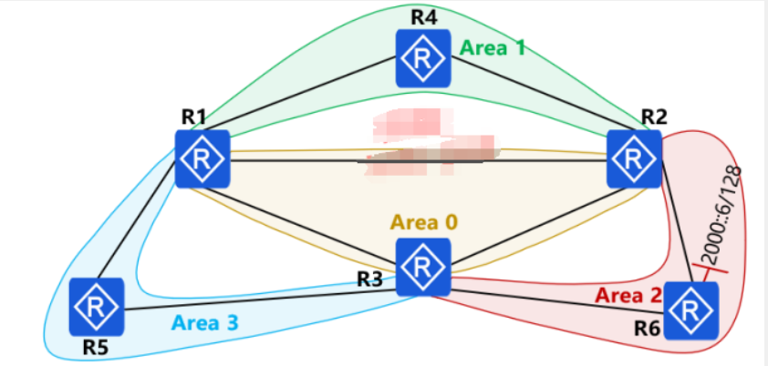

9 (单选题)如图所示的OSPFv3网络,区域1为Stub区域,区域2为普通区域,区域3为NSSA区域。R6 Loo pback0接口的IPv6地址为2000 :: 6/128。每一台设备的Router ID为10.0.XX,其中X为设备的编号。在R2 的区域1中配置了"stub no-summary",以下描述正确的是哪一项?

：R4 LSDB中存在R1生成的描述2000 :: 6/128的Inter-Area-Prefix-LSA

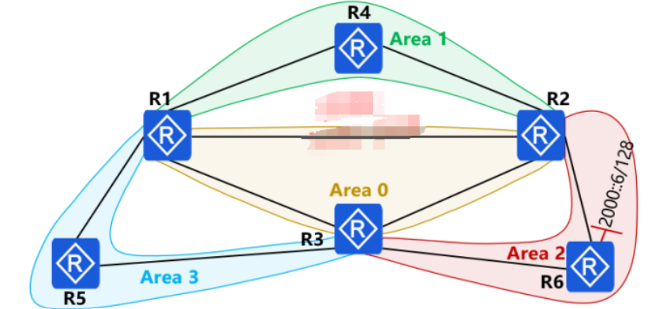

10 (单选题)如图所示的OSPFv3网络,区域1为Stub区域,区域2为普通区域,区域3为NSSA区域,R6 Loo pback0接口的IPv6地址为2000 :: 6/128,每一台设备的RouterlD为10.0.XX,其中X为设备的编号,以下 描述错误的是哪一项?

：R6 LSDB中存在R3生成的描述2000:6/128的Inter-Area-Prefix-LSA

11 (单选题)如图所示的OSPFv3网络,区域1为Stub区域,区域2为普通区域,区域3为NSSA区域。R5 Loo pback0接口的IPv6地址为2000 :: 5/128,通过import方式引入OSPFV3.每一台设备的Router ID为10.0.X. X,其中X为设备的编号。以下描述正确的是哪一项?

：R2在区域0生成Inter-Area-Router-LSA

12 (单选题)如图所示的OSPFv3网络,区域1为Stub区域,区域2为普通区域,区域3为NSSA区域,则以下 哪一种类型的LSA只会出现在区域2中?

：AS-External-LSA

13 (单选题)如图所示的OSPFv3网络,路由器之间使用以太网链路互联。缺省情况下,该网络中DR的数量 为以下哪一项?

：9

14 (单选题)管理员通过命令display mpls lsp查看设备的LSP,输出信息如图所示,以下关于该信息的描 述,正确的是哪一项?

：该设备转发目的IP地址为3.3.3.3的数据时,会打上标签1027再发送

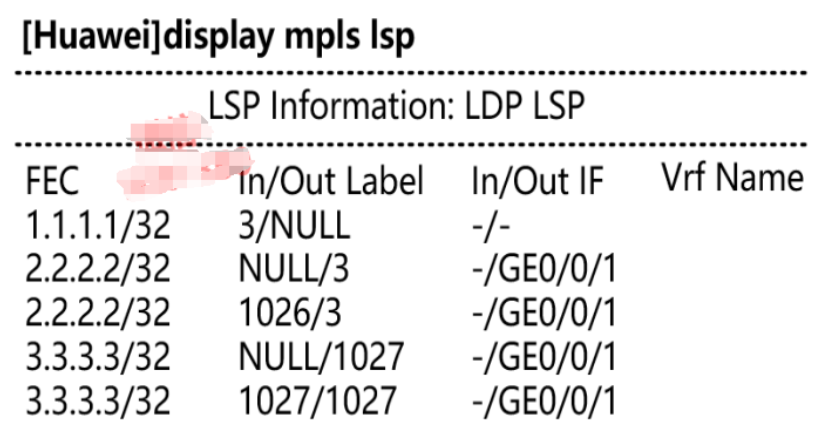

15 (单选题)灵活QinQ功能可以根据不同的内层报文来加上不同的外层Tag,那么以下关于灵活QinQ的tag 添加情况的描述,错误的是哪一项?

：灵活QinQ可以为具有不同TIL值的报文添加不同的外层VLAN Tag

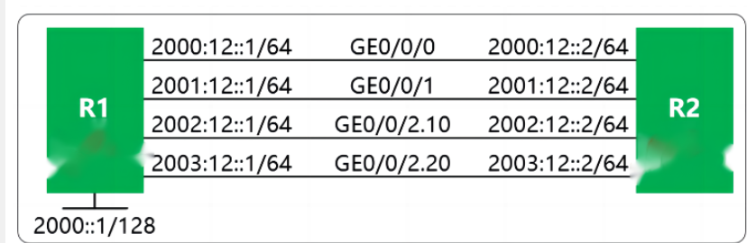

16 (单选题)R2设备上存在如图所示的文件信息当网络工程师使用"dir Iexclude 1"命令查看文件信息时, 会看到以下哪一个文件?

：dat

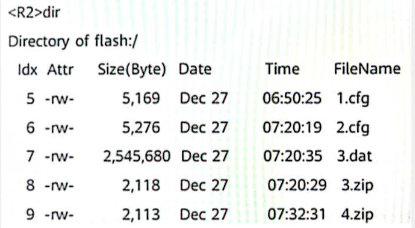

17 (单选题)如图所示的OSPF网络链路的Cost值已在图中标出,R1开启了OSPFIPFRR,且在OSPF进程中 配置了"maximumload-balancing 8"命令,如果某一业务经过R1-R5-R3这条路径到达10.0.3.3/32,则 该业务的备份出接口为以下哪一项?

:无备份出接口

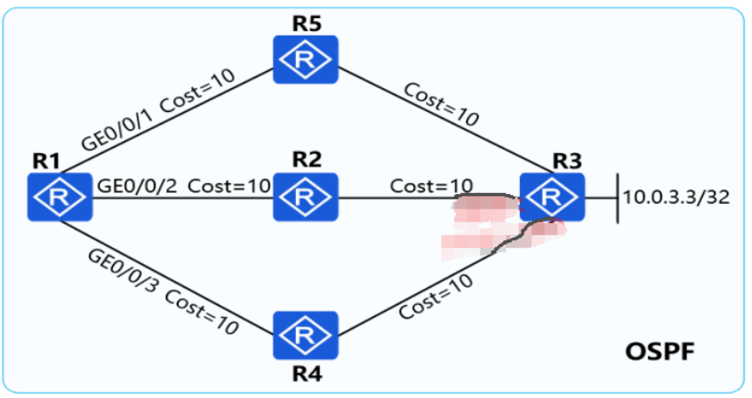

18 (单选题)如图所示的OSPF网络,链路的Cost值已在图中标出,R1开启了OSPF IP FRR,且在OSPF进程 中配置了“maximum load-balancing 1”命令,则R1到达10.0.3.3/32的备份出接口为以下哪一项?

：GE0/0/2

19 (单选题)如图所示的OSPF网络,链路的Cost值已在图中标出,R1开启OSPF IP FRR,则以下描述中错 误的是哪一项?

: 如果R1和S1之间的链路中断,由于R1开启了FRR,因此R1将直接使用备份路径到达R3

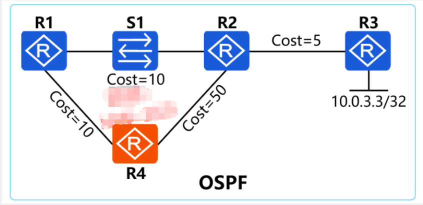

20 (单选题)在某MPLS网络中,R1和R2的LSP信息如图所示,此时管理员在R1上输入命令ping 3.3.3.3,那 么以下关于该场景的描述,正确的是哪一项?

：R1发出的Ping报文会携带标签1025,R2收到后将剥离标签基于IP进行转发

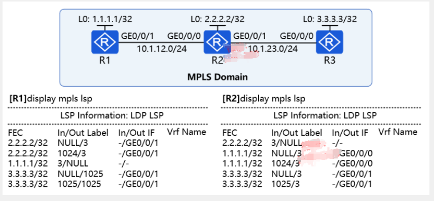

21 (单选题)如图所示为某多层标签嵌套的MPLS报文,那么S1、S2、S3这三个位置的S字段的取值,正确的 是哪一项?

：S1=0, S2=0, S3=1

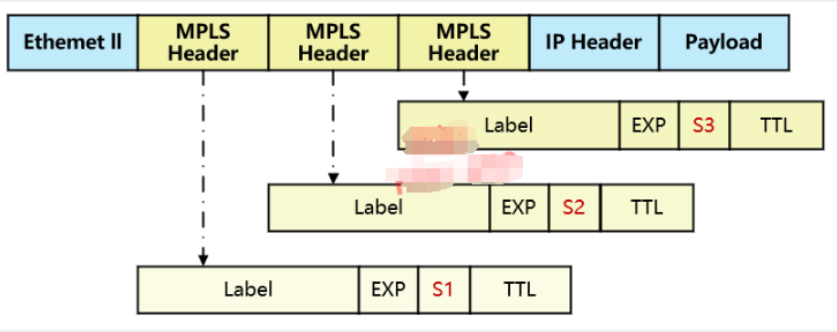

22 (单选题)如图所示的网络,相邻的路由器之间使用直连接口建立EBGP邻居关系。每台设备的RouterlD为 10.0.X.X,AS号为6500X,其中X为路由器的编号。R1和R4均有到达192.168.1.0/24的静态路由,通过i mport方式引入BGP,R1向邻居发送路由时添加了Community属性值(1:1),网络中所有路由器均使能了 传递团体属性的能力,R3上配置了路由策略,拒绝接收携带Community属性值为1:1的路由,则R3到达1 92.168.1.0/24的流量路径为以下哪一项?

：R3无到达192.168.1.0/24的路由

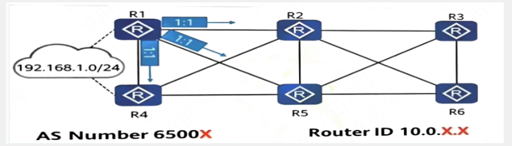

23 (单选题)如图所示的网络,相邻的路由器之间使用直连接口建立EBGP邻居关系AS号为6500X,其中X为 路由器的编号。R1和R4均有到达192.168.1.0/24的静态路由,通过import方式引入BGP。在R3上配置EB GP负载分担的最大等价路由条数为8。缺省情况下,则R3到达192.168.1.0/24的等价路由数量为以下哪一 项?

：2

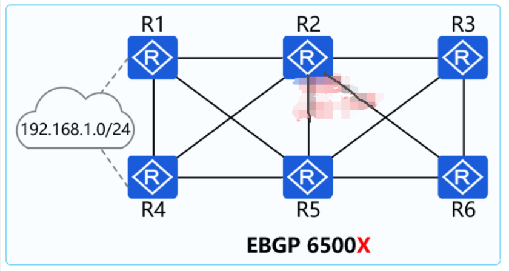

24 (单选题)网络工程师发现某一台设备的接口频繁出现链路故障告警,该接口为以太网光口,则网络工程 师使用以下哪一条命令可以检查该接口的收发光功率?：display transceiver

25 (单选题)网络工程师在设备上输入“dir",获取到以下选项中的文件名,请问以下哪一项最有可能是设备 的版本文件?：V300R022C00SPC100.cc

26 (单选题)网络工程师通过命令行误删了某个接口的IP地址,如果想要查看被删除的IP地址,应该查询以下 哪一种信息? ：Log信息

27 (单选题)在如图所示的BGP/MPLS IP VPN网络中,管理员通过Hub-spoke组网实现了Hub站点对VPN 流量的集中管控,那么以下各设备RT值的规划,正确的是哪一项?

:PE1 VPN1:IRT=100:1; ERT=200:1

PE2 VPN1: IRT=100:1; ERT=200:1

PE3 VPN in: IRT=200:1; VPN out: ERT=100:1

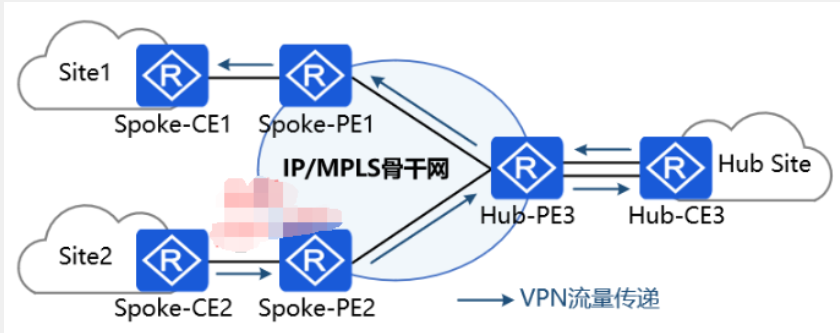

28 (单选题)流量接入骨干网时需进行VPN隔离此时某PE路由器接口配置如下所示,若管理员需要将该接口 绑定到VPN1,且接口IP地址保持不变,那么以下关于管理员操作的描述,正确的是哪一项?Interface Gig abitEthernet 0/0/1lpaddress 192.168.100.2 24 ：管理员在接口视图下键入命令ipbinding vpn-instance VPN1后,还需要重新配置接口IP地 址

29 (单选题)为了支持多拓扑功能,IS-IS新增加了以下哪一种TLV? : 229号TLV

30 (单选题)某台IS-IS路由器的进程中配置了"set-overload"命令,缺省情况下,该路由器重启后经过多长 时间退出过载状态? ：600s

31 (单选题)在IS-IS Level-1-2设备上配置以下哪-条命令可以使Leve1-1设备不生成缺省路由? : attached-bit advertise never

32 (单选题)在网络监控管理方式中,以下哪一项功能可以实现对设备日志的监控管理?

: Syslog

33 (单选题)两台路由器使用以太网接口互联,两个接口的IP地址不在同一个网段,假如将两个接口的OSPF 网络类型设置为P2P,则OSPF邻居会停留在,以下哪一个状态? ： Full

34 (单选题)在排除同-VLAN内的主机不能互通的故障时,以下描述中错误的是哪一项?

：执行display ip routing table命令查看是否存在到达主机的路由

35 (单选题)以下哪一选项不是OSPFv3中Link LSA的作用? ：向该链路上其他路由器通告本路由器的接口ID

36 (单选题)MPLS标签可以标识多少种优先级? ：8

37 (单选题)下列选项中,哪个关于DHCPSnooping的描述是错误的? ：在VLAN IF 接口视图下使能DHCP Snooping功能,则对该接口下的所有DHCP报文命令 功能生效

38 (多选题)如图所示的OSPF网络R1和R2通过OSPF实现Loopback0接口互通。同时,R1和R2开启了MPL SLDP功能,LDP传输地址为Loopback0接口的IP地址,网络工程师发现R1和R2无法建立LDP Session, 于是首先在R2上执行了如图所示的命令,在此基础上,请问以下哪些原因可能会导致R1和R2 LDP Session 无法建立?

A、R2 GEO/0/1接口拒绝接收目的IP地址为224.0.0.2的报文

B、R1 GE0/0/1接口拒绝接收TCP目的端口为646的报文

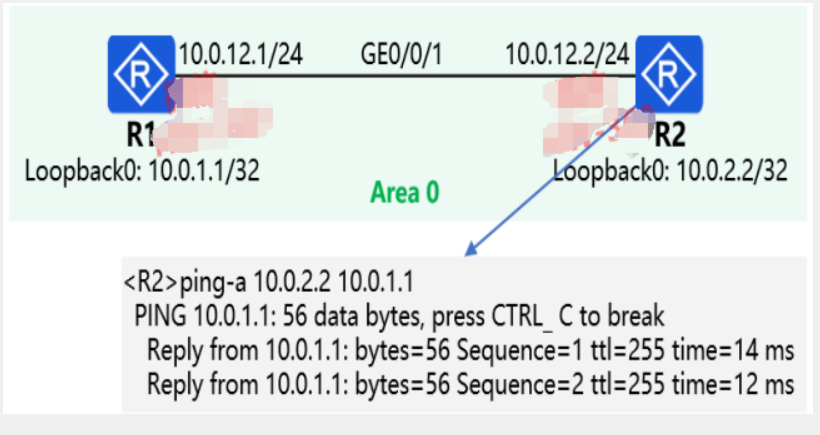

39 (多选题)如图所示的OSPF网络,链路的Cost值已在图中标出,R1开启OSPF IP FRR,则以下描述中正 确的有哪些项?

A、如果整个网络开启BFD检测功能(检测参数设为默认值),当R2和S1之间的链路中断时,R1 可以快速感知OSPF邻接关系故障

B、如果S1设备断电,则R1直接使用备份路径到达R3

D、如果R1和S1之间的链路中断,则R1直接使用备份路径到达R3

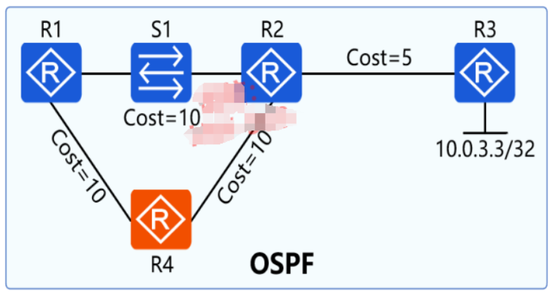

40 (多选题)如图所示,某管理员在路由器R1\~R4之间配置静态LSP,那么以下哪些选项的配置是正确的?

B. [R3] static-Isp transit test in-label 300nexthop 10.0.34.4 out-label 400

C. [R4] static-Isp egress test incoming.interface GigabitEthernet 0/0/0 in-labe400

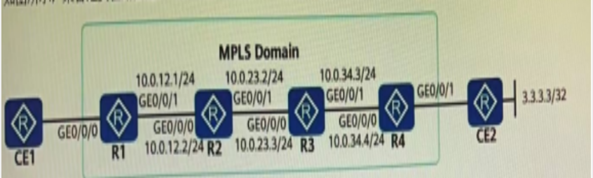

41 (多选题)某企业网络通过部署MUXVLAN功能,实现控制员工和访客之间的二层互通,那么关于如图所 示的场景,以下描述正确的有哪些项?

B、PC1与PC4之间无法二层互通

C、PC1\~PC4均可以访问Server

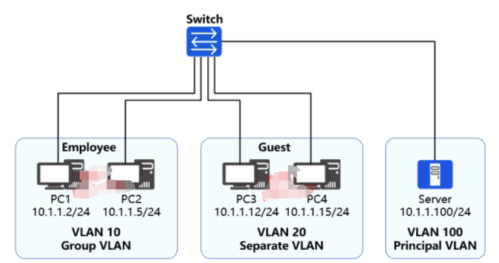

42 (多选题)如图所示的OSPFv3网络,R3 Loopback0接口的IPv6地址为2000:3/128,且使能OSPFV3。 以下描述中正确的有哪些项?

A、R2-定会生成Link-LSA

C、R3-定会生成Intra-Area-Prefix-LSA

D、R2生成的Link-LSA不会出现在R1的LSDB中

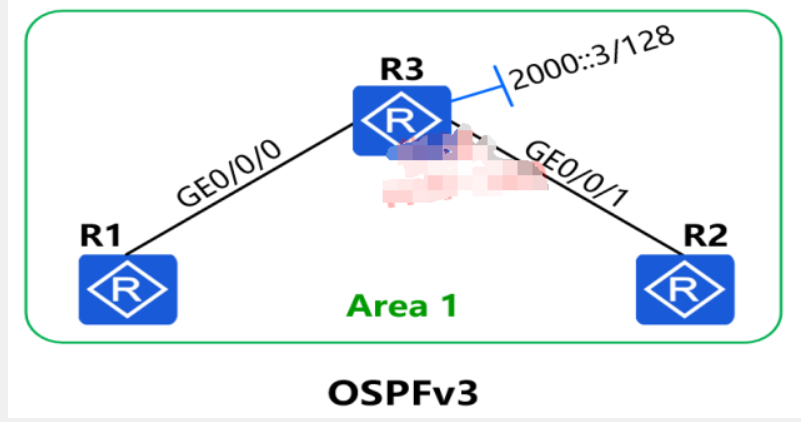

43 (多选题)端口安全是通过将接口学习到的动态MAC地址转换为安全MAC地址,包括安全动态MAC、安 全静态MAC和Sticky MAC,那么以下关于安全MAC地址的描述,正确的有哪些项?

B、安全动态MAC和Sticky MAC的区别是,前者设备重启后MAC表项会丢失

C、缺省情况下,这三种MAC地址信息都不会被老化

D、安全动态MAC和Sticky MAC都是将动态学习到的MAC地址转换成安全地址

44 (多选题)如图所示,R1与R2之间希望通过OSPFv3传递IPv6路由,已知两台路由器上均配置了0SPFv3, 进程号均为1,且OSPFv3邻居关系已正常建立,但查看R1路由表发现没有到达R2环回口地址的路由,以下 哪些选项可能会造成这种现象?

1.  R2 将环回口通告进了另外一个OSPFv3进程
2.  R2没有在环回口上使能 OSPFv3

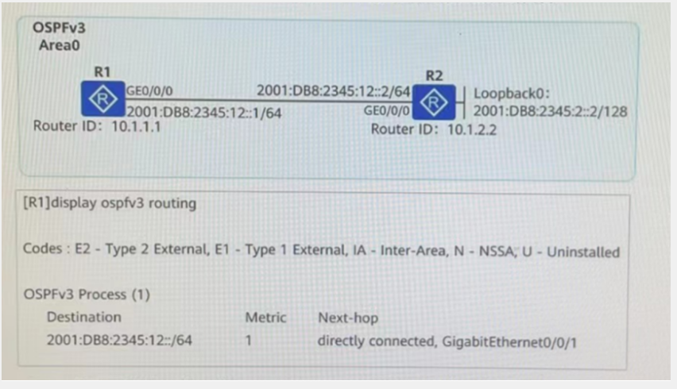

45 (多选题)网络管理员A希望使用ACL匹配特定的路由条目,请问以下哪些路由条目将被下列的ACL规则匹配?

acl number 2000

rule 10 permit source 10.0.0.0 0.0.6.0

1.  10.0.6.0/24
2.  10.0.4.0/24

46 (多选题)网络管理员A希望使用IP Prefix List匹配特定的路由条目,请问以下哪些路由将被图中的IP Prefi x List配? ip-prefix TEST permit 10.0.0.0 24 lessteqial 30

A. 10.0.0.1/30

B. 10.0.0.0/24

47 (多选题)若在交换机上执行如图所示的配置命令,则下列哪些选项中的描述是正确的?

B、当前配置可以用来防止DHCP Server仿冒者攻击

C、当该交换机收到DHCP请求报文时若该报文中没有Option82选项,则插入option82 选 项 D、若有一台DHCP服务器接入该交换机的GEO/0/1,则该DHCP服务器可以正常地为DHCP客 户端分配地址

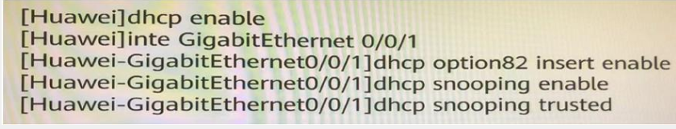

48 (多选题)如图所示的PIM-SM组播网络,R3为RP所有路由器运行OSPF,且每条链路的Cost值相等R2和 R4配置了永远不发起SPT切换,则Receiver1和Receiver2接收组播数据流的稳定路径分别是以下哪项?

1.  Receiver1:Sourcel-R1-R2-R3-R4 Receiver1
2.  Receiver2:Sourcel-R1-R2-R3-R2 Receiver2 Receiver2 Receiver1

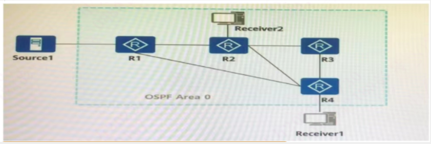

49 (判断题)如图所示的网络,R1和R2建立EBGP邻居关系,R1通过“network 2000 :: 1/128命令引入Loop back接口的路由,在R1发送的更新报文中Next Hop属性(公认必遵属性)的取值为2000:12:1。A、正确

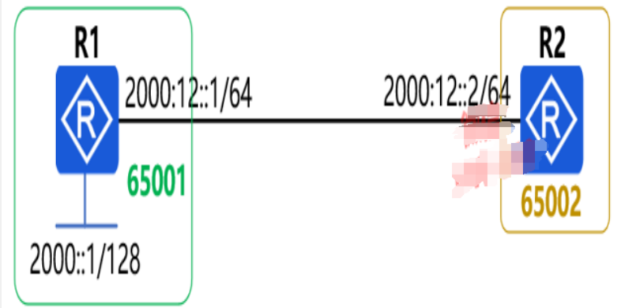

50 (判断题)为了保证LDP消息的可靠发送LDP的Discovery消息、Session消息、Advertisement消息和Not ification消息都使用TCP传输。B、错误

51 (判断题)交换机的某个接口处于error-down状态,可能是由于该接口接收到的广播报文的平均速率超过 了管理员在风暴控制中设置的最大阈值。 A、正确

52 (判断题)某企业网络如图所示,若CE2双归属PE2和PE3,有可能产生Type5LSA路由环路,可以通过在P E2和PE3设备上设置route-tag命令来进行防环,当PE3收到的路由的Route Tag与本地配置的一样,则会 忽略该路由。A、正确

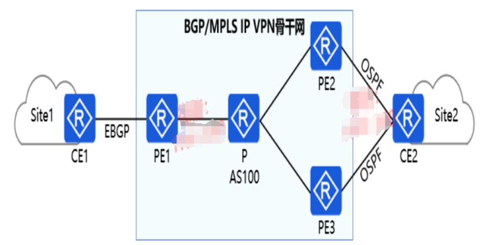

53 (判断题)每个OSPFv3路由器都会为每个链路产生一个Link-LSA,描述此链路上的link-local地址、IPv6 前缀地址以及接口编号等信息,并提供将会在Network-LSA中设置的链路选项,它仅在本链路内传播。B、错误

54 (判断题)MPLS支持多层标签嵌套,当设备收到MPLS报文后,会先处理靠近二层首部的标签,即栈顶M PLS标签。 A、正确

55 (判断题)IP报文在MPLS网络中经过的路径称为标签交换路径LSP,LSP是一个双向路径,指明了数据流 的传递方向。 B、错误

56 (判断题)在路由器上使用"display version\| begin uptime"命令,则输出信息的首个单词为"uptime"。 A、正确

57 (填空题)请将左侧的时间与右侧的描述进行匹配。(Token可重复使用)

：1-2,1-3,2-1

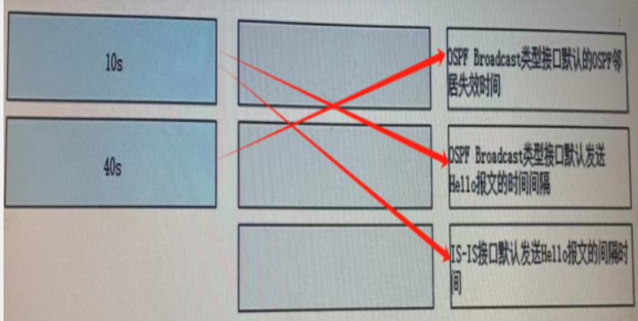

的 (填空题)如图所示的网络,R1、R2、R4、R5运行IS-IS,区域号为49.0001,R3、R6运行IS-IS,区域号 为49.0002。AS 65000内部R1、R3、R4、R6均与R2、R5建立IBGP邻居关系,其中R2、R5是RR,R1、 R4、R3、R6是客户端。IBGP邻居关系均使用Loopback0接口建立。R2和R5之间也建立IBGP邻居关系, 且配置相同的cluster ID,IBGP邻居关系均使用Loopback0接口建立。每台设备的Loopback0接口的IP地 址为10.0.X.X/32,Router ID为10.0.X.X,其中X为设备的编号。R1和R4将外部网络192.168.1./24通过i mport方式引入BGP。针对于192.168.1.0/24,请根据"display bgp routing-table"输出信息中有效路由 5行数量进配。

：1-1,2-2,2-3,2-5,2-6,3-4

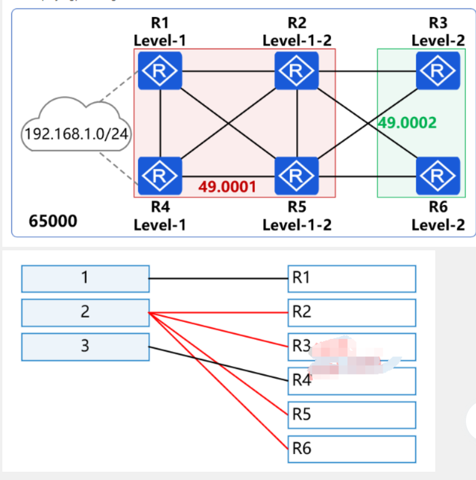

59 (填空题)在BGP/MPLSIP VPN中,通过()区分使用相同地址空间的IPv4前缀,此时的IPv4地址称为VP NV4地址。(填写缩略语,所有字母大写) ： RD

60 (填空题)如图所示的OSPFv3网络,R2的LSDB中有 条Link-LSA。(填写阿拉伯数字)：4

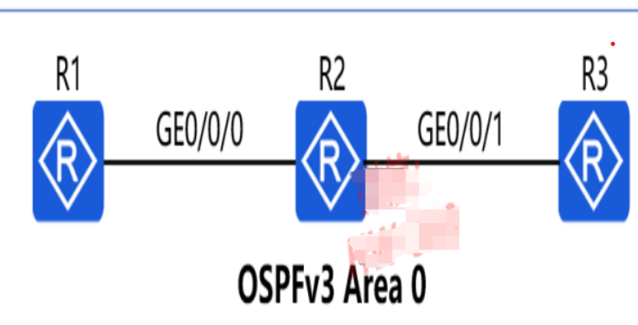

61 (填空题)如图所示的网络,R2与R1之间部署OSPF协议。R2与R3之间部署IS-IS协议,为了让R1能获取 到达10.0.3.3/32的路由在R2上做了将IS-IS路由引入OSPF路由的操作,则在R1的路由表中,到达10.0.3.3/3 2的下一跳地址为 。 ：10.0.23.3

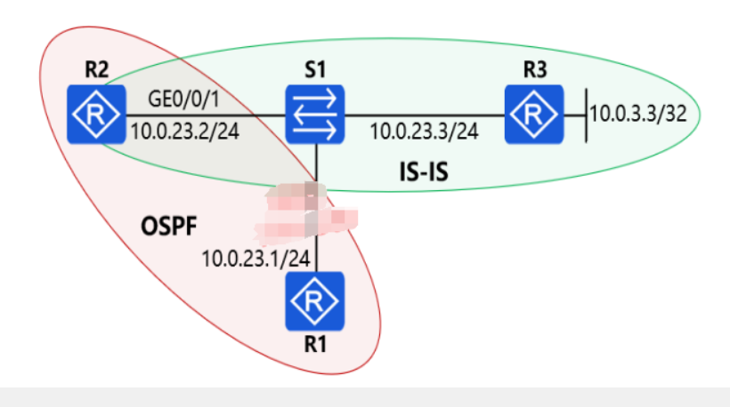

62 (连线题)如图所示的OSPF网络,请将左侧数值拖拽的正确的位置,使PC1访问PC2的流量为PC1-R1-R3 -R2-PC2:PC2访问PC1的流量为PC2-R2-R1-PC1.

：1-3，2-1，3-2

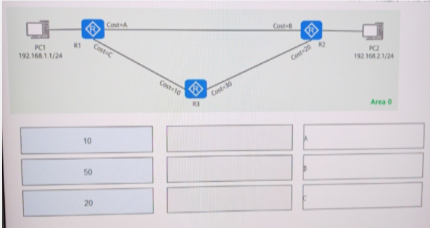

