---
tags:
  - HCIP-Datacom
comment: false
---
# 题库
## 初级-01

1.关于PPP的部署和配置，下面说法正确的是：PPP支持CHAP和PAP两种认证方式

2.以太网数据帧的Length/Type字段获取以下哪个值时，表示承载的是PPPoE发现阶段的报文：0x8863

3.如下图所示的网络，路由器A使用手工模式的链路聚合，并且把G0/0/1和G0/0/2端口均加入聚合组1，关于Router A聚合端口1的状态说法错误的是：同时关系Router B的G0/0/1和G0/0/2端口，Eth-Trunk 1 protocol up

4.交换机某个端口配置信息如下，则此端口发送携带哪个VLAN TAG数据帧时，剥离VLAN TAG：10

5.交换机某个端口配置信息如下，则此端口在发送携带哪些VLAN的数据帧时剥离VLAN TAG：1，4，6

6.Access端口发送数据帧时如何处理：剥离TAG转发

7.如下图，管理员在Router上进行了如上配置，那么连接在该路由器的G1/0/0接口下的每一台主机，能够通过DHCP获取到什么样的IP地址：该主机获取的IP地址属于10.10.10.0/24网络

8.某公司网络管理员希望能够远程管理分支机构的网络设备，则下面哪个协议会被用到：Telnet

9.OSPF协议的HELLO报文中不包括以下哪个字段：sysname

10.下列哪个属性不能作为衡量Cost的参数：sysname

11.OSPF协议封装在以下哪种数据包内：IP

12.如下图所示的网络，管理员希望Router A使用静态路由的方式，指定优先通过G0/0/1端口发送数据包给Router B，则在Router A输入哪条命令可以实现此需求：ip router-static 10.0.2.2 255.255.255.255 10.0.12.2    ip route-static 10.0.2.2 255.255.255.255 10.0.21.2 preference 70

13.如下图所示的网络，所有路由器运行OSPF协议，链路上方为Cost值的大小，则RA到达网络10.0.0.0/8的路径为：A-C-D

14.下列关于RSTP协议中Backup端口说法正确的是：Backup端口作为指定端口的备份，提供了另一条从根桥到相应网段的备份通路

15.如图所示，关于此网络拓扑图描述正确的是：此网络中有2个广播域

16.生成树协议中端口ID总长度是多少bit：16

17.如下图所示，所有主机之间都可以正常通行，则SWB MAC地址和端口的对应关系正确的是：MAC-A G0/0/3 MAC-B G0/0/3 MAC-C G0/0/1

18.如下图所示，下列交换机的哪个端口会处于阻塞状态：SWC的G0/0/1

19.Tracert诊断工具记录下每一个ICMP TTL超时消息的（），从而可以向用户提供报文达到目的地所经过的IP地址：源IP地址

20.缺省情况下，在以太网链路上发送OSPFv3 HELLO报文的周期为多少秒：10

21.DHCPv6请求报文目的地址为：FF02::1:2

22.OSPFv3的邻接关系建立后的状态为：Full

23.缺省情况下在SNMP协议中，代理进程使用哪个端口号向NMS发送告警消息：162

24.如下图所示的网络，要求主机B所在的网络通过Easy IP的方式访问Internet，则在路由器的G0/0/3接口需要使用下列哪个ACL：acl number 2000 rule 5 permit source 10.0.12.0 0.0.0.255

25.PPPoE客户端使用哪种方式向Server发送PADI报文：广播

26.某台路由器配置信息如下，则对端路由器使用哪个用户名和密码的组合可以使PPP随路完成认证：用户名：test 密码：test

27.PPP帧格式中的Protocol字段为0xC223，表示该协议是：CHAP

28.基于端口划分VLAN的特点是：主机移动位置需要重新配置VLAN

29.VLAN标签中的Priority字段可以标识数据帧的优先级，此优先级的范围是：0-7

30.VLANIF接口通过数据帧的哪个信息判断进行二层转发或者三层转发：目的MAC

31.交换机某个端口输出配置信息如图，下列说法错误的是：如果数据帧携带的VLAN TAG为100，则交换机剥离VLAN TAG发出

32.华为设备可以使用Telnet协议进行管理，关于该管理功能，以下哪个说法是正确的：Telnet必须开启VTY端口，且最大为15

33.DHCP客户端想要离开网络时发送哪种DHCP报文：DHCP RELEASE

34.如果DHCP客户端申请的IP地址已经被占用时，DHCP服务器会使用哪种报文作为应答：DHCP NAK

35.路由器表由多个要素组成，下列说法错误的是：NextHop显示此路由的本地接口地址

36.下列哪个命令可以查看OSPF是否已经正确建立邻居关系：display ospf peer

37.以下关于静态路由说法错误的是：路由器之间需要交换路由信息

38.如下图所示的网络，在路由器输入下列哪些命令可以使主机A能够Ping通主机B:Router A:ip route-static 0.0.0.0 0.0.0.0 11.0.12.2 Router B:ip route-static 0.0.0.0 0.0.0.0 11.0.12.1

39.下图所示的两台交换机都开启了STP协议，哪个端口最终会处于Blocking状态：SWB的G0/0/3端口

40.在STP协议中，假设所有交换机所配置的优先级相同，交换机1的MAC地址为00-e0-fc-00-00-40，交换机2的MAC地址为00-e0-fc-00-00-10，交换机3的MAC地址为00-e0-fc-00-00-20，交换机4的MAC地址为00-e0-fc-00-00-80，则根交换机应当为：交换机2

41.缺省情况下，STP协议Forward Delay时间是多少秒：15

42.STP协议的配置BPDU报文不包含以下哪个参数：VLAN ID

43.如图所示，两台交换机使用默认参数运行STP，交换机A上使用了配置命令 STP root primary，交换机B上使用了配置命令 STP priority 0，则下面哪个端口将会被阻塞：交换机 A 的 G0/0/2

44.现有交换机MAC地址表如下，下列说法正确的有：MAC 地址 5489-9811-0b49 是由管理员手工配置

45.VRP 操作系统命令划分为访问级、监控级、配置级、管理级 4 个级别。能运行各种业务配置命令但不能操作文件系统的哪一级：配置级

46.主机的 IPv4 地址为 200.200.200.201 / 30，拥有下列哪个 IPv4 地址的主机和其通信不需要经过路由器转发：200.200.200.202

47.网络管理员在网络中捕获到了一个数据帧，其目的 MAC 地址是 01-00-5E-A0-B1-C3。关于该 MAC 地址的说法正确的是：它是一个组播 MAC 地址

48.以下哪项不是 CSMA/CD 的工作原理：延迟固定时间后重发

49.如下图所示的网络，当 OSPF 协议稳定后，Router A 和 Router B 的邻居状态为：Full

50.如图所示的网络中，下列描述正确的是：
SWA 与 SWC 之间的网络为同一个广播域；
SWA 与 SWC 之间的网络为同一个冲突域

51.DHCP包含以下哪些报文类型：
DHCP DISCOVER；
DHCP REQUEST；
DHCP OFFER

52.下面哪些是路由协议：
BGP；
OSPF

53.OSPF协议DR和BDR的作用有：
减少邻接关系的数量；
减少链路状态信息的交换次数

54.如下图示的网络，路由器A和路由器B建立OSPF邻居关系，路由器A的 OSPF 进程号为1，区域号为0，以下哪些方式可以使路由器B获得主机A所在网段的路由：全选

55.下列关于缺省路由的说法正确的有：
在路由表中，缺省路由以到网络0.0.0.0（掩码也为0.0.0.0）的路由形式出现；
如果报文的目的地址不能与路由表的任何目的地址相匹配，那么该报文将选取缺省路由进行转发

56.[R1] ospf [R1-ospf-1]area 1 [R1-ospf-1-area-0.0.0.1]network 10.0.12.0 0.0.0.255 如配置所示，管理员在R1上配置了OSPF，但R1学习不到其他路由器的路由，那么可能的原因是：
此路由器没有配置认证功能，但是邻居路由器配置了认证功能；
此路由器配置的区域ID和它的邻居路由器的区域ID不同；
此路由器在配置OSPF时没有宣告连接邻居的网络

57.下列关于OSPF邻居状态说法正确的有：
Exchange状态下路由器相互发送包含链路状态信息摘要的DBD报文，描述本地LSDB的内容；
OSPF的主从关系是在ExStart态下形成的；
路由器LSDB同步之后，转化为Full状态

58.以下哪些MAC地址不会老化：
黑洞MAC地址；
静态MAC地址

59.某路由器输出信息如下，下列说法正确的有：
当前使用的VRP版本文件和下次启动使用的VRP文件相同；
当前使用的配置文件和下次启动使用的配置文件不同

60.IPv4首部中的哪些字段和分片相关：
Fragment Offset；
Flags；
Identification

61.MPLS头部包括以下哪些字段：
Label；
EXP；
TTL

62.以下哪些字段是IPv6和IPv4报文头中都存在的字段：
Source Address；
Version；
Destination Address

63.某台路由器配置信息如下，下列说法正确的有：
域名为huawei的域没有使用计费方案；
域名为huawei的域采用的授权方式为本地授权

64.如下图所示的网络，网络管理员在进行流量规划时希望主机A发往主机B的数据包经过路由器之间的G0/0/3接口，主机B发往主机A的数据包经过路由器之间的G0/0/4接口，下列哪些命令可以实现这个需求：Router A:ip route-static 0.0.0.0 0.0.0.0 11.0.12.2；Router B: ip route-static 0.0.0.0 0.0.0.0 11.0.12.5

65.ip route-static 10.0.2.2 255.255.255.255 10.0.12.2 preference 20，关于此命令说法正确的是：
该路由可以指导目的IP地址为10.0.2.2的数据包转发；
该路由优先级为20；
该路由的NextHop为10.0.12.2

66.下列描述正确的是：
通过不同路由协议获得的路由，其优先级也不相同；
不同路由协议所定义的度量值不具有可比性

67.如下图所示的网络，下列哪些命令可以使Router A可以转发目的IP地址为10.0.3.3的数据包：
ip route-static 10.0.3.3 255.255.255.255 10.0.12.2；
ip route-static 10.0.2.2 255.255.255.255 10.0.12.2 ip route-static 10.0.3.3 255.255.255.255 10.0.2.2；
ip route-static 0.0.0.0 0.0.0.0 10.0.12.2

68.运行STP协议的交换网络在进行生成树计算时用到了以下哪些参数：
根路径开销；
端口ID；
桥ID

69.RSTP协议比STP协议增加了哪种端口角色：
Alternate端口；
Backup端口

70.下图所示的两台交换机都开启了STP协议，某工程师对此网络做出了如下结论，你认为正确的结论有：
SWB的G0/0/2端口稳定在Forwarding状态；
SWA的G0/0/2端口稳定在Forwarding状态；
SWA的G0/0/3端口稳定在Forwarding状态

71.如下图所示，交换机开启STP协议，当网络稳定后，下列说法正确的有：
SWA是这个网络中的根桥；
SWB的两个端口都处于Forwarding状态

72.以下哪些存储介质是华为路由器常用的存储介质：
SDRAM；
NVRAM；
Flash；
SD Card

73.使能Proxy ARP功能的路由器收到一个ARP请求报文时，发现其所请求的IP地址不是自己，则会进行如下哪些操作：
如果查到有到该目的地址的路由，则将自己的MAC地址发给ARP请求方；
查找有无到该目的地址的路由

74.如果以太网数据帧 Length / Type = 0x0806，下列说法正确的是：
此数据帧为 Ethernet II 帧；
此数据帧的源 MAC 地址一定不是 FFFF-FFFF-FFFF

75.在华为设备上，如果使用 AAA 认证进行授权，当远程服务器无响应时，可以从网络设备侧进行授权：正确

76.NAT在使用动态地址池时，地址池中的地址可以重复使用，即同一IP同时映射给多个内网IP：错误

77.交换机的端口在发送携带VLAN TAG和PVID一致的数据帧时，一定剥离VLAN TAG转发：错误

78.Telnet基于TCP协议：正确

79.在广播型的接口上配置静态路由时，可以通过指定下一跳地址或出接口来配置静态路由：错误

80.网络结构和 OSPF 分区如图所示，图中除了 R1 之外，路由器 R2、R3 和 R4 都是 OSPF 的 ABR 路由器：错误。

81.当运行标准 STP 协议的交换机某个端口收到次优的 BPDU 时，立刻从此端口发送自己的配置 BPDU：错误。

82.交换机组成的网络不开启 STP，一定出现二层环路：错误。

83.运行STP协议的交换机，只有在本交换机某个端口出现故障时才会发送TCN BPDU：错误

84.缺省情况下，交换机的桥优先级取值是32768：正确

85.运行 STP 协议的交换机，端口在任何状态下都可以直接转化为 Disabled 状态：正确

86.VRP操作平台中pwd和dir命令都可以查看当前目录下的文件信息：错误

87.VLSM可以扩大任意IP网段，包括D类地址：错误

88.ARP协议能够根据目的IP地址解析目标设备MAC地址，从而实现链路层地址与IP地址的映射：正确

89.SR（SegmentRouting）将网络中的目的地址前缀 / 节点和邻接定义为段，并且为这些段分配 SID（Segment ID）。通过对 Adjacency SID（邻接段）和 Prefix/Node SID（目的地址前缀 / 节点段）进行无序排列（Segment List），就得到一条转发路径：错误。

90.如图所示的网络，所有接口开启OSPFv3协议，则Router A和Router B不能建立邻接关系：正确

91.从安全性来讲，IPSec隧道模式优于IPSec传输模式：正确。

92.如果报文匹配 ACL 的结果是 “拒绝”，该报文最终被丢弃：错误

93.运用 IKE 协议为 IPSec 自动协商建立 SA，可以支持在协商发起方地址动态变化情况下进行身份认证：正确...

94.两台路由器之间转发的数据包一定不携带VLAN TAG：错误。

95.标签为 VLAN10 的数据帧可以在两台交换机之间正常转发：正确

96.DHCP REQUEST报文一定是以广播形式发送的：错误。

97.对于到达同一个目的网络的多条路径，路由器需要通过比较Preference值的大小进行选择，如果Preference相同，则依据Cost值的大小进行选择：正确

98.对于到达同一个目的网络的多条路径，路由器需要先比较 Cost 值的大小进行选择，如果 Cost 取值相同，则依据 Preference 值的大小进行选择：错误

99.VRP 界面下，使用命令 delete 或 unreserved vrpcfg.zip 无法删除文件，必须在回收站中清空，才能彻底删除文件：正确

100.主机 A 和主机 B 不能通信：错误

## 初级-02
1

(单选题)IPv6组播地址标志字段(Flag)取值为以下哪个时表示该组播地址是一个临时组播地址?

B 1

2

(单选题)如下图所示,IPSec采用隧道模式,则ESP加密的范围是?

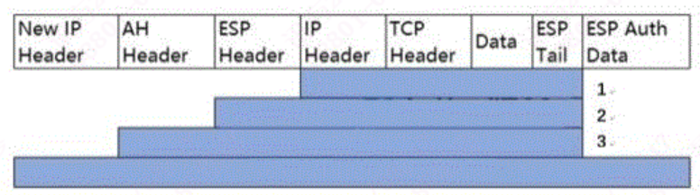

A, 1

(单选题)NAPT允许多个私有IP地址通过不同的端口号映射到同一个公有IP地址上,则下面关于NAPT中端口号描述正确的是()。

D、不需要做任何关于端口号的配置

(单选题)ARG3系列路由器和X7系列交换机上一个Eth-Trunk接口最多能加入多少个成员端口?

B 8

(单选题)如下图所示的网络,所有链路均是以太网链路,并且所有路由器运行OSPF协议,则整个网络中选举几个DR?

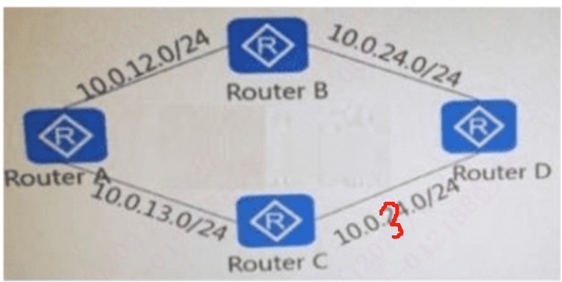

D．4

(单选题)OSPF协议在进行主从关系选举时依据以下哪个参数?

B. Router ID

(单选题)以下关于直连路由说法正确的是?

C、直连路由优先级最高

(单选题)在路由表中存在到达同一个目的网络的多个NextHop

路由条目),这些路由称之为?

◎ A、等价路由

(单选题)如图所示,四台交换机都运行STP,各种参数都采用默认值。在根交换机某端口发送堵塞并无法通过该端口发送配置BPDU时,网络中blocked端口在多久之后会进入到转发状态?

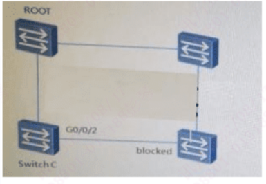

◎ B、约50秒

(单选题)下图中所有交换机都开启了STP协议,假设所有端口的路径开销值都为200。则SWD和的G0/0/4端口收到的配置BPDU报文中包含的跟路径开销值是多少?

B.200

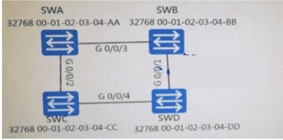

(单选题)RSTP协议中,当根端口失效的情况下,()就会快速转换为新的根端口并立即进入转发状态。

D、Alternate端口

(单选题)\<Huawei\>Warning:Auto-Config is working.Before configuring the device,stop Auto-Confi

g.If you performconfigurations when Auto-Config is running,the DHCP, routing,DNS,and VTY configur

ations will be lost.Do you want to stop Auto-config?[Y/N]:管理员发现设备弹出了上面的提示信息,关于此信息说法正确的是()。(已确认)

1.  设备第一次启动时,自动配置功能是启用的

(单选题)以太网光接口只能工作在()模式。

1.  全双工

(单选题)下列哪一个不可能是IPv4数据包首部长度?

B、64B

(单选题)一个IPv4数据包首部长度字段为20B,总长度字段为1500B,则此数据包有效载荷为?

C. 1480B

(单选题)采用MPLS标签双层嵌套技术的报文比原IP报文多了多少个字节?

B、8

(单选题)段路由SR(Segment Routing)是基于什么理念而设计的在网络上转发数据包的一种协议?

D、源路由

(单选题)DHCPv6客户端发送哪个报文,请求DHCPv6服务器为其分配IPv6地址和网络配置参数?

A, Solicit

(单选题)IPv6报文头的哪个字段可以用于QoS?

C. Traffic Class

(单选题)如果一个接口的MAC地址为OEEO-FFFE-OFEC,则其对应的EUI-64地址为?

A, OCEO-FFFF-FEFE-OFEC

(单选题)以下那条命令配置认证模式为HWTACACS认证?

D. authentication-mode hwtacacs

(单选题)如下图所示,IPSec传输模式中AH协议认证的范围是?

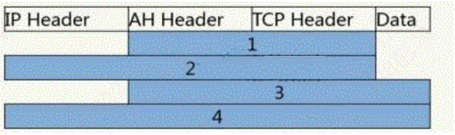

D4

(单选题)在如图所示的数据包封装格式中,下面哪些字段将会被IPSec VPN的ESP协议加密?

D. TCP Header,Data,ESP Trailer

(单选题)在SNMP中应用如下ACL:则下列说法错误的是?

acl number 2000

rule 5 permit source 192.168.1.2 0

rule 10 permit source 192.168.1.3 0

rule 15 permit source 192.168.1.4 0

1.  IP地址为192.168.1.5的设备可以使用SNMP服务

(单选题)如图所示,网络管理员在SWA与SWB上创建VLAN2,并将两台交换机上连接主机的端口配置为Access端口,划入VLAN2。将SWA的G0/0/1与SWB的G0/0/2配置为Trunk端口,允许所有VLAN通过。则要

实现两台主机间能够正常通信,还需要()。

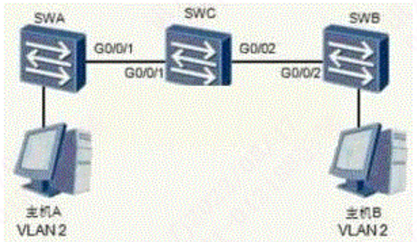

2.  在SWC上创建VLAN2,配置GO/0/1和G0/0/2为trunk端口,且允许VLAN2通过

(单选题)网络管理员在三层交换机上创建了VLAN10,并在该VLAN的虚拟接口下配置了IP地址。当使用命令"\<l\>display ip interface brief\</\|\>"查看接口状态时,发现VLANIF 10接口处于down状态,则应该通过怎样的操作来使得VLANIF 10接口恢复正常?

2.  将一个状态必须为Up的物理接口划进VLAN 10

(单选题)命令port trunk allow-pass vlan all有什么作用?

3.  该端口上允许所有VLAN的数据帧通过

(单选题)如下图所示的网络,主机A通过Telnet登录到路由器A,然后在远程的界面通过FTP获取路由器B的配置文件,此时路由器A存在多少个TCP连接?

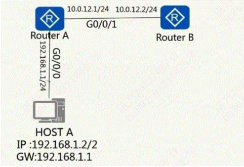

C.3

(单选题)某AR2200路由器通过OSPF和RIPv2同时学习到了到达同一网络的路由条目,通过OSPF学习到的路由的开销值是4882,通过RIPv2学习到的路由的跳数是4,则该路由器的路由表中将有()。

2.  OSPF的路由

(单选题)管理员发现两台路由器在建立OSPF邻居时,停留在TWO-WAY状态,则下面描述正确的是()。(已确认)

B、这两台路由器是广播型网络中的DR Other路由器

(单选题)生成树协议中使用哪个参数来进行根桥的选举?

D、桥ID

(单选题)关于静态MAC地址表说法正确的是?(单选)

A、由用户手工配置,并下发到各接口板,表项不可老化

(单选题)下列关于STP协议Forward Delay的作用说法正确的是?

E、防止出现临时性环路

(单选题)华为Sx7系列交换机运行STP时,缺省情况下交换机的优先级为()。(已确认)

B、32768

(单选题)交换机发送的配置BPDU中,哪一个桥ID不可能会出现?

A、4096 01-01-02-03-04-05

(单选题)下列哪一个命令可以修改设备名字为huawei?

B. sysname Huawei

(单选题)某公司申请到一个C类IP地址段,但要分配给6个子公司,最大的一个子公司有26台计算机,不同的

子公司必须在不同的网段中,则该最大的子公司的网络子网掩码应设为()。

A, 255.255.255.224

(单选题)下列哪一类地址不能作为主机的IPv4地址?

◎ D、D类地址

(单选题)在VRP平台上使用ping命令时,如果需要指定一个IP地址作为回显请求报文的源地址,那么应该使用下面哪一个参数?(已确认)

B a

(单选题)网络管理员希望能够有效利用192.168.176.0/25网段的IP地址。现公司市场部门有20个主机,则最好分配下面哪个地址段给市场部?(已确认)

B 192.168.176.96/27

(单选题)缺省情况下,P2P链路上OSPFv3 HELLO报文的周期为多少秒?

A、10

(单选题)如下图所示,IPSec隧道模式中AH协议认证的范围是?

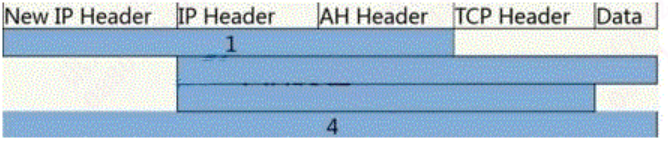

D4

(单选题)如图所示的网络,Router A的配置信息如下,下列说法错误的是?(单选)

acl number2000

rule 5 deny source 200.0.12.0 0.0.0.7

rule 10 permit source 200.0.12.0 0.0.0.15

interface GigabitEthernet0\\0\\1 traffic-filter

outbound acl 2000

◎C、源IP地址为200.0.12.8的主机不能访问Internet

(多选题)以下关于IPv6无状态地址自动配置和DHCPv6说法正确的有?

A、IPv6无状态地址自动配置使用RA和RS报文

B、DHCPv6比无状态自动配置可管理性更好

C、DHCPv6又可以分为DHCPv6有状态自动配置和DHCPv6无状态自动配置

(多选题)SA(Security Association)安全联盟由以下哪些参数标识?

B、安全参数索引SPI(Security Parameter Index)

C、目的IP地址

D、安全协议(AH或ESP)

(多选题)如图所示,在RTA的Serial1/0/1接口使用命令"ip address unnumbered interface loopback 0配置了地址借用,则下面描述正确的是()。

B、RTA的接口Serial1/0/1的IP地址为10.1.1.1/32

D、RTA的路由表中不存在一条10.1.1.0/24的路由条目

(多选题)下列关于链路聚合说法正确的有?

A、Eth-Trunk接口不能嵌套

B、两台设备对接时需要保证两端设备上链路聚合的模式一致

C、GE接口和FE接口不能加入同一个Eth-Trunk接口

(多选题)下列关于单臂路由的说法正确的有?

B、交换机上,把连接到路由器的端口配置成Trunk类型的端口,并允许相关VLAN的帧通过

C、在路由器上需要创建子接口

D、交换机和路由器之间仅使用一条物理链路连接

(多选题)参考以下DHCP流程图,以下说法正确的是()。

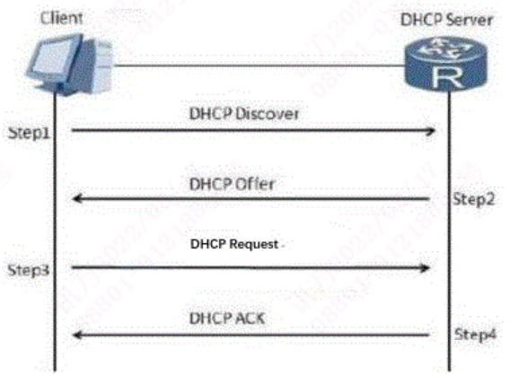

B、第二步发送的是单播报文

C、第三步发送的是广播报文

D、第四步发送的是单播报文

(多选题)在一台路由器上配置OSPF时,必须手动进行的配置有()。

A、开启OSPF进程

B、创建OSPF区域

D、指定每个区域中所包含的网络

(多选题)OSPF协议在以下哪种网络类型中需要选举DR和BDR?

B、广播类型

C NBMA

(多选题)关于静态MAC地址表说法正确的是?

A、接口和MAC地址静态绑定后,其他接口收到源MAC是该MAC地址的报文将会被丢弃

C、一条静态MAC地址表项,只能绑定一个出接口

D、在系统复位、接口板热插拔或接口板复位后,保存的表项不会丢失

(多选题)关于黑洞MAC地址表说法正确的是?

全选

A、在系统复位、接口板热插拔或接口板复位后,保存的表项不会丢失

B、由用户手工配置,并下发到各接口板,表项不可老化

C、配置黑洞MAC地址后,源MAC地址或目的MAC地址是该MAC的报文将会被丢弃

D、通过配置黑洞MAC地址表项,可以过滤掉非法用户

(多选题)某台设备输出信息如下,下列说法正确的有?

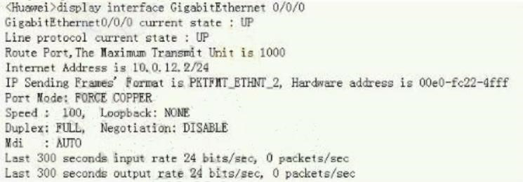

A、接口的MAC地址为00e0-fc22-4fff

B、接口的IP地址为10.0.12.2/24

D、本接口的MTU值为1000

(多选题)查询设备OSPF协议的配置信息,可以使用下列哪些命令?

B. display current-configuration

D、在OSPF协议视图下:display this

(多选题)路由条目10.0.0.24/29可能由如下哪几条子网路由汇聚而来?

A, 10.0.0.24/30

B. 10.0.0.26/30

C. 10.0.0.28/30

(多选题)如下图所示的网络,交换机配置信息如下,据此网络和配置,下列说法正确的是?

Router B

interface Serial1/0/0

link-protocol ppp

ip address 10.0.21.1 255.255.255.0

ospf 1 router-id 10.0.21.1

area 0.0.0.0

network 10.0.21.1 0.0.0.0

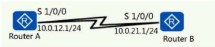

Router A

Router A

interface Serial1/0/0

link-protocol ppp

ip add 10.0.12.1 24

ospf 1 router-id 10.0.12.1

area 0.0.0.0

network 10.0.12.1 0.0.0.0

A、路由器A和路由器B学习不到对方接口的MAC地址

C、两台路由器可以建立OSPF邻接关系

D、网络中不存在DR和BDR

(多选题)如下图所示网络,路由器使用子接口作为主机的网关,网关的IP地址为10.0.12.2,以下哪些命令可以实现这个需求?

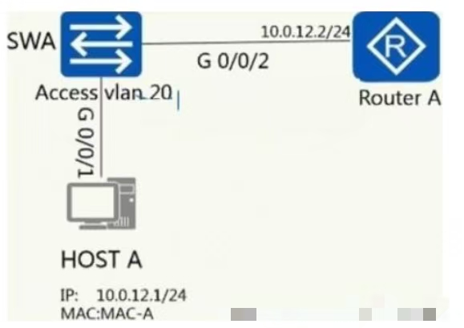

B. interface GigabitEthernet0/0/0.20

dotlq termination vid 20

ip address 10.0.12.2 255.255.255.0

arp broadcast enable

C interface GigabitEthernet0/0/0.10

dotlq termination vid 20

ip address 10.0.12.2 255.255.255.0

arp broadcast enable

(多选题)目前,公司有一个网络管理员,公司网络中的AR2200通过Telnet直接输入密码后就可以实现远程管理。新来了两个网络管理员后,公司希望给所有的管理员分配各自的用户名与密码,以及不同的权限等级。那么

应该如何操作呢?(多选)

A、在配置每个管理员的帐户时,需要配置不同的权限级别

B、Telnet配置的用户认证模式必须选择AAA模式

C、在AAA视图下配置三个用户名和各自对应的密码

(多选题)如图所示,两台路由器配置了OSPF之后,管理员在RTA上配置了\<silent-interfaces0/0/1\>命令,则下面描述正确的是()。

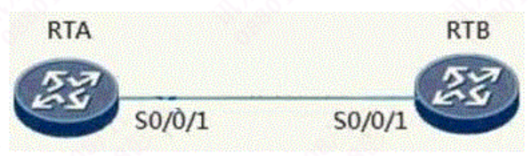

B、两台路由器的邻居关系将会down掉

C、RTA将不再发送OSPF报文

(多选题)在OSPF协议中,下面对DR的描述中正确的是()。(ABD)

A、DR和BDR之间也要建立邻接关系

B、若两台路由器的优先级值相等,则选择RouterlD大的路由器作为DR

D、默认情况下,本广播网络中所有的路由器都将参与DR选举

(多选题)如图所示,所有路由器运行OSPF协议,要求OSPF进程号为1,并且区域号为0,下列哪些命令可以

在路由器Router A上实现这个需求?

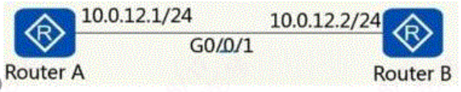

A. \\

ospf 1

area 0.0.0.0

network 10.0.12.1 0.0.0.0

C．ospf 1

area 0.0.0.0

network 10.0.12.0 0.0.0.255

D I

interface GigabitEthernet0\\0\\1

ip address 10.0.12.1 255.255.255.0

ospf enable 1 area 0.0.0.0

(多选题)下列哪些路由协议是动态路由协议?

A, OSPF

B. BGP

(多选题)OSPF协议邻居和邻接关系建立过程中,有哪几种稳定状态?(多选)

A, Down

B. Full

C 2-way

(多选题)OSPF协议支持以下哪些网络类型?（全选）

A、广播类型

B、点到点

C、点到多点类型

D. NBMA

(多选题)VRP操作平台存在哪些命令行视图?（全选）

A、接口视图

B、用户视图

C、协议视图

D、系统视图

(多选题)管理员想要更新AR2200路由器的VRP,则正确的方法有()。

B、管理员把AR2200配置为TFTP客户端,通过TFTP来传输VRP软件

C、管理员把AR2200配置为FTP服务器,通过FTP来传输VRP软件

D、管理员把AR2200配置为FTP客户端,通过FTP来传输VRP软件

(多选题)关于传输层协议说法正确的有?

B、知名端口号范围为0-1023

D、TCP连接的建立是一个三次握手的过程,而TCP连接的终止则要经过四次挥手

(多选题)SR(Segment Routing)的产生的原因之一是因为传统的LDP存在一些制约其发展的因素,以下关于LDP的问题描述正确有哪些?

A、LDP算路依赖与IGP,在IGP与LDP不同步的情况下会造成黑洞,影响业务

B、LDP本身有11种协议报文,在应用时大大增加了链路带宽的消耗和设备CPU利用率

C、LDP只支持IGP最短路径(最小开销)进行路径计算,不支持流量工程

(多选题)路由器Router D邻居关系如下,下列说法正确的有?

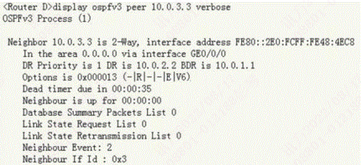

A、DR路由器的Router-ID为10.0.2.2

C、本路由器是DROther路由器

D、本路由器和Router-ID为10.0.3.3的路由器不能直接交换链路状态信息

(多选题)基于ACL规则,ACL可以划分为以下哪些类?(全选ABCD)

A、二层ACL

B、用户ACL

C、高级ACL

D、基本ACL

(判断题)OSPFv3的Router-ID可以通过系统自动产生。

B、错误

(判断题)如图所示,如果主机A有主机B的ARP缓存,则主机A可以Ping通主机B。

B、错误

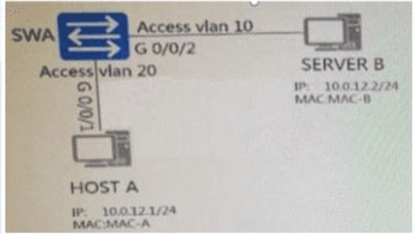

(判断题)Trunk端口既能发送带标签的数据帧,也能发送不带标签的数据帧。

1.  正确

(判断题)DHCP协议接口地址池的优先级比全局地址池高。

A、正确

(判断题)骨干区域内的路由器有它所有区域的全部LSDB。

2.  错误

(判断题)静态路由协议的优先级不能手工指定。

B、错误

(判断题)OSPF进程的Router ID修改之后立即生效。

B、错误

(判断题)缺省情况下,STP协议中的端口状态由Disabled转化为forwarding状态至少需要30s的时间。

A、正确

(判断题)RSTP中Alternate端口和Backup端口均无法转发用户流量,但可以接收、处理、发送BPDU

A、正确

(判断题)路由器的同一个接口不能同时作为DHCP v6服务器和DHCPv6客户端。

1.  正确

(判断题)IPSec的数据封装模式为隧道模式时,隐藏了内网主机的IP地址,这样可以保护整个原始数据包的安

全。

A、正确

(判断题)PPP中启用CHAP认证的命令为:ppp chap authentication。

2.  错误

(判断题)数据链路层采用PPP封装,链路两端的IP地址可以不在同一个网段。

◎ A、正确

(判断题)同一台交换机VLANIF接口的IP地址不能相同。

1.  正确

(判断题)Hybrid端口既可以连接用户主机,又可以连接其他交换机。

◎ A、正确

(判断题)DHCP OFFER报文可以携带DNS地址,但是只能携带一个DNS地址。(已确认)

2.  错误

(判断题)路由器在进行数据报转发时,每经过一个数据链路层,数据链路层都需要重新封装。

1.  正确

(判断题)RSTP协议中,边缘端口收到配置BPDU报文,就丧失了边缘端口属性。

1.  正确

(判断题)RSTP协议提供的环路保护功能只能在指定端口上配置生效。

2.  错误

(判断题)交换机组网中,如果发生环路则可能会导致广播风暴。(已确认)

1.  正确

(判断题)SRGB(segment routing global block):为全局segment预留的本地标签集合。在MPLS和IPv6

中,SRGB均为全局标签预留的本地标签集合。

2.  错误

(判断题)IPv6地址2001:ABEF:224E:FFE2:BCCO:CD00:DDBE:8D58不能简写。

1.  正确

(判断题)IPv6报文的基本首部长度是固定值。

OA 正确

(判断题)组播地址FF02 :: 2表示链路本地范围的所有路由器。

◎ A、正确

(判断题)被请求节点组播地址由前缀FF02 :: 1:FF0O:0/104和单播地址的最后24位组成。

1.  正确

(判断题)AR G3系列路由器上的ACL支持两种匹配顺序:配置顺序和自动排序。

1.  正确

(判断题)管理信息库MIB(Management Information Base)是一个虚拟的数据库,这个数据库保存在NM

S上。

2.  错误

## 初级-03
1.(单选题)如果在路由器上执行命令:user-interface maximum-vty 0,下列说法正确的是?

C、任何用户都不能通过Telnet或者SSH登录到路由器

1.  (单选题)如图所示,如果管理员希望能够提升此网络的性能,则下面哪一种方法最合适?

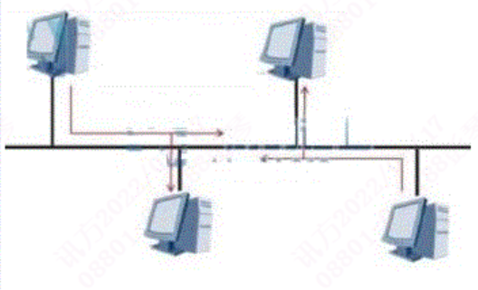

A、使用交换机把每台主机连接起来,并把每台主机的工作模式修改为全双工

3.(单选题)如下图所示的网络,在Router B设备上配置静态路由如下,则在Router B路由表中,2001 :: 1\\128对应的Next Hop为?

ipv6 route-static 2001 :: 1 128 3001 :: 12:1

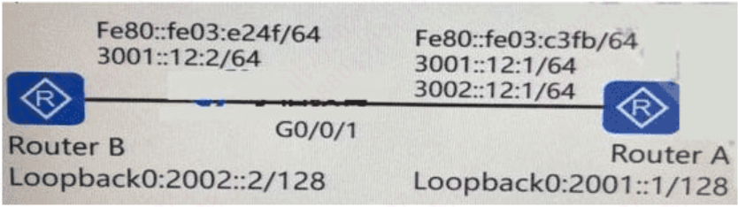

D. 3001 :: 12:1

4.(单选题)当DHCPv6客户端收到DHCPv6服务器发送的RA报文中的M和O标记位取值为下列哪个数值时,DHCP

v6客户端采用DHCPv6有状态自动配置获取IPv6地址和其它配置信息?

B、M=10=1

5.(单选题)DHCPv6服务器发送的DHCPv6 ADVERTISE报文目的端口号为?

D、546

6

6.(单选题)下面哪个版本的SNMP协议支持加密特性?

1.  SNMPv3

7.(单选题)在华为ARG3系列路由器上进行有关AAA认证的配置时,最多能配置多少个域(Domain)?

C、32

8.(单选题)VRP平台上,设置Serial接口数据链路层的封装类型为HDLC的命令是()。

1.  link-protocol hdlc

9.(单选题)以太网数据帧的Length/Type字段取以下哪个值时,表示承载的是PPPoE会话阶段的报文?

B、0x8864

10.(单选题)PPP链路建立过程中由Dead阶段可以直接转化为哪个阶段?

C、Establish

11.(单选题)以下关于Hybrid端口说法正确的有?

D、Hybrid端口可以在出端口方向将某些VLAN帧的Tag剥掉

12.(单选题)以下关于LACP模式的链路聚合说法正确的是?

D、LACP模式下链路两端的设备相互发送LACP报文

13.(单选题)DHCP DISCOVER报文的主要作用是?

1.  客户端用来寻找DHCP服务器

14.(单选题)一台windows主机初次启动,如果无法从DHCP服务器处获取地址,那么此主机可能会使用下列哪

个IP地址?

B、169.254.2.33

15.(单选题)下面哪个OSPF版本适用于IPv6?

B. OSPFv3

16.(单选题)两台路由器通过PPP链路互连,管理员在两台路由器上配置了OSPF,且运行在同一个区域中,如它们的Router ID相同,则下面描述正确的()。

D、VRP会提示两台路由器的Router ID冲突

17.(单选题)缺省情况下,广播网络上OSPF协议HELLO报文发送的周期为?

A、10s

18.(单选题)ip route-static 10.0.12.0 255.255.255.0 192.168.1.1关于此命令描述正确的是()。

B. 此命今配置了一冬到达100120网络的路由

19.(单选题)VRP支持OSPF多进程,如果在启用OSPF时不指定进程号,则默认使用的进程号码是()。

C、1

20.(单选题)STP下游设备通知上游设备发生拓扑变化时发送的报文是?

D、TCN BPDU

21.(单选题)交换机MAC地址表如下,下列说法正确的有?

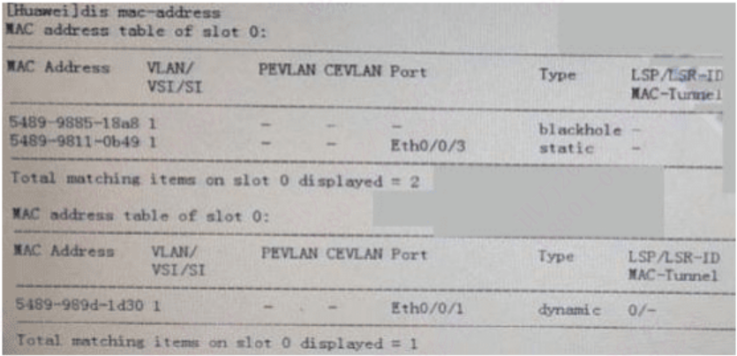

B、交换机收到目的MAC地址为5489-9885-18a8的数据帧一定会丢弃

22.(单选题)现有一台交换机通过一个端口和对端设备的指定端口直连,但是该端口不转发任何报文,却可以通过接收BPDU来监听网络变化,那么该端口的角色应该是()。

C、Alternate端口

23.(单选题)某台交换机STP端口输出信息如下:下列说法错误的是?

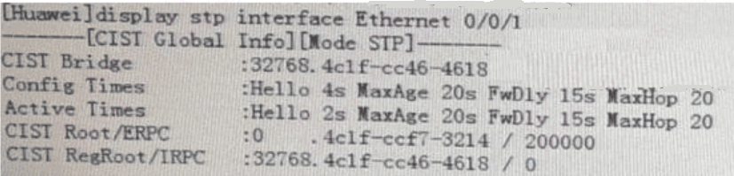

B、Forward-delay为20s

24.(单选题)LDP的倒数第二跳弹出机制(PHP),可以使得标签在倒数第二跳LSR上弹出,这样做可以降低以下哪个选项设

备的报文处理复杂度?

D、最后一跳设备

25.(单选题)IPv6报文头比IPv4报文头增加了哪个字段?

B. Flow Label

26.(单选题)DHCPv6客户端发送的DHCPv6请求报文的目的端口号为?

C、547

27.(单选题)IPv6地址2019 :: 8:AB对应的Solicited-node组播地址为?

A、FF02 :: 1:FF08:AB

28.(单选题)以下业务模块的ACL默认动作为permit的是?

D、流策略

29.(单选题)以下哪种远程登录方式最安全?

C. Stelnet v2

30.(单选题)如下图所示,IPSec传输模式中AH的头部应该插入到以下哪个位置?

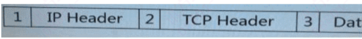

B. 2

31.(单选题)如图所示,两台私网主机之间希望通过GRE隧道进行通信,当GRE隧道建立之后,网络管理员需要在RTA上配置

一条静态路由,将主机A访问主机B的流量引入到隧道中,则下面关于静态路由配道能满足需求的是()。

A、ip route-static 10.1.2.0 24 tunnel 0/0/1

32.(单选题)如下图所示的网络,要求主机A所在的网络通过Easy IP的方式访问Internet,则在路由器A的G0/0/3接口需要使用下列哪个ACL?

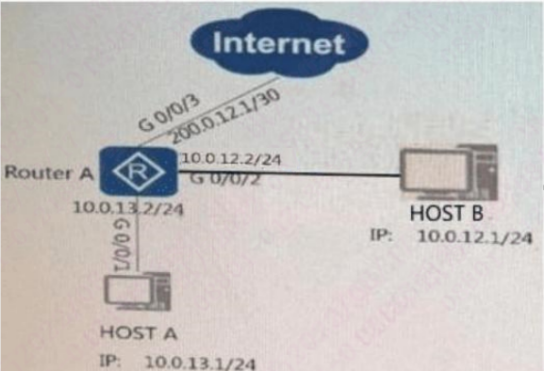

B、acl number 2000

rule 5 permit source 10.0.13.0 0.0.0.255

\\

33.(单选题)PPP帧格式中的Flag字段的取值为?

B、Ox7E

34.(单选题)Telnet协议默认使用的服务器端口号是?

D、23

35.(单选题)VRP操作平台,以下哪条命令可以查看路由表?

A、display ip routing-table

36.(单选题)如下图所示,下列说法正确是?

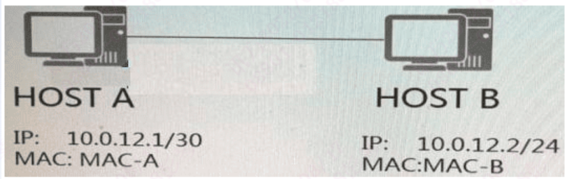

C、主机A可以ping通主机B

37.(单选题)OSPF协议在哪种状态下确定DD报文的主从关系?

C、ExStart

38.(单选题)如下图所示,假设SWA的MAC地址表如下,现在主机A发送一个目的MAC地址为MAC-B的数据帧,下列说法正确的是?

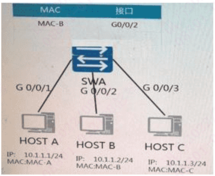

B、将这个数据帧只从G0/0/2端口转发出去

39.(单选题)在存在冗余的二层网络中,可以使用下列哪种协议避免出现环路?

B. STP

40.(单选题)如图所示,交换机SWA在运行RSTP,管理员将SWA的g0/0/3端口配置为Edge Port后,使用一台交换机替代了主机C,则下面描述正确的是()

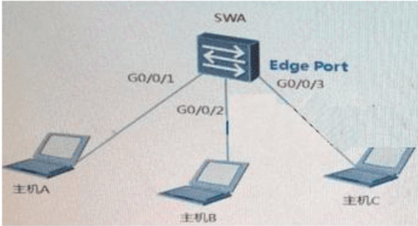

A、SWA的g0/0/3端口在接收到BPDU后,将会进行RSTP运算

41.(单选题)某台交换机输出信息如下,下列说法正确的是?

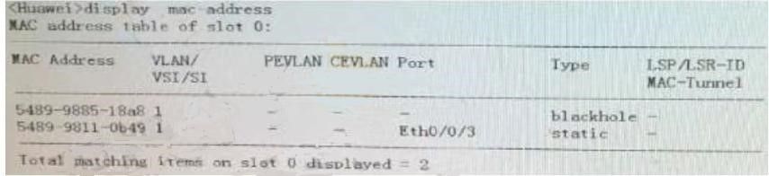

D、交换机收到源MAC或者目的MAC为5489-9885-18a8的数据帧,都会将该帧丢弃

42.(单选题)某网络工程师在输入命令行时提示如下信息:Error:Unrecognized command found at'\^'position.对于该提示信息说法正确的是?

B、没有杳找到关键字

43.(单选题)现有交换机MAC地址表如下图,下列说法正确的有?

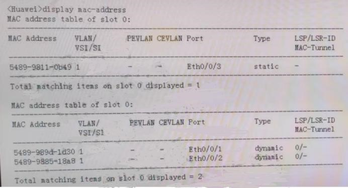

D、从端口收到源MAC地址为5489-9885-18a8,目的MAC地址为5489-989d-1d30的数据帧,从Eth0/0/1端口转发出去

44.(单选题)(单选题)如Display信息所示,当此交换机需要转发目的MAC地址为5489-98ec-f011的帧时,下面描述正确的是

A、交换机将会在除了收到该帧的端口之外的所有端口泛洪该帧

45.(单选题)关于访问控制列表编号与类型的对应关系,下面描述正确的是()。

B、二层的访问控制列表编号范围是4000-4999

46.(单选题)某台路由器输出信息如下,则此接口采用的隧道协议是?

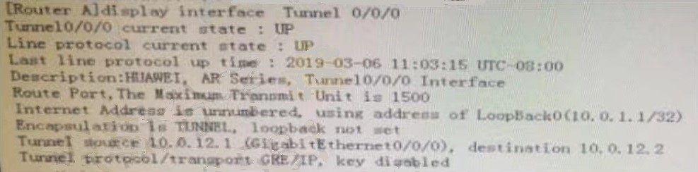

D. GRE

47.(单选题)基于MPLS标签最多可以标示出几类服务等级不同的数据流?

C、8

48.(单选题)IPv6组播地址标志字段(Flag)取值为以下哪个时表示该组播地址是一个永久组播地址?

A、0

49.(多选题)DHCPv6客户端和DHCPv6服务器通过哪些报文判断客户端采用DHCPv6有状态自动配置还是DHCPv6无状态自动配置?

A, RA

D, RS

50.(多选题)路由器Radius信息配置如下:下列说法正确的有?

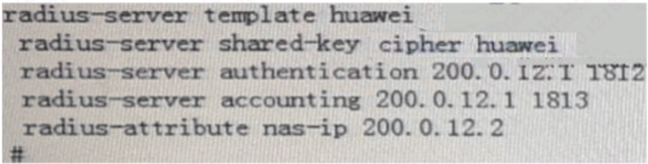

A、计费服务器的IP地址为200.0.12.1

C、路由器发送Radius报文的源IP地址为200.0.12.2

D、认证服务器的IP地址为200.0.12.1

51.(多选题)链路聚合有什么作用?

A、实现负载分担

C、增加带宽

D、提升网络可靠性

52.(多选题)以下关于DR和BDR的选举说法正确的有?

A、如果一个接口优先级为0,那么该接口将不会参与DR或者BDR的选举

C、如果优先级相同时,则比较Router ID,值越大越优先被选举为DR

53.(多选题)路由器R1路由表输出信息如下,下列说法正确的是?(注意有相似题)

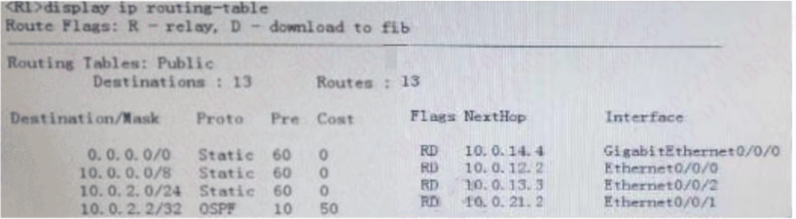

A、路由器会转发目的网络为12.0.0.0/8的数据包

C、目的网络为11.0.0.0/8的数据包将从路由器的GigabitEthernet0/0/0接口转发

54.(多选题)当路由出现环路时,可能会产生下列哪些问题?

A、路由器的内存消耗增大

D、路由器的CPU消耗增大

55.(多选题)某台路由器输出信息如下,下列说法正确的有?

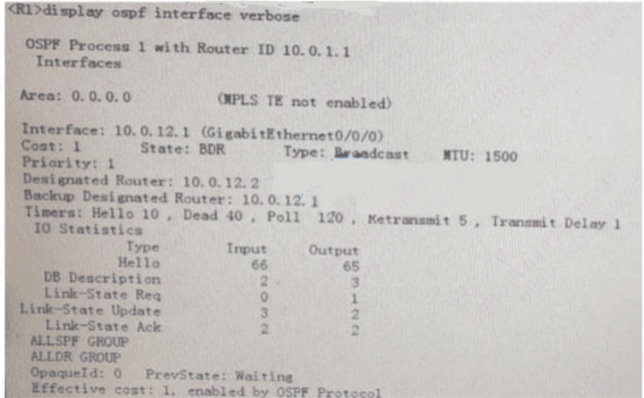

B、路由器Router ID为10.0.1.1

C、本接口Cost值为1

D、本路由器是BDR

56.(多选题)如下图所示的网络,在RouterA设备里面存在如下配置,则下列说法正确的是?

ip route-static 10.0.2.2 255.255.255.255

10.0.12.2

ip route-static 10.0.2.2

255.255.255.25510.0.21.2 preference 40

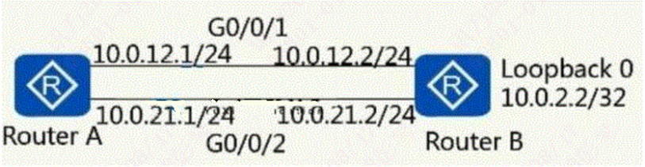

A、如果G0/0/2端口Down,Router A路由表中到达10.0.2.2的Interface更改为G0/0/1

D、Router A路由表中到达10.0.2.2的Interface为G0\\0\\2

57.(多选题)RSTP协议配置BPDU中的Flag字段使用了哪些STP协议未使用的标志位?

A、Agreement

D、Proposal

58.(多选题)如下图所示网络,所有交换机开启STP协议。关闭SWA的G0/0/2端口配置BPDU的发送功能,SWC的GO/0/1重新收敛成为根端口,关于此过程,下列说法正确的有?

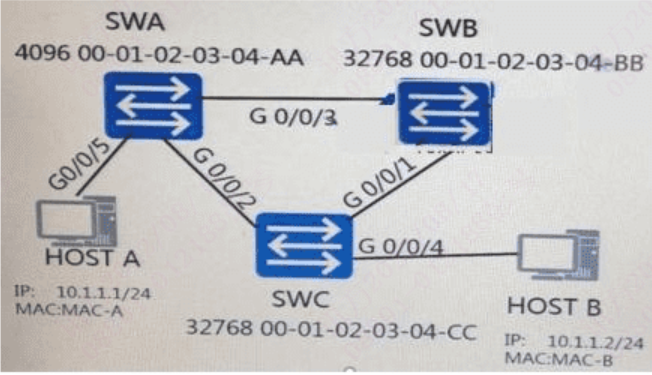

全选

59.(多选题)管理员想要通过USB线缆来为AR2200升级配置文件,则下面描述正确的有()。

C、在连接线缆之后,管理员需要为mini USB安装驱动程序

D、使用mini USB线缆连接PC和AR2200的miniUSB接口

60.(多选题)现在有以下10.24.0.0/24,10.24.1.0/24,10.24.2.0/24,10.24.3.0/24四个网段,这四个网段可以汇总为以下哪

个网段?

C、10.24.0.0/22

D、10.24.0.0/21

61.(多选题)关于检测IP网络连通性时使用的命令,下面说法错误的有()。

A、ping 127.0.0.1,此命令用来检测主机的网线是否插好

B、ipconfig/release命令可以用来检测主机到本地网关的连通性

C、ping 127.0.0.2,此命令用来检测主机的网线是否插好

62.(多选题)以下哪些MAC地址不能作为主机网卡的MAC地址?

C、01-02-03-04-05-06

D、03-04-05-06-07-08

63.(多选题)OSPFv3邻接关系无法建立,可能是由以下哪些原因引起?

A、Router-ID冲突

B、HELLO报文发送周期不一致

C、区域号码不一致

64.(多选题)动态主机配置协议DHCP可以分配以下哪些网络参数?

B、DNS地址

C、IP地址

D、网关地址

65.(多选题)下列哪几项是配置静态路由的基本要素?

A、目的网段

C、下一跳的IP地址

D、出接口

66.(多选题)在华为设备中,OSPF选举Router ID的方法可以是下列哪种?

全选

67.(多选题)在VRP操作系统中,如何进入OSPF区域0的视图?

A、[Huawei-ospf-1]area 0

D、[Huawei-ospf-1]area 0.0.0.0

68.(多选题)某台路由器输出信息如下,下列说法错误的是?

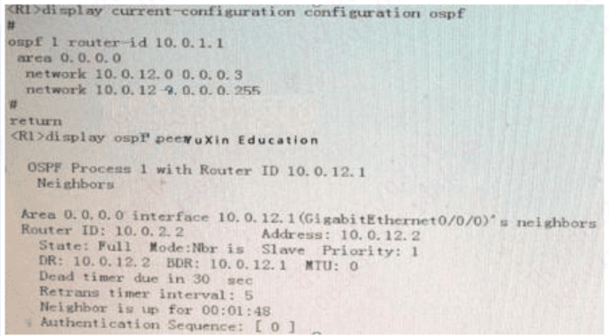

A、本路由器开启了区域认证

B、本设备出现故障,配置的Router ID和实际生效的Router ID不一致

D、本设备生效的Router Id为10.0.1.1

69.(多选题)路由器建立路由表的方式有哪三种?

A、动态路由

B、静态路由

C、直连路由

70.(多选题)如图所示,两台交换机上都禁用了STP协议,主机A发送了一个ARP Request,则下面描述正确的是()。

B、这两台交换机的CPU占用率将会很高

C、这个网络中将会出现重复帧

D、这两台交换机的MAC地址表会频繁抖动

71.(多选题)在OSI参考模型的传输层中,可以使用下面哪些流量控制方式?

B、窗口机制

D、缓存技术

72.(多选题)关于免费ARP,下面说法正确的是()。

C、通过发送免费ARP,可以确认IP地址是否有冲突

D、免费ARP报文的格式与普通ARP请求报文的格式是相同的

73.(多选题)路由器R1路由表输出信息如下,下列说法正确的是?

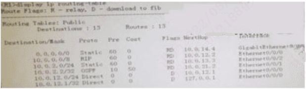

A、路由表中存在两种动态路由协议

B、路由器Ethernet0/0/0接口IP地址的掩码长度为24位

C、路由器Ethernet0/0/0接口的IP地址为10.0.12.1

74.(多选题)某台路由器DHCP地址池配置信息如下,下列说法正确有?

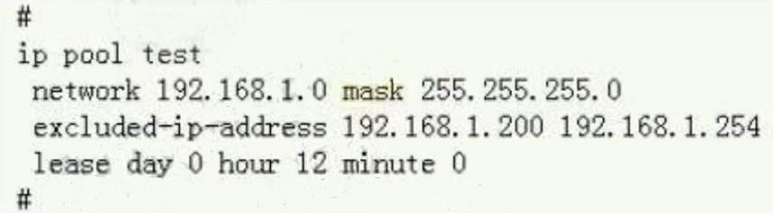

A、该地址池有199个可用的IP地址

B、IP地址的租期为12h

D、DHCP客户端可能获取的IP地址为192.168.1.2

75.(多选题)路由器接口输出信息如下,下列说法正确的有?

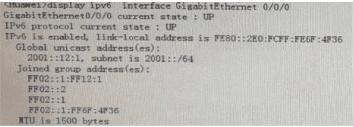

全选

76.(判断题)广播地址是网络地址中主机位全部置为1的一种特殊地址,它也可以做为主机地址使用。

B、错误

77.(判断题)SR(Segment Routing)作为一种新的替代MPLS的隧道技术受到越来越多的关注,很多用户希望引入SR技术来

简化网络部署和管理,降低CAPEX(Capital Expenditure)。SR作为当前主流的隧道技术,在承载网使用广泛。

B、错误

78.(判断题) :: 1/128是IPv6环回地址。

A、正确

79.(判断题)AAA协议是RADIUS协议。

B、错误

80.(判断题)启用GRE的keepalive功能后,GRE隧道的本端会周期性的每10s向对端发送一次keepalive报文。

B、错误

81.(判断题)SNMPv1定义了5种协议操作。

A、正确

82.(判断题)RSTP中Backup端口可以替换发生故障的根端

B、错误

83.(判断题)STP协议当指定端口收到比自己差的配置BPDU时,立刻向下游发送自己的BPDU。

A、正确

84.(判断题)运行STP的设备收到RSTP的配置BPDU时会丢弃。

A、正确

85.(判断题)交换机收到一个单播数据帧,如果该数据帧目的MAC在MAC地表中能够找到,这此数据帧一定会从此MAC对应

端口转发出去。

B、错误

86.(判断题)ICMP报文不包含端口号,所以无法使用NAPT。

B、错误

87.(判断题)参考下图中单臂路由的配置,可以判断即使在R1的子接口上不开启ARP代理,行政部门与财务部门之间也能够互访。

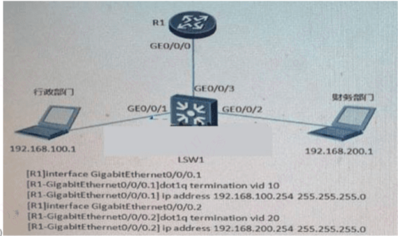

B、错误

88.(判断题)拓扑及配置如图所示,那么两台交换机之间可以正常建立一条Eth-Trunk逻辑链路,且LSW2为主动端0。

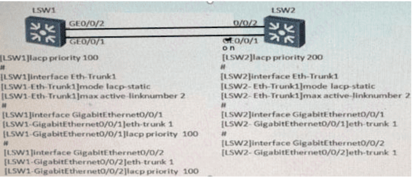

B、错误

89.(判断题)VTY用户界面的最大个数决定了多少个用户可以同时通过Telnet或STelnet登录设备。

A、正确

90.(判断题)以下两条配置命令可以实现路由器RTA去往同一目的地10.1.1.0的路由主备备份:[RTA]ip route-static 10.1.1.0 24

12.1.1.1 permanent [RTA]ip route-static 10.1.1.0 24 13.1.1.1

B、错误

91.(判断题)运行OSPF协议的路由器所有接口必须属于同一个区域。

B、错误

92.(判断题)静态MAC地址表在系统复位、接口板热插拔或接口板复位后,保存的表项不会丢失。

A、正确

93.(判断题)默认情况下,STP协议中根桥的根路径开销一定是0。

A、正确

94.(判断题)(单选题)应用数据经过数据链路层处理后一定携带了MAC地址。

B. 错误

95.(判断题)(单选题)如果传输层协议为UDP,则网络层Protocol字段取值为6。

B、错误

96.(判断题)下图为某一台路由器的路由表,当该路由器收到一个目的IP地址为9.1.1.1的数据包时,路由器将根据9.1.0.0/16

的路由进行转发,因为该条路由匹配目的地址9.1.1.1的位数更多。

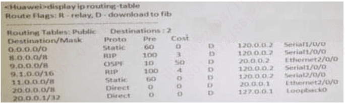

A、正确

97.(判断题)Segment Routing将代表转发路径的段序列编码在数据包头部,随数据包传输,接收端收到数据包后,对段序列

进行解析。如果段序列的顶部段标识是本节点时,则弹出该标识,然后进行下一步处理,如果不是本节点,则使用ECMP

(Equal Cost Multiple Path)方式将数据包转发到下一节点。

A、正确
## 初级-04
1.(单选题)以下是路由器R1的路由表,如果R1发送一个目的IP地址10.0.2.2的数据包,那么需要从哪个接口发出?

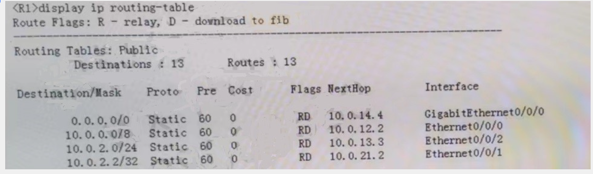

B. EthernetO/O/1

2\. (单选题)已知某台路由器的路由表中有如下两个表项,如果该路由器要转发目的地址为9.1.4.5的报文,则下列说法中正确的是()。

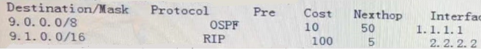

D、选择第二项作为最优匹配项,因为该路由相对于目的地址9.1.4.5来说是更精确的匹配

3.(单选题)如下图所示的网络,这个网络中的BDR是哪一台路由器?

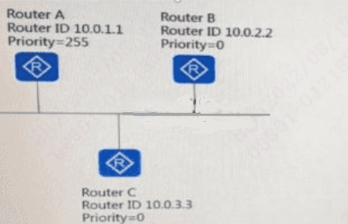

C、无BDR

4.(单选题)RSTP协议不包含以下哪个端口状态?

A、Blocking

5.(单选题)\<Huawei\>reset saved-configuration Warning:The action will delete the saved configuration in the device. The configuration, will be erased to reconfi gure. Continue? [Y/N]:管理员在AR2200上进行了如上配置,则下列关

于配置信息描述正确的是()。

B、用户如果想要清除保存的配置文件,则应该选择“Y"

6.(单选题)DHCPv6服务发送的RA报文中的MO标记位取值为01,则主机采用下列哪种方式进行地址自动配置?

B、DHCPv6无状态自动配置

7(单选题)IPv6报头中的哪个字段的作用类似于IPv4报头中的TTL字段?

C. Hop Limit

8(单选题)以下哪个IPv6地址是链路本地地址?

B FE80 :: 2EO:FCFF:FEEF:FEC

9(单选题)在Telnet中应用如下ACL：下列说法正确的是？acl number 2000rule 5 deny source 172.16.105.3 0 rule 10 deny source 172.16.105.4 0rule 15 deny source 172.16.105.5 0 rule 20 permit

1.  IP地址为172.16.105.6的设备可以使用Telnet服务

10(单选题)当需要终止PPPoE会话时需要发送哪种报文?

B. PADT

11(单选题)在VRP平台上,命令“interface vlan\<vlan-id\>"的作用是()。

1.  创建或进入VLAN虚接口视图

12(单选题)当主机经常移动位置时,使用哪种VLAN划分方式最合适?

B、基于MAC地址划分

13(单选题)关于OSPF骨干区域说法正确的是?

A、Area 0是骨干区域

14(单选题)下面哪项是路由表中所不包含的?

C、源地址

15(单选题)路由器输出信息如下,下列说法错误的是?

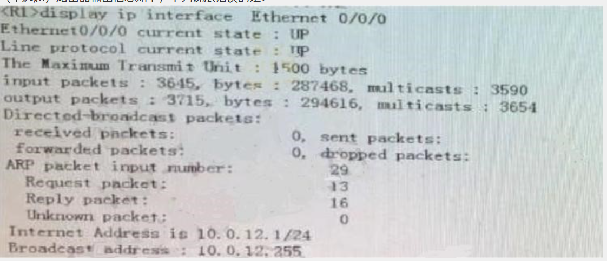

1.  Ethernet0/0/0接口的MTU值为1480

16(单选题)如下图所示,主机A和主机B使用哪种网络设备可以实现通信?

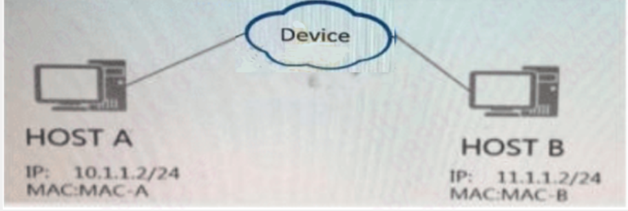

1.  路由器

17(单选题)如下图所示的网络,假设所有路由器同时运行OSPF协议,这个网络中的BDR是哪一个路由器?()

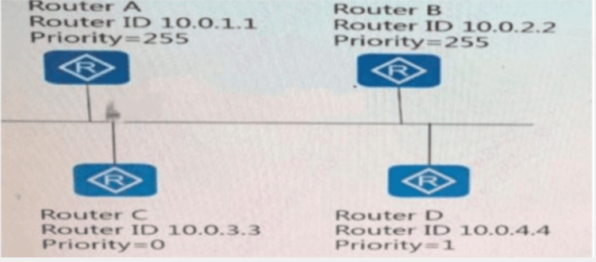

A, Router A

18(单选题)标准STP模式下,下列非根交换机中的哪个端口会转发由根交换机产生的TC置位BPDU?

D、指定端口

19(单选题)下列关于生成树协议根桥选举说法正确的是?

C、桥优先级数值较小的设备成为根桥

20(单选题)VRP平台如何表示路由器第3槽位,0号子卡,2号GE端口。

D. interface GigabitEthernet 3/0/2

21(单选题)下面关于IP报文头部中TTL字段的说法正确的是()。

2.  IP报文每经过一台路由器时,其TTL值会被减1

22(单选题)在华为ARG3路由器上,VRP中Ping命令的-i参数是用来设置()。

A、发送Echo Request报文的接口

23(单选题)以下关于Node Segment说法错误的是哪个?

A、Node SID与节点的Prefix SID不能相同

24(单选题)IPv6组播地址标志字段(Flag)长度为多少bit?

C、4

25(单选题)当主机采用DHCPv6无状态自动配置时,主机发送哪一个DHCPv6报文请求配置信息?

A, Information-Request

26(单选题)IPv6地址3001:0DB8:0000:0000:0346:ABCD:42BC:8D58的最简形式为?

C、3001:DB8 :: 346:ABCD:42BC:8D58

27(单选题)在邻接关系建立过程中,OSPFv3中DD报文的作用是?

3.  来描述自己的LSDB

28(单选题)下面选项中,能使一台IP地址为10.0.0.1的主机访问Internet的必要技术是()。

B. NAT

29(单选题)交换机某个端口配置信息如下,则此端口在发送携带哪些VLAN的数据帧时携带VLAN TAG?

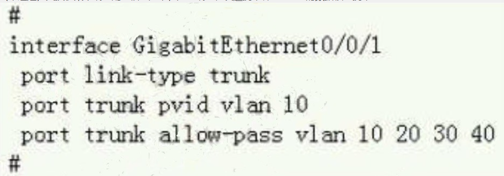

C. 20, 30, 40

30(单选题)用户可以使用的VLAN ID的范围是?

C、1-4094

31(单选题)一台windows主机初次启动,如果采用DHCP的方式获取IP地址,那么此主机发送的第一个数据包的源IP地址

是?

C. 0.0.0.0

32(单选题)DHCP服务器使用哪种报文确认主机可以使用IP地址?

A, DHCP ACK

33(单选题)在使用FTP协议升级路由器软件时,传输模式应该选用()。

4.  二进制模式

34(单选题)OSPF报文类型有多少种?

C、5

35(单选题)在华为AR路由器中,缺省情况下静态路由协议优先级的数值为?

A、60

36(单选题)以下关于RSTP协议中边缘端口说法正确的是?

1.  边缘端口可以由Disable直接转到Forwarding状态

37(单选题)以下哪项不是RSTP可以提高收敛速度的原因?

B、取消了Forward Delay

38(单选题)RSTP BPDU报文中的Flag字段的总长度为多少bit?

C、8

39(单选题)STP协议在以下哪个状态下进行端口角色的选举?

D. Listening

40(单选题)管理员在哪个视图下才能为路由器修改设备名称?

B System-view

41(单选题)VRP不支持通过哪种方式对路由器进行配置?

D、通过FTP对路由器进行配置

42(单选题)UDP是面向无连接的,必须依靠()来保障传输的可靠性。

B、应用层协议

43(单选题)IPv4首部中的DSCP字段取值范围为?

B、0-63

44(单选题)以下关于Prefix Segment说法错误的是哪个?

C、Prefix Segment需要手工配置

45(单选题)在一个广播型网络中存在4台路由器,并且4台路由器全部运行OSPFv3协议,所有路由器DR优先级均非0,则网络中共有多少个邻接关系?

C、5

46(单选题)网络管理工作站通过SNMP协议管理网络设备,当被管理设备有异常发生时,网络管理工作站将会收到哪种SNMP报文?

2.  trap报文

47(单选题)高级ACL的编号范围是?

C、3000-3999

48(单选题)AR G3系列路由器上ACL缺省步长为?

C 5

49(单选题)PPP帧格式中的Protoco1字段为0xC023,表示该协议是?

A, PAP

50(单选题)Trunk端口发送数据帧时如何处理?

D、当VLAN ID与端口的PVID相同,且是该端口允许通过的VLANID时,去掉Tag,发送该报文

51(单选题)路由器某接口配置信息如下,则此端口可以接收携带哪个VLAN的数据包?

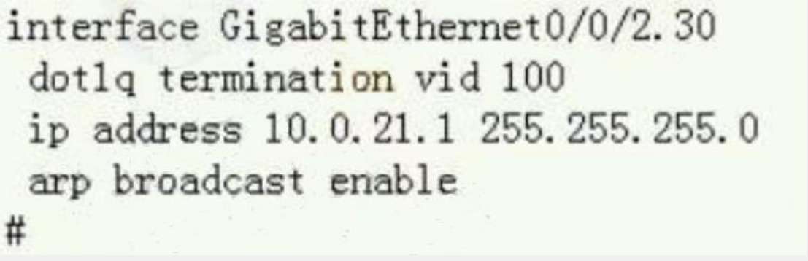

A, 100

52(单选题)DHCP DISCOVER报文的目的IP地址为?

D. 255.255.255.255

53(单选题)在华为AR路由器中,缺省情况下RIP协议优先级的数值为?

C 100

54(单选题)运行STP协议的设备端口处于Forwarding状态,下列说法正确的有?

B、该端口端口既转发用户流量也处理BPDU报文

55(单选题)如下图所示,下列交换机的哪个端口会成为指定端口?

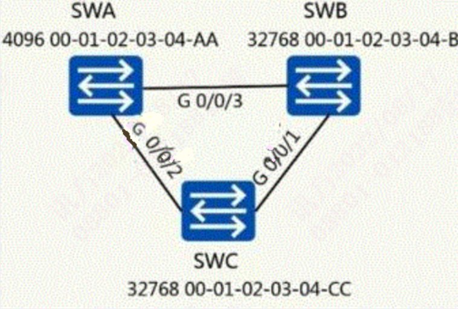

D、SWA的G0/0/3

56(单选题)IEEE 802.1D标准中规定桥优先级是多少bit?

C, 16

57(单选题)在VRP操作平台上,接口视图下显示当前接口配置的命令是?

B display this

58(多选题)路由表当中包含以下哪些要素?

全选

59(多选题)当路由器运行在同一个OSPF区域中时,对它们的LSDB和路由表的描述正确的是()。

B、各台路由器的路由表是不同的

C、所有路由器得到的链路状态数据库是相同的

60(多选题)STP端口在下列哪种状态之间转化时存在Forward Delay?

D. Listening-Learning

E, Learning-Forwarding

61(多选题)以下关于MPLS报文头中S字段说法正确的是哪些?

B、S位存在于每一个MPLS报文头中

C、用来标志本标签后是否还有其他标签,0表示是,1表示不是

62(多选题)DHCPv6基本协议架构中,主要包括哪三种角色?

B、DHCPv6中继

C、DHCPv6客户端

D、DHCPv6服务器

63(多选题)如图所示:两台主机之间使用IPSec VPN传输数据,为了隐藏真实的IP地址和尽可能高地保证数据的安全性,则使用IPSec VPN的哪种模式和协议封装较好?

B、隧道模式

D. ESP

64(多选题)PPP协议有以下哪些优点?

全选

65(多选题)OSPF协议都有哪种优点?

全选

66(多选题)如下所示路由表,下列说法正确的是?

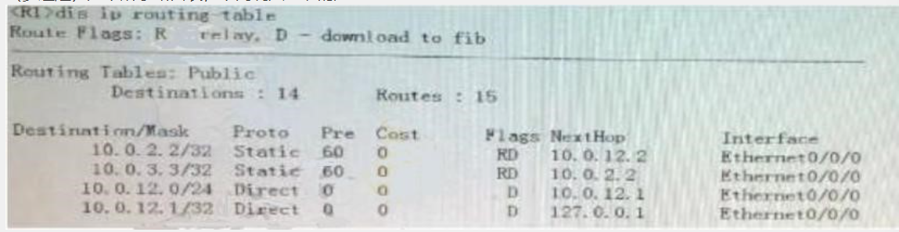

B、路由器从Ethernet0/0/0转发目的IP地址为10.0.2.2的数据包

D、路由器从Ethernet0/0/0转发目的IP地址为10.0.3.3的数据包

67(多选题)STP中选举根端口时需要考虑以下哪些参数?

B、端口优先级

C、端口到达根交换机的Cost

D、端口的MAC地址

68(多选题)以下关于ICMP报文说法正确的有?

A、ICMP报文格式中的Type字段长度为8bit

C、ICMP报文在IPv4的首部协议类型字段的值为1

D、ICMP报文格式中的Code字段长度为8bit

69(多选题)以下属于MPLS标签动作的有哪几项?

A, pop

C swap

D. push

70(多选题)如图所示的网络,通过以下哪些配置可以实现主机A不能访问主机B的HTTP服务,主机B不能访问主机A的下FTP服务?

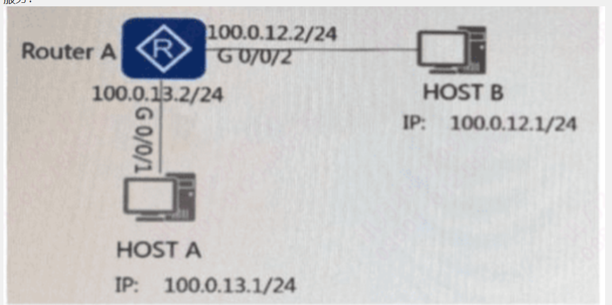

A, acl number 3000

rule 5 deny tcp source 100.0.12.0 0.0.0.255 source-port eq www destination 100.0.13.0 0.0.0.255

acl number 3001

rule 5 deny tcp source 100.0.13.0 0.0.0.255 source-port eq ftp destination 100.0.12.0 0.0.0.255

interface GigabitEthernet0\\0\\1 traffic-filter outbound acl 3000

interface GigabitEthernet0\\0\\2 traffic-filter outbound acl 3001

B acl number 3000

rule 5 deny tcp source 100.0.13.0 0.0.0.255 destination 100.0.12.00.0.255 destination-port eq www

acl number 3001

rule 5 deny tcp source 100.0.12.0 0.0.0.255 destination 100.0.13.00.0.255 destination-port eq ftp

interface GigabitEthernet0\\0\\1 traffic-filter inbound acl 3000

interface GigabitEthernet0\\0\\2 traffic-filter inbound acl 3001

71(多选题)如下图所示的网络,从安全角度考虑,路由器A拒接从G0/0/1接口收到的OSPF报文、GRE报文、ICMP报文,以下哪些命令可以实现这个需求?

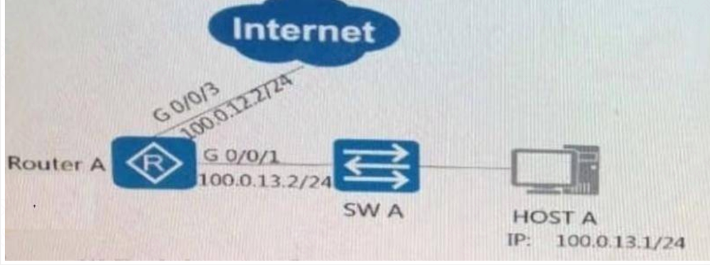

A, acl number 3000 rule 5 deny gre rule 10 deny ospf rule 15 deny icmp

interface GigabitEthernet0\\0\\1 traffic-filter inbound acl 3000

B. acl number 3000 rule 5 deny gre rule 10 deny 89 rule 15 deny icmp

interface GigabitEthernet0\\0\\1 traffic-filter inbound acl 3000

D. acl number 3000 rule 5 deny 47 rule 10 deny 89 rule 15 deny 1

interface GigabitEthernet0\\0\\1 traffic-filter inbound acl 3000

72(多选题)OSPF协议支持的网络类型有哪些?

全选

73(多选题)如下图所示的网络,所有路由器均运行OSPF协议,那台设备是ABR?

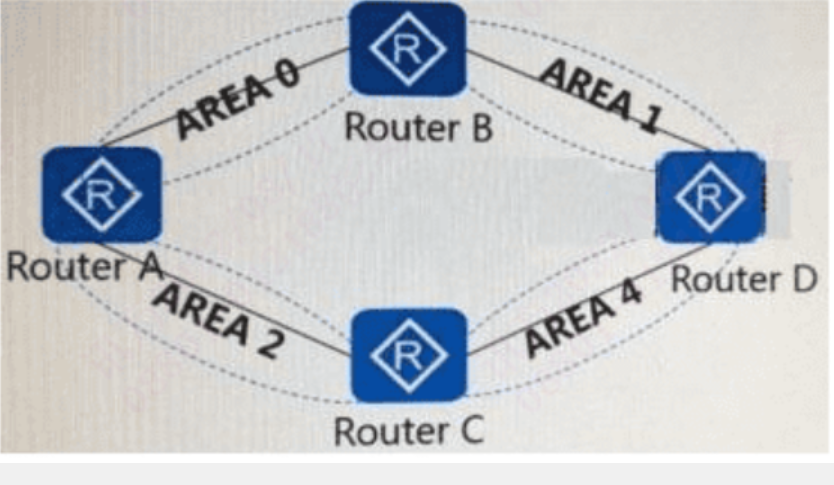

C Router A

D. Router B

74(多选题)关于IPv4首部中的TTL字段说法正确的有?

全选

75(多选题)以下关于ACL的匹配机制说法正确的有?

全选

76(多选题)IPSec VPN体系结构主要由以下哪些协议组成?

B. ESP

C. IKE

D. AH

77(多选题)某台路由器输出信息如下,下列说法正确的有?

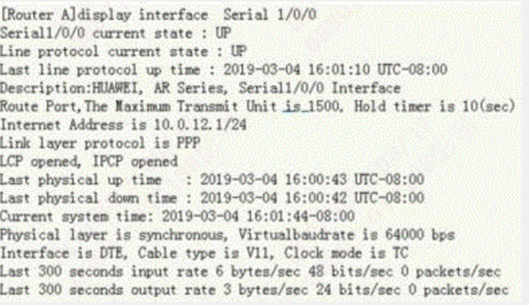

A、本接口是同步接口

B、接口的IP地址为10.0.12.1/24

C、数据链路层采用的协议为PPP

78(多选题)HDLC具有以下哪些特点?

A、HDLC协议支持点到点链路

B、HDLC协议不支持IP地址协商

D、HDLC协议不支持认证

79(多选题)如果一个以太网数据帧的Length/Type=0x8100,那么这个数据帧的载荷不可能是?

C、RSTP数据帧

D、STP数据帧

80(多选题)OSPF协议建立邻接关系时,以下哪些内容必须要一致?

C. Router Dead Interval

D. Area ID

81(多选题)如下图所示的网络,主机A没有配置网关,主机B存在网关的ARP缓存,下列说法正确的有?

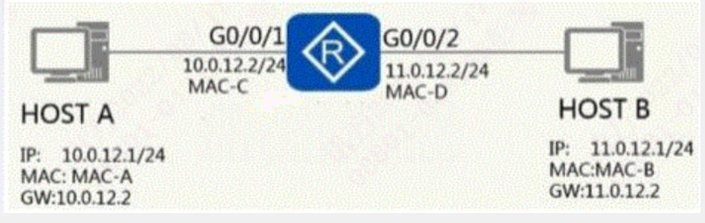

B、主机A和主机B不能双向通信

C、主机B发送目的IP地址为10.0.12.1的数据包可以转发到主机A

82(多选题)如下图所示的网络,主机存在ARP缓存,下列说法正确的有?

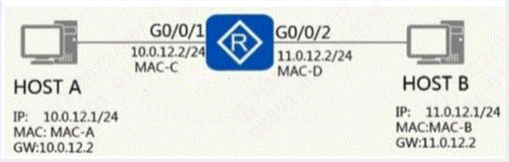

B、主机A的ARP缓存中存在如下条目10.0.12.2 MAC-C

D、主机A和主机B可以双向通信

83(判断题)VRP界面下,使用命令startup saved-configuration backup.cfg,配置下次启动时使用backup.cfg文件。

1.  正确

84(判断题)NAPT是通过TCP或者UDP或者IP报文中的协议号区分不同用户的IP地址。

2.  错误

85(判断题)路由器的聚合端口可以配置路由子接口。

1.  正确

86(判断题)[Huawei] user-interface vty 0 14[Huawei-ui-vty0-14]ac1 2000 inbound [Huawei-ui-vty0-14]user privilege level 3 [Huawei-ui-vty0-14]authentication-mode password Please configure the login password (maximum length 16):huawei vty的配置如上所示,用户权限等级被设置为3级。

1.  正确

87(判断题)STP协议中根桥发出的配置BPDU报文中的Message Age为0。

1.  正确

88(判断题)如果使用万兆光模块互联两台华为S5710交换机,那么互联端口工作模式默认为全双工。

1.  正确

89(判断题)在P2P网络中,OSPFv3邻接关系建立时不需要发送DD报文。

2.  错误

90(判断题)组播地址FF02 :: 1表示链路本地范围的所有节点。

1.  正确

91(判断题)SNMP报文是通过TCP来承载的。

2.  错误

92(判断题)Eth-Trunk两端的负载分担模式可以不一致。

1.  正确

93(判断题)运行STP协议的交换机,端口在Learning状态下需要等待转发延时后才能转化为Forwarding状态。

1.  正确

94(判断题)由于TCP协议在建立连接和关闭连接时都采用三次握手机制,所以TCP支持可靠传输。

2.  错误

95(判断题)路由器在转发IPv6报文时,不需要对数据链路层重新封装。

B、错误

96(判断题)RSTP中处于Discarding状态下的端口,虽然会对接收到的数据帧做丢弃处理,但可以根据该端口收到的数据帧维护MAC地址表。

B、错误

## 初级-05

(单选题)OSPF协议用哪种报文来描述自己的LSDB?

C. DD

(单选题)路由器在查找路由表时存在最长匹配原则,这里的长度指的是以下哪个参数?

1.  掩码的长度

(单选题)如图所示,交换机使用默认参数运行STP,则下面哪个端口将会被选举为指定端口?

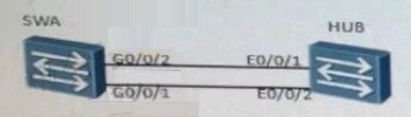

A、交换机A的G0/0/1端

（单选题)STP协议中BPDU报文的目的MAC地址为?

1.  01-80-C2-00-00-00

\<Huawei\>system-view [Hawei] user-interface console 0 [Huawei-ui-console0]history-command max-Size 20关于上面的配置,说法正确的是()

A、history-command max-size 20是希望调整历史命令缓存的大小为20条

(单选题)应用数据经过数据链路层处理后称为?

C. Frame

(单选题)DHCPv6服务器在RA报文中包含管理地址配置标记(M),如果取值为1,则下列说法正确的是?

A、表示客户端启用DHCPv6有状态地址配置

(单选题)如果两个IPSec VPN对等体希望同时使用AH和ESP来保证安全通信,则两个对等体总共需要构建多少个SA(安全联盟)?

D、4

(单选题)如果ACL规则中最大的编号为12,缺省情况下,用户配置新规则时未指定编号,则系统为新规则分配的编号为?

C、15

(单选题)RADIUS使用以下哪种报文类型表示认证拒绝?

A. Access-Reject

(单选题)如图所示,私有网络中有一台Web服务器需要向公网用户提供HTTP服务,因此网络管理员需要在网关路由器RTA上配置NAT以实现需求,则下面配置中能满足需求的是()

A. [RTA-Serial1/0/1]nat server protocol tcp global 202.10.10.1 www inside 192.168.1.1

8080

12(单选题)一个公司有50个私有IP地址,管理员使用NAT技术将公司网络接入公网,但是该公司仅有一个公网地址,则下列哪种NAT转换方式符合需求?

A, easy-ip

13(单选题)下列关于Trunk端口与Access端口描述正确的是()。

1.  Access端口只能发送untagged帧

14(单选题)如果一个以太网数据帧的Length/Type=0x8100,下列说法正确的是?

A、这个数据帧一定携带了VLAN TAG

(单选题)LACP协议优先级如图所示,交换机A和交换机B采用LACP模式的链路聚合,并且所有接口加入链路聚合组,同时设置最大活动端口数量为3,则交换机A的哪个端口不是活动端口?

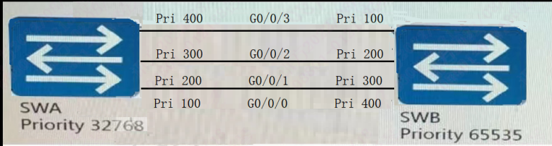

B ,G0/0/3

16(单选题)下列关于华为设备中静态路由的优先级说法错误的是()。

C、静态路由优先级值的范围为0-255

17(单选题)关于OSPF协议DR的说法正确的是?

D,一个接口优先级为0,那么该接口不可能成为DR

18(单选题)route-static 10.0.2.2 255.255.255.255 10.0.12.2 preference 20,关于此命令说法正确的是?

D、该路由目的网络的掩码长度为32位

19(单选题)下列协议中属于动态IGP路由协议的是?

C. OSPF

20(单选题)RSTP协议使用P/A机制加快了上游端口转到Forwarding状态的速度,但是却没有出现环路的原因是什么?

C、通过阻塞自己的非根端口来保证不会出现环路

(单选题)交换网络中STP协议的桥ID如下,拥有下列哪个桥ID的交换机会成为根桥?

D. 4096 00-01-02-03-04-DD

(单选题)下面关于生成树协议中Forwarding状态描述错误的是()。

B、Forwarding状态的端口不学习报文源MAC地址

(单选题)以上是AR2200路由器的display startup信息,关于这些信息,说法错误的是()。

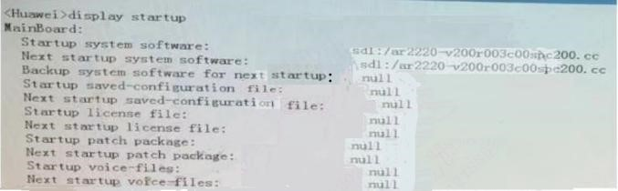

D、设备下次启动时的系统文件不能被修改

(单选题)下列哪一个IPv4地址是A类地址?

1.  100.1.1.1

(单选题)共享介质型网络使用哪一种技术进行数据转发?

D. CSMA/CD

(单选题)以下哪个IPv6地址是组播地址?

A, FE80 :: 2E0:FCFF:FEEF:FEC

(单选题)二层ACL的编号范围是?

A、4000\~4999

(单选题)以下哪种SNMP报文是由被管理设备上的Agent发送给NMS的?

D. Response

29

AH Header

Dngu PHeader

(单选题)下图为数据包在IPSec VPN中的封装格式,这种类型的数据包是使用IPSec VPN的哪种模式封装的?

A、隧道模式

(单选题)以下哪种PPPoE的报文是非单播方式发送的?

B, PADI

(单选题)如下图所示的网络,通过静态路由的方式使Router A和Router B的loopback0通信,则需要在Router A输入如下哪条命令?

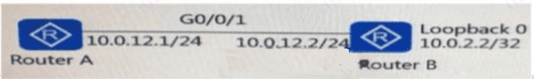

C. ip route-static 10.0.2.2 255.255.255.255 10.0.12.2

(单选题)OSPF协议使用哪种报文对接收到的LSU报文进行确认?

A, LSACK

(单选题)如下图所示的网络,所有路由器运行OSPF协议,链路上方为Cost值的大小,则RA到达网络10.0.0.0/8的路径d cost为?

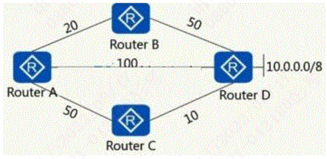

C,60

34(单选题)在下列种情况下,运行RSTP协议的交换机会产生TC置位的配置BPDU?

A、一个非边缘端口迁移到Forwarding状态

(单选题)RSTP配置BPDU报文中的Type字段取值为?

D、0x02

(单选题)在OSI参考模型中,能够完成端到端差错检测和流量控制的是()。

D,传输层

(单选题)以下关于Adjacency Segment(邻接段)的说法错误的是哪个?

D、Adjacency Segment必须手动配置

(单选题)下列哪个IPv6地址的Solicited-node组播地址为FF02 :: 1:FF12:1?

B、2019 :: 12:1

39

(单选题)OSPFv3中使用哪个组播地址表示所有路由器?

C,FF02 :: 5

(单选题)FTP协议控制平面使用的端口号为?

B.21

(单选题)某台路由器运行OSPF协议,并且没有指定Router ID,所有接口的IP地址如下,则此路由器OSPF协议的Router ID为?

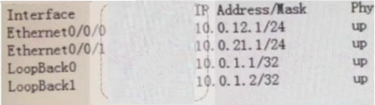

2.  10.0.1.2

(单选题)下面关于静态与动态路由描述错误的是()。

1.  链路产生故障后,静态路由能够自动完成网络收敛

43(单选题)路由器工作OSI参考模型的哪一层?

B、网络层

(单选题)VRP操作平台,以下哪条命令可以只查看静态路由?

C display ip routing-table protocol static

(单选题)在RSTP标准中,为了提局收蚊速度,可以将交换机自接与终端相连的端人为()。

1.  边缘端口

46

(单选题)下列关于RSTP协议中Alternate端口说法正确的是?

D、Alternate端口提供了从指定桥到根的另一条可切换路径,作为根端口的备份端口

(单选题)交换机工作在OSI参考模型的哪一层?

C、数据链路层

48(单选题)通过Console配置路由器时,终端仿真程序的正确设置是()。

D、9600bps、8位数据位、1位停止位、无校验和无流控

49(单选题)设备启动时依据哪个存储器保存的配置选择VRP版本文件?

A, NVRAM

50(单选题)包含以太网首部的Ethernet_I帧的长度为?

A, 64-1518B

51(单选题)DHCPv6服务器用哪个报文回复Solicit报文?

B. Advertise

(单选题)IPv6地址总长度是IPv4地址长度的多少倍?

A 4

(单选题)以下关于IPSec VPN中的AH协议的功能说法错误的是?

C、支持报文的加密

(单选题)AAA不包含下列哪一项?

C、Audit(审计)

55(单选题)LCP协商使用以下哪个参数检测链路环路和其它异常情况?

D、魔术字

(单选题)如下图所示的网络,路由器配置信息如下,下列说法正确的是?

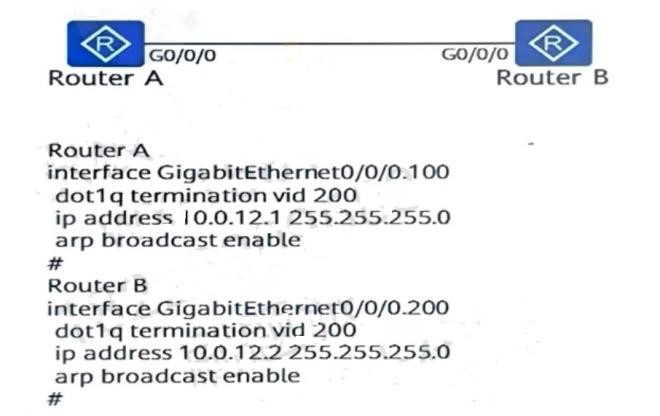

A、10.0.12.1可以Ping通10.0.12.2

(单选题)如下图所示的网络,交换机A输出信息如下,则在交换机A的现MAC地址表中,主机B的MAC地址对应于哪个接口?

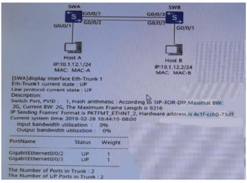

1.  Eth-Trunk 1

(单选题)路由器某接口开启DHCP服务器功能,D HCP客户端可能获取到以下哪个IP地址?

nterface GigabitEthernet0/0/1

p address 11.0.1.1 255.255.255.0

dhcp select interface

dhcp server excluded-ip-address 11.0.1.2 11.0.1.127

C. 11.0.1.254

(单选题)缺省情况下,DHCP服务器分配IP地址的租期为?

B. 24H

(多选题)根据如上所示的命令,则下列描述中正确的是()[HuaweiGigabitEthernet0/0/1]port link-type access[Huaw

ei-GigabitEthernet0/0/1]port default vlan 10 [Huawei-GigabitEthernet0/0/2] port link-type trunk [Huawei-GigabitEt

hernet0/0/2] port trunk allow-pass vlan 10

A、GigabitEthernet0/0/2端口的PVID是1

D、GigabitEthernet0/0/1端口的PVID是10

(多选题)在华为ARG3系列路由器上,AAA支持哪些认证模式?

B, None

C. HWTACACS

D. Local

(多选题)在华为设备上部署ACL时,下面描述正确的是()。

B、同一个ACL可以调用在多个接口下

E、ACL可以匹配报文的TCP/UDP的端口号,且可以指定端口号的范围

(多选题)PPP协议中的LCP协议支持以下哪些功能?

A、协商最大接收单元MRU

B、协商认证协议

D、检测链路环路

(多选题)路由器开启FTP服务,用户名和密码均为huawei,并且设置FTP的根目录为flash:/dhcp/,则以下哪些命令是

必须要配置的?

A, local-user huawei password cipher huawei

B, ftp server enable

C. local-user huawei service-type ftp

D. local-user huawei ftp-directory flash:/dhcp/

(多选题)关于动态MAC地址表说法正确的是?

A、由接口通过报文中的源MAC地址学习获得,表项可老化

B、在系统复位、接口板热插拔或接口板复位后,动态表项会丢失

C、通过查看指定动态MAC地址表项的个数,可以获取接口下通信的用户数

(多选题)VRP系统中,Ctr1+Z组合键具备下列哪些功能?

B、从系统视图退回到用户视图

D、从任何视图退回到用户视图

(多选题)VRP支持通过哪几种方式对路由器进行配置?

A、通过Telnet正确路由器进行配置

C、通过mini USB口对路由器进行配置

D、通过Console口对路由器进行配置

(多选题)HDLC帧由以下哪些字段组成?

A、控制字段(C)

B、帧校验序列字段(FCS)

C、地址字段(A)

D、标志字段(F)

(多选题)某台交换机输出信息如下,下列说法正确的是?

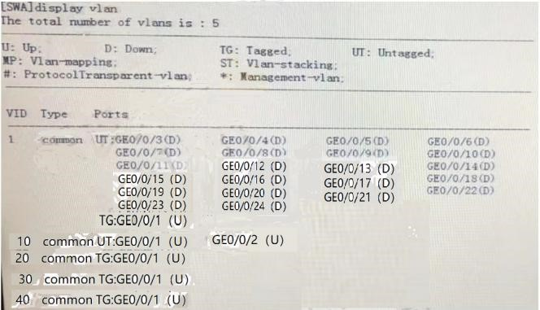

A、用户手工创建了4个VLAN

B、交换机GEO/0/1端口在发送VLAN10的数据帧时,不携带VLAN TAG

(多选题)以下哪种路由协议可以产生缺省路由?

A, OSPFv3

C. OSPF

D. Static

(多选题)关于STP报文说法正确的有?

A、在初始化过程中,每个开启STP协议的交换机都主动发送配置BPDU

C、BPDU报文被封装在以太网数据帧中,目的MAC是组播MAC

D、STP协议存在两种报文,配置BPDU和TCNBPDU

(多选题)RSTP协议中,当拓扑稳定时,哪些端口角色处于Discarding状态?

A、Backup端口

C、Alternate端口

(多选题)如图所示,网络管理员在路由器上完成Telnet配置后,发现主机无法与路由器通过Telnet建立起连接。下面哪些选项能够帮助解决该问题?

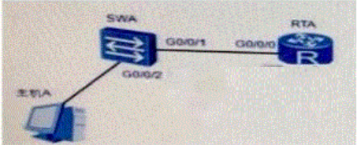

B、使用Ping来检查主机与路由器GO/0/0接口间的IP连通性

C、检查路由器上关于Telnet的配置是否正确

(多选题)TCP/IPv4模型不包括哪些层次?

A、会话层

B、表示层

(多选题)如下图所示网络,交换机A和交换机B连接主机的端口分别属于VLAN10和VLAN20,交换机互联的端口类型为Trunk,PVID分别为10和20,下列说法正确的有?

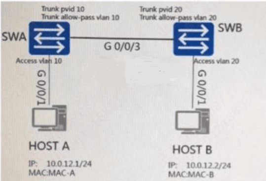

B、主机A和主机B可以ping通

D、交换机之间转发主机发送的数据帧时不携带VLAN TAG

(多选题)手工链路聚合模式下的Eth-Truk端口,其传输速率与()有关。

1.  成员端口的带

D、成员端口的数量

(多选题)管理员无法通过Telnet登录AR2200路由器,但是其他管理员可以正常登录,那么下面哪些项是可能的原因?

A、该管理员用户账户已经被删除

B、该管理员用户账户已经被禁用

C、该管理员用户账户的权限级别已经被修改为0

(多选题)IPv6报文支持哪些扩展报头?

B、逐跳选项扩展报头

C、目的选项扩展报头

D、分片扩展报头

(多选题)如下图所示网络,RouterA作为DHCPv6中继,Router B作为DHCPv6服务器,此时在RouterB设备上必须配置以下哪些参数?

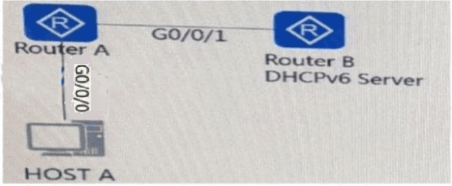

C. DHCPv6 DUID

D、DHCPv6地址池

(多选题)在华为ARG3系列路由器上,AAA支持哪些授权模式?

A、HWTACACS授权

B、不授权

C、RADIUS认证成功后授权

D、本地授权

(多选题)在交换机上,哪些VLAN可以通过使用undo命令来对其进行删除?

A, vlan 4094

C. vlan 2

D. vlan 1024

(多选题)以下应用程序中基于TCP协议的是哪一项?

A、FTP

B、HTTP

(判断题)DHCPv6属于一种有状态地址自动配置协议。

1.  正确

(判断题)路由器进行数据包转发时需要修改数据包中的目的IP地址。

B、错误

(判断题)IPv6中的流标签字段、源地址字段和目的地址字段一起为特定数据流指定了网络中的转发路径。

A、正确

(判断题)OSPFv3协议本身不提供认证功能。

1.  正确

(判断题)ACL不会过滤设备自身产生的访间其它设备的流量;只过滤转发的流量,转发的流量中包括其它设备访问该设备的流量。

A、正确

(判断题)Trunk类型的端口和Hybrid类型的端口在接收数据帧时的处理方式相同。

A 正确

(判断题)TFTP基于TCP协议。

B、错误

(判断题)在串行接口上,可以通过指定下一跳地址或出接口来配置静态路由。

1.  正确

(判断题)路由表中某条路由信息的Proto为OSPF,则此路由的优先级一定为10。

2.  错误

(判断题)运行OSPF协议的路由器先达到FULL状态,然后进行LSDB同步。

B、错误

(判断题)运行RSTP协议的交换机接收到TC置位的BPDU后,清空所有端口学习到的MAC地址。

B、错误

(判断题)链路两端IPv6地址前缀相同才可以建立0SPFv3的邻接关系。

B、错误

(判断题)路由器可以通过无状态地址自动配置方案为主机分配指定的IPv6地址。

B、错误

(判断题)在AR路由器上创建的认证方案、授权方案、计费方案、HWTACACS或者RADIUS服务器模板,只有在域下应用后才能生效。

1.  正确

(判断题)子网192.168.1.0/25的广播地址为192.168.1.128。

2.  错误

(判断题)华为路由器中Tracert诊断工具使用UDP封装跟踪数据。

1.  正确

(判断题)MPLS的体系结构由控制平面(ControlPlane)和转发平面(Forwarding Plane)组成其中转发平面主要完成标签的交换和报文的转发。

A、正确

(判断题)静态NAT只能实现私有地址和公有地址的一对一映射。

A、正确

## 初级-06
1.公司有用户反映在使用网络传输文件时，速度非常低，管理员在网络中使用Wireshark软件抓包发现了一些重复的帧，下面关于可能的原因或解决方案描述正确的是（）。B、网络在二层存在环路2，如下图所示的网络，交换机的MAC地址已标出。在SWD交换机上输入命令stp root secondary，下列哪台交换机出成为此网络的根桥。

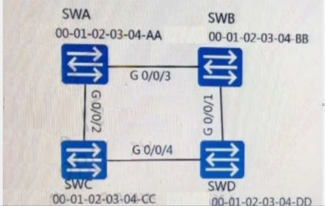A、SWD3，如下图所示的交换网络，所有交换机都运行了STP协议。当拓扑稳定后，在下列那台交换机上修改配置BPDU的发送周期，可以影响SWD配置BPDU的发送周期。

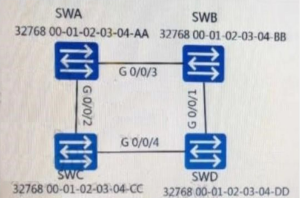D、SWA4（单选题）如图所示，三台二层交换机与一台HUB互联，交换机均开启STP功能，交换机STP的桥D设置请参考下图，其它均是默认配置。以下说法错误的是（）。

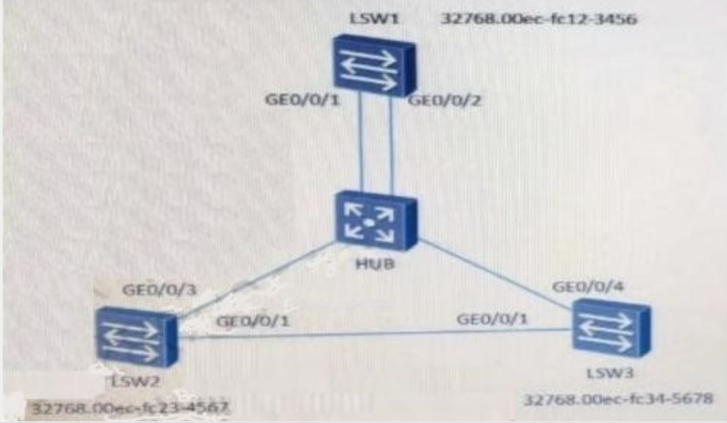C、LSW1的两个端口都为指定端口，处于转发状态5.（单选题）通用路由平台VRP的全称是？D、Versatile Routing Platform6（单选题）链路本地单播地址的接口标识总长度为多少bit？C、64bit7（单选题）OSPFv3报文在IPv6报文首部中的Protocol字段取十进制的值为？B、898（单选题）如图所示的网络，管理员希望所有主机都不能访问Web服务（端口号为80）其它服务正常访问，则在G0/0/1的接口配置中traffic-filter outbound 需要绑定哪个ACL规则？

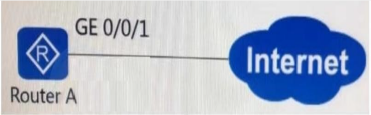C、acl number 3000rule 5 deny tcp destination-port eq www rule10 permit ip/9（单选题）如下图所示的网络，通过以下哪个配置可以实现所有主机都能和主机C通信。但是主机A和主机B不能通信？

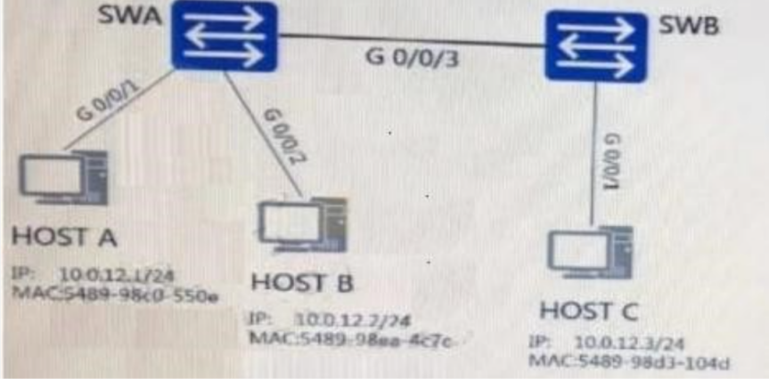B、acl number 4000rule 5 deny destination-mac 5489-98ea-4c7c source-mac 5489-98c0-550e/interface GigabitEthernet0/0/1 traffic-filter inbound acl 4000/10（单选题）PPP帧中的Protocol字段取以下哪个值时表示核有是一个IP数据包？B、0x002111（单选题）以下关于VLANIF接口说法正确的是？D、VLANIF接口是三层接口12（单选题）以下哪种协议不属于文件传输协？B、HTTP13（单选题）缺省情况下，广播网络上OSPF协议Deadtime是？B、40s14（单选题）如下图所示的网络，假设所有路由器同时运行OSPF协议，这个网络中的DR是哪一台路由器？

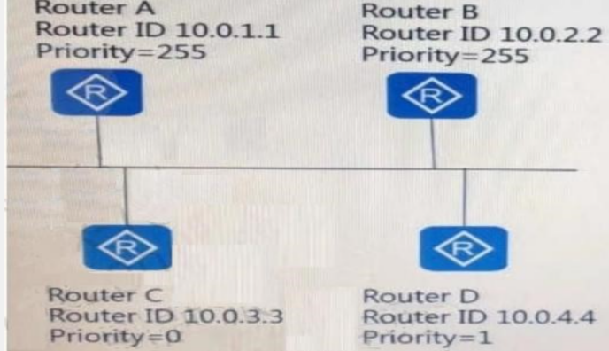B、Router B15（单选题）在VRP平台上，直连路由、静态路由、RIP、OSPF的默认协议优先级从高到低的排序是（）。A、直连路由、OSPF、静态路由、RIP16（单选题）如果应用层协议为Telnet，那么IPv4首部中Protocol字段取值为？D、617（单选题）关于OSI参考模型中网络层的功能说法正确的是？E、提供逻辑地址，实现数据从源到目的地的转发18（单选题）IPv6无状态自动配置使用的RA报文在以下哪种报文类型中承载？B、ICMPV619（单选题）Router C的输出信息如下，则Router C发送OSPFv3 LSU报文时的源IPv6地址为？

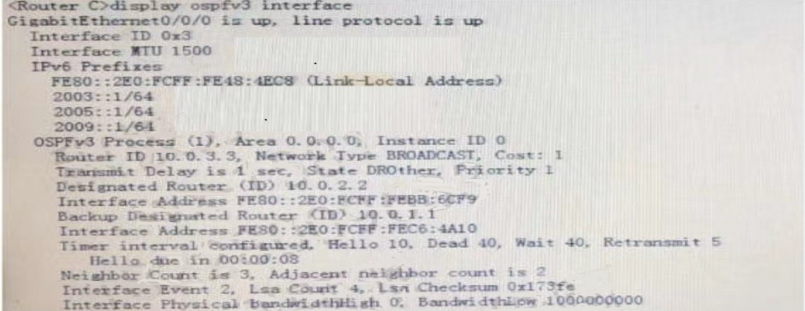B、FE80::2E0:FCFF:FE48:4EC820（单选题）如下图所示的网络，交换机使用VLANIF接口和路由器的子接口对接，则以下哪个配置可以实现这种需求？

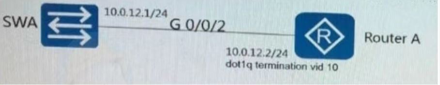C、interface Vlanif10ip address 10.0.12.1 255.255.255.0/interface GigabitEthernet0/0/2 port link-typetrunkport trunk allow-pass vlan 10/21（单选题）管理员通过Telnet成功登录路由器后，发现无法配置路由器的接口IP地址。那么可能的原因有（ )。

C、Telnet用户的级别配置错误22（单选题）下面关于生成树指定端口的描述正确的是（）。B、指定端口可以向与其相连的网段转发配置BPDU报文23（单选题）VRP操作平台对于输入命令不完整使用下列哪条信息提示？B、Error:Incomplete command found at '\^'position24（单选题）VRP系统登录方式不包括下列哪一项？C、Netstream25（单选题）Router C的输出信息如下，则Router C通告多少个全球单播地址前缀？

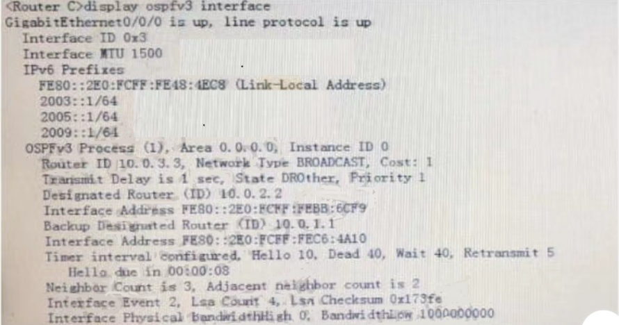

C、326（单选题）IP报文中的协议类型字段值为多少表示协议为GRE？

A、47

27（单选题）交换机G0／0／1端口配置信息如下，交换机在转发哪个VLAN数据帧时不携带VLAN TAG？\\ interface GigabitEthernet0/0/1 port link tuna Trunk port trunk pvid vlan 10 port trunk allow-pass vlan 10 20 30 40

A、1028（单选题）直连路由协议优先级的数值为？A、029（单选题）在华为AR路由器中，缺省情况下OSPF协议优先级的数值为？B、1030（单选题）如下图所示的网络，主机A没有配置网关，主机B存在网关的ARP缓存，在主机A使用命令ping 11.0.12.1，下列说法正确的有？

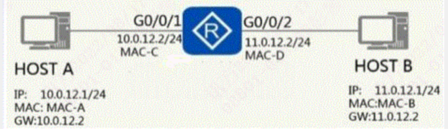D、不会有任何数据包从主机A发出31（单选题）网络管理员发现交换机的某个端口已经学习到MAC地址，但是却不能转发数据帧，此端口处于以下哪种工作状态？D、Learning32（单选题）如下图所示网络，SWA的MAC地址表如下，交换机始终学习不到HOST A的MAC地址，不可能是以下哪种原因？

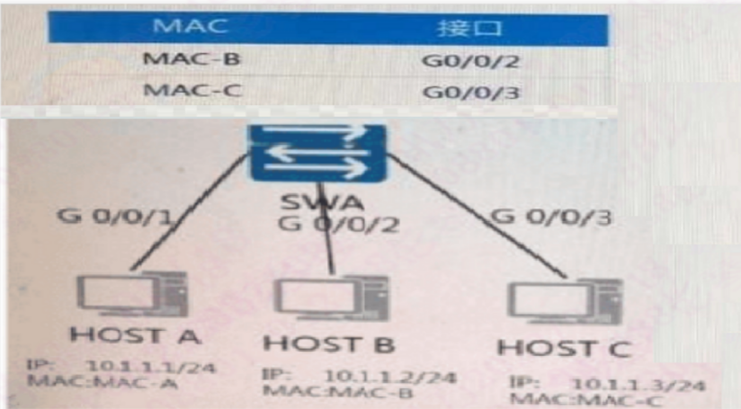B、交换机的G0／0／1端口被设置为ACCESS模式33（单选题）如下图所示，现要求主机C只能和主机A或者主机B其中的一台设备通信，那么在SWB的G0／0／3端口下配置那条命令可以实现这个需求？5555.png

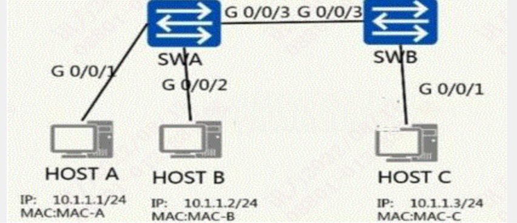D、mac-limit maximum 134(单选题）网络管理员在路由器设备上使用了Tracert Route功能后， 路由器发出的数据包中，IPv4首部的Protocol字段取值为?

B、135（单选题）IP报文头部中有一个TTL字段，关于该字段说法正确的是（ )。C、该字段用于数据包防环36（单选题）DHCPv6客户端发送哪个报文，回应DHCPv6服务器发送的Advertise报文？

B、Request

37（单选题）在IPv6网络中，OSPFv3不再支持下面哪项特性？C、认证功能38（单选题）路由器输出信息如下，则此接口获取到的IPv6地址为？

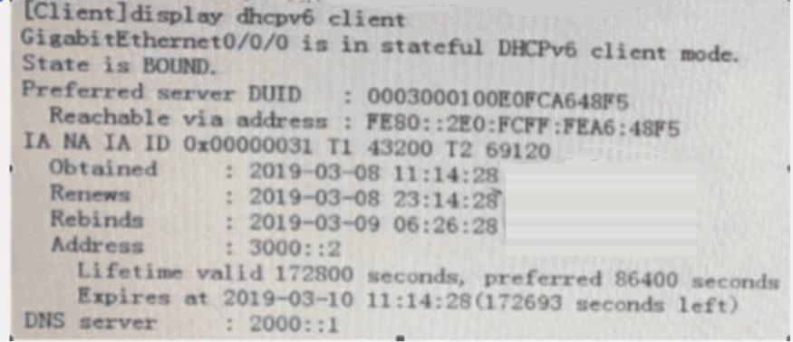C、3000::2/6439（单选题）如图所示的网络，管理员希望所有主机每天在8：00-17：00不能访问Tnternet，则在GO／0／1的接口配置中traffic-filter outbound 需要绑定哪个ACL规则？2222.png

C、time-range am9topm5 08:00 to 17:00 daily/acl number 2001rule 5 deny time-range am9topm5/

40（单选题）某台交换机输出信息如下，以下哪个接口可以转发VLANID为40的数据帧，并且转发时不携带标签？

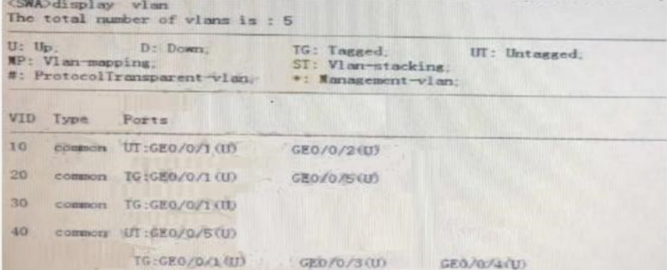D、GE0/0/541（单选题）交换机收到一个单播数据帧，会在MAC地表中查找目的MAC地址，下列说法错误的是？

D、如果查不到这个MAC地址，则交换机执行丢弃操作

42（单选题）下面关于免费ARP报文的作用描述错误的是（）。D、免费ARP报文用来在主机空闲时与网关设备保持激活43（单选题）在使用Tracert程序测试到达目标节点所经过的路径时，默认对每个TTL值Traceroute都要测（ ）次。A、3

44（单选题）如果EUI-64地址78BC-FEFF-FEFE-EFAB 是根据MAC地址计算得到，则其所对应的MAC地址应该为？A、7ABC-FEFE-EFAB45（单选题）在一台充当认证服务器的路由器上配置了两个认证域＂Area 1＂和＂Area 2＂，用户如果使用正确的用户名＂huawei＂和密码＂hello＂进行认证，则此用户会被分配到哪个认证域当中？D、认证域＂default domain＂46（单选题）［RTA］aaa[RTA-aaal domain huawei[RTA-aaa-domain-huawei]authentication-scheme au1[RTA-aaa-domain-huawei]authentication-scheme au2网络管理员在华为路由器RTA上进行如上所示配置，若某用户需在认证域＂huawei＂中进行认证，则下面描述正确的是（）。
C、将使用＂authentication-scheme au2＂认证47（单选题）某公司网络管理员想要把经常变换办公位置而导致经常会从不同的交换机接入公司网络的用户统一划分到VLAN10，则应该采用下列哪种方式来划分VLAN?B、基于MAC地址划分VLAN48（单选题）如下图所示的网络，两台交换机之间通过四条链路相连，COPPER指电接口，FIBR指光接口，则以下哪两个接口可以实现链路聚合？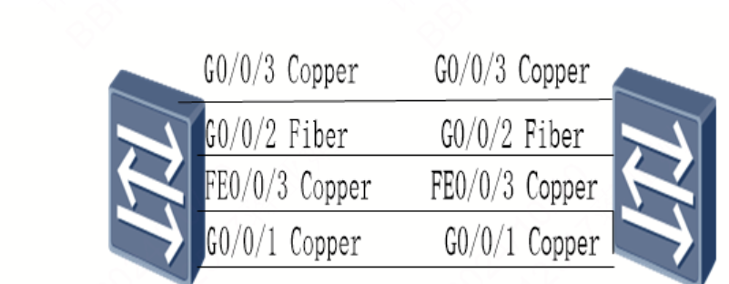

D、G0／0／3和G0／0／149（多选题）在VRP平台上，可以通过下面哪种方式访问上一条历史命令？C、Ctrl+PD、上光标50（多选题）下列哪些IPv6地址是链路范围内的组播地址？全选51（多选题）下列哪些IPv6地址的Solicited-node组播地址为F02：1：FFAB：FECA？

A、2030::BBAB:FECAB、2020::EEAB:FECAC、2020::FFAB:FECA52（多选题）如图所示的网络，通过以下哪些配置可以实现主机A和主机B不能相互通信？

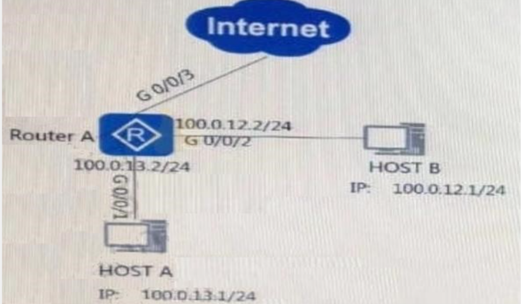C、acl number 2000rule 5 deny source 100.0.12.0 0.0.0.255/interface GigabitEthernet0/0/1 traffic-filteroutbound acl 2000/D、acl number 2000rule 5 deny source 100.0.12.0 0.0.0.255/interface GigabitEthernet0/0/2 traffic-filterinbound acl 2000/

53（多选题）PPP协议由以下哪些协议组成？A、认证协议B、NCPC、LCP54（多选题）如下图所示网络，交换机配置信息如下，下列说法中正确的有？

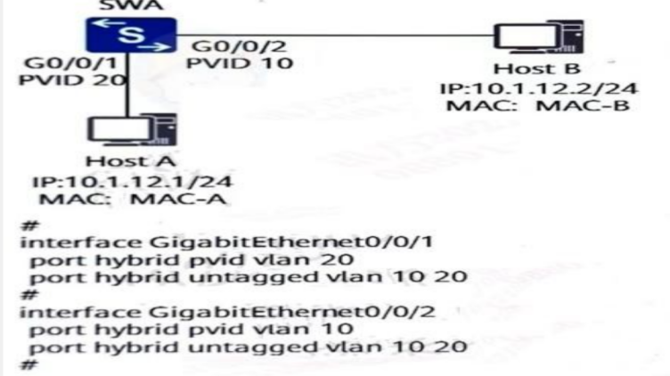

A、主机A和主机B可以ping通B、在两条链路上的数据帧都不包含VLAN TAGD、交换机Gigabit Ethernet0／0／1端口的PVID为2055（多选题）OSPF的hello报文的功能是（）。A、发布Router ID、Router Priority等参数信息C、邻居发现D、维持邻居关系56（多选题）SWA和SWB运行RSTP协议，下列说法正确的有？

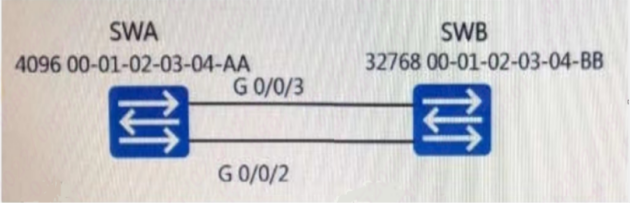A、SWA的G0／0／3端口是指定端口B、SWB的G0／0／3端口是Alternate端口D、SWA的G0／0／2端口是指定端口57（多选题）现有交换机MAC地址表如下，交换机收到一个源MAC地址为5489-9811-0b49，目的MAC为5489-989d-1d30的数据帧，下列说法正确的有？

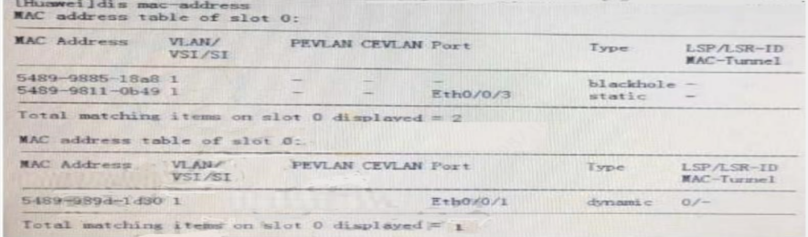

A、如果这个数据帧是从Eth0／0／1端口收到，交换机将会丢弃这个数据帧D、如果这个数据帧是从Eth0／0／3端口收到，则交换机把此数据帧从Eth0／0/1端口转发出去58（多选题）如图所示，交换机GE0／0／1和GE0／0／2两个端口都进行不同的此Hybrid配置，下面说法正确的是

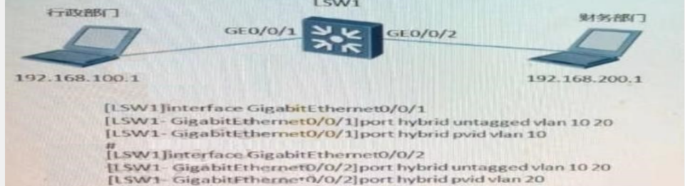A、财务部门发出的数据帧在交换机中携带的Tag为VLAN20E、这里的交换机可以是二层交换机，也可以是三层交换机，因为通信无需经过三层网关59（多选题）如果一个以太网数据帧的Length/Type=0x8100, 那么这个数据帧可能是由以下哪种端口发出的A、交换机Hybrid类型的端口D、交换机Trunk类型的端口60（多选题）以下关于OSPF的Router ID描述不正确的是（ )。B、Router ID必须是路由器某接口的IP地址C、必须通过手工配置方式来指定Router IDD、在同一区域内Router ID必须相同，在不同区城内的Router ID可以不同61（多选题）下列说法不正确的是（）。

B、VRP中，路由协议优先级值越大则表示该路由的优先级越高D、若路由条目的cost值越大，则该路由的优先级越高62（多选题）以下关于RSTP配置BPDU的处理说法正确的有哪些？

1.  拓扑稳定后，无论是否接收到根桥传来的配置BPDU报文，非根桥设备仍然按照Hello Timer规定的时间间隔发送配置BPDUD、当一个端口收到上游的指定桥发来的次优RST BPDU报文时，该端口立即回应自身存储的RST BPDU63（多选题）目前使用的IPv6组播地址标志字段（Flag）取值有？A、0B、164（多选题）全球单播地址由以下哪些部分组成？B、Interface IDC、Subnet IDD、Global Routing Prefix65（多选题）路由器A的G0／0／1接口配置信息如下，下列说法正确的有？acl number 3000rule 5 deny 17rule 10 deny 89rule 15 deny 6\#interface GigabitEthernet0/0/1traffic-filterinbound acl 3000B、本接口不会转发收到的SNMP报文C、本接口不会转发收到的FTP报文66（多选题）PPP比HDLC更安全可靠，是因为PPP支持（）。B、PAP

D、CHAP

67（多选题）在OSPF广播网络中，一台DRother路由器会与哪些路由器交换链路状态信息？A、DRB、BDR68（多选题）如果路由器的以太网接口需要转发一个1600B的数据包，则下列说法正确的有？

全选

69（多选题）某路由器DHCPv6地址池配置信息如下，如果主机采用DHCPv6有状态自动配置，则主机可以获取到哪些IPv6地址？\\ dhcpv6 pool test address prefix 3000::/64 excluded-address 3000::1 dns-server 2000::1 dns-domain-name huawei dns-domain-name [huawei.com](/storage/emulated/0/Download/Notes/huawei.com#huawei.com)A、3000::2/64C、3000::3000/6470（多选题）链路聚合技术中，Eth-Trunk可以根据哪些参数来实现流量的负载分担？A、相同的源IP地址或目的IP地址C、相同的源MAC地址或目的MAC地址71（多选题）如图所示，华为交换机上关于VLAN的配置，说法正确的是（）。

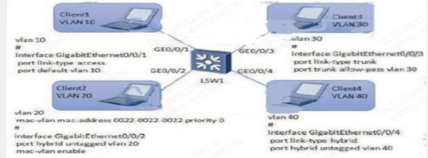

A、Client1属于VLAN10，且交换机上划分VLAN的命令正确B、Client2属于VLAN20，且交换机上基于MAC地址划分VLAN的命令正确72（多选题）下列哪些报文属于OSPF协议的报文？A、LSUC、LSRD、HELLO73（多选题）缺省路由可以来源于（ ）。A、手工配置B、动态路由协议产生74（多选题）以下关于IPv6任播地址说法正确的有？

全选75（多选题）路由器接口输出信息如下，则此接口可以接收哪些组播地址的数据？

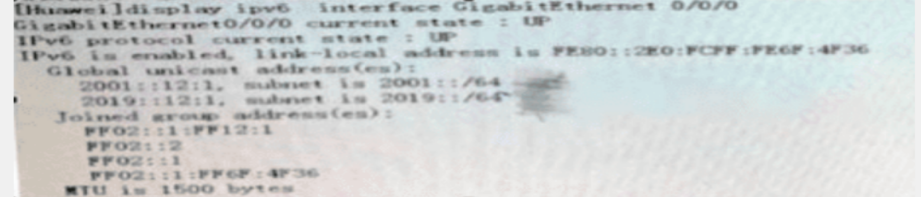

全选76（多选题）IPSec VPN支持以下哪些封装模式？A、隧道模式C、传输模式77（多选题）PPPoE会话建立过程可分为哪两个阶段？B、Discovery阶段C、PPPoE Session阶段78（判断题）动态路由协议能够自动适应网络拓扑的变化。A、正确79（判断题）如果一个以太网数据帧的Type／Length字段的值为0x0800，则此数据帧所承载的上层报文首部长度范围为20-60B。A、正确80（判断题）MPLS域中的LER全称为Label Egress Router。B、错误81（判断题）华为交换机上创建VLAN的规则是不能创建VLAN4095，且不可以删除VLAN1。A、正确82（判断题）当两台OSPF路由器形成TWO-WAY邻居关系时，LSDB已完成同步，但是SPF算法尚未运行。B、错误83（判断题）OSPF的Router ID必须和路由器的某个接口IP地址相同。B、错误84（判断题）UDP不能保证数据传输的可靠性，不提供报文排序和流量控制等功能，适合传输可靠性要求不高，但是对传输速度和延迟要求较高的流量。

A、正确85（判断题）FEC（Forwarding Equivalence Class）转发等价类，是一组具有某些共性的数据流的集合；FEC可以根据地址进行划分，但是不能根据业务类型、QoS等要素进行划分。B、错误86（判断题）路由器在转发某个数据包时，如果未匹配到对应的明细路由且无默认路由时，将直接丢弃该数据包。A、正确87（判断题）OSPFv2通过增加新类型的LSA支持IPv6。B、错误88（判断题）二层ACL可以匹配源MAC，目的MAC，源IP，目的IP等信息。B、错误89（判断题）参考以下拓扑及配置，路由器R1与R2通过Serial低速线缆连接，且数据链路层封装使用PPP。当R1和R2的Holdtime不一致时，PPP协商失败，无法通信。

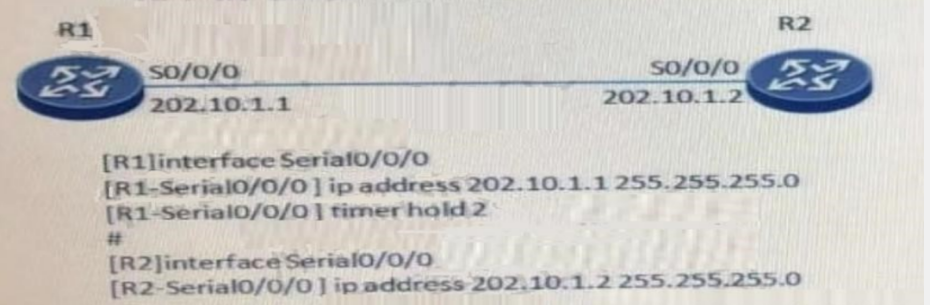

B、错误90（判断题）在广播型的接口上配置静态路由时，必须要指定下一跳地址。

A、正确

91（判断题）段路由SR（Segment Routing）是对现有IGP协议进行扩展，基于MPLS协议，采用源路由技术而设计的在网络上转发数据包的一种协议。A、正确92（判断题）Truk端口可以允许多个VLAN通过，包括VLAN4096。B、错误93（判断题）在广播网络上，DR和BDR都使用组播地址224.0.0.6来接收链路状态更新报文。A、正确94（判断题）VRP操作平台中使用命令mkdir test，系统会创建一个名字为test的文件夹。

A、正确95（判断题）MPLS标签头封装在报文的数据链路层头部和网络层头部之间。

A、正确96（判断题）网络设备发送的IPv6报文时，会首先将报文长度和MTU值进行对比，如果大于MTU值，则直接丢弃。B、错误97（判断题）DHCPv6客户端必须从DHCPv6服务器同时获取IPv6地址和其它配置信息。

B、错误98（判断题）华为ARG3系列路由器默认使能SNMP的所有版本（SNMPv1、SNMPv2c和SNMPv3）。A、正确

## 初级-07
1.(单选题)管理员发现无法通过TFTP传输文件到华为AR200路由器,则可能的原因是什么?

D、TFTP服务器的UDP 69号端口被禁用

2.(单选题)管理员计划通过配置静态浮动路由来实现路由备份,则正确的实现方法是()。

A、管理员需要为主用静态路由和备用静态路由配置不同的协议优先级值

3.(单选题)某台交换机MAC地址表如下,如果交换机从Eth0/0/2端口收到一个目的MAC为5489-9885-18a8的数据帧,下列说法中正确的是?

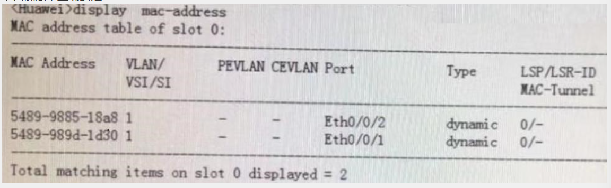

C、将这个数据帧丢弃

4.(单选题)DHCPV6设备唯一标识符DUID有多少种生成方式?

B. 2

5.(单选题)IPv6报文头部中的Traffic Class字段的长度为多少bit?

B. 8

6.(单选题)如下图所示的网络,从安全角度考虑,路由器A拒接从GO/0/1接口收到的OSPF报文、GRE报文、ICMP报文、以下哪些命令不可以实现这个需求?

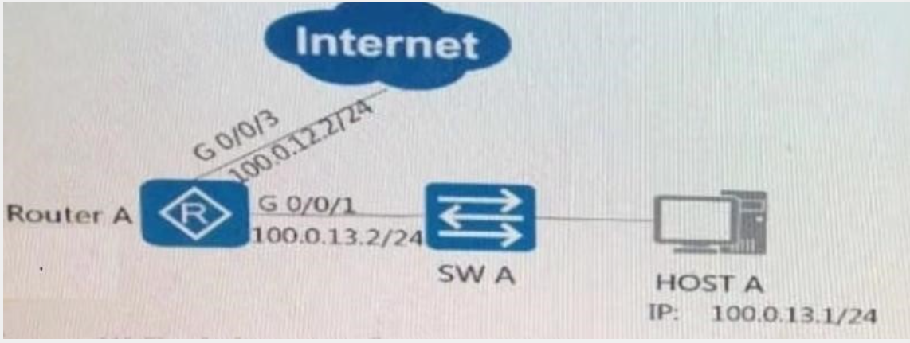

B. acl number 2000 rule 5 deny 47 rule 10 deny

89 rule 15 deny 1

/

interface GigabitEthernet0/0/1 traffic-filter

inbound acl 2000

7.(单选题)如图所示,网络管理员希望将SWA与SWB之间的两条物理链路手工聚合成一条Eth-trunk链路;下列描述正确的是()。

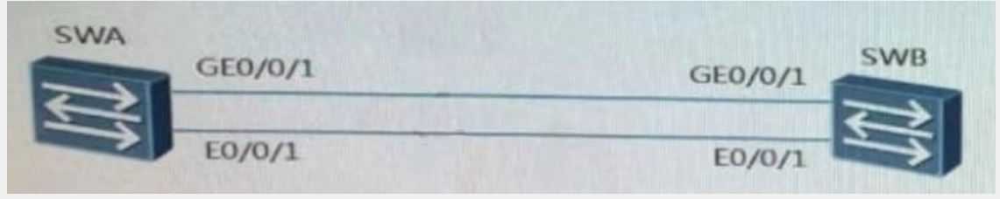

A、不能被聚合

8.(单选题)在路由表中不包含以下哪项内容?

A、MAC

9.(单选题)RSTP协议存在几种端口状态?

C、3

10.(单选题)管理员要在路由器的G0/0/0接口上配置IP地址,那么使用下面哪一个地址才是正确的?

A、 145.4.2.55/26

11.(单选题)如图所示是管理员在网络中捕获到的三个数据包。下面说法不正确的是()。

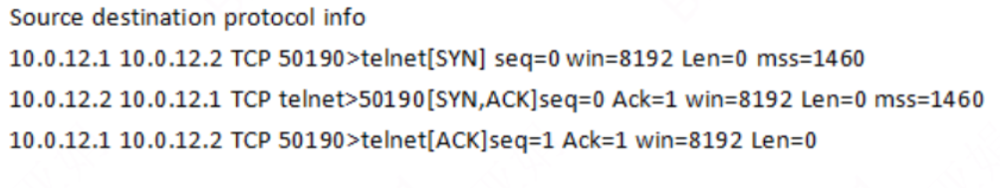

C、Telnet服务器的IP地址是10.0.12.1,Telnet客户端的IP地址是10.0.12.2

12.(单选题)从源设备到目的设备之间有两台路由器RTA和RTB,使用Tracert命令来检测路径。检测第一跳RTA时,源设备对目的设备的某个较大的端口送一个TTL为1的UDP报文,当该报文到达RTB时,TTL将变为0,于是RTA对源设备回应一个ICMP()消息。

C、Time Exceeded

13.(单选题)如果IPv6的主机希望发出的报文最多经过10台路由器转发,则应该修改IPv6报文头中的哪个参数?

C. Hop Limit

14.(单选题)IPv6地址总长度比IPv4增加了多少bit?

B、96

15.(单选题)如下命令属于哪种类型的ACL?rule permit 8021p 7

A、二层ACL

16.(单选题)以下哪种协议不属于文件传输协议?

D. HTTP

17.(单选题)下列哪个OSPF协议的报文可以确保LSA更新的可靠性?

A、LSACK

18.(单选题)\<Huawei\>system-view[Huawei]command-privilege level 3 view user save关于上面的配置命令说法正确的是()。

C、修改用户视图下的save命令的权限等级为3

19.(单选题)OSI参考模型从高层到低层分别是?

C、应用层、表示层、会话层、传输层、网络层、数据链路层、物理层

20.(单选题)以下哪种认证方式不需要输入用户名和密码?

D. authentication-mode none

21.(单选题)PPP协议定义的是OSI参考模型中哪个层次的封装格式?

B、数据链路层

22.(单选题)某台交换机链路聚合端口输出信息如下,如果想要删除Eth-Trunk1,下列命令正确的是?

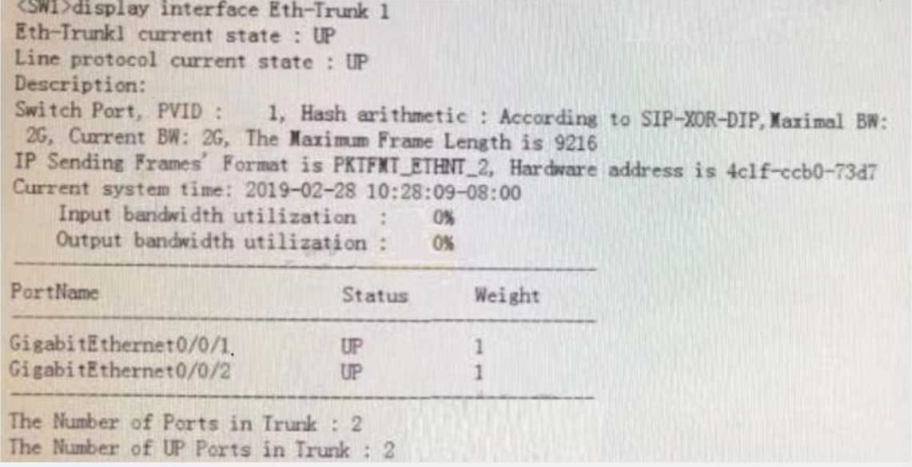

C. inte GigabitEthernet 0/0/1 undo eth-trunk

quit

inte GigabitEthernet 0/0/2 undo eth-trunk

quit

undo interface Eth-Trunk1

23.(单选题)关于上面的display信息描述正确的是()。

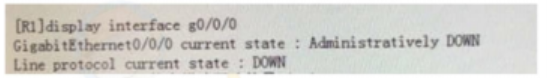

A、GigabitEthernet 0/0/0接口被管理员手动关闭了

24.(单选题)下列路由协议中优先级最高的是?

A、Direct

25.(单选题)交换机的MAC地址表不包含以下哪种信息?

C、IP地址

26.(单选题)交换机中,端口与MAC绑定的技术是以下哪一个?

D. Port Security

27.(单选题)\<Huawei\>system-view

[Huawei] user-interface console 0

[Huawei-ui-console0] user privilege level 15

[Huawei-ui-console0]authentication-mode password

[huawei-ui-console0] set authentication password cipher huawei2012

[Huawei-ui-console0]quit

关于上述配置命令说法错误的是()。

D、通过console登录设备的用户的密码为"cipherhuawei2012"

28.(单选题)下面有关MPLS Label标签的说法,错误的是哪个?

E、无

29.(单选题)缺省情况下,在P2P链路上发送OSPFv3邻接关系的Deadtime为多少秒?

A. 40

30.(单选题)如果在PPP认证的过程中,被认证者发送了错误的用户名和密码给认证者,认证者将会发送哪种类型的报文给被认证者?

C、Authenticate-Nak

31.(单选题)如图所示,网络管理员在SWA与SWB上创建VLAN2,并将两台交换机上连接主机的端口配置为Access端口,划入VLAN2。将SWA的GO/0/1与SWB的G0/0/2配置为Trunk端口,允许所有VLAN通过。则要实现两台主机间能够正常通信,还需要()。

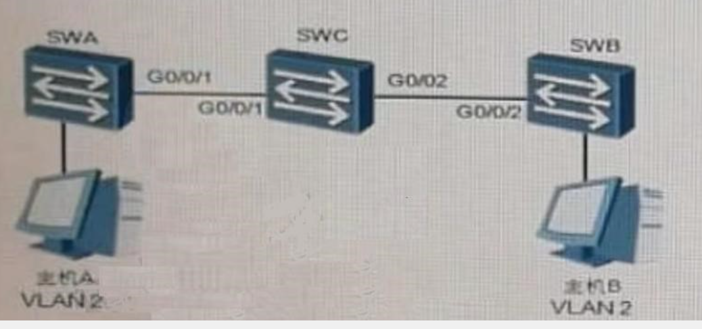

B、在SWC上创建VLAN2,配置GO/0/1和GO/0/2为trunk端口,且允许VLAN 2通过

32.(单选题)以下那条命令可以开启路由器接口的DHCP中继功能?

D. dhcp select relay

33.(单选题)STP计算的端口开销(Port Cost)和端口带宽有一定关系,即带宽越大,开销越()。

D、小

34(单选题)管理员想要彻底删除旧的设备配置文件\<config.zip\>,则下面的命令正确的是()。

A, delete/unreserved config.zip

35(单选题)网络层首部格式中不包含哪些字段?

C. Sequence Number

36(单选题)DHCPv6报文需要哪种协议报文承载?

C. UDP

37(单选题)IPv6地址总长度为多少bit?

C、128

38(单选题)以下哪种类型的ACL可以匹配传输层端口号?

B、高级ACL

39(单选题)为了查看路由器上串口SO/0/1是DTE接口还是DCE接口,应该使用下面哪个命令?

A, display interface s0/0/1

40(单选题)某交换机收到一个带有VLAN标签的数据帧,但发现在其MAC地址表中查询不到该数据帧的目的MAC地址,则交换机对该数据帧的处理行为是()。

C、交换机会向属于该数据帧所在VLAN中的所有端口(除接收端口)广播此数据帧

41(单选题)如图所示,关于OSPF的拓扑和配置,下列说法中正确的是()。

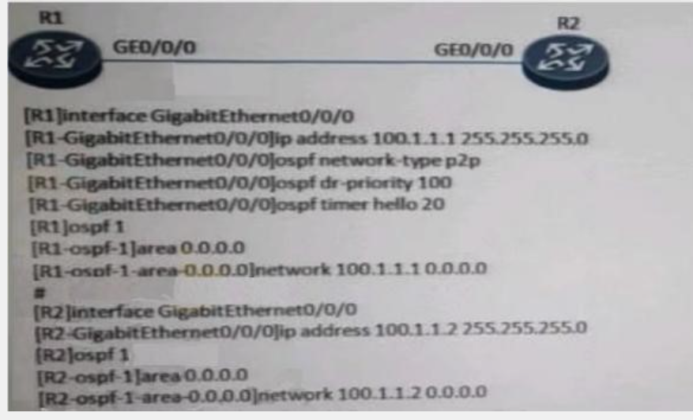

C、只要把R1的接口网络类型恢复为默认的广播类型,同时调整hel1o时间为10s,R1和R2即可建立稳定的邻居关系

42(单选题)如下图所示的网络,通过静态路由的方式使Router A和Router B的loopback 0通信,则需要在Router A输入如下那条命令?

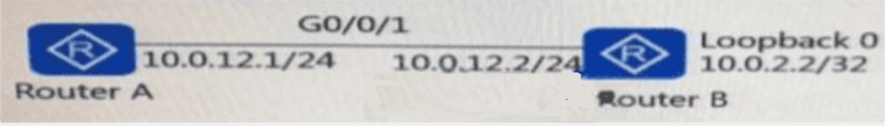

C. ip route-static 10.0.2.2 255.255.255.25510.0.12.2

43(单选题)下面关于二层以太网交换机的描述,说法不正确的是()。

D、需要对所转发的报文三层头部做一定的修改,然后再转发

44(单选题)如图所示,四台交换机都运行STP,各参数都采用默认值。在根交换机某端口发生阻塞并无法通过该端口发送配置即心时,网络中塞端口在多久之后会进入到转发状态?

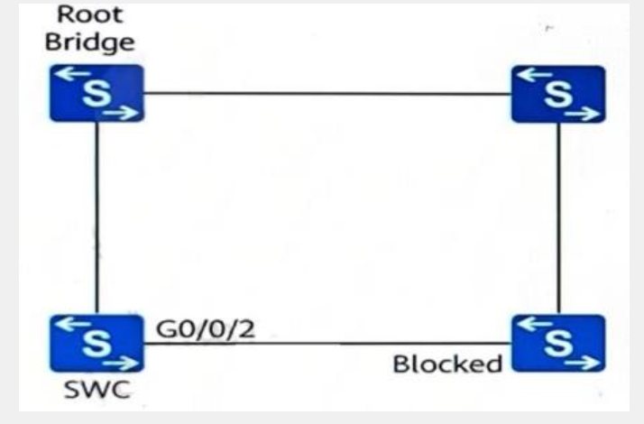

B、约50秒

45(单选题)路由器上电时,会从默认存储路径中读取配置文件进行路由器的初始化工作。如果默认存储路径中没有配置文件,则路由器会使用什么来进行初始化?

C、缺省参数

46(单选题)如果一个网络的网络地址为10.1.1.0/30,那么它的广播地址是()?

C. 10.1.1.3

47(单选题)IPv6地址中不包括下面哪种类型的地址?

B、广播地址

48(单选题)OSPFv3使用哪个区域号标识骨干区域?

A,0

49(单选题)下面哪项参数不能用于高级访问控制列表?

A、物理接口

50(单选题)下列配置默认路由的命令中,正确的是()。

A, [Huawei]ip route-static 0.0.0.0 0.0.0.0 192.168.1.1

51(多选题)如下图所示网络,交换机配置信息如下,下列说法正确的有?

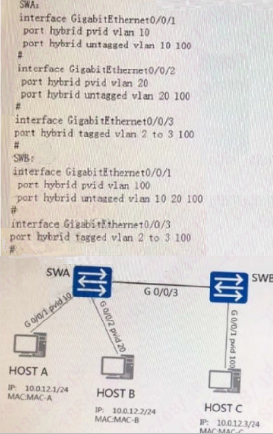

B、主机A和主机B不能Ping通

C、主机A和主机C不能Ping通

52(多选题)路由器的主要功能,以下说法错误的是?

C、根据收到数据包的源IP地址进行转发

D、实现相同网段设备之间相互通信

53(多选题)通过抓包工具捕获到一个以太网帧,发现该帧的Type/Length字段的值为0x0800,下面对该帧的描述,正确的是()。

B、该帧承载的是一个IP报文

C、该帧的帧结构是Ethernet_II格式

54(多选题)下面关于IPv6描述正确的是()。

A、IPv6的地址长度为128 bits

C、当一个IPv6报文有多个扩展头部时,扩展头部必须有序地出现

55(多选题)关于以太网子接口描述正确有哪些?

B、一个子接口可以绑定多个VLAN

C、子接口的IP地址不能属于同一网段

56(多选题)下列关于OSPF中的DD报文和LSA描述正确的是()。

A、LSA的头部可以唯一标识一个LSA

D、LSA头部只是LSA的一小部分

57(多选题)一个网段150.25.0.0的子网掩码是255.255.224.0,那么()是该网段中的有效的主机地址。

A, 150.25.2.24

D. 150.25.1.255

58(多选题) [RTA] acL 2002

[RTA-acl-basic-2002]rule deny source 172.16.1.1 0.0.0.0

[RTA-acl-basic-2002]rule deny source 172.16.0.0 0.255.0.0

在路由器RTA上使用如上所示ACL匹配路由条目,则下面哪些条目将会被匹配上?

B. 172.16.1.1/32

D. 172.48.0.0/16

59(多选题)网络管理员使用Ping能来测试网络的连通性,在这个过程中下面哪些协议可能会被使用到?

A, ARP

C ICMP

60(多选题)如果一个以太网数据帧的Length/Type=0X8100,那么这个数据帧的载荷可能是?

A、TCP数据段

B、UDP数据

C、ICMP报文

60.(多选题)如果一个以太网数据帧的Length/Type=0X8100,那么这个数据帧的载荷可能是?

A、TCP数据段

B、UDP数据

1.  ICMP报文

61.(多选题)开启标准STP协议的交换机可能存在哪些端口状态?

B、Listening

C、Disabled

D、Forwarding

62.(多选题)关于VRP操作平台快捷键说法正确的有?

A、CTRL+Z回到用户视图

B、CTRL+C停止当前命令的运行

C、向左的光标键( \<- )光标左移一位。

63.(多选题)通过SR(Segment Routing)可以简易的定义一条显式路径,网络中的节点只需要维护Seament Routing信息。

即可应对业务的实时快速发展。Segment Routing具有如下哪些特点?

A、同时支持控制器的集中控制模式和转发器的分布控制模式。提供集中控制和分布控制之间的平衡

C、通过对现有协议(例如IGP)进行扩展,能使现有网络更好的平滑演进

D、采用源路由技术 提供网络和上层应用快速交互的能力

64.(多选题)某个ACL规则如下:则下列哪些IP地址可以被permit规则匹配?

rule 5 permit ip source 10.0.1.0 0.0.254.255

B、10.0.3.4

C、10.0.1.2

65.(多选题)如下图所示的网络,交换机A和路由器A通过两链路相连,将这两条链路通过手工负载分担的模式进行链路聚合,聚合端口编号为1,并且聚合链路进行数据转发时需要携带VLAN TAG100,路由器A需要使用如下哪些配置?

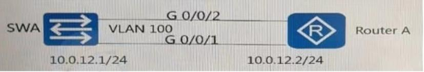

B、interface GiaabitEtherneta/0/1 eth-trunk 1

/

interface GigabitEthernet0/0/2 eth-trunk 1

D、interface Eth-Trunk1 undo portswitch

/

interface Eth-Trunk1.100 dot1q termination

vid 100

ip address 10.0.12.2.255.255.255.0

arp broadcast enable

/

66.(多选题)某台路由器输出信息如下,下列说法正确的有?

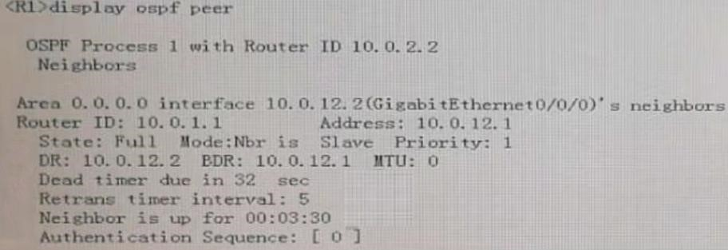

A、本路由器是DR

C、路由器Router ID为10.0.2.2

D、本路由器的接口地址为10.0.12.2

67.(多选题)以下哪种情况下交换机会产生配置BPDU?

A、在初始化过程中,只要端口使能STP,则配置BPDU就会按照Hel1o Time定时器规定的时间间隔从指定端口

发出

B、当根端口收到配置BPDU时,根端口所在的设备会从自己的每一个指定端口发送配置BPDU

D、当指定端口收到比自己差的配置BPDU时,会立刻向下游设备发送自己的BPDU

68.(多选题)一台AR2200路由器需要恢复初始配置,则下面哪些描述是正确的?

B、重置saved configuration

D、重启该AR2200路由器

69.(多选题)客户访问FTP服务器时出错,检查发现服务器与客户端之间的连通性没有问题,那么有可能是下面哪些服务器端

口被阻塞而导致的问题?

A、21

B、20

70.(多选题)以下关于IPv6地址配置说法正确的有?

B、IPv6支持DHCPv6的形式进行地址配置

C、IPv6支持无状态自动配置

D、IPv6地址支持多种方式的自动配置

71.(多选题)链路聚合是企业网络中的常用技术。下列描述中哪些是链路聚合技术的优点?

A、提高可靠性

C、增加带宽

D、实现负载分担

72.(多选题)用Telnet方式登录路由器时,可以选择哪几种认证方式?

A、本地认证

B、不认证

C、password认证

73.(多选题)如下图所示,所有主机之间都可以正常通信,下列说法正确的有?

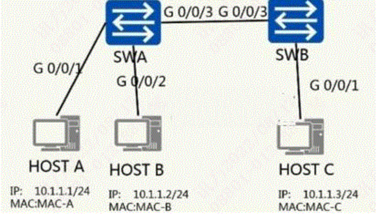

A、SWB的G0/0/3学习到2个MAC地址

C、SWA的G0/0/3学习到1个MAC地址

74.(多选题)RSTP协议包含以下哪些端口状态?

A、Forwarding

B、Discarding

D、Learning

75.(多选题)如下图所示的网络,所有交换机运行STP协议,当拓扑稳定后。将SWA设备断电,下列说法正确的是?

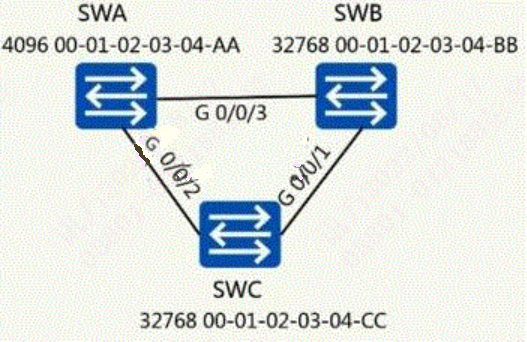

A、SWB仍然周期性从GO/0/1端口发送配置BPDU

B、SWC经过现Max Age时间之后从G0/0/1端口发送配置BPDU

76.(多选题)在STP协议中,下面哪些因素会影响根交换机的选举?

D、交换机的现MAC地址

E、交换机优先级

77.(多选题)以下关于ICMP报文的分析正确的是()。

A、ICMP报文封装在IP报文中,不经过传输层封装

C、ICMP报文可以记录时间,包括原始时间、接收时间、发送时间

78.(多选题)路由器RouterlD邻居关系如下,下列说法正确的有?

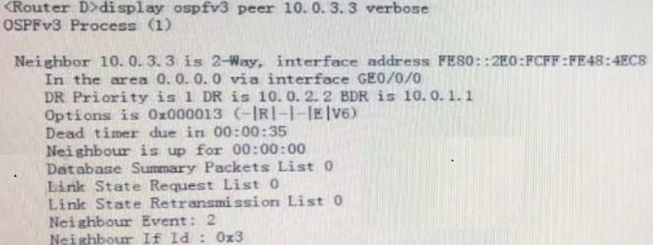

A、本路由器和Router-ID为10.0.3.3的路由器不能真接交换链路状态信息

B、本路由器是DROther路由器

79.(多选题)某个ACL规则如下:则下列哪些IP地址可以被permit规则匹配?rule 5 permit ip source 10.1.1.0 255.0.254.255

B、6.1.3.1

D、9.1.1.1

80.(多选题)如下图所示,路由器A已经通过IP地址10.0.12.2 Telnet路由器B,在当前界面下,以下哪些操作会导致路由器和路由器的Telnet会话中断?

A、关闭G0/0/1接口

B、修改G0/0/1接口IP地址

81.(多选题)使用动态主机配置协议DHCP分配IP地址有哪些优点?

A、可以实现IP地址重复利用

B、避免IP地址冲突

D、配置信息发生变化(如DNS),只需要管理员在DHCP服务器上修改,方便统一管理

82.(多选题)路由器R1路由表输出信息如下,下列说法正确的是?

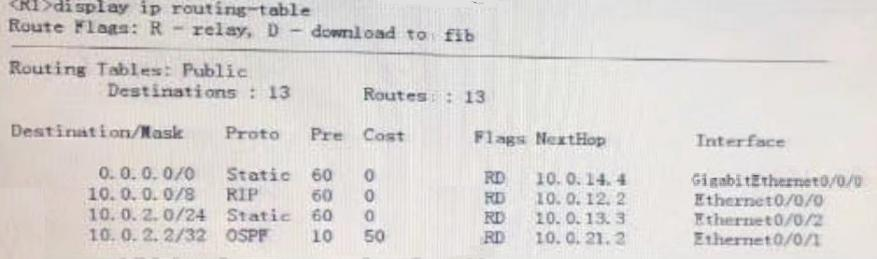

A、目的地址为10.0.2.2的数据包通过Ethernet0/0/1接口转发

B、目的地址为10.0.1.1的数据包通过Ethernet0/0/0接口转发

D、目的地址为10.0.2.1的数据包通过Ethernet0/0/2接口转发

83.(判断题)以太网帧在交换机内部都是以带VLAN TAG的形式来被处理和转发的。

A、正确

84.(判断题)运行OSPF协议的路由器在完成LSDB同步后才能达到FULL状态。

A、正确

85.(判断题)在Telnet中应用如下ACL:acl number 2000 rule 5 permit source 172.16.105.2 0则只允许IP地址为172.16.105.2

的设备登录。

A、正确

86.(判断题)如图所示,可以判断00e0-fc99-9999是交换机通过ARP学习到的特定主机MAC地址,且该主机更换过三次IP地址。

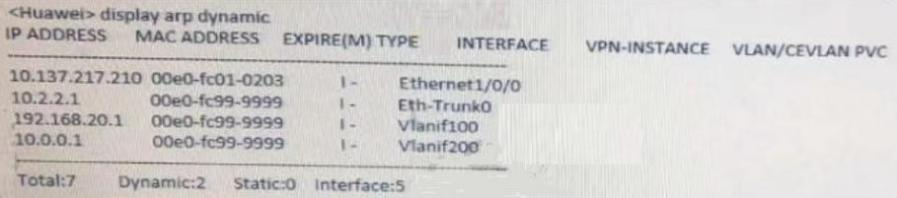

B、错误

87.(判断题)路由器在转发IPv6报文时,需要根据IPv6报文的源IP地址查找路由表。

B、错误

88.(判断题)

(单选题)如图所示,路由器R1上部署了静态NAT命令,当PC访问互联网时,数据包中的目的地址不会发生任何变化。

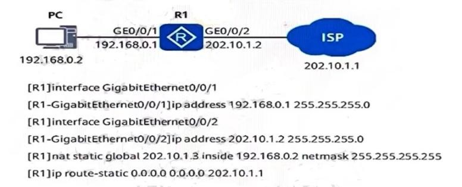

A、正确

89.(判断题)参考如图所示的输出结果,可以判断该路由器的路由表是由直连路由和静态路由组成。

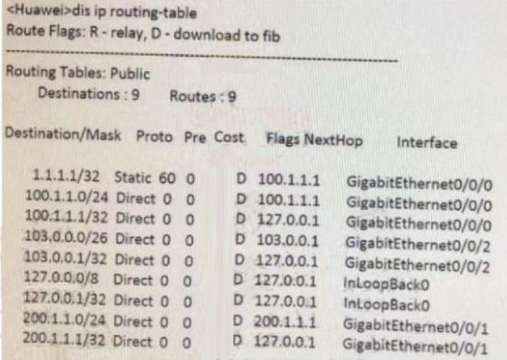

A、正确

90.(判断题)当IPv6接口收到跳数限制(Hop Limit)字段取值为1的数据包时不会转发此数据包。

A、正确

91.(判断题)ACL本质上是一种报文过滤器,将ACL在业务模块中应用,ACL才能生效。

A、正确

92.(判断题)RSTP协议中,P/A机制要求两台交换设备之间链路必须是点对点的全双工模式。

A、正确

93.(判断题)2001 :: 12:1对应的被请求节点的组播地址为FF02 :: 1:FF12:1。

A、正确

94.(判断题)DHCP服务器回应客户端的报文一定是单播报文。

B、错误

95.(判断题)如图所示的广播网络中,OSPF运行在四台路由器上,且在同一区域,同一网段。OSPF会自动选举一个DR.多个BDR,从而达到更好的备份效果。

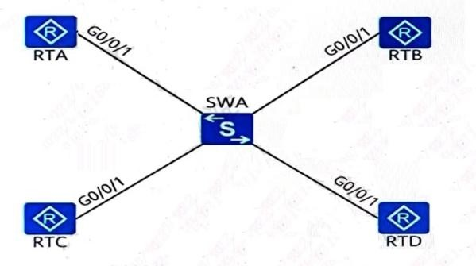

B、错误

96.(判断题)二层交换机属于数据链路层设备,可以识别数据帧中的MAC地址信息,根据MAC地址转发数据,并将这些MAC地址与对应的端口信息记录在自己内部的MAC地址表中。

A、正确

97.(判断题)如果一个网络的网络地址为192.168.1.0,那么它的广播地址一定是192.168.1.255。

B、错误

98.(判断题)某路由器OSPFv3邻接关系如下,则本路由器是ABR。

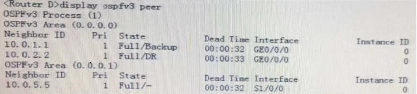

A、正确

99.(判断题)交换机的端口在收到不携带VLAN TAG数据帧时,一定添加PVID。

A、正确

100.(判断题)路由器所有的接口属于同一个广播域。

B、错误

## 初级-08
1(单选题)如下图所示的网络,所有链路均是以太网链路,并且所有路由器的全部接口都运行OSPF协议,则整个网络中选举几个DR?  
B、4  
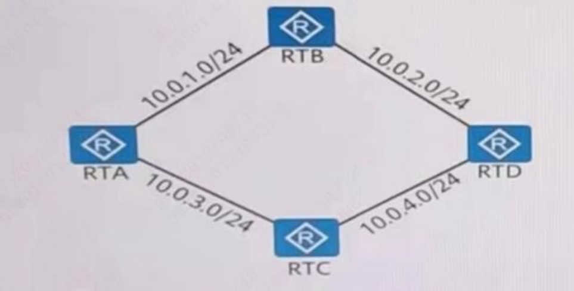  
2(单选题)以下哪些不是小型园区网络的特点?  
C、覆盖范围广

3(单选题)园区网搭建的生命周期中哪个阶段是一个项目的开端?

C、规划与设计

4(单选题)WLAN架构中FIT AP无法独立进行工作,需要由AC进行统一管理。FIT AP与AC之间通过以下哪种协

议进行通信?

D. CAPWAP

5(单选题)Wi-Fi 6相比于Wi-Fi5的优势不包括以下哪项?

D、更高的功耗  
6(单选题)DHCP客户端在租期到达哪个比例时第一次发送续租报文?

D. 0.5  
7(单选题)交换机某个端口配置信息如下,下列说法错误的是?

interface CigabitEthernet0/0/1

port link-type trunk

port trunk pvid vlan 100

port trunk allow-pass vlan 100 200

C、如果数据帧携带的VLANAG为200,则交换机剥离TAG发出  
8(单选题)二层以太网交换机根据端口所接收到以太网帧的()生成MAC地址表的表项。

A、源MAC地址  
9(单选题)当采用LACP模式进行链路聚合时,华为交换机的默认系统优先级是?

B. 32768

10(单选题)下列协议中属于链路状态路由协议的是?

C. OSPF

11(单选题)以下选项中,不属于SDN网络架构的是?

B、芯片层

12(单选题)以下关于Python语言说法错误的是?

1.  Python语言支持自动缩进,在写代码时候不需要关注。

13(单选题)以下哪个IPV6地址可以简写为2FFF:DAC:ABEF :: CDAA:732

1.  2FFF:ODAC:ABEF:0000:0000:0000:CDAA:0732

14(单选题)PPPOE会话建立和终结过程中不包括以下哪个阶段?

A、数据转发阶段

15(单选题)交换机某个端口配置信息如图,则此端口的PVID为?

B、1  
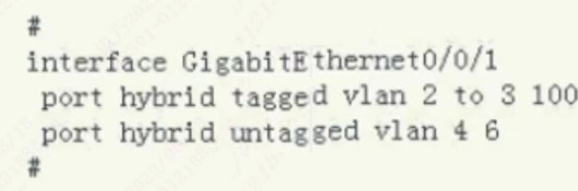  
16(单选题)以下哪个层次不属于中型园区网络架构中常见的网络层次?

D、网络层  
17(单选题)下面选项中关于NFV架构的概念描述不正确的是?

C、VIM(Virtualised Infrastructure Manager)虚拟资源管理,负责实现基础设施的虚拟化。

18(单选题)在以太网这种多点访问网络上,PPPOE服务器可以通过一个以太网端口与很多PPPoE客户端建立起PP连接,因此服务器必须为每个PP会话建立唯一的会话标识符以区分不同的连接。PPPOE会使用什么参数建立会话标识符?

C、MAC地址与Session-ID

19(单选题)Wi-Fi6所对应的1EE802.11标准为?

B. 802.11ax  
20(单选题)IEEE802.1Q定义的VLAN帧格式总长度为多少字节?

A, 4

21(单选题)以下关于链路聚合LACP模式选举主动端的说法,正确的是?

A、优先级数值小的优先,如果相同则比较设备MAC,越小越优。  
22(单选题)以下关于链路聚合LACP模式选举active端口的说法,正确的是?

A、先比较接口优先级,无法判断出较优者继续比较接口编号,越小越优。

23(单选题)网络管理员给网络中的某台主机分配的IPv4地址为192.168.1.1/28,则这个主机所在的网络还可以增加多少台主机?

C、13

24(单选题)在WLAN发展历史中,初级移动办公时代的主要无线协议标准不包括以下哪项?

D. 802.11ac

25(单选题)一条路由条目包含多个要素,下列说法错误的是?

A、NextHop显示此路由条目正确应的本地接口地址  
26(单选题)管理员在某台路由器上配置OSPF,但该路由器上未配置loopback接口,以下关于RouterlD的正确描述是()。

A、该路由器物理接口的最大IP地址将会成为Router ID

27(单选题)OSPF协议数据包在网络层的协议号是?

D、89

28(单选题)OSPF协议使用哪种报文请求本地缺少的LSA?

D. LSR  
29(单选题)掩码长度为12位可以表示为?

C. 255.240.0.0

30(单选题)如图所示,RTA的G0/0/0和G0/0/1接口分别连接到两个不同的网段,RTA为这两个网络的网关。主机A在发送数据给主机C之前,会先发送ARP Request来获取()的MAC地址。

B、RTA的G0/0/0接口  
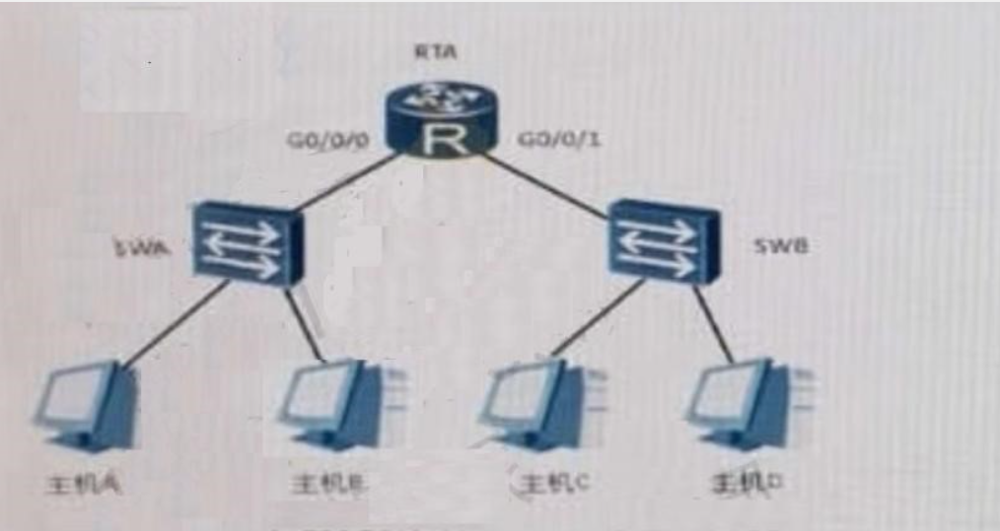  
31(单选题)关于OSPF协议区域划分说法错误的是?

C、只有ABR才能作为ASBR

32(单选题)动态路由协议的主要作用是?

B、生成路由表

33(单选题)管理员用如下命令在路由器上配置了DHCP服务器:

ip poo1 poo11

network 10.10.10.0 mask 255.255.255.0

gateway-List 10.10.10.1

同时管理员希望给DHCP地址指定一个较短的租期,请问应该使用如下哪条命令?

D. Lease day 1  
34(单选题)如果EUI-64地址CA9E-93FF-FE7B-057B是根据MAC地址计算得到,则其对应的MAC地址应该为?

D. C89E-937B-057B  
35(单选题)168.1.127.127/25代表的是()地址。

D、广播  
36(单选题)交换机和主机之间相连,交换机常用的端口链路类型为?

C、Access链路

37(单选题)下列哪项命令可以用来检查PPPOE客户端的会话状态?

C. display pppoe-client session summary

38(单选题)某公司申请到一个C类IP地址段,需要平均分配给8个子公司,最大的一个子公司有14台计算机,不同的子公司必须在各自不同的网段中,则子网掩码应设为()。

A. 255.255.255.240  
39(单选题)OSPFv3在以下哪种类型网络中需要选举DR?

D、广播网络

40(单选题)如图所示,RTA使用NAT技术,且通过定义地址池来实现多对多的非NAPT地址转换,使得私网内主机能够访问公网。假设地址池中仅有两个公网IP地址,并且已经分配给主机A与B做了地址转换,而此时若主机C也希望访问公网,则下列描述正确的是  
C、主机C无法分配到公网地址,不能访问公网  
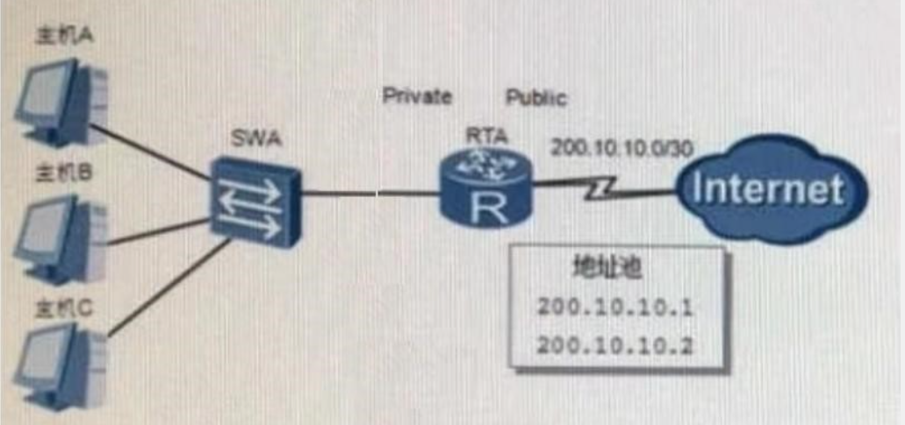  
41(单选题)一台路由器通过RIP、OSPF和静态路由都学习到了到达同一目的地址的路由。默认情况下,VRP将最终选择通过哪种协议学习到的路由?

C. OSPF

42(单选题)以下说法正确的是?

D、路由器工作在网络层  
43(单选题)IPv4最后一个选项字段(option)是可变长的可选信息,该字段最大长度为?

A、40B

44(单选题)IPv6地址FE80 :: 2E0:FCFF:FE6F:4F36属于哪一类?

B、链路本地地址

45(单选题)DHCPv6客户端在向DHCPv6服务器发送请求报文之前,会发送以下哪个报文?

B. RS  
46(单选题)下列哪个IPv6扩展报头能出现两次?

A、目的选项扩展报头

47(单选题)路由器某个ACL中存在如下规则:

rule deny tcp source 192.168.1.0 0.0.255 destination 172.16.10.1 0.0.0.0 destination-port eq 21下列说法正确的是?

1.  源IP为192.168.1.1,目的IP为172.16.10.1,并且目的端口号为21的所有TCP报文匹配这条规则

48(单选题)PPPOE客户端向Server发送PADI报文,Server回复PADO报文。其中,PADO报文是一个什么帧?

C、单播

49(多选题)下列关于IPv6中的RA和Rs报文说法正确的是?

A、RA用于回复地址前缀信息

C、Rs用于请求地址前缀信息

50(多选题)为实现FIT AP的上线,FIT AP首先需要获取AC的IP地址,FIT AP获取AC的IP地址方式包含以下哪项?

A、广播方式

B、DHCP Option方式

C、AP上静态指定方式  
51(多选题)网络中部署了一台DHCP服务器,但是管理员发现部分主机并没有正确获取到该DHCP服务器所指定的地址,请问可能的原因有哪些?

A、部分主机无法与该DHCP服务器正常通信,这些主机客户端系统自动生成了169.0.0范围内的地址

B、网络中存在另外一台工作效率更高的DHCP服务器

D、DHCP服务器的地址池已经全部分配完毕

52(多选题)与STP相比,以下哪些端口角色是RSTP中新定义的?

A、Alternate端

B、Backup端口

53(多选题)链路聚合的LACP模式采用LACPDU选举主动端,LACPDU中的哪些信息是选举LACP主动端的依据?

B、设备优先级

D、MAC地址

54(多选题)下列关于静态路由的配置命令中,正确的是()。

A, ip route-static 129.1.0.0 16 serial 0/0/0

B. ip route-static 129.1.0.0 16 10.0.0.2

C. ip route-static 129.1.0.0 255.255.0.0 10.0.0.2

55(多选题)哪些WLAN安全策略支持Open方式的链路认证方式? 全选  
56(多选题)堆叠、集群技术有以下哪些优势? 全选  
57(多选题)以下哪些网络属于局域网?

B、一个家庭网络

C、某公司办公网络

58(多选题)WLAN中可以部署的用户认证方式有? 全选  
59(多选题)网络中出现故障后,管理员通过排查发现某台路由器的配置被修改了,那么管理员该采取哪些措施来避免这种状况的再次发生?

B、B管理员应该通过配置ACL来控制只有管理员能够登录设备

C、管理员应该配置AAA来对登录设备的用户进行认证和授权

60(多选题)园区网规划时,业务VLAN可以按照以下哪些方式进行划分? 全选  
61(多选题)IPv6地址包含以下哪些类型?

B、单播地址

C、任播地址

D、组播地址

62(多选题)为检测CAPWAP隧道的连通状态,在CAPWAP隧道建立之后AC使用以下哪些CAPWAP报文进行探测?

C. Keepalive

D. Echo

63(多选题)路由器获得路由条目的来源有哪三种?

A、静态路由

C、动态路由

D、直连路由

64(多选题)SNMP由以下哪些部分组成? 全选  
65(多选题)当两台交换机之间使用链路聚合技术进行互连时,各个成员端口需要满足以下哪些条件?

A、两端相连的物理口速率一致

C、两端相连的物理口双工模式一致

D、两端相连的物理口数量一致  
66(多选题)为了实现VLAN接口上的网络层功能,需要在VLAN接口上配置?

A、子网掩码

C、IP地址

67(多选题)运行STP的交换机会发送BPDU。下面关于BPDU的说法正确的是()

A、BPDU帧的Control字段值为3

B、BPDU使用的是IEEE 802.3标准的帧  
68(多选题)某私有网络内有主机需要访问Internet,为实现此需求,管理员应该在该网络的边缘路由器上做如下哪些配置?

B. NAT Easy-Ip

C、默认路由  
69(多选题)关于RSTP协议提供的保护功能说法正确的有? 全选  
70(多选题)IPv6报文头部包含以下哪些字段?

A, Version

B. Next Header

D. Traffic Class

71(多选题)如下选项中的配置,哪些属于二层ACL?

A, rule 10 permit 12-protocol arp

C. rule 20 permit source-mac 0203-0405-0607

D. rule 15 permit vlan-id 100

72(多选题)某台路由器输出信息如下,下列说法正确的是?  
A、OSPFv3进程号为1

B、本路由器的DR优先级为1

D、邻居路由器的Router-ID是10.0.1.1  
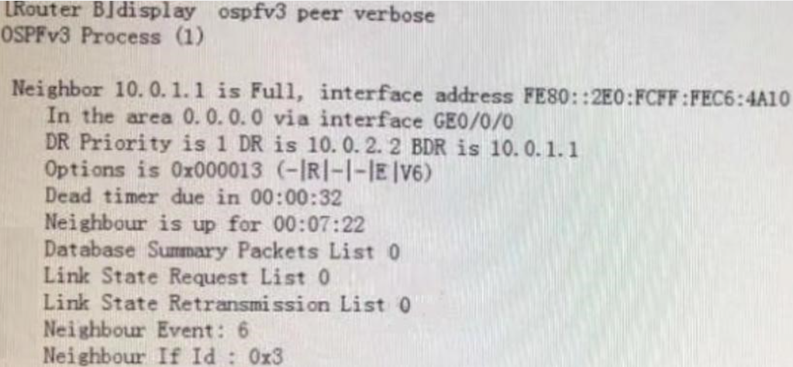  
73(多选题)某台路由器OSPFv3接口信息如下,下列说法正确的是?  
A、本接口网络类型为P2P

B、本接口的Router-ID为10.0.6.6

D、本接口区域号为1  
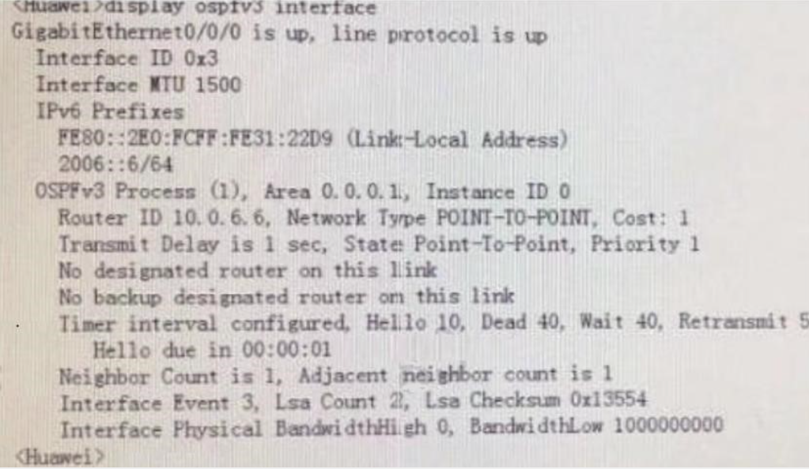  
74(多选题)某台路由器聚合端口1的子接口输出信息如下,据此信息,下列说法正确的有?

B、该聚合端口的子接口的IP地址为10.0.12.2/24

C、聚合端口存在两条链路

D、聚合端口的子接口编号为100  
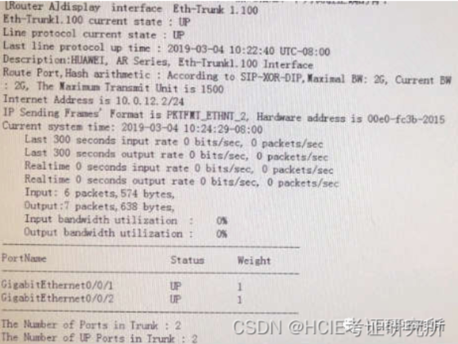  
75(多选题)设备链路聚合支持哪些模式?

B、手工负载分担模式

D、LACP模式  
76(多选题)下面关于PPP描述正确的是()。

A、PPP支持将多条物理链路捆绑为逻辑链路以增大带宽

B、PPP支持明文和密文认证

D、对物理层而言,PPP支持异步链路和同步链路  
77(判断题)Telnetlib是Python自带的实现Telnet协议的模块。

A、正确

78(判断题)SDN的起源是转控分离。转控分离是实现SDN的一种方法而不是本质。

A、正确

79(判断题)FIT AP上线的过程中一定会从AC下载软件版本。

B、错误  
80(判断题)华为ARG3系列路由器默认存在SNMP的所有版本(SNMPv1、SNMPv2c和SNMPv3)

A、正确

81(判断题)AC上可以手动指定创建CAPWAP隧道的源地址或者源接口。

A、正确  
82(判断题)在IPv4网络中,AP支持静态和DHCP两种方式获取IP地址。

A、正确  
83(判断题)国家码的配置会影响实际传输使用的频率以及最大传输功率。

A、正确

84(判断题)骨干区域内的路由器有其它所有区域的完整链路状态信息。

B、错误  
85(判断题)在以PPP作为数据链路层协议的接口上,可以通过指定下一跳地址或出接口来配置静态路由。

A、正确  
86(判断题)DHCPv6服务器支持为主机提供DNS服务器地址等其他配置信息。

A、正确  
87(判断题)WiFi-6实际是指IEEE 802.11ax标准。

A、正确  
88(判断题)VTY用户界面的“maximum-vty"命令可以配置多少个用户可以同时登陆Telnet登陆设备。

A、正确  
89(判断题)运行SNMP协议的网络设备可以主动上报告警信息以便网络管理员及时发现故障。

A、正确  
90(判断题)WLAN的二层组网指的是STA将AC做为自己的网关。

B、错误  
91(判断题)2.4Ghz频段中的14个可用频段不存在信道重叠。

B、错误

92(判断题)路由表中某条路由信息的Proto为Direct,则此路由的优先级一定为0

A、正确

93(判断题)树型网络拓扑实际上是一种层次化的星型机构,易于扩充网络规模,但是层级越高的节点故障导致的网络问题越严重。

A、正确

94(判断题)IPv6协议使用NS和NA报文进行重复地址检测(DAD)。

A、正确  
95(判断题)华为AR路由器的命令行界面下,Save命令的作用是保存当前的系统时间。

B、错误

96(判断题)与IPv4相比,IPv6报头中不存在IHL字段。

A、正确  
97(判断题)如果网络管理员没有配置骨干区域,则路由器会自动创建骨干区域。

B、错误

98(判断题)STP中根交换机的选举依据是比较交换机优先级,而在RSTP中,会同时比较交换机优先级与MAC地址。

B、错误  
99(判断题)DHCPv6无状态自动分配方案中,主机不需要发送任何DHCPv6报文。

B、错误   
100(判断题)主机使用无状态地址自动配置方案来获取IPv6地址时,无法获取DNS服务器地址信息。

A、正确

## 初级-09
1(单选题)PPP协议LCP协商阶段,如果完全接受对方发送的参数,则发送以下哪个报文?

B. Configure-Ack  
2(单选题)在AP上为区分不同的用户,提供不同的网络服务,可以在通过配置以下哪项内容实现?

A、VAP

3(单选题)在AC上配置数据转发方式为直接转发的命令为?

D、forward-mode direct-forward  
4(单选题)我们在笔记本电脑上搜索可接入无线网络时,显示出来的网络名称实际是?

C、SSID

5(单选题)使用命令“vlan batch 10 20"和"vlan batch 10 to 20",分别能创建的VLAN数量是()。

C、2和11

6(单选题)在华为路由器上,缺省情况下OSPF协议内部路由优先级的数值为?

D、10  
7(单选题)以下IEEE 802.11标准中只支持2.4GHz频段进行通信的是?

A, 802.11g  
8(单选题)使用FTP进行文件传输时,会建立多少个TCP连接?

C、2

9(单选题)IEEE802.1Q定义的TPID的值为多少?

D. 0x8100  
10(单选题)以下关于手动负载均衡模式的链路聚合说法正确的是?

D、手工负载分担模式下所有活动接口都参与数据的转发,分担负载流量  
11(单选题)如下图所示,所有主机之间都可以正常通信,则SWA MAC地址和端口的对应关系正确的是?

A, MAC-A GO/0/1

MAC-B GO/0/2

MAC-C G0/0/3  
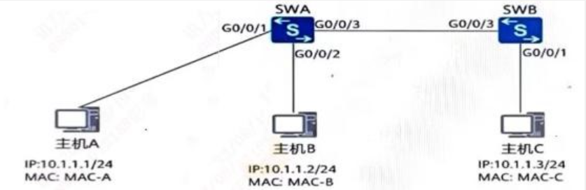  
12(单选题)交换机发送的配置BPDU中,哪一个桥ID不可能会出现?(有雷同题)

A. 2048.00-01-02-03-04-CC

13(单选题)园区网络规划时,设备互联IP地址推荐使用以下哪种掩码长度?

A、30

14(单选题)使用SNMPv1协议管理网络设备时,网管系统使用下列哪条命令完成对网络设备的配置?

B、Set Request

15(单选题)为让STA获取AP上的SSID相关信息,AP采用以下哪种报文主动对外声明无线网络SSID信息?

B、Beacon

16(单选题)局域网中的一台主机的IPv4地址为192.168.1.1/30,则主机会处理将下列哪些IP地址作为目的地址的IP包?

C、192.168.1.1

17(单选题)下列关于华为设备中静态路由的说法错误的是()。

A、静态路由的优先级为0时,则该路由一定会被优选。  
18(单选题)如果一个网络的广播地址为172.16.1.255,那么它的网络地址可能是()?

B、172.16.1.128

19(单选题)关于ARP报文的说法错误的是?

A、任何链路层协议都需要ARP协议辅助获取数据链路层标识  
20(单选题)以下关于DHCP协议的使用场景说法正确的是?

B、如果DHCP客户端和DHCP服务器不在同一个网段,需要通过DHCP中继来转发DHCP报文  
21(单选题)以下哪种类型的ACL不能匹配网络层信息?

C、二层ACL

22(单选题)在Telnet中应用如图所配置的ACL,下列说法正确的是?  
B、IP地址为172.16.105.60的设备可以使用Telnet服务  
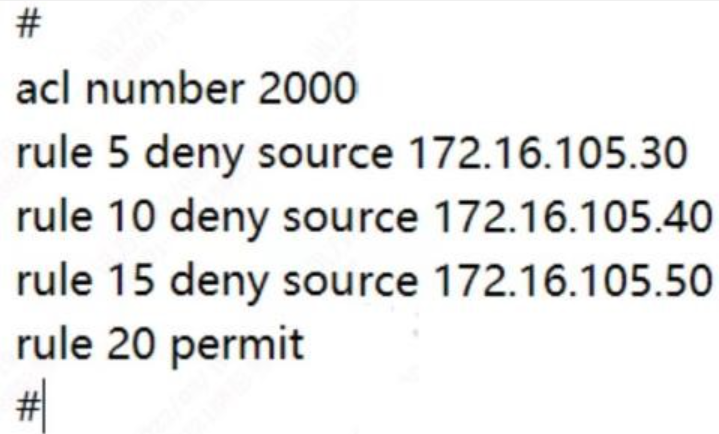  
23(单选题)RSTP协议使用P/A机制加快了上游端口转到Forwarding状态的速度,但是却没有出现临时环路的原因是什么?

A、通过同步机制保证不会出现临时环路  
24(单选题)链路聚合的LACP模式采用LACPDU选举主动端,以下哪项信息不会在LACPDU中携带?

A、接口描述  
25(单选题)IEEE802.1Q定义的VLAN帧格式中VLANID总共有多少bit?

B、12

26(单选题)OSPF协议使用哪种报文发现和维护邻居关系?

B、HELLO  
27(单选题)(华为产品)AP通过以下哪项报文从AC请求软件版本?

B、Image Data Request  
28(单选题)无线接入控制器(AC,Access Controller)作为FIT AP架构中的统一管理、控制设备,以下关于AC的作用描述错误的是?

D、D无论何种数据转发方式,用户的数据报文都由AC进行转发  
29(单选题)基本ACL的编号范围是?

D、2000-2999

30(单选题)现有一台交换机通过某端口与一个指定端口相连,但是该端口不转发任何报文,却可以通过接收BPDU来监听网络变化,那么该端口的角色应该是()。

D、Alternate端口  
31(单选题)关于ARP协议的作用和报文封装,描述正确的是()。

A、ARP协议基于Ethernet封装  
32(单选题)以下哪个IPv6地址是全球单播地址?

C、2001 :: 12:1

33(单选题)在WLAN网络构架中,支持802.11标准的终端设备被称为?

D、STA  
34(单选题)在WLAN中标识一个AP覆盖范围的是?

A、BSS  
35(单选题)表示AP上每个VAP的数据链路层MAC地址的是?

D、BSSID

36(单选题)管理员在路由器上做了如图配置,同时管理员希望给DHCP地址指定一个较短的租期,请问应该使用如下哪条命令?  
A、lease day 0 hour 10  
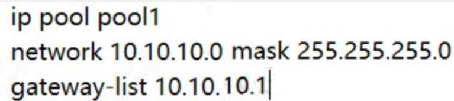  
37(单选题)在路由器RTA上完成如图所示的ACL配置,则下面描述正确的是()。  
A、VRP系统将会按顺序编号先匹配规则denysource 20.1.1.00.0.0.255  
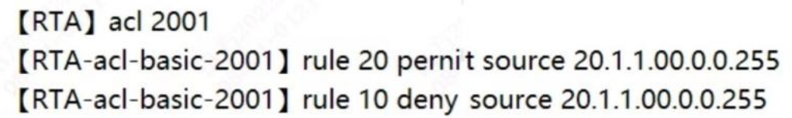  
38(单选题)单臂路由的方式实现VLAN间路由互通,有以下哪种优势?  
C、减少链路连接的数量  
39(单选题)下面关于生成树指定端口的描述正确的是

D、指定端口可以向与其相连的网段转发配置BPDU报文  
40(单选题)一台主机可以直接使用以下哪一个IPv4地址直接访问Internet?

A、172.32.1.1/24  
41(单选题)以下哪些不是华为控制器开放的接口?

D、AAA  
42(单选题)FIT AP可以通过DHCP Option获取AC的IP地址以此建立CAPWAP隆道,为此需要在DHCP服务器上配置哪个Option?

D、Option 43  
43(单选题)200.200.200.200/30所对应的广播地址为?

D、200.200.200.203

44(单选题)以下关于交换机的描述,说法错误的是?

B、交换机一般作为网络的出口设备  
45(单选题)某设备已配置完成Telnet配置。设备登陆地址为10.1.1.10,Telnet用户名为admin,密码为Huawei@123.以下使用telnetlib登陆此设备正确的方法是?

C、telnetlib.Telnet (10.1.1.0)

46(单选题)CAPWAP协议规定了AC与AP之间的通信标准,以下关于CAPWAP协议说法正确的是?

D、AP可以将用户的数据报文封装在CAPWAP中交由AC转发  
47(单选题)为实现FIT AP的上线,FIT AP首先需要获取AC的IP地址,FIT AP获取AC的IP地址方式不包含以下哪项?

B、组播方式

48(单选题)广义上构成无线局域网WLAN的传输介质不包括?

B、射线  
49(单选题)如图所示,SWA和SWB连接主机的端口都为Access端口且PVID都为2,而SWA的G0/0/1为Hybrid端口,PVID为1,且配置了port hybrid tagged vlan 2命令;SWB的G0/0/1为Trunk端口,PVID为1,且允许VLAN2通过。则下列描述中正确的是()。  
C、主机A与主机B之间可以正常通信  
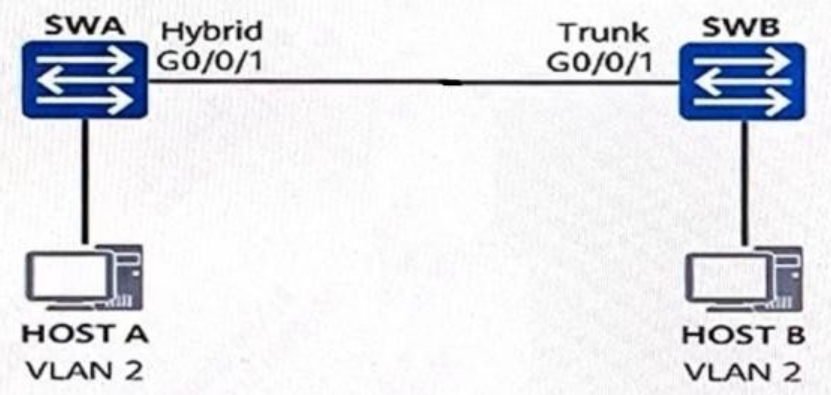  
50(单选题)如图所示,两台主机通过单臂路由实现VLAN间通信,当RTA的GO/0/1.2子接口收到主机B发送给主机A的数据顿时,RTA将执行下面哪项操作?

D、RTA先要删除VLAN标签20,然后添加VLAN标签10,再由G0/0/1.1接口发送出去  
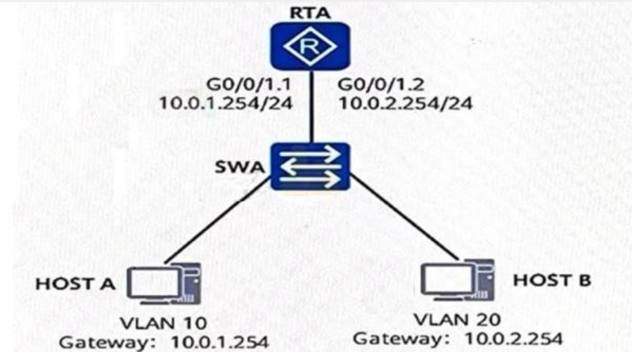  
51(单选题)交换机某个端口配置信息如图,下列说法错误的是?  
A、如果数据帧携带的VLAN TAG为100,则交换机剥离VLAN TAG发出  
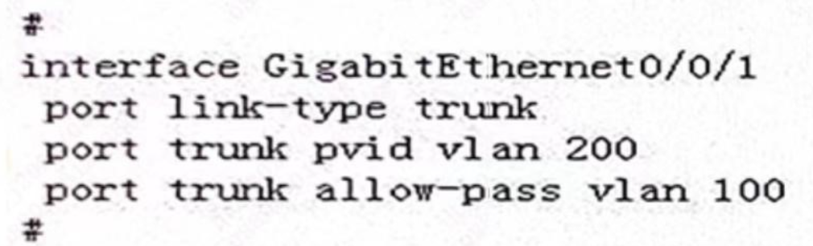  
52(单选题)Access类型的端口在发送报文时,会()

A、剥离报文的VLAN信息,然后再发送出去  
53(单选题)OSPF协议使用哪种状态表示邻接关系已经建立?

D、Full  
54(单选题)完成链路认证后,STA会继续发起链路服务协商,具体的协商是通过以下哪项报文实现?

D、Association  
55(单选题)以下IEEE802.11标准中不支持5GHz频段进行通信的是?

D、802.11g  
56(单选题)STP协议中端口处于哪个工作状态时可以不经过其它状态转为Forwarding状态?

B、Learning

57(单选题)如图信息是某运行STP的交换机上所显示的端口状态信息。根据这些信息,下面的描述错误的是  
A、此交换机的优先级为0  
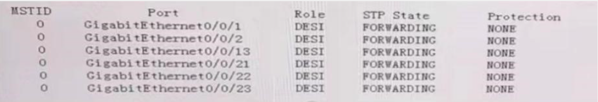  
58(多选题)下列哪几项是配置静态路由的基本参数?

A、出接口

C、下一跳的IP地址

D、目的网络  
59(多选题)一台网络设备有哪几个平面?

A、控制平面

C、管理平面

D、数据平面  
60(多选题)在配置PPP认证方式为PAP时,下面哪些操作是必须的?

A、配置与正确端设备相连接口的数据链路层封装类型为PPP

C、在被认证方配置向认证方发送的用户名和密码

D、把被认证方的用户名和密码加入到认证方的本地用户列表  
61(多选题)CAPWAP隧道建立阶段,AC收到AP发送的Join Request报文之后,AC会对AP进行合法性检查,以下哪些项是AC支持的认证方式?

A、不认证

B、SN认证

C、MAC认证  
62(多选题)二层以太网交换机中的默认VLAN有以下哪些特点?

A、缺省情况下,交换机所有端口都是默认VLAN的成员端口

B、默认VLAN无法被手动删除

63(多选题)IEEE 802.11n标准支持在哪些频率下工作?

A, 2.4GHz

C. 5GHz  
64(多选题)在AC上添加AP的方式有?(多选)

B、手工确认未认证列表中的AP

C、自动发现AP

D、离线导入AP  
65(多选题)经典的网络转发方式是基于路由表路由表转发。OpenFlow交换机的转发方式是基于流表转发。对于这两种转发方式,说法正确的是?

A、路由表的匹配方式是匹配拥有最长掩码的目的网段路由。

C、路由表是定长的。一台设备只能有一张公共的路由表。

66(多选题)下面选项中关于NFV架构的概念描述正确的是?

A、NFVO(NFV Orchestrator),负责业务的编排。

B、VNFM.虚拟网络功能管理,负责VNF的生命周期管理。

D、MANO由NFVO、VNFM和VIM组成。  
67(多选题)根据如图所示的命令输出,下列描述中正确的是()。  
C、GigabitEthernet0/0/1不允许VLAN 1通过

D、如果要把GigabitEthernet0/0/1端口变为Access端口,首先需要使用命令"undo port trun

kallow-pass vlan 2 to 4094"  
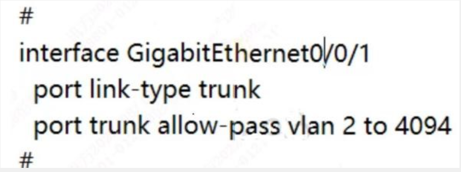  
68(多选题)下列关于OSPF区域描述正确的是()。

A、区域的编号范围是从0.0.0.0到255.255.255.255

C、骨干区域的编号不能为2  
69(多选题)OSPF协议存在以下哪种特性?

B、支持区域的划分

C、触发更新

70(多选题)某台设备输出信息如图,下列说法正确的有?  
A、该设备的VRP操作版本为VRP5

B、该设备已经运行1分钟

C、该设备名字为Huawei  
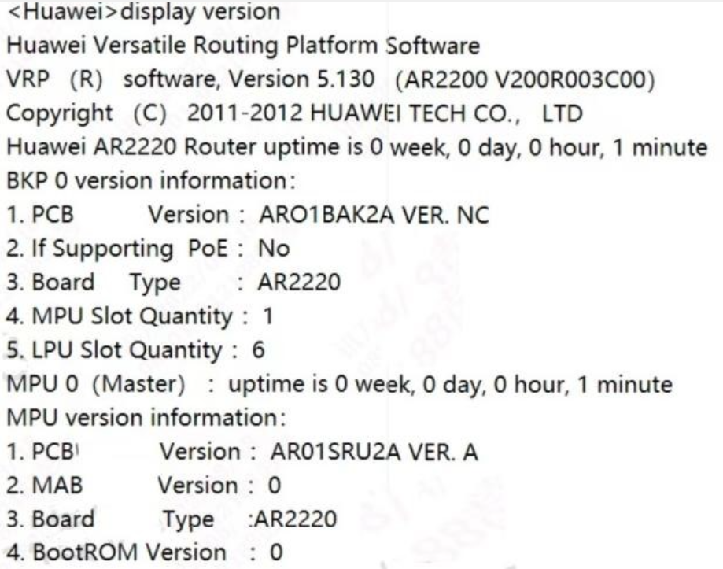  
71(多选题)ARP报文格式包含以下哪些字段? 全选  
72(多选题)以下哪些不是华为网络设备开放接口?

A、NOSC

D、XML  
73(多选题)IPv6无状态地址自动配置使用以下哪些报文?

C、RS

D、RA  
74(多选题)以下哪些IEEE 802.11标准支持工作在5GHz频段?

B、802.11n

C、802.11a

D、802.11ax  
75(多选题)如下图所示的网络,所有交换机运行STP协议,当拓扑稳定后,关闭SWA的STP功能,下列说法正确的是?  
A、SWB仍然周期性从G0/0/1端口发送配置BPDU

B、SWB经过Max Age时间之后从GO/0/3端口发送配置BPDU

D、SWC经过Max Age时间之后从G0/0/2端口发送配置BPDU  
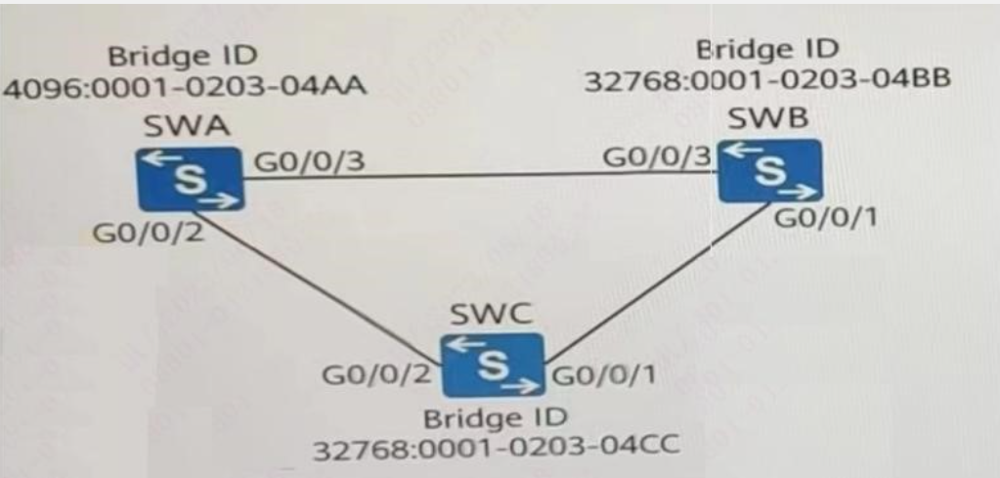  
76(多选题)如下图所示,假设交换机的其他配置均保持默认状态,下列交换机的哪个端口会成为指定端口?  
A. SWAJJGO / 0 / 3

C、SWB的G0/0/1

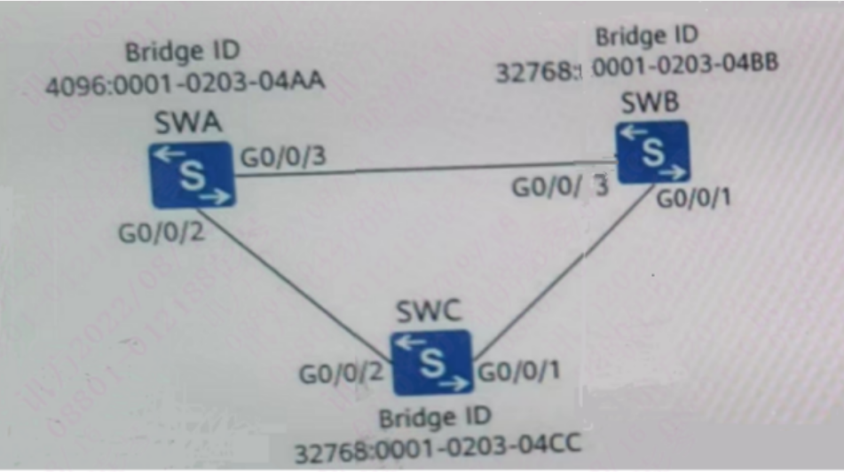  
77(多选题)如图所示,华为交换机上关于VLAN的配置,说法正确的是()  
B、Client1属于VLAN10,且交换机上划分VLAN的命令正确

C、Client2属于VLAN20,且交换机基于MAC地址划分的命令正确  
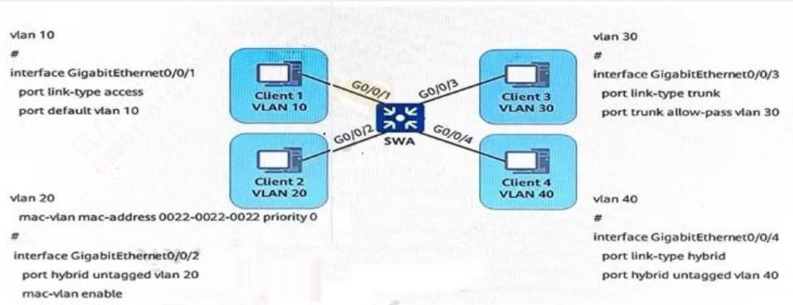  
78(多选题)以下说法中,哪些关于园区网络的VLAN设计与规划是正确的?

A、VLAN编号建议连续分配,以保证VLAN资源合理利用。

B、预留一定数量的VLAN以方便后续扩展。

C、最常用的VLAN划分方式是基于端口进行划分的方式

79(多选题)STA关联到AP之前需要通过一些报文交互获取SSID,这些报文为?

A、Beacon

B、Probe Request

D、Probe Response  
80(多选题)华为设备上的高级ACL可以用于过滤下面哪些内容?

A、基于特定源地址的网络流量

B、基于特定端口号的网络流量

E、基于特定目的地址的网络流量  
81(多选题)如图所示,主机A与主机B希望通过单臂路由实现VLAN间通信,则在RTA的G0/0/1.1接口下该做哪项配置?  
A、dotlq termination vid 20

B、dotlq termination vid 10  
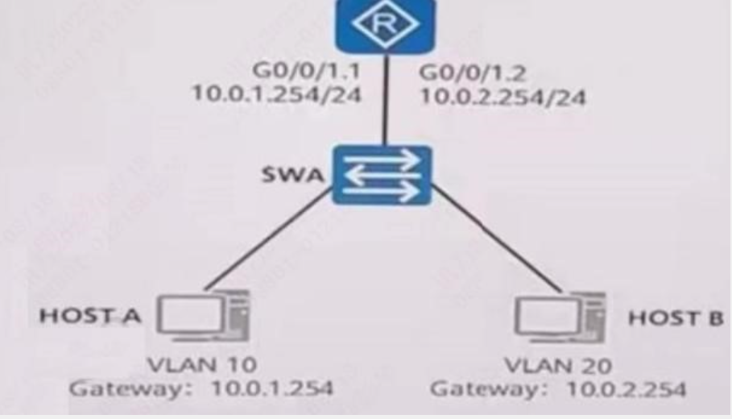  
82(判断题)园区网络规划时,服务器建议采用静态IP地址。

A、正确  
83(判断题)SDN架构中协同层的作用是基于用户意图完成业务部署。OpenStack属于业务协同层。

A、正确  
84(判断题)FAT AP无需AC即可独立完成无线用户接入、无线用户认证、业务数据转发的工作。

A、正确  
85(判断题)运行SNMP协议的网络设备本地都运行一个代理进程。

A、正确  
86(判断题)交换机通过堆叠、集群之后成为一台逻辑上的交换机,可以部署跨物理设备的Eth-Trunk以提高网络可靠性。

A、正确  
87(判断题)Telnetlib中telnet.Read_very_eager()的作用是非阻塞的读取数据。通常需要和time模块一起使用。

A、正确

88(判断题)在Telnet中应用如图所配置的ACL,则只允许IP地址为172.16.105.20的设备进行远程登录。  
A、正确  
  
89(判断题)华为交换机上可以使用命令vlan batch批量创建多个VLAN,简化配置过程。

A、正确

90(判断题)FIT AP无需AC也可以独立工作。

B、错误  
91(判断题)如果配置的ACL规则存在包含关系,应注意严格条件的规则编号需要排序靠前,宽松条件的规则编号需要排序靠后,避免报文因命中宽松条件的规则而停止往下继续匹配,从而使其无法命中严格条件的规则。

A、正确  
92(判断题)一台主机和其它主机进行通信一定要配置网关。

B、错误

93(判断题)NFV(Network Functional Virtualization)。网络功能虚拟化,实现了以软件化的方式部署网络应用。

A、正确

94(判断题)网络管理系统通过SNMP协议只能查看设备运行状态而不能下发配置。

B、错误  
95(判断题)用户不能将VLAN ID配置为0。

A、正确  
96(判断题)FIT AP可以不依赖AC独立进行工作。

B、错误

97(判断题)在配置Telnet登录用户界面时,必须配置认证方式,否则用户无法成功登录设备。

A、正确

98(判断题)config模式是华为设备上缺省的ACL匹配顺序。

A、正确

99(判断题)当交换网络存在冗余链路时,使用STP可以解决交换网络中的环路问题。

A、正确  
100(判断题)CSS是指将两台支持集群特性的交换机设备组合在一起,从逻辑上组合成一台交换设备。

A、正确

## 初级-10  
1(单选题)如下图所示的网络,交换机的桥ID已标出。在SWD交换机上输入命令stp root secondary,下列哪台交换机会成为此网络的根杯?  
C、SWA  
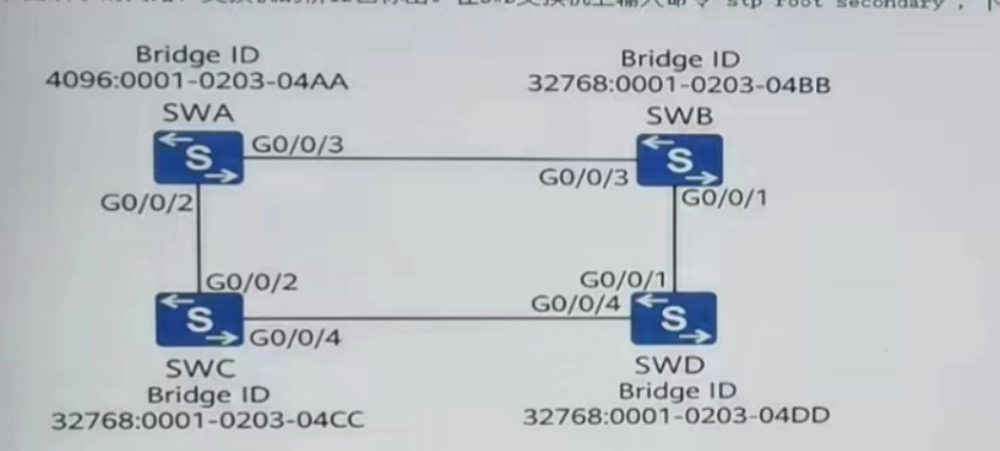  
2(单选题)在华为交换机上配置RADIUS服务器模板时,下列选项中哪些参数为可选的配置参数?

B、RADIUS自动探测用户  
3(单选题)不同虚拟机间可以利用vswitch建立的VTEP隧道来进行VXLAN的通信,那么VXLAN的通信过程是:1.源VTEP将源VM发通的ARP广播封装为组播报文发送到L3网络中,2.目的VTEP收到组播报文后,学习源VM与VTEP映射关系,并将组播报文转发给本地VM 3.本地进行单播应答4.目标VTEP封装Vxlan隧道,并建立映射表封装后单播发给源VTEP 5.源VTEP收到隧道建立目标VM与目标VTEP映射关系,去掉隧道转发给源VM。6.源VM与目标VM通过隧道进行单播报文通信。

C、1-2-3-4-5-6

4(单选题)RED技术可以解决以下哪些缺点?

A、TCP全局同步现象

5(单选题)如下图所示的网络,主机存在ARP缓存,主机A发送数据包给主机B,则此数据包的目的MAC和目的IP分别为?  
A、MAC-C,11.0.12.1  
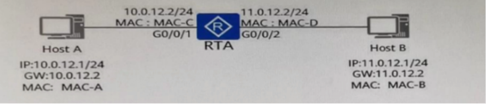  
6(单选题)某公司网管要进行网络规划的时候,能够要让PC1访问PC2的数据包从GO/0/0口走(图上GO/0/2)。PC2访问PC1的数据包,从GO/0/4口走(图上G0/0/0)。以下路由配置正确的是?  
B、[AR1]ip route-static 10.0.12.5 255.255.255.255 11.0.12.2 [AR2]ip route-static 10.0.12.1 2

55.255.255.255 11.0.12.5  
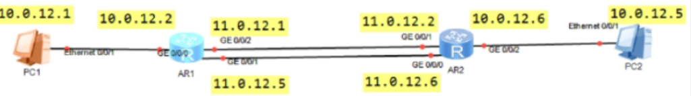  
7(单选题)如下图所示,IPSec采用隧道模式,则ESP认证的范围是?  
B、2

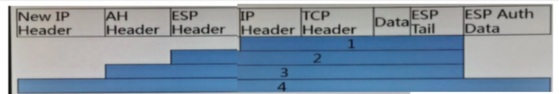  
8(单选题)RSTP配置BPDU报文中的Type字段取值为?

D、0x02  
9(单选题)CAPWAP协议规定了AC与AP之间的通信标准,以下关于CAPWAP协议说法正确的是?

C、AP可以将用户的数据报文封装在CAPWAP中交由AC转发

10(单选题)现在需要实现一个Python自动化脚本Telnet到设备上查看设备运行配置。以下说法错误的是?

C、telnet.close()用在每一次输入命令后,作用是用户等待交换机回显信息。  
11(单选题)以下关于Hybrid端口说法正确的有?

A、Hybrid端口可以在出端口方向将某些vlan帧的tag剥掉  
12(多选题)下列选项中,关于Agile Controller的终端安全管理特点的描述,正确的是 全选  
13(多选题)假设对标记为AF21的报文,设置的WRED丢弃策略为下限设为35,上限设为40,丢弃概率是50%。那么当AF21的报文到达时,关于WRED对该报文的处理结果的描述,错误的是

A、如果当前队列平均长度小于35,报文开始丢弃

C、如果当前队列的平均长度大于上限40,则该报文开始进入队列  
14(多选题)基于会话的状态检测防火墙对于首包和后续包有不同的处理流程,关于该流程描述正确的是哪些选页?

A、报文到达防火墙时会查找会话表如果没有匹配防火墙会进行首包处理流程。

B、在状态检查机制打开的情况下,防火墙处理TCP报文时,只有SYN报文才建立会话。

D、报文到达防火墙时,会查找会话表如果匹配,防火墙会进行后续包处理流程。  
15(多选题)关于VRRP slave设备的描述,正确的是

A、当Slave收到Master发送的VRRP报文时,可判断Master的状态是否正常

B、当收到优先级为0的VRRP报文时,Slave会直接切换到Master

C、Slave会丢弃目的Mac为虚拟MAC地址的IP报文

16(多选题)对于此台交换机上的配置描述正确的是?

A、默认情况下,配置DHCP服务器和DHCP delay都必须开启DHCP服务

B、VLANIF100接口会将接收到DHCP报文,通过中继发送到外部DHCP Server

C、为VLANIF100接口指定DHCP服务器组为dhcpgroup1

D、首先需要创建DHCP服务器组并向服务器组添加DHCP服务器  
  
17(多选题)当拥塞发生时,通常会影响到QoS的哪些指标

A、传输时延

B、传输抖动

C、传输带宽

18(多选题)LDP会话用于LSR之间交换标签映射、释放等消息。关于LDP会话建立过程的描述正确的是

A、两台LSR之间通过交换hello消息来发LDP session的建立

B、initalization Message用来在LDP Session建立过程中协商参数

C、KeepAlive Message用来监控LDP Seesion的TCP连接的完整性

19(多选题)华为企业级AP支持的工作模式有以下哪几种?

B、FIT

C、FAT

D、Cloud  
20(多选题)如果以太网数据帧Length/Type=0x0806,下列说法正确的是?

A、此数据帧的目的MAC地址有可能是FFFF-FFFF-FFFF

B、此数据帧的源MAC地址一定不是FFFF-FFFF-FFFF

D、此数据帧为EthernetⅡ帧

