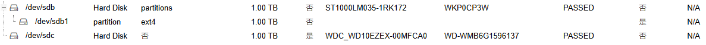
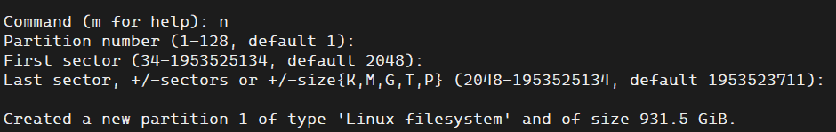
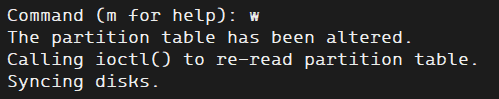
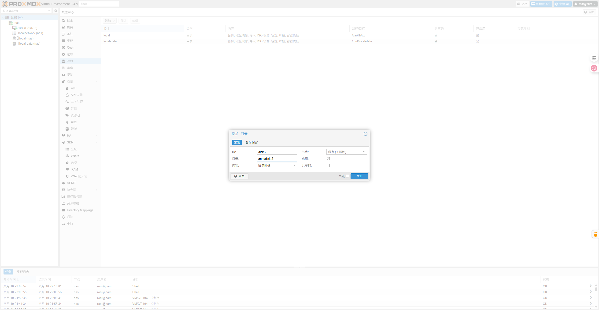

# ProXmox添加硬盘

在PVE中除了装PVE的硬盘，其他硬盘都是需要手动挂载的，这点不如ESXI方便，但是挂载硬盘方式也不难，下面就来看看PVE下怎么新增一块硬盘，不管是机械还是固态都是一样的。



可以看到PVE已经识别到了新加入的1T机械

```bash
fdisk /dev/sdc
```

输入n创建一个新的分区



输入w保存修改信息



输入以下指令使用ext4格式化分区

```bash
mkfs -t ext4 /dev/sdc1
```

补充知识：要实现设备到目录的挂载，就要有个目录，在/mnt下创建一个文件夹，名字自己命名，我这边叫disk-2，为什么要在/mnt下而不是其他目录，因为mnt这个目录就是用来挂载u盘、硬盘等设备用的，可以说这是一种标准，至于你要放其他目录也无所谓。

```bash
mkdir /mnt/disk-2
mount -t ext4 /dev/sdc1 /mnt/disk-2/
echo /dev/sdc1 /mnt/disk-2 ext4 default 1 2 >> /etc/fstab
```

最后一行是将挂载写进开机自启里面

做完上面的操作，我们在PVE后台—>数据中心—>存储—>添加，就可以添加我们挂载的磁盘了


