# 解决Windows10账户被禁用的问题

# 问题分析

预装有Windows10家庭版系统的笔记本电脑有时因为一些误操作导致之前创建的本地管理员账户被删除掉，而系统内置的Administrator账户默认又是禁用的状态无法使用，因此会导致开机提示“你的账户已被停用。请向系统管理员咨询”

# 问题复现

由于问题复现无法使用正常的工作中Windows，因此在VMware中创建了一个Windows10Pro来复现Bug

如下图是一个正常运行的Windows

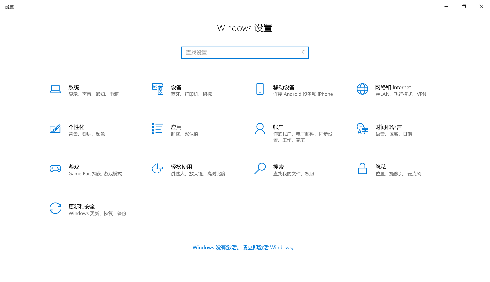

进入计算机管理-本地用户和组-用户

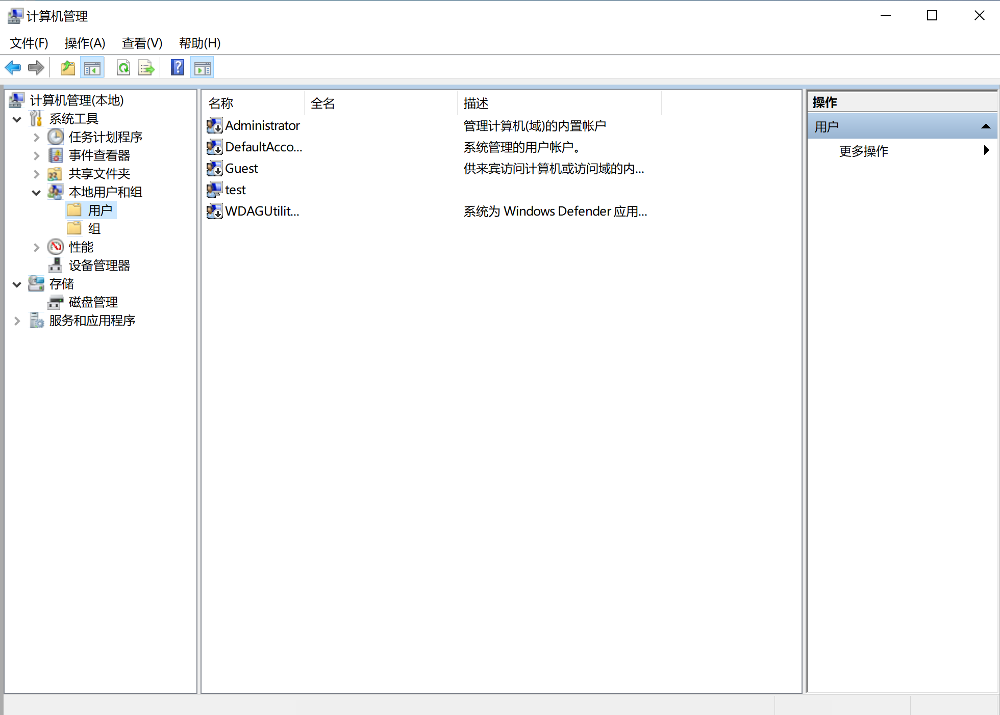

将test账户禁用，重启就能复现问题

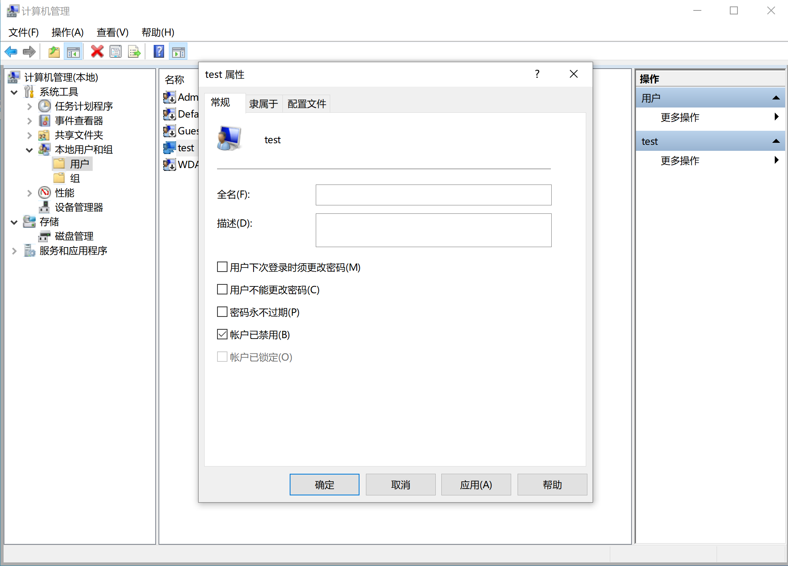

如下图，成功复现问题

# 问题解决

若是无法进入系统，可以在开机出现微软图标下面有转圈的小点时（如下图），立即关断电源。在此界面断开电源多次即可进入高级启动界面。

只要进入以下界面就算成功

进入该界面之后选择高级选项

选择疑难解答-高级选项

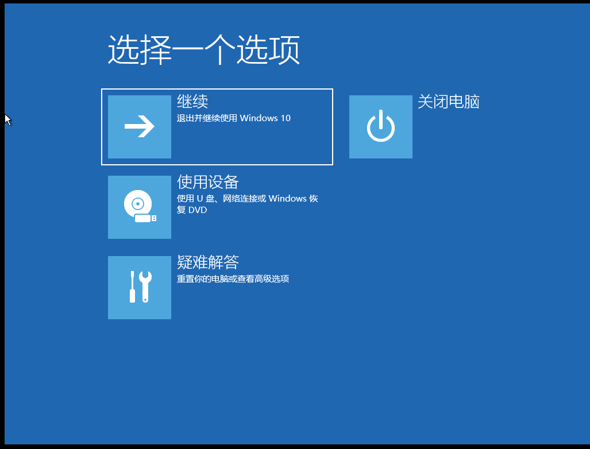​

​

之后选择高级选项-启动选项，重启

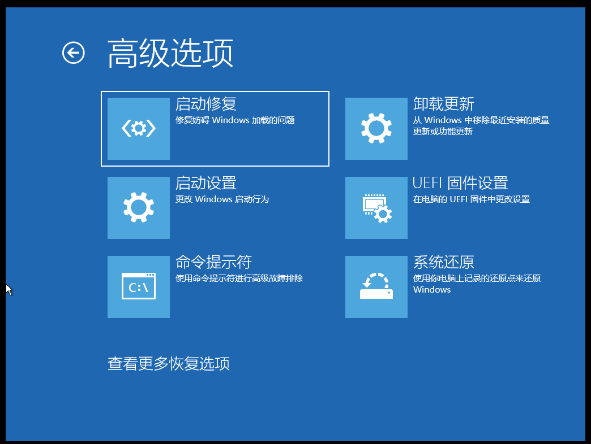按数字4或F4进入安全模式

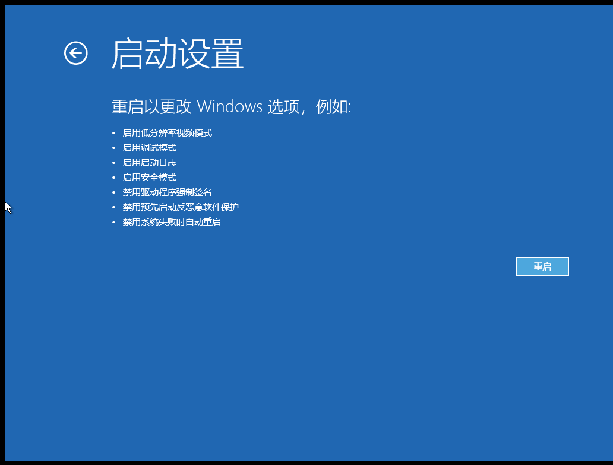

‍

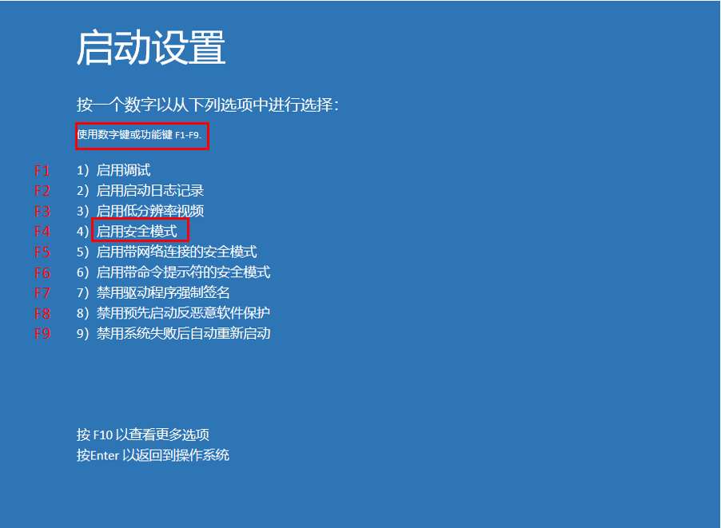

## 安全模式下的Windows10

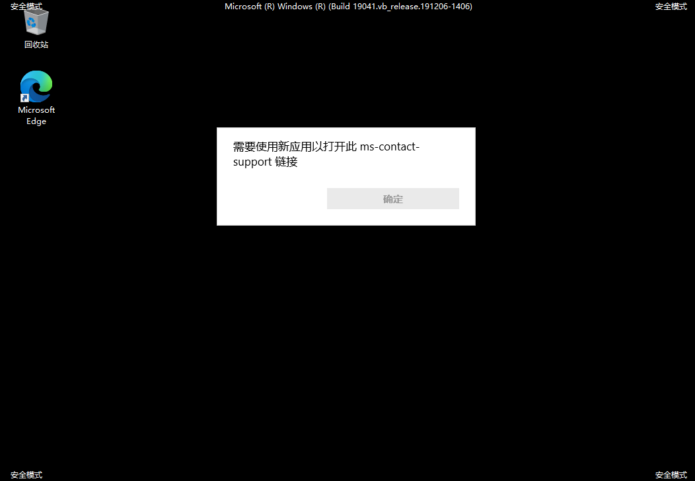

进入计算机管理界面（Win+X或其他方式）

选择本地用户和组-用户中

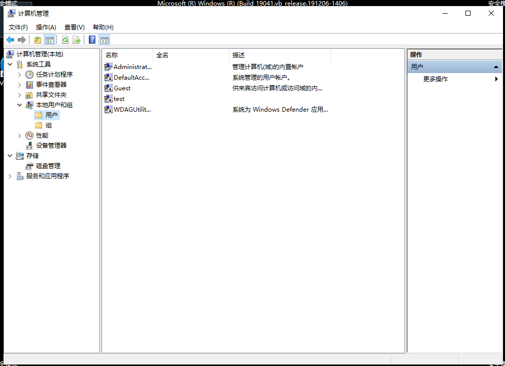

找到使用的Windows账户

将账户禁用关闭，重启即可使用

在安全模式无法进入Windows的启动菜单，使用Alt+F4重启

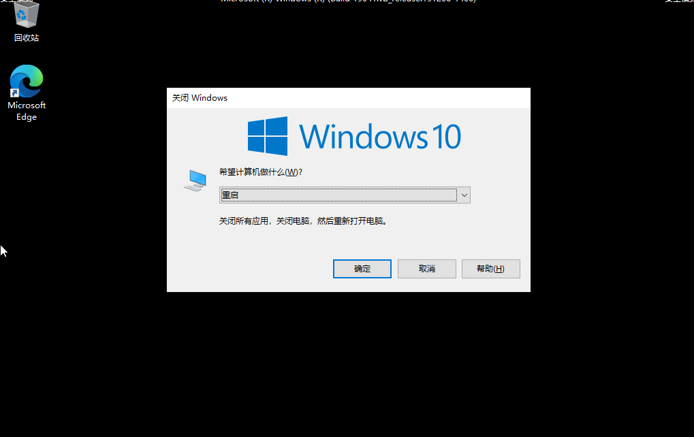

已经能够正常使用Windows

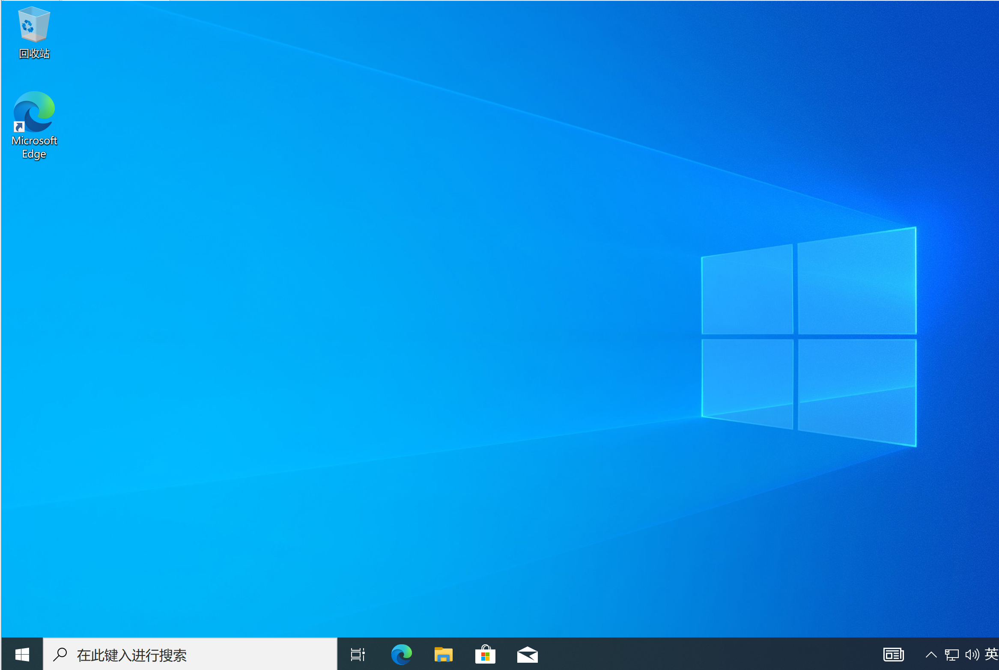
