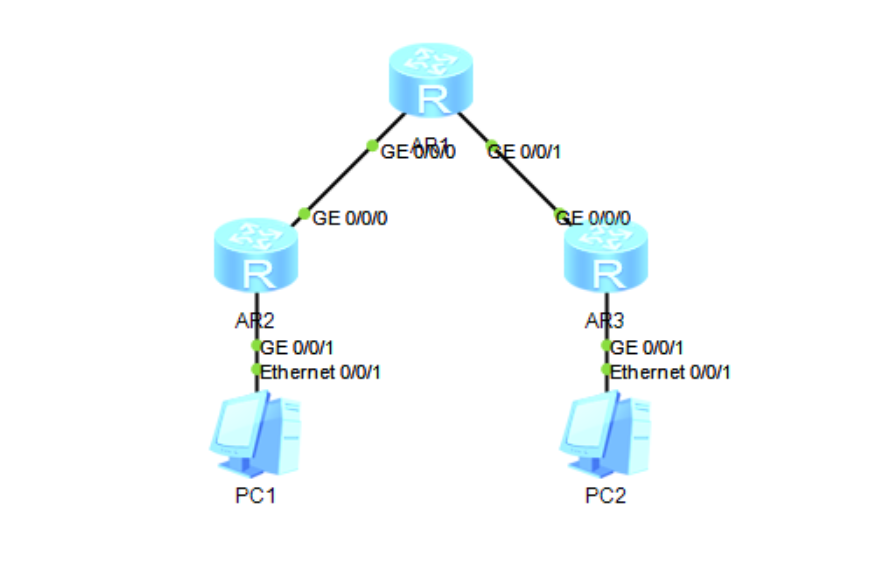

# IPv4 Over IPv6

在IPv4发展末期，IPv4如同IPv6前期一样形成信息孤岛，因此需要将IPv4报文封装在IPv6中以实现互访

​

如上图是实验拓扑

实验IP规划

|设备ID|G0/0/0|G0/0/1|
| --------| ------------| ----------------|
|AR1|2001::1/96|2002::1/96|
|AR2|2001::2/96|192.168.1.1/24|
|AR3|2002::2/96|192.168.2.1/24|

代码样例

AR1  AR2  AR3

```bash
system
ipv6
int g0/0/0
ipv6 enable
ipv6 add 2001::1 96
int g0/0/1
ipv6 enable
ipv6 add 2002::1 96
quit
ospfv3
router-id 1.1.1.1
int g0/0/0
ospfv3 1 area 0
int g0/0/1
ospfv3 1 area 0
```

```bash
‍system
ipv6
int g0/0/0
ipv6 enable
ipv6 add 2001::2 96
int g0/0/1
ip add 192.168.1.1 24
quit
ospfv3
router-id 2.2.2.2
int g0/0/0
ospfv3 1 area 0
```

```bash
system
ipv6
int g0/0/0
ipv6 enable
ipv6 add 2002::2 96
int g0/0/1
ip add 192.168.2.1 24
quit
ospfv3
router-id 3.3.3.3
int g0/0/0
ospfv3 1 area 0
```

‍
