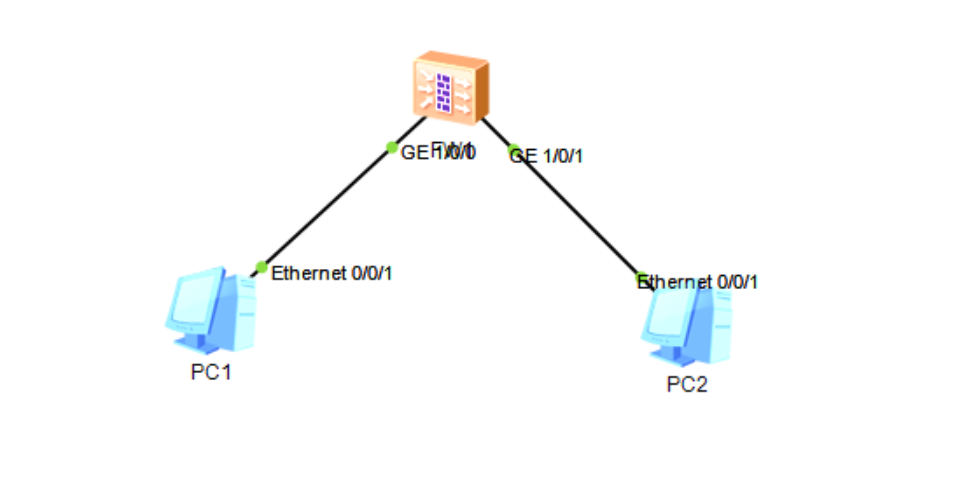

# Nat64技术

- ### 组网需求

如图1所示，实现IPv4 Host与[IPv6](https://so.csdn.net/so/search?q=IPv6&spm=1001.2101.3001.7020) Host间的互访；（由于eNSP模拟器的路由器不支持NAT64实现，因此使用USG6000V）USG6000V为双协议栈，连接IPv6网络以及IPv4网络；

​

（1）首先进入防火墙配置界面  
注：防火墙初始账号密码为user：admin，pwd：Admin@123，进入之后首先修改密码。（Huawei12#$）

‍
